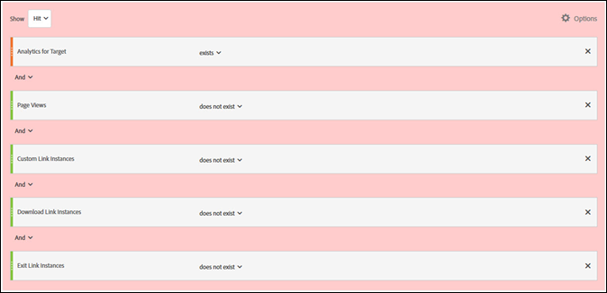

# Minimizing Inflated Visit and Visitor Counts in A4T

<table id="table_08DC686833144E6BAB92A78A98B56CAB"> 
 <tbody> 
  <tr> 
   <td colname="col1"> 
On November 14, 2016,  Adobe Analytics  changed the way some data is processed for customers using  Analytics  reporting for  Target  (A4T). These changes bring  Adobe Target  data into better alignment with the data model for  Adobe Analytics . These changes were rolled out for all customers using A4T. These changes specifically address an issue where some customers have noticed an inflated visitor count when  Target  activities are running. 
 
 
Note:  This change is not retroactive. If your historical reports show inflated counts, and you would like to exclude them from your reports, you can create a virtual report suite, as explained below. 
 
 
Additionally, several JavaScript libraries have been updated to help minimize inflated counts. We recommend that you upgrade to the following library versions (or newer): 
 
 
 </td> 
  </tr> 
 </tbody> 
</table>

This section contains the following information: 

* [ What Changed? ](../../../c_integrating_target_with_mac/a4t/c_a4t_troubleshooting/minimizing-inflated-visit-and-visitor-counts-a4t.md#section_9CCF45F5D66D48EBA88F3A178B27D986)
* [ Why did Adobe Making this Change? ](../../../c_integrating_target_with_mac/a4t/c_a4t_troubleshooting/minimizing-inflated-visit-and-visitor-counts-a4t.md#section_92380A4BD69E4B8886692DD27540C92A)
* [ What Contributes to Partial Data? ](../../../c_integrating_target_with_mac/a4t/c_a4t_troubleshooting/minimizing-inflated-visit-and-visitor-counts-a4t.md#section_C9C906BEAA7D44DAB9D3C03932A2FEB8)
* [ What are the Best Practices to Reduce Partial Data? ](../../../c_integrating_target_with_mac/a4t/c_a4t_troubleshooting/minimizing-inflated-visit-and-visitor-counts-a4t.md#section_065C38501527451C8058278054A1818D)
* [ How Can I See How Much Partial Data I Have... ](../../../c_integrating_target_with_mac/a4t/c_a4t_troubleshooting/minimizing-inflated-visit-and-visitor-counts-a4t.md#section_89B663E2824A4805AB934153508A0F4B)
* [ How Can I View Historical Trends Without Partial Data? ](../../../c_integrating_target_with_mac/a4t/c_a4t_troubleshooting/minimizing-inflated-visit-and-visitor-counts-a4t.md#section_4C9DED560FAD4428B362DDA2064897C3)
* [ What Does this Mean for my Target Reporting? ](../../../c_integrating_target_with_mac/a4t/c_a4t_troubleshooting/minimizing-inflated-visit-and-visitor-counts-a4t.md#section_AAD354C722BE46D4875507F0FCBA5E36)

## What Changed? {#section_9CCF45F5D66D48EBA88F3A178B27D986}

When [!DNL  Adobe Analytics] is used to measure [!DNL  Target] activities (called A4T), [!DNL  Analytics] collects additional data that is not available when there is no [!DNL  Target] activity on the page. This is because the [!DNL  Target] activity fires a call at the top of the page, but [!DNL  Analytics] typically fires its data collection calls at the bottom of the page. In the implementation of A4T to date, we included this additional data whenever a [!DNL  Target] activity was active. Going forward, we will include this additional data only when both the [!DNL  Target] and [!DNL  Analytics] tags have fired. 

## Why did Adobe Making this Change? {#section_92380A4BD69E4B8886692DD27540C92A}

Adobe prides itself on data accuracy and quality. When the [!DNL  Target] tag fires, but the [!DNL  Analytics] tag does not, we are recording “partial data” (sometimes called "unstitched hits"), which would not be captured by [!DNL  Analytics] were there no [!DNL  Target] activity. Although including this partial data in [!DNL  Analytics] reporting does provide additional information, it also creates inconsistency with historical data from periods when there were no [!DNL  Target] activities running. This can cause problems for [!DNL  Analytics] users who are analyzing trends over time. In the interest of ensuring data consistency in [!DNL  Analytics], we will be excluding all partial data. 

## What Contributes to Partial Data? {#section_C9C906BEAA7D44DAB9D3C03932A2FEB8}

We have seen some customers with very high rates of partial data in [!DNL  Analytics]. This can result from improper implementation, but there are legitimate causes as well. 

The identified causes of partial data include the following: 

* **Misaligned Report Suite IDs (Implementation):** The report suite specified during activity setup does not match the report suite on the page where the test is delivered. This looks like partial data because the data cannot be reconciled on [!DNL  Analytics] servers. 

* **Slow Pages:** Because [!DNL  Target] calls are at the top of the page and [!DNL  Analytics] calls are typically at the bottom of the page, if the page loads slowly, it increases the likelihood of a visitor leaving the page after the [!DNL  Target] call fires, but before the [!DNL  Analytics] call. This can be especially problematic on mobile web sites where connections are often slower. 

* **Page Errors:** If there are JavaScript errors or other scenarios where each of the touchpoints do not fire (Experience Cloud ID service, Target, and Analytics), partial data will result. 

* **Redirect Offer(s) in Target Activity:** Redirect offers immediately send a user to a different page, which means the [!DNL  Analytics] call does not fire on the first page. 

  >[!NOTE]
  >
  >After November 14, 2016, customers will no longer be able to create A4T activities with redirect offers.

* **Old Versions of the Libraries:** Over the past year Adobe has made several improvements to our JavaScript libraries ( [!DNL  appMeasurement.js], ` at.js/mbox.js`, and ` visitorAPI.js`) to make sure data is sent as efficiently as possible. To learn more about implementation requirements, see [ Before You Implement ](../../../c_integrating_target_with_mac/a4t/c_before_implement.md#concept_046BC89C03044417A30B63CE34C22543). 

## What are the Best Practices to Reduce Partial Data? {#section_065C38501527451C8058278054A1818D}

We recommend reviewing the following steps, in order, to reduce partial data collection: 

<table id="table_46ECBA452D8A4DB692F1CD4E8A1F0B0B"> 
 <thead> 
  <tr> 
   <th colname="col1" class="entry"> Step </th> 
   <th colname="col2" class="entry"> Task </th> 
  </tr> 
 </thead>
 <tbody> 
  <tr> 
   <td colname="col1">  </td> 
   <td colname="col2"> 
Make sure the report suite selected in  Target  is the same as the one on the page(s) where the activity will be presented. 
 </td> 
  </tr> 
  <tr> 
   <td colname="col1">  </td> 
   <td colname="col2"> 
Ensure the  visitorAPI.js ,  appMeasurement.js ,  mbox.js /  at.js  libraries are on A4T compatible versions. To learn more about implementation requirements, see <a href="../../../c_integrating_target_with_mac/a4t/c_before_implement.md#concept_046BC89C03044417A30B63CE34C22543" format="dita" scope="local"> Before You Implement </a>. 
 </td> 
  </tr> 
  <tr> 
   <td colname="col1">  </td> 
   <td colname="col2"> 
Check to make sure the SDID is getting set on all  Target  and  Analytics  calls leaving the page and that they match. 
 
Do this by using a network analyzer or debugging tool to ensure that the  mboxMCSDID  parameter on  Target  call(s) matches the SDID parameter in the  Analytics  call. 
 </td> 
  </tr> 
  <tr> 
   <td colname="col1">  </td> 
   <td colname="col2"> 
Confirm that the implementation libraries load in the correct order on your sites. For more information, see <a href="../../../c_integrating_target_with_mac/a4t/c_a4timplementation.md#concept_CE78750AC2A4487D8ACD9369B3EAC85A" format="dita" scope="local"> Analytics for Target Implementation </a>. 
 </td> 
  </tr> 
 </tbody> 
</table>

## How Can I See How Much Partial Data I Have? {#section_89B663E2824A4805AB934153508A0F4B}

Although this information is not available directly in [!DNL  Analytics], you can contact Adobe Customer Care to retrieve a Partial Data report. This report is intended to aid in debugging. 

## How Can I View Historical Trends Without Partial Data? {#section_4C9DED560FAD4428B362DDA2064897C3}

Because this processing change affects data only after the release date (November 14, 2016), if you would like to adjust your historical metrics to match, we recommend that you create a segment to exclude partial data. 

The following information relating to this change includes instructions to help you define the segment and apply it to a virtual report suite so that this segment is always applied to your [!DNL  Analytics] views. 

In most situations, a [!DNL  Target] hit is stitched with an  [!DNL  Analytics] hit on each webpage. This stitching happens if there is a consistent SDID in both the  [!DNL  Target] and [!DNL  Analytics] call and a [!DNL  Experience Cloud ID] (MCID) in the  [!DNL  Analytics] call on the same page. [!DNL  Target] typically has the MCID as well, but if the call to [!DNL  Target] happens before the visitor ID returns, the hit will still be stitched because of the SDID. Also, the user must remain on the page long enough to fire an  [!DNL  Analytics] call after a  [!DNL  Target]&nbsp;call was fired. This is the ideal scenario. 

**Partial-Data Hits: **Users sometimes don't remain on a page long enough to send an [!DNL  Analytics] call, but [!DNL  Target] has a proper MCID. This results in partial-data hits (hits with no [!DNL  Analytics] page view). If these users come back to your site and view a page containing [!DNL  Analytics] code, they'll be properly counted as returning visitors. These are hits that would have been lost if you had only [!DNL  Analytics] code on the page. Some clients don't want data for these hits because they inflate certain metrics (visits) and deflate other metrics (page views per visit, time per visit, and so forth). You will also see visits without any page views. However, there are still valid reasons for keeping this data. 

To minimize partial-data hits, you can make your page load faster, update to the latest versions of the libraries, or create a [ virtual report suite ](https://marketing.adobe.com/resources/help/en_US/reference/virtual-report-suites.html) that excludes those hits. For step-by-step instructions, see [ Creating Virtual Report Suites ](https://marketing.adobe.com/resources/help/en_US/reference/vrs-create.html) in the [!DNL  Analytics] product documentation. 

The following illustration shows for the segment definition for the virtual report suite: 

 

When creating the virtual report suite, specify the following configuration for the segment definition (as shown in the above illustration): 

<ul class="simplelist"> 
 <li> <b>Show Hit:</b> </li> 
 <li> Analytics for Target: Exists </li> 
 <li> And </li> 
 <li> Page Views: Does not exist </li> 
 <li> And </li> 
 <li> Custom Link Instances: Does not exist </li> 
 <li> And </li> 
 <li> Download Link Instances: Does not exist </li> 
 <li> And </li> 
 <li> Exit Link Instances: Does not exist </li> 
</ul>

**Orphaned Hits:&amp;nbsp;**In fewer situations, users don't remain on the page long enough for an Analytics call and Target didn't get a proper MCID. These are what we define as "orphaned" hits. These hits represent customers that rarely return and they inflate visit and visitor counts inappropriately. 

To minimize these "orphaned" hits, you can create a [ virtual report suite ](https://marketing.adobe.com/resources/help/en_US/reference/vrs-create.html) that excludes those hits, as explained above. 

## What Does this Mean for my Target Reporting? {#section_AAD354C722BE46D4875507F0FCBA5E36}

Once this change occurs, you might see a decrease in new visitors and visits to live tests because Adobe will not process incoming partial data. Conversions and hits to other Analytics metrics will not change. 
