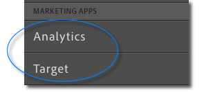

# User Permission Requirements

Before a report suite can be selected when defining an Analytics activity, you need both an Analytics user account and a Target user account. Your user accounts must be configured as described in the following sections: 

* [ Adobe Experience Cloud ](../../c_integrating_target_with_mac/a4t/c_account_reqs.md#section_3931A2FAD38F4A4FA92CC77B92AF3F0D)
* [ Adobe Analytics ](../../c_integrating_target_with_mac/a4t/c_account_reqs.md#section_8F404FDE9A634534AB0AA4CB3075582B)
* [ Adobe Target ](../../c_integrating_target_with_mac/a4t/c_account_reqs.md#section_26BA212D8D40443E9EE2AB327091425C)

## Adobe Experience Cloud {#section_3931A2FAD38F4A4FA92CC77B92AF3F0D}

See [ Join the Experience Cloud ](https://marketing.adobe.com/resources/help/en_US/mcloud/link_accounts.html) for more information. 

* **Linked Accounts**. Your Analytics and Target user accounts must be linked to your Adobe ID. To verify, open **[!UICONTROL  Account Settings]** > **[!UICONTROL  Organization &amp; Product Access]**. 
  
* **Experience Cloud group membership**. You must be a member of one or more Experience Cloud groups that have access to Analytics and Target. Verify that **[!UICONTROL  Analytics]** and **[!UICONTROL  Target]** appear in the **[!UICONTROL  Marketing Apps]** section of the left navigation: 
   Also verify that when you click on Analytics you see your full Analytics account. If you only see a welcome page with no access to your data, relink your account. 

## Adobe Analytics {#section_8F404FDE9A634534AB0AA4CB3075582B}

* **Analytics report suite access: **Before creating or viewing reports for an Analytics-powered activity, you must be a member of the **[!UICONTROL  All Report Access]** group, or member of a group that has access to at least one report in the report suite that you want to use. If you are unable to view reports, make sure you are a member of one of these groups. See [ Groups ](https://marketing.adobe.com/resources/help/en_US/reference/groups.html) for more information. 

* **Web Services Access Group:** You must belong to the Web Services Access group in Adobe Analytics to be able to use Analytics as the reporting source for Target. 

## Adobe Target {#section_26BA212D8D40443E9EE2AB327091425C}

No additional privileges are required. 
