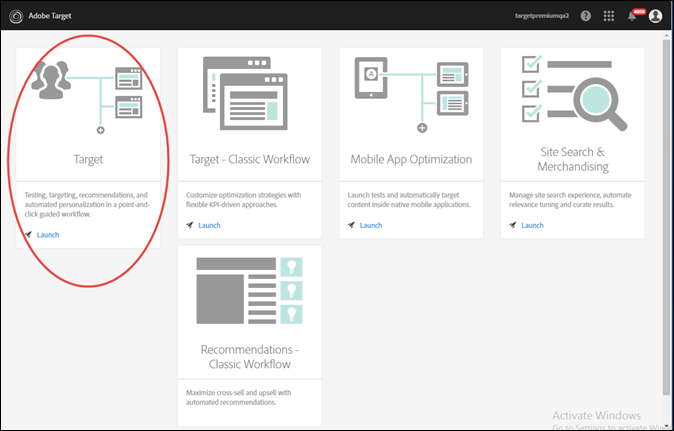

# Invite Users to Target

This video explains how to set up [!DNL  Target] users and administrators. 

<table id="table_C56F4BE9B867463380013C584D97DAD2"> 
 <thead> 
  <tr> 
   <th class="entry" colspan="2"> User Management </th> 
   <th colname="col3" class="entry"> 4:39 </th> 
  </tr>
 </thead>
 <tbody> 
  <tr> 
   <td colspan="2"> 
 
     
 
      <iframe src="https://www.youtube.com/embed/PIjZHxQpOlg/" frameborder="0" webkitallowfullscreen="true" mozallowfullscreen="true" oallowfullscreen="true" msallowfullscreen="true" allowfullscreen="allowfullscreen" scrolling="no" width="550" height="345">https://www.youtube.com/embed/PIjZHxQpOlg/</iframe>
     
 
 </td> 
   <td colname="col3"> 
 
     <ul id="ul_B17C3EFA4B664415AE0159E418FF45C4"> 
      <li id="li_916224D2105348BE93D60015B2F43D4F">Create new Target users at the appropriate access level </li> 
      <li id="li_0FED234A3A054DEAB62C4F58BAB47F7F">Create new target administrators </li> 
     </ul> 
 </td> 
  </tr> 
 </tbody> 
</table>

**Target Standard/Premium** 

>1. Add the new user in the role-specific groups in the Enterprise Dashboard.

>       After you add a user, the user receives an invitation email. 
>1. After the user accepts the invitation and logs in to [!DNL  Target], configure the user's permission level on the [!UICONTROL  Users] page in [!DNL  Target Standard/Premium] ( **[!UICONTROL  Setup]** > **[!UICONTROL  Users]**).

>       You will not see the new user listed on the [!UICONTROL  Users] page until the user logs in using his or her Adobe Experience Cloud account and then logs in to [!DNL  Target Standard/Premium] by clicking the [!DNL  Target] card. 

>        
