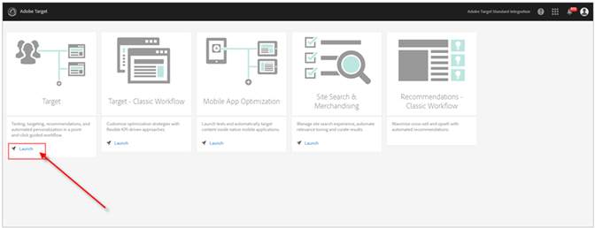
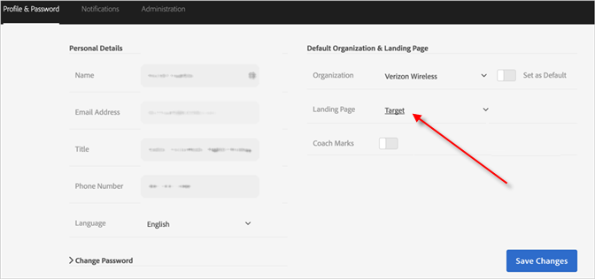

# Access Target from the Adobe Experience Cloud

This video includes information about [!DNL  Adobe Target] in the [!DNL  Experience Cloud]. 

<table id="table_A3A70CC0C9F54131BB9F098B4DA8C9D6"> 
 <thead> 
  <tr> 
   <th class="entry" colspan="2"> Adobe Target in the Experience Cloud </th> 
   <th colname="col3" class="entry"> 4:59 </th> 
  </tr>
 </thead>
 <tbody> 
  <tr> 
   <td colspan="2"> 
    
 
     <iframe src="https://www.youtube.com/embed/7lwYrYC7vdM/" frameborder="0" webkitallowfullscreen="true" mozallowfullscreen="true" oallowfullscreen="true" msallowfullscreen="true" allowfullscreen="allowfullscreen" scrolling="no" width="550" height="345">https://www.youtube.com/embed/7lwYrYC7vdM/</iframe>
    
 </td> 
   <td colname="col3"> 
 
     <ul id="ul_FF4FEC7BC7A34461BAA54FBE18A8E63B"> 
      <li id="li_7D6D4CB2E771430F84D2B658F8611532">Describe and understand the value of the Adobe Experience Cloud </li> 
      <li id="li_1DE40F1125BA46499AE9207E56427155">Log in to the Adobe Experience Cloud with your Adobe ID or create an Adobe ID </li> 
      <li id="li_4BE2720BCFC6424D87F07261FB2AC103">Invite a new user to the Adobe Experience Cloud </li> 
      <li id="li_1FA3774078DA4266AC3FA412E3117B07">Link your Target account to the Adobe Experience Cloud </li> 
      <li id="li_088787515C094AF5A4576CC58D6498DD">Set Adobe Target as your default landing page </li> 
     </ul> 
 </td> 
  </tr> 
 </tbody> 
</table>

>1. After signing into the [!DNL  Experience Cloud], click the App icon (   ) in the navigation bar.

>        
>1. Click the [!DNL  Target] icon in the App menu.

>        
>1. Click ** [!UICONTROL  Launch] ** on the [!DNL  Target] card.

>        
>1. (Optional) To set [!DNL  Target] as your default view when you log in to the [!DNL  Experience Cloud], click ** [!UICONTROL  Edit Profile] ** under your profile avatar, then set your landing page preference.

>        
