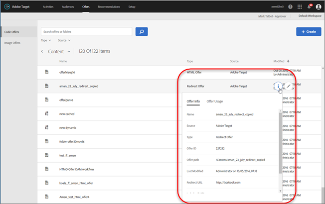

# Offers

>[!NOTE]
>
>In the January 2017 release, offers created via [!DNL  Target Classic], [!DNL  Adobe Experience Manager] (AEM), [!DNL  Adobe Mobile Services] (AMS), and APIs are visible in the [!DNL  Target Standard/Premium] user interface. Offers updated in the last two years using these methods will be visible (i.e. January 2015 and beyond). The initial synchronization will occur the first time any user in your organization opens the [!UICONTROL  Offers] page. The amount of time for the initial synchronization will depend on the amount of data. After the initial synchronization, data will sync incrementally. If you had code and images in the same folder before this release, [!DNL  Target] will split them into two duplicate folders. Note that the Updated date and time refers to the time when the folder was migrated and does not reflect the date you originally created the folder. 

This video includes information about managing offers. 

<table id="table_A3A70CC0C9F54131BB9F098B4DA8C9D6"> 
 <thead> 
  <tr> 
   <th class="entry" colspan="2"> Offers Library </th> 
   <th colname="col3" class="entry"> 4:56 </th> 
  </tr>
 </thead>
 <tbody> 
  <tr> 
   <td colspan="2"> 
    
 
     <iframe src="https://www.youtube.com/embed/ZNIGgXOATMY/" frameborder="0" webkitallowfullscreen="true" mozallowfullscreen="true" oallowfullscreen="true" msallowfullscreen="true" allowfullscreen="allowfullscreen" scrolling="no" width="550" height="345">https://www.youtube.com/embed/ZNIGgXOATMY/</iframe>
    
 </td> 
   <td colname="col3"> 
 
     <ul id="ul_FF4FEC7BC7A34461BAA54FBE18A8E63B"> 
      <li id="li_7D6D4CB2E771430F84D2B658F8611532">Connection between the <a href="https://marketing.adobe.com/resources/help/en_US/mcloud/creative_cloud.html" format="https" scope="external"> Experience Cloud Asset Library</a> and the Target Content Library </li> 
      <li id="li_61D9DDCD3AFB40E2BC55AFED5CD6C405">Custom HTML Offers </li> 
      <li id="li_745F20CC95DF4BE48173991CB42EC50A">Custom HTML Offer in the Visual Experience Composer </li> 
     </ul> 
 </td> 
  </tr> 
 </tbody> 
</table>

Click ** [!UICONTROL  Offers] ** to open the library. The library contains the offers that have been set up via [!DNL  Target Standard/Premium], [!DNL  Target Classic], [!DNL  Adobe Experience Manager] (AEM), [!DNL  Adobe Mobile Services] (AMS), and APIs. Offers created in [!DNL  Target Classic] or other solutions are editable in [!DNL  Target Standard/Premium]. 

The [!UICONTROL  Offers] page has two tabs along the right side: Code Offers and Image Offers that let you view offers by type. 

 

You can filter offers by type ( HTML Offer, Redirect Offer, Remote Offer, or Folder) and by source (Adobe Target, Adobe Target Classic, Adobe Experience Manager, Adobe Mobile Services, or API). 

 

You can edit or copy a folder or offer by hovering over the desired item, then by clicking the Edit or Copy icons. 

 

## Viewing Offer Definitions {#section_6B059DD121434E6292CAB393507D010E}

You can view offer definition details on a pop-up card in the Offers Library without opening the offer. 

For example, the following offer definition card for an HTML offer is accessed by hovering over an offer on the Contents List, then clicking the information icon: 

 

The following information is available: 

* Name 

* Source 

* Type 

* Offer ID 

* Offer path 

* Last Modified 

Click the [!UICONTROL  Offer Usage] tab to view the activities that reference a code offer in each offer's definition pop-up card. This functionality does not apply to image offers. This way you can avoid impact to other activities while editing offers. Information includes Live Activities and Inactive Activities. 

 

The following offer definition card for a Redirect offer: 

 

The following information is available: 

* Name 

* Source 

* Type 

* Offer ID 

* Offer Path 

* Last Modified 

* Redirect URL 

* Include all URL parameters (on or off) 

* Pass mbox session ID (on or off) 

The following offer definition card for a Remote offer: 

 

The following information is available: 

* Name 

* Source 

* Type 

* Offer ID 

* Offer Path 

* Last Modified 

* Redirect URL Type 

* Absolute or Relative URL 

