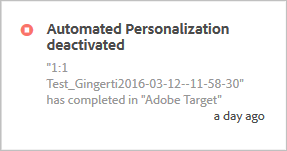
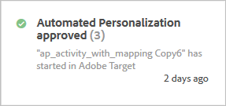

# Notifications

Notifications from [!DNL  Target] can be seen in all solutions by users who have a [!DNL  Experience Cloud]product context of [!DNL  Target Standard/Premium]. 

For information about setting up Notifications, see [ Notifications](https://marketing.adobe.com/resources/help/en_US/mcloud/notifications.html) in the [!DNL  Adobe Experience Cloud] documentation. 

Access Notifications from anywhere in [!DNL  Target], except from within the activity creation workflow. Click the bell icon in the page header to display or hide the notifications widget. 

 

[!DNL  Target] sends two kinds of notifications for all activity types: 

* When an activity becomes live and offer delivery begins: For example: 

   

* When an activity is deactivated and offer delivery ceases: For example: 

   

Similar notifications also appear when a scheduled activity reaches its start date, and when it ends upon reaching its end date. 

All [!DNL  Target] notifications display the name of activity that was approved or deactivated, and include the words "Adobe Target" for easy identification. 

If a single activity sends multiple notifications of the same type, they are combined into a single card with the number of notifications displayed in it. For example: 

 

Click the notification card to view details of each individual notification. 

For example, if you click the card shown above, the three notifications display: 

 

## Limitations {#section_B466EB20B2554CE7B1915374B39F4322}

* Notifications do not tell you who approved, deactivated, or imported the activity.
* MVT notifications appear as "A/B Test" because they are synchronized as A/B campaigns in [!DNL  Target Classic].

