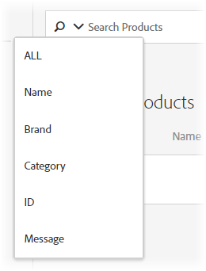

# Catalog Search

You can refine your search by selecting a search option from the options menu that displays when you click the down arrow in the search field. 

 

**[!UICONTROL  ALL]** searches across all of the other search criteria, using OR logic. 

In the search results, you click Settings to specify the production host group environment whose catalog you are displaying. An item can exist only once within an environment. You can also scroll through the items in the search results to view thumbnails and other product information. 

The number that displays next to "Products" is the number of products that match the search term, out of the total available in the specified environment. 

Click the refresh icon to re-index your catalog. Be aware that indexing can take some time, depending on the size of your feed. 

The catalog is automatically refreshed every hour. Click **[!UICONTROL  Refresh]** to reindex the catalog between automatic refreshes. 

You can create collections or exclusions using Advanced Search on the Catalog Search page (Recommendations &amp;gt; Catalog Search &amp;gt; Advanced Search). After creating a search using "id &amp;gt; contains," for example, you can then click Save As &amp;gt; Collection or Exclusion. 

>[!IMPORTANT]
>
>The Advanced Search functionality is case-insensitive; however, products returned at the time of delivery are based on case-sensitive search. This mismatch might lead to confusion. Ensure that you consider case-sensitivity when you create collections or exclusions based on results using the Advanced Search functionality. For example, if you perform a search for "Holiday," that initial search lists results containing "Holiday" and "holiday." If you then create a catalog with the intent to return products containing "holiday," only products containing "holiday" are returned. Products containing "Holiday" are not returned. Exclusions are handled in a similar fashion.

