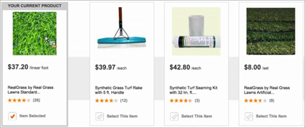

# Customizing a Design Using Velocity


<a id="section_71D5DC4CA2FB49E5AD57221BD170AF14"></a>

This section contains the following information: 


* [ Velocity Overview ](c_customizing_a_template.md#section_C431ACA940BC4210954C7AEFF6D03EA5) 

* [ Scenario: Display Key Item with Recommended Products ](c_customizing_a_template.md#section_7F8D8C0CCCB0403FB9904B32D9E5EDDE) 

* [ Scenario: Replace the Decimal Point with the Comma Delimiter in a Sales Price ](c_customizing_a_template.md#section_01F8C993C79F42978ED00E39956FA8CA) 


## Velocity Overview {#section_C431ACA940BC4210954C7AEFF6D03EA5}

Information about Velocity can be found at [ http://velocity.apache.org ](http://velocity.apache.org). 

All Velocity logic, syntax, and so on can be used for a recommendation design. This means that you can create *for* loops, *if* statements, and other code using Velocity rather than JavaScript. 

Any variable sent to [!DNL  Recommendations] in the ` productPage` mbox or the CSV upload can be displayed in a design. These values are referenced with the following syntax: 


```
$entityN.variable
```


Variable names must follow Velocity shorthand notation, which consists of a leading *$* character, followed by a Velocity Template Language (VTL) Identifier. The VTL Identifier must start with an alphabetic character (a-z or A-Z). 

Velocity variable names are restricted to the following types of characters: 


* Alphabetic (a-z, A-Z)
* Numeric (0-9)
* Hyphen ( - )
* Underscore ( _ )


The following variables are available as Velocity arrays. As such, they can be iterated over or referenced via index. 


* ` entities` 

* ` entityN.categoriesList` 


For example: 


```
#foreach ($category in $entity1.categoriesList) 
<br/>$category 
#end
```


Or 


```
#if ($entities[0].categoriesList.size() >= 3 ) 
$entities[0].categoriesList[2] 
#end
```


For more information about Velocity variables, see [ https://velocity.apache.org/engine/releases/velocity-1.7/user-guide.html#variables ](https://velocity.apache.org/engine/releases/velocity-1.7/user-guide.html#variables). 

If you use a profile script in your design, the $ preceding the script name must be escaped with a \. For example, ` \${user.script_name}`. 


>[!NOTE]
>
>The maximum number of entities that can be referenced in a design, either hardcoded or via loops, is 99. The template script length can contain up to 65,000 characters.


For example, if you want a design that displays something similar to this: 

 

you can use the following code: 


```
<table style="border:1px solid #CCCCCC;"> 
 
<tr> 
 
<td colspan="3" style="font-size: 130%; border-bottom:1px solid  
#CCCCCC;"> You May Also Like... </td> 
 
</tr> 
 
<tr> 
 
<td style="border-right:1px solid #CCCCCC;"> 
 
<div class="search_content_inner" style="border-bottom:0px;"> 
 
<div class="search_title"><a href="$entity1.pageUrl"  
style="color: rgb(112, 161, 0); font-weight: bold;"> 
$entity1.id</a></div> 
 
By $entity1.message <a href="?x14=brand;q14=$entity1.message"> 
(More)</a><br/> 
 
sku: $entity1.prodId<br/> Price: $$entity1.value 
 
<br/><br/> 
 
</div> 
 
</td> 
 
<td style="border-right:1px solid #CCCCCC; padding-left:10px;"> 
 
<div class="search_content_inner" style="border-bottom:0px;"> 
 
<div class="search_title"><a href="$entity2.pageUrl"  
style="color: rgb(112, 161, 0); font-weight: bold;"> 
$entity2.id</a></div> 
 
By $entity2.message <a href="?x14=brand;q14=$entity2.message"> 
(More)</a><br/> 
 
sku: $entity2.prodId<br/> 
 
Price: $$entity2.value 
 
<br/><br/> 
 
</div> 
 
</td> 
 
<td style="padding-left:10px;"> 
 
<div class="search_content_inner" style="border-bottom:0px;"> 
 
<div class="search_title"><a href="$entity3.pageUrl"  
style="color: rgb(112, 161, 0); font-weight: bold;"> 
$entity3.id</a></div> 
 
By $entity3.message <a href="?x14=brand;q14=$entity3.message"> 
(More)</a><br/> 
 
sku: $entity3.prodId<br/> Price: $$entity3.value 
 
<br/><br/> 
 
</div> 
 
</td> 
 
</tr> 
 
</table>
```


>[!NOTE] {class="- topic/note "}
>
>If you want to add information after the variable value, you can do so using formal notation. For example: ` ${entity1.thumbnailUrl}.gif`. 


You can also use ` algorithm.name` and ` algorithm.dayCount` as variables in designs, so one design can be used to test multiple criteria, and the criteria name can be dynamically displayed in the design. This shows the visitor that he or she is looking at "top sellers" or "people who viewed this bought that." You can even use these variables to display the ` dayCount` (number of days of data used in the criteria, like "top sellers over the last 2 days," etc. 

## Scenario: Display Key Item with Recommended Products {#section_7F8D8C0CCCB0403FB9904B32D9E5EDDE}

You can modify your design to show your key item alongside other recommended products. For example, you might want to show the current item for reference next to the recommendations. 

To do this, create a column in your design that uses the ` $key` attribute you are basing your recommendation on rather than the ` $entity` attribute. For example, the code for your key column might look like this: 


```
<div class="at-table-column"> 
   <a href="$key.pageURL"> 
       
      <br/><h3>$key.name</h3> 
      <br/><p class="at-light">$key.message</p> 
      <br/><p class="at-light">$key.value</p> 
   </a> 
</div>
```


The result is a design like the following, where one column shows the key item. 

 

When you are creating your [!DNL  Recommendations] activity, if the key item is taken from the visitor's profile, such as "last purchased item," [!DNL  Target] displays a random product in the [!UICONTROL  Visual Experience Composer] (VEC). This is because a profile is not available while you design the activity. When visitors view the page, they will see the expected key item. 

## Scenario: Replace the Decimal Point with the Comma Delimiter in a Sales Price {#section_01F8C993C79F42978ED00E39956FA8CA}

You can modify your design to replace the decimal point delimiter used in the United States with the comma delimiter used in Europe and other countries. 

The following code shows a single line in a conditional sale pricing example: 


```
&amp;lt;span&amp;nbsp;class="price"&amp;gt;$entity1.value.replace(".",&amp;nbsp;",")&amp;nbsp;€&amp;lt;/span&amp;gt;&amp;lt;br&amp;gt;
```


The following code is a complete conditional example of a sale price: 


```
<div class="price"> 
    #if($entity1.hasSalesprice==true) 
    <span class="old">Statt <s>$entity1.salesprice.replace(".", ",") €</s></span><br> 
    <span style="font-size: 10px; float: left;">jetzt nur</span> $entity1.value.replace(".", ",") €<br> #else 
    <span class="price">$entity1.value.replace(".", ",") €</span><br> #end 
    <span style="font-weight:normal; font-size:10px;"> 
                                        $entity1.vatclassDisplay 
                                        <br/> 
                                        $entity1.delivery 
                                        <br> 
                                    </span>
```

