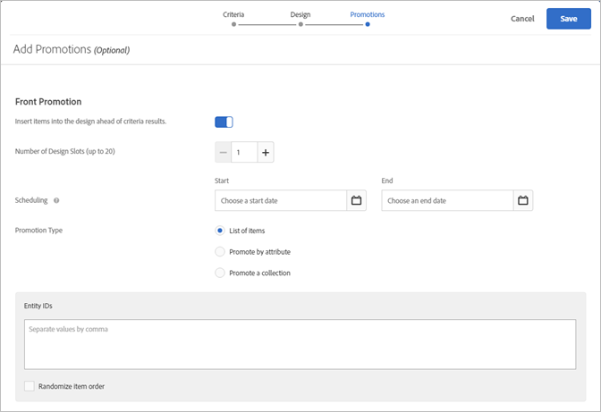

# Adding Promotions

>[!IMPORTANT]
>
>Static and dynamic exclusion rules are powerful features that can help you with your marketing efforts. For detailed information, examples, and use-case scenarios, see[ Use Dynamic and Static Inclusion Rules](../../c_recommendations/t_create_recs_activity/c_use-dynamic-and-static-inclusion-rules.md#concept_4CB5C0FA705D4E449BD0B37B3D987F9F). 

When you create a [!DNL  Recommendations] activity, you have the option to include promoted items in your [!DNL  Recommendations] design. Promotions use available slots in a design and take precedence over criteria results and backup recommendations. For example, if your design has six slots and you use two of them for promotions, four slots are available for items recommended based on criteria. 

You can promote specific items, dynamically promote items, promote items based on attributes, or promote collections. 

 

>[!NOTE]
>
>Using promotions changes CSV structure and output. These changes could have an impact on any external processes that involve CSV, such as email.

>1. On the ** [!UICONTROL  Add Promotions] ** screen, click either the ** [!UICONTROL  Front Promotion] ** or ** [!UICONTROL  Back Promotion] ** toggle.

>        

>       You can insert promotions both before *and* after your criteria results. 
>1. Set the number of design slots to use for promoted items.

>    [!DNL  Recommendations]1. Set a start date and end date for your promoted items.

>1. Select a ** [!UICONTROL  Promotion Type] **.

>    
>    * Select ** [!UICONTROL  List of items] ** and enter the ` entity.id` values, separated by commas, of the specific items you want to promote. 

>      If your list includes more items than the number of slots you set for promotions, you can select the [!UICONTROL  Randomize Item Order] check box to vary the promoted items that are displayed in your design. This will randomly select the number of items enabled for promotions in the template from the entire promotion set for each visit. 

>    * Select ** [!UICONTROL  Promote by attribute] ** and add rules to define the attributes of the items you want to promote. 

>      If you select Promote by Attribute, you can create dynamic matches. For more information, see [ Use Dynamic and Static Inclusion Rules](../../c_recommendations/t_create_recs_activity/c_use-dynamic-and-static-inclusion-rules.md#concept_4CB5C0FA705D4E449BD0B37B3D987F9F). 

>    * Select ** [!UICONTROL  Promote a collection] ** and choose the collection of items you want to promote. You can create new collections to use for promotions. See [ Create a Collection](../../c_recommendations/c_products/c_collections.md#task_1256DFF6842141FCAADD9E1428EF7F08) for more information. 

>1. Click ** [!UICONTROL  Save.] **.

>       Promotions are applied to all experiences in the activity. 
