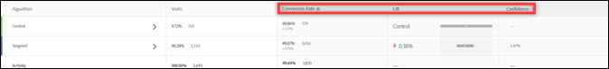

# About the Conversion Rate

The following illustration shows the chart header for a sample activity with the [!UICONTROL  Conversion Rate], [!UICONTROL  Lift], and [!UICONTROL  Confidence] headers highlighted. 

 

>[!NOTE] {class="- topic/note "}
>
>In all data, duplicate orders are ignored if an ` orderID` is passed. The audit report lists the ignored duplicate orders. 

This section contains the following information: 

* [ Conversion Rate](../../c_reports/c_conversion_rate/c_conversion_rate.md#section_07A36846C4E84D0881906809B9CE5A74)
* [ Lift](../../c_reports/c_conversion_rate/c_conversion_rate.md#section_0F409572C720433D9378092ABC999982)
* [ Confidence (Statistical Significance)](../../c_reports/c_conversion_rate/c_conversion_rate.md#section_35DB6724813D40C7B0808DE18FE595C1)
* [ Retail Data](../../c_reports/c_conversion_rate/c_conversion_rate.md#section_30A674731BA6440E9BB93C421BE990EE)

## Conversion Rate {#section_07A36846C4E84D0881906809B9CE5A74}

Shows the median conversion rate, confidence, interval, and the number of conversions. 

For example, examine the following Conversion Rate report column: 

 

The first line is the control experience. It shows a 15% conversion rate, with three conversions. The second line, Experience B, shows a 15% conversion rate, with a confidence interval of plus or minus 15.65% and three conversions. 

>[!NOTE]
>
>Currently, the confidence interval is calculated only for binary metrics.

## Lift {#section_0F409572C720433D9378092ABC999982}

Compares the conversion rate for each experience against the control experience. 

Lift = (Experience CR - Control CR) / Control CR 

If control is 0, there is no percentage lift. 

## Confidence (Statistical Significance) {#section_35DB6724813D40C7B0808DE18FE595C1}

This number represents the likelihood that the results would be duplicated if the test were run again. The confidence rounds up to 100.00% when the confidence is greater than or equal to 99.995%. 

See [ Confidence Level and Confidence Interval](../../c_reports/c_conversion_rate/c_confidence_level_and_confidence_interval.md#concept_0D0002A1EBDF420E9C50E2A46F36629B). 

## Retail Data {#section_30A674731BA6440E9BB93C421BE990EE}

AOV, RPV, and Sales data are displayed for each experience if you inserted a [ Place Order](https://marketing.adobe.com/resources/help/en_US/target/ov/t_orderconfirm_create.html) ( ` orderConfirmPage`) mbox and selected it as the conversion mbox. 
