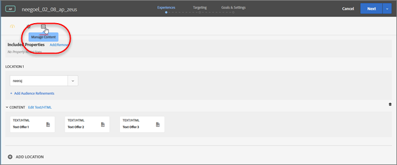

# Offer Reporting Groups in Automated Personalization

Reporting groups perform two key functions: 

* They let you see your offers grouped in AP activity reporting. 

* They play a key role with how Target's personalization models function. 

When you use reporting groups, Target creates only one personalization model for each reporting group instead of each offer in your AP activity using the data from all offers in that group. 

If your activity setup doesn't have enough data for a personalization model to be built per offer, reporting groups can help reduce the data requirements to use Automated Personalization. Reporting groups can also help solve the "cold start" problem for new offers by grouping similar offers so that each model gets more data to train on. Modeling groups can also be used for activities where new offers are being introduced regularly to your AP activity. 

This approach works well if visitors respond the same way to all offers in a group. Best practice is to group offers that similar groups of visitors respond to in a similar way. In order words, group offers with similar conversion rates. You should never put all offers into a single reporting group. Grouping all offers or grouping offers with very different conversion rates likely reduces the effectiveness of Target's personalization models. 

>[!NOTE]
>
>If an offer is removed or replaced from a particular modeling group, the historical traffic that saw that specific offer is also deleted from the modeling group. In other words, deleted offers do not contribute to what data is used for Target's personalization models to learn.

**To set up reporting groups:** 

1. On the Experiences page of an AP activity, click the **[!UICONTROL  Manage Content]** icon. 

    

1. Click the **[!UICONTROL  Offers]** tab at the top of the [!UICONTROL  Manage Content] dialog box. 

1. (Conditional) Add specific experiences to a reporting group by hovering over the desired offer and then by clicking the **[!UICONTROL  Reporting Group]** folder icon. 

    

1. (Conditional) Batch include experiences in a reporting group by selecting the checkbox for the relevant experiences and then by clicking the **[!UICONTROL  Reporting Group]** folder icon in the top right corner of the dialog box. 

    

1. To assign the selected offer to an existing reporting group, select **[!UICONTROL  Existing]**, select the desired reporting group from the drop-down list, then click **[!UICONTROL  Apply]**. 

   Or 

   To create a new reporting group to assign the selected offer to, select **[!UICONTROL  New]**, name the new reporting group, then click **[!UICONTROL  Apply]**. 

    

