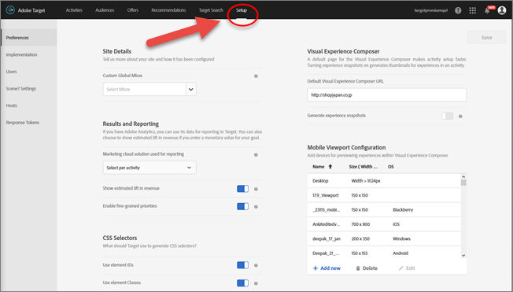

# Setting Up Target

To access the [!UICONTROL  Setup] menu items, click ** [!UICONTROL  Setup] ** in the top menu bar, then click the desired tab along the left side: 

* Preferences
* Implementation
* Users
* Scene7 Settings
* Hosts

 
