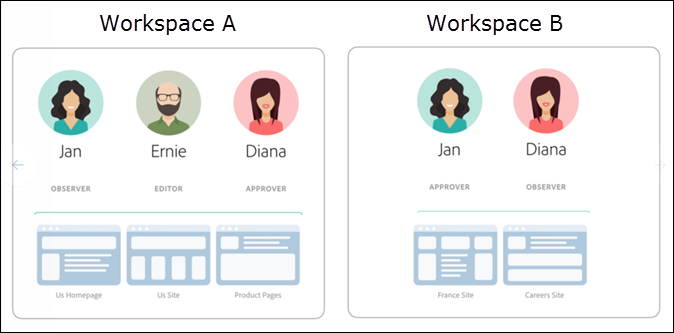

# Enterprise User Permissions

<table id="table_FD223AA7282243338769C27AC146FD51"> 
 <tbody> 
  <tr> 
   <td colname="col1"> 
 Properties and Permissions functionality is available as part of the  Target Premium  solution. They are not available in  Target Standard  without a  Target Premium  license. 
 
Your Target implementation can be using any version of at.js or mbox.js. 
 
You can tell whether your organization has a Standard or Premium license by clicking the  Setup  link at the top of the Target UI. 
 
 
     <ul id="ul_3911B1BA89C54A9D91F5CD47ADC31C6E"> 
      <li id="li_439701DC0EA9408FA833314D7569D5FA"> 
<b>Target Standard Customers: </b>If you see the  Users  tab (  Setup  &gt;  Users ), your organization has a Target Standard license. Target Standard customers should follow the instructions in <a href="../ov/c_user_management.xml#concept_501166A5F8FB4964A3AAA15D6095C6BE" format="dita" scope="local"> Users </a> to add users and assign permissions in the Adobe Admin Console. 
 
Target Standard users see the following error message when clicking the Properties tab. There is nothing wrong with Target. Target Standard users do not have access to the Target Premium Enterprise Permissions functionality. 
 
  
 </li> 
      <li id="li_82A31FD812AA49F9A684B5860240DF26"> 
<b>Target Premium Customers: </b>If you see the  Properties  tab (  Setup  &gt; Properties), your organization has a Target Premium license. Target Premium customers should follow the instructions in this topic and in <a href="properties-overview.xml#concept_22F2855DBF0D4754B9460F5D68749C71" format="dita" scope="local"> Configure Enterprise Permissions </a>. 
 </li> 
     </ul> 
 </td> 
  </tr> 
 </tbody> 
</table>

>[!IMPORTANT]
>
>Ensure that you read the[ Caveats ](property_channel.md#section_9714311B1CD9497A86F4910F8AE635E2) section below before proceeding with Enterprise Permissions. 

This section contains the following information: 

* [ Enterprise Permissions Training Video ](property_channel.md#section_2FA080303A064242B63FF16CFA6DB31D)
* [ Terms and Definitions Used in this Section ](property_channel.md#section_F8D229544FEA41C3BC2EFD1F95AA0116)
* [ Permissions Overview ](property_channel.md#section_DC2172520DA84605B218A5E9FB6D187A)
* [ Use Case Scenarios ](property_channel.md#section_F3CE8576959E4F4CB13BEEED38311DD8)
* [ Target UI Property and Permissions Touchpoints ](property_channel.md#section_3414371393BB42999A268628B5456EC9)
* [ Caveats ](property_channel.md#section_9714311B1CD9497A86F4910F8AE635E2)
* [ Frequently Asked Questions ](property_channel.md#section_31D3450ADEAE4A29963A34F8E8C19FE0)

## Enterprise Permissions Training Video {#section_2FA080303A064242B63FF16CFA6DB31D}

This video explains the Enterprise Permissions: 

<table id="table_C56F4BE9B867463380013C584D97DAD2"> 
 <thead> 
  <tr> 
   <th class="entry" colspan="2"> Enterprise Permissions </th> 
   <th colname="col3" class="entry"> 3:16 </th> 
  </tr> 
 </thead>
 <tbody> 
  <tr> 
   <td colspan="2"> 
 
     
 
      <iframe src="https://video.tv.adobe.com/v/19042/" frameborder="0" webkitallowfullscreen="true" mozallowfullscreen="true" oallowfullscreen="true" msallowfullscreen="true" allowfullscreen="allowfullscreen" scrolling="no" width="550" height="345">https://video.tv.adobe.com/v/19042/</iframe>
     
 
 </td> 
   <td colname="col3"> 
Learning objectives: 
 
 
     <ul id="ul_B17C3EFA4B664415AE0159E418FF45C4"> 
      <li id="li_916224D2105348BE93D60015B2F43D4F"> 
The three role levels that Adobe Target users can hold 
 </li> 
      <li id="li_0FED234A3A054DEAB62C4F58BAB47F7F"> 
The concepts of Properties and Workspaces, and how these boundaries and groupings work to allow for control over users' access levels 
 </li> 
      <li id="li_6C4D1871E45D40118D7D9D4DF81547B5"> 
Different Property examples for your organization to consider 
 </li> 
     </ul> 
 </td> 
  </tr> 
 </tbody> 
</table>

## Terms and Definitions Used in this Section {#section_F8D229544FEA41C3BC2EFD1F95AA0116}

The following terms are used throughout this section and might be new to users wanting to use the Properties and Permissions functionality in Target Premium. 

<table id="table_3A0AF4EDED5C45A68CB3F03CDE9E3C47"> 
 <thead> 
  <tr> 
   <th colname="col1" class="entry"> Term </th> 
   <th colname="col2" class="entry"> Definition </th> 
  </tr> 
 </thead>
 <tbody> 
  <tr> 
   <td colname="col1"> 
Property 
 </td> 
   <td colname="col2"> 
Properties are similar in nature to those within  Dynamic Tag Management  (  Activation ) in that they use a unique snippet of code to differentiate them. 
 
A web property is a library of rules and one embed code. A web property can be any grouping of one or more domains and subdomains. 
 
Properties are enabled by adding a specific name/value pair as a parameter with any call (mbox, api, etc.) to Target. 
 
Properties belong to specific channels (Web, Mobile, Email, or API/Other). 
 </td> 
  </tr> 
  <tr> 
   <td colname="col1"> 
Workspace (Product Profile) 
 </td> 
   <td colname="col2"> 
A workspace lets an organization assign a specific set of users to a specific set of properties. In many ways, a workspace is similar to a report suite in  Adobe Analytics . 
 
 
Note:  Workspaces are known as  Product Profiles  in the  Adobe Admin Console for Enterprise . 
 
 
If you are part of a multi-national organization, you might have a workspace for your European web pages, properties, or sites and another workspace for your American web pages, properties, or sites. If you are part of a multi-brand organization, you might have a separate workspace for each of your brands. 
 
Users can be part of multiple workspaces and can even have different roles within each workspace. 
 
Users can have different views of Adobe Target by moving between workspaces, similar to how Analytics users have different views of Analytics by moving between Report Suites. 
 
Workspaces can include complete different audiences, code offers, and activities. 
 
All audiences and activities created before the new Enterprise Permissions model migration will be grouped together in the "Default Workspace," discussed below. 
 
All activities created via Adobe Experience Manager (AEM), Adobe Mobile Services, and Adobe Target Classic will be part of the "Default Workspace." 
 </td> 
  </tr> 
  <tr> 
   <td colname="col1"> 
Default Workspace 
 </td> 
   <td colname="col2"> 
All existing workspaces (product profiles) within Admin Console are merged into a single workspace called "Default Workspace" during your organization's migration to the new Enterprise Permissions model. 
 
 
Note:  Do not delete the Default Workspace. 
 
 
All user roles and access to all Target functionality remains exactly the same as they were prior to the migration to the new Enterprise Permissions model. 
 </td> 
  </tr> 
  <tr> 
   <td colname="col1"> 
User Groups 
 </td> 
   <td colname="col2"> 
You can create user groups, such as Developers, Analysts, Marketers, Executives, etc., and then assign privileges across multiple Adobe products and workspaces. Assigning a new team member all the appropriate privileges across different Adobe products can be as easy as adding them to a specific user group. 
 </td> 
  </tr> 
  <tr> 
   <td colname="col1"> 
Roles and Permissions 
 </td> 
   <td colname="col2"> 
Roles and permissions determine the access levels that users have to create and manage activities in your  Target  implementation. In  Target , roles include the following: 
 
 
     <ul id="ul_3F57367D49494CA9A05C3F8B16C45ED1"> 
      <li id="li_672C00988A354BC2B6A6376CFD9A5EA8"> 
<b>Observer: </b>Can view activities, but cannot create or edit them. 
 </li> 
      <li id="li_B65D3D9CC79A416AB1F9F0EACD3196DE"> 
<b>Editor: </b>Can create and edit activities before they are live, but cannot approve the launch of an activity. 
 </li> 
      <li id="li_6964D91D40F6489AA706AE623BAB9397"> 
<b>Approver: </b>Can create, edit, and activate or stop activities. 
 </li> 
     </ul> 
 </td> 
  </tr> 
  <tr> 
   <td colname="col1"> 
Channel 
 </td> 
   <td colname="col2"> 
Channel refers to the content type of where your  Target  activities are delivered: webpages, mobile apps, email messages, and so forth. 
 
When you create a new activity, it is created in the currently selected workspace. You'll see channel selection options in the first dialog box that lets you choose the desired channel for the activity: Web, Mobile App, Email, or Other/API. 
 </td> 
  </tr> 
 </tbody> 
</table>

## Permissions Overview {#section_DC2172520DA84605B218A5E9FB6D187A}

The following information explains the way permissions were enforced previously in [!DNL  Target] and how they are enforced using the [!UICONTROL  Properties] and [!UICONTROL  Permissions] functionality. 

The new [!UICONTROL  Permissions] functionality lets you create different projects (called "Product Profiles" in the [!DNL  Adobe Admin Console for Enterprise]) to allow you to assign different permissions for a single user that dictate that user's access rights for each project. These distinct projects can be compared to the way that report suites work in [!DNL  Adobe Analytics]. Each project can have specific users with specific roles that apply to a set of properties. The result is that customers will be able to restrict the view, edit, and approval access to their users based on region, environment (dev/stage/prod), channel, or other custom criteria, as shown below: 

 

For example, a specific user might have "approval" access on the Americas websites but only "view" access on the European mobile app. That same user might not have any access to even view the activities offered on web and mobile properties in the APAC region. 

The current [!DNL  Target] [!UICONTROL  Permissions] model has three permission roles (Observer, Editor, and Approver), as shown in the following illustration: 

 

Each role has different levels of permissions: 

<table id="table_4B17E288A7364A738FE0637AC53820C8"> 
 <thead> 
  <tr> 
   <th colname="col1" class="entry"> Role </th> 
   <th colname="col2" class="entry"> Description </th> 
  </tr> 
 </thead>
 <tbody> 
  <tr> 
   <td colname="col1"> 
Observer 
 </td> 
   <td colname="col2"> 
Has read-only access to activities. Can view activities, but cannot create or edit them. 
 </td> 
  </tr> 
  <tr> 
   <td colname="col1"> 
Editor 
 </td> 
   <td colname="col2"> 
Can create and edit activities before they are live, but cannot approve the launch of an activity. 
 </td> 
  </tr> 
  <tr> 
   <td colname="col1"> 
Approver 
 </td> 
   <td colname="col2"> 
 Can create, edit, and activate or stop activities. 
 </td> 
  </tr> 
 </tbody> 
</table>

It is important to note that each user's role applies to every page, property, or site in your account that includes [!DNL  Target] tags, as shown below: 

 

The new [!DNL  Target] [!UICONTROL  Permissions] model has the same three permission roles (Observer, Editor, and Approver); however, you can assign a user's permissions roles separately for individual pages, properties, or sites, as shown below: 

 

In this example, Jan has Approver permissions to the US Homepage and the US Site and Observer permissions to the France Site. 

Furthermore, Jan won't be able to see pages, properties, or sites in [!DNL  Target] that she doesn't have permissions to see, as shown below: 

 

In this example, Jan cannot see the Product Pages, Russia Site, and the Careers Site. 

## Use Case Scenarios {#section_F3CE8576959E4F4CB13BEEED38311DD8}

The following use cases might be helpful to understand how properties, projects, roles, and permissions can help you achieve your marketing goals with [!DNL  Target]: 

<table id="table_93CA752C63844160A415C164882E8952"> 
 <thead> 
  <tr> 
   <th colname="col1" class="entry"> Type of Organization </th> 
   <th colname="col2" class="entry"> Example Project and Permissions Structure </th> 
  </tr> 
 </thead>
 <tbody> 
  <tr> 
   <td colname="col1"> 
Multi-national organization 
 </td> 
   <td colname="col2"> 
If you are part of a multi-national organization, you might have a workspace for your European web pages, properties, or sites and another workspace for your American web pages, properties, or sites. 
 
After a reorganization, using the personas in the illustrations above, you might set up workspaces and permissions similar to the following: 
 
 
     <ul id="ul_92A2A83608764DED95AF938EEF95B7C5"> 
      <li id="li_6F935ABAE5504633B3AACB67CE2E1FA2"> 
<b>Jan: </b>Jan is the Head of Optimization in the Center of Excellence for her organization's United States web pages, properties, and sites. She most likely has System Admin rights in the  Adobe Experience Cloud . 
 
In her role, she has Approver permissions for the US Homepage and the US Site. With Approver permissions, she can create, edit, and activate or stop activities. 
 
Jan also consults with the optimization team in France and, therefore, has Observer permissions for the France Site that give her read-only access to activities. Jan can view activities, but cannot create or edit them. 
 
Because Jan has no role that necessitates her seeing the Product Pages, Russia Site, or Careers Site, she cannot see activities for those sites. 
 </li> 
      <li id="li_843C4F69B6ED48169388A58080D0ECBA"> 
<b>Ernie:</b> Ernie is a Marketing Manager for the organization in charge of marketing in the United States. 
 
Because Ernie is fairly new to the organization and somewhat inexperienced with  Target , he has Editor permissions for the US Homepage, US Site, and Product Pages. With Editor permissions, Ernie can create and edit activities before they are live, but he cannot approve the launch of an activity—someone with Approval permissions, such as Jan, must approve the activity before it can be put into production. 
 
Because Ernie has no role that necessitates him seeing the Russia Site, France Site, or Careers Site, he cannot see activities for those sites. 
 </li> 
      <li id="li_B37A4D41680F443F82A1A487CB83BD7D"> 
<b>Diana: </b>Diana is now an Analyst for the organization and has been granted Observer permissions for the US Homepage, US Site, Product Pages, Russia Site, and the France Site that give her read-only access to activities. Diana can view activities, but cannot create or edit them. 
 
Because Diana has no role that necessitates her seeing the Careers Site, she cannot see activities for those sites. 
 </li> 
     </ul> 
 </td> 
  </tr> 
  <tr> 
   <td colname="col1"> 
Multi-brand organization 
 </td> 
   <td colname="col2"> 
If you are part of a multi-brand organization, you might have a separate workspace for each brand's web pages, properties, or sites. 
 
After a reorganization, using the personas in the illustrations above, you might set up projects and permissions similar to the following: 
 
 
     <ul id="ul_CAB7F8536FBA4CCC89382C4DDCEF6462"> 
      <li id="li_0C10E3344A764A98A485D42875D93874"> 
<b>Jan: </b>Jan is the Head of Optimization in the Center of Excellence for a heath-care organization that operates in the hospital-product and consumer-product spaces. She most likely has System Admin rights in the  Adobe Experience Cloud . 
 
In her role, she has Approver permissions for the Hospital Site. With Approver permissions, she can create, edit, and activate or stop activities. 
 
Jan also consults with the optimization team in the consumer-products space and, therefore, has Observer permissions for that site that give her read-only access to activities. Jan can view activities, but cannot create or edit them. 
 </li> 
      <li id="li_2245E59E82B74DBDA948434458B8D3CF"> 
<b>Ernie:</b> Ernie is a Marketing Manager for the organization in charge of marketing in the consumer-product space. 
 
Because Ernie is fairly new to the organization and somewhat inexperienced with  Target , he has Editor permissions for the Consumer Site. With Editor permissions, Ernie can create and edit activities before they are live, but he cannot approve the launch of an activity—someone with Approval permissions for the Consumer Site, but not Jan in this scenario, must approve the activity before it can be put into production. 
 
Because Ernie has no role that necessitates him seeing the Hospital Site, he cannot see activities for that site. 
 </li> 
      <li id="li_5DF3DB9698C146EA9D8A560BEC8B0036"> 
<b>Diana: </b>Diana is now an Analyst for the organization and has been granted Observer permissions for the Hospital Site and the Consumer Site that give her read-only access to activities. Diana can view activities, but cannot create or edit them. 
 </li> 
     </ul> 
 </td> 
  </tr> 
 </tbody> 
</table>

## Target UI Property and Permissions Touchpoints {#section_3414371393BB42999A268628B5456EC9}

The new Permissions functionality can be seen in various places in the [!DNL  Target] UI. 

* **Workspace (Product Profile) drop-down list: **The Workspace drop-down list displays at the top of the [!UICONTROL  Activities], [!UICONTROL  Audiences], and [!UICONTROL  Offers] pages. Select the desired workspace to filter the list to display only items in the selected workspace. 

   

* **Activity Creation: **When you create a new activity, it is created in the currently selected workspace. You'll see channel selection options in the first dialog box that lets you choose the desired channel for the activity: Web, Mobile App, Email, or Other/API. 

   

* **Audience Creation: **When you create a new audience, it is created in the currently selected workspace. 

* **Offer Creation: **When you create a new offer, it is created in the currently selected workspace. 

* **Properties page (Setup &amp;gt; Properties): **You can use the [!UICONTROL  Search] box, the [!UICONTROL  Channel], and [!UICONTROL  Product Profile] options to filter the [!UICONTROL  Property] List. 

   

## Caveats {#section_9714311B1CD9497A86F4910F8AE635E2}

Consider the following when using or configuring properties and permissions in Target Premium: 

* 
  >[!IMPORTANT]
  >
  >Do not delete workspaces with activities. If this happens, work with client care to recover those activities.

* When using the All My Workspaces view: 

    * You can see activities, audiences, and offers for all workspaces that you have the proper roles and permissions to access. 

    * When you select the All My Workspaces view, a new column is added to the Activities, Audiences, and Offers page that lists the item's workspace and your user permission associated with that item (Observer, Editor, or Approver), 

    * When creating an activity, audience, or offer in the All My Workspaces view, you must select the workspace where the item is to be created. Only those workspaces can be selected for which you have the Editor or Approver permission. 

    * When copying an activity, audience, or offer in the All My Workspaces view, you must select the workspace where the item is to be copied. Only those workspaces can be selected for which you have the Editor or Approver permission. 

* Any setting on the following the Setup pages can be controlled by any Approver in any workspace: 

    * Preferences 

    * Implementation 

    * Scene7 Settings 

    * Hosts 

* Users cannot move resources from one workspace (product profile) to another. Copy, however, is supported. 

* When viewing audiences from the [!DNL  Audiences] page, the page loads slower than expected. If you interact with the search bar in any way, audiences display faster. This is a known issue and will be fixed in an upcoming update. This issue does not affect selecting audiences during the activity-creation workflow. 

* The following resources are or are not part of the new Enterprise Permissions model: 

<table id="table_56155869DF7F4674A5B8BAF676E23EB2"> 
 <thead> 
  <tr> 
   <th colname="col1" class="entry"> Are Part of New Enterprise Permissions Model </th> 
   <th colname="col2" class="entry"> Are Not Part of New Enterprise Permissions Model </th> 
  </tr> 
 </thead>
 <tbody> 
  <tr> 
   <td colname="col1"> 
The following resources are part of the new Enterprise Permissions model: 
 
    <ul id="ul_DADD4A6354C048438B905DBA91CAFE9E"> 
     <li id="li_D52CF7EBE74F43D0AE8ABF91CD265399"> 
Activities, audiences, and code offers created within Target Standard/Premium after the customer is enabled for permissions. (Note: customers must be entitled to Target Premium.) 
 </li> 
     <li id="li_7E1ED21EBB1E4296879130EF56BD7ACB"> 
Properties can be added to existing activities in the Default Workspace; however, this is subject to change. 
 </li> 
    </ul> </td> 
   <td colname="col2"> 
The following resources are not part of the new Enterprise Permissions model: 
 
    <ul id="ul_5EDEF20E83A24FF59004D5B0287779CA"> 
     <li id="li_7C7C341539DE46C1B322D2E47790F0B2"> 
Image offers 
 </li> 
     <li id="li_2AE7D54CF6A34A2D8B3C2BEF8F531D3E"> 
All Recommendations resources: 
 
      <ul id="ul_C24501026C1E43819BEA589D9406048D"> 
       <li id="li_4E703E322B8440B0B68FE6403D48A99C"> 
Criteria Library 
 </li> 
       <li id="li_F1FE90CE3A7B4ED0BE8A6DC49F22D480"> 
Design Library 
 </li> 
       <li id="li_0FDF0E7D45F247B89F0D3AF1689950D7"> 
Catalog 
 </li> 
       <li id="li_2469CB2A2B2440DC8DECCB381BE201B5"> 
Recommendations Setup 
 </li> 
      </ul> </li> 
    </ul> </td> 
  </tr> 
  <tr> 
   <td colname="col1"> 
Only new resources (such as activities, code offers, and audiences) created within Target Premium (after Enterprise Permissions are enabled) will be available to restrict by permissions. 
 </td> 
   <td colname="col2"> 
Existing resources (such as activities, code offers, and audiences) created within Target Premium prior to enabling Enterprise Permissions can be copied but cannot be moved to other workspaces. 
 </td> 
  </tr> 
  <tr> 
   <td colname="col1"> 
External resources are available only to users in the Default Workspace. A user's role in the Default Workspace applies globally (to all Target requests and all Target resources). 
 </td> 
   <td colname="col2"> 
Activities, audiences, code offers, image offers, or any other resource created using the following solutions or methods cannot be controlled by the Enterprise Permissions model, but will be part of the Default Workspace: 
 
    <ul id="ul_1974180FE424479880FAF405809DB362"> 
     <li id="li_A3E8270F72684568833883CD833B17F7"> 
Target Classic 
 </li> 
     <li id="li_DEFB3650EA494DF586B75F86577A9A74"> 
Adobe Experience Manager (AEM) 
 </li> 
     <li id="li_AE56A1D00F5641B3B0470539F7A487B9"> 
Adobe Mobile Services 
 </li> 
     <li id="li_F731A6DA33774846AD3FC5952EB76398"> 
Resources created via API (including activities, audiences, code offers, and image offers). 
 </li> 
    </ul> </td> 
  </tr> 
  <tr> 
   <td colname="col1"> </td> 
   <td colname="col2"> 
Image offers (assets stored under  https://[tenantName].marketing.adobe.com/content/mac/[tenantName]/target/offers.html#image-library ) cannot be controlled by the Enterprise Permissions model at this time. 
 </td> 
  </tr> 
  <tr> 
   <td colname="col1"> </td> 
   <td colname="col2"> 
clickTracking and redirects will only work when the destination link or destination page are part of a property that is included in the activity. Additionally, clickTracking may not work when using the t  argetPageParams()  function. The  targetPageParamsAll()  is the recommended function. 
 
Target currently requires an  at_property  token to be present on any page where tracking occurs. In the event that the token is (1) not present, (2) not detected at the time of activity setup (within the VEC), or (3) not passed to the clickTracking mbox via the  targetPageParamsAll()  function, the metric will not be incremented and will appear as "0." 
 
The same applies for activities using redirects. The destination page must have an  at_property  token and be recognized at the time of setup within the VEC. 
 
In a future release, Target will work on pages where no  at_property  token is present or pages where a different  at_property  token is present. 
 </td> 
  </tr> 
 </tbody> 
</table>

* The Enterprise User Permissions functionality is not supported in [ Adobe I/O API calls ](http://developers.adobetarget.com). 

## Frequently Asked Questions {#section_31D3450ADEAE4A29963A34F8E8C19FE0}

**Can I move an activity from one workspace to another?** 

Unfortunately, you cannot move activities from one workspace to another. However, you can copy an activity to any workspace knowing that reporting data will not carry over. For more information, see "Copying/Editing an Activity When Using Workspaces" in [ Copying/Editing an Activity When Using Workspaces ](c_edit-activity.md#section_45A92E1DD3934523B07E71EF90C4F8B6). 

Activities created before the migration continue to run the same way in the Default Workspace unless they are edited and assigned properties. Activities under a specific workspace will honor properties assigned to that workspace and, therefore, behavior might not remain same as before the migration. 
