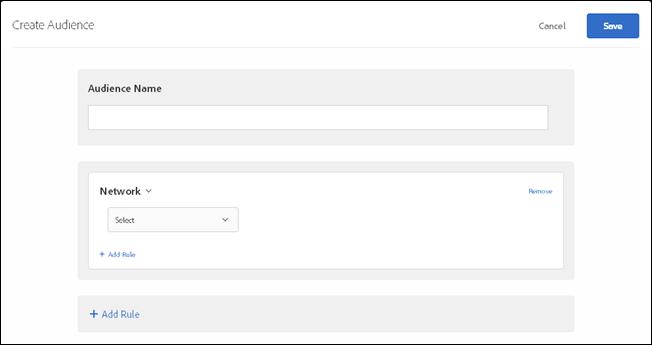

# Network

**Creating Audiences (9:58)** 

This video includes information about using audience categories. 

* Create audiences
* Define audience categories

>[!VIDEO](https://vimeo.com/wV9lVTSOxMk) 

1. In the [!DNL  Target] interface, click **[!UICONTROL  Audiences]** > **[!UICONTROL  Create Audience]**. 

1. Name the audience. 

1. Click **[!UICONTROL  Add Rule]** > **[!UICONTROL  Network]**. 

    

1. Click **[!UICONTROL  Select]**, then select one of the following options: 

    * **ISP: **An ISP is an organization that provides internet access to its subscribers, usually at a monthly or yearly fee. Many ISPs provide additional services, such as web hosting or email. The ISP field is either a commercial ISP (such as Comcast or TimeWarner) or another entity such as a business or educational institution. 

      The following are some examples of popular ISPs in the United States: 

      |  Popular Name  | ISP Name  | Domain Name  | Sample IP Address  |
      |---|---|---|---|
      |  Cablevision  | Cablevision Systems Corp.  | *.optonline.net  | 68.196.130.239  |
      |  CenturyLink  | Qwest Communications Company, LLC  | *.centurylink.net  | 64.40.65.0  |
      |  Charter Communications  | Charter Communications  | *.charter.com  | 71.85.225.124  |
      |  Comcast  | Comcast Cable Communications, Inc.  | *.comcast.net  | 76.27.24.28  |
      |  Cox  | Cox Communications Inc.  | *cox.net  | 68.224.174.22  |
      |  Speakeasy  | MegaPath Corporation  | *.speakeasy.net  | 66.93.240.0  |
      |  Time Warner  | Time Warner Cable Internet LLC  | *.res.rr.com  | 72.229.28.185  |
      |  Verizon FiOS  | MCI Communications Services, Inc. d/b/a Verizon Business  | *.fios.verizon.net  | 173.68.112.34  |
      |  Vivint  | Smartrove Inc.  | *.vivintwireless.net  | 170.72.26.105  |
      |  AT&amp;amp;T Wireless  | AT  | *.mycingular.net  |  |
      |  Sprint mobile  | Sprint Personal Communications Systems  | ip address  |  |
      |  T-Mobile  | T-Mobile USA, Inc.  | ip address  | 208.54.86.0  |
      |  Verizon Wireless  | Cellco Parternship DBA Verizon Wireless  | *.myvzw.com  | 70.195.74.199  |

      >[!NOTE]
      >
      >When targeting based on ISP, use the ISP name, not the popular name. Ensure that you build the rule to be case-insensitive or always use lowercase format.

      If you'd like to see more ISPs referenced in this table, please contact Customer Care with your suggestion. 

      You can test the ISP and domain name values. [ http://www.whoismyisp.org ](http://www.whoismyisp.org) is a good resource for targeting purposes. You can use the sample IP addresses given in the table above, or enter your own. Then use the ` themboxOverride.browserIp= URL` parameter to mimic that IP address. 

    * **Domain Name: **This is the domain name for the visitor's IP address. This is not the domain name of the website you are using with [!DNL  Target]. This domain name is related to the visitor's IP address and is sometimes called a hostname. It is usually very similar to the ISP name. Sometimes the hostname references older names of companies that have rebranded their ISP name but not the domain name. 

    * **Connection Speed:** This is the speed of the visitor's connection to the internet. Options include: broadband, cable, dialup, mobile, oc3, oc12, satellite, t1, t2, and wireless, and xdsl. This field is based on the type of connection and not the actual speed itself. [!DNL  Target] cannot determine the exact connection speeds of connections. The Broadband connection type is used when there is no indication of other connection types so a specific type cannot be chosen. 

1. (Optional) Click **[!UICONTROL  Add Rule]** and set up additional rules for the audience. 

1. Click **[!UICONTROL  Save]**. 

