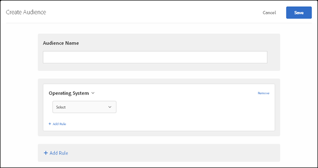

# Operating System

1. In the [!DNL  Target] interface, click ** [!UICONTROL  Audiences] ** > ** [!UICONTROL  Create Audience] **. 

1. Name the audience. 

1. Click ** [!UICONTROL  Add Rule] ** > ** [!UICONTROL  Operating System] **. 

    

1. Click ** [!UICONTROL  Select] **, then select one of the following options: 

    * Linux
    * Macintosh
    * Windows

1. (Optional) Click ** [!UICONTROL  Add Rule] ** and set up additional rules for the audience. 

1. Click ** [!UICONTROL  Save] **. 

This video includes information about using audience categories. 

<table id="table_A3A70CC0C9F54131BB9F098B4DA8C9D6"> 
 <thead> 
  <tr> 
   <th class="entry" colspan="2"> Creating Audiences </th> 
   <th colname="col3" class="entry"> 9:58 </th> 
  </tr>
 </thead>
 <tbody> 
  <tr> 
   <td colspan="2"> 
    
 
     <iframe src="https://www.youtube.com/embed/wV9lVTSOxMk/" frameborder="0" webkitallowfullscreen="true" mozallowfullscreen="true" oallowfullscreen="true" msallowfullscreen="true" allowfullscreen="allowfullscreen" scrolling="no" width="550" height="345">https://www.youtube.com/embed/wV9lVTSOxMk/</iframe>
    
 </td> 
   <td colname="col3"> 
 
     <ul id="ul_FF4FEC7BC7A34461BAA54FBE18A8E63B"> 
      <li id="li_7D6D4CB2E771430F84D2B658F8611532">Create audiences </li> 
      <li id="li_8529CB01E80B4C89B74287882AE0DA9D">Define audience categories </li> 
     </ul> 
 </td> 
  </tr> 
 </tbody> 
</table>

