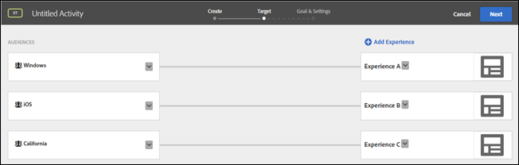

# Targets and Audiences Frequently Asked Questions

The following sections contain more information: 

* [ When creating a new audience, what's the difference between Target Library &amp;gt; New Visitors and Visitor Profile &amp;gt; New Visitor? ](../c_target/c_troubleshooting_targets_and_audiences.md#section_9EBF5B0F9DF94168A15B92B905CCF7E0) 

* [ How do I know how traffic will be split between... ](../c_target/c_troubleshooting_targets_and_audiences.md#section_067EEFB956E7465CBF77EC86834470AB) 

* [ Which experience displays if a user qualifies for an activity... ](../c_target/c_troubleshooting_targets_and_audiences.md#section_94A60B11212D48FD8AB0803C6C7E7253) 

* [ Why do names for the same audience in Target, Adobe Audience Manager (AAM), and the Audience Library in core services differ? ](../c_target/c_troubleshooting_targets_and_audiences.md#section_F67E61A607B6444C8DAA4F99C3E95AED) 

* [ Why can't I rename an audience? ](../c_target/c_troubleshooting_targets_and_audiences.md#section_54E420556F534D20836E261E253D8B97) 

* [ Why are all profile parameters not showing in the Target... ](../c_target/c_troubleshooting_targets_and_audiences.md#section_3CD947D15C984EE9AD19550220E0E8BD) 

* [ Why are visitors seeing experiences for an AP activity that... ](../c_target/c_troubleshooting_targets_and_audiences.md#section_41CECEAE0881446A8D9F3B016857914B) 

* [ Why are changes made to audiences created via API not... ](../c_target/c_troubleshooting_targets_and_audiences.md#section_6BEB237CAC004A06A290F9644E5BF0FB) 

## When building audiences, why are pre-built audiences under Target Library found under other categories? {#section_9EBF5B0F9DF94168A15B92B905CCF7E0}

The pre-built audiences in the Target Library category are legacy audiences and exist in other categories. As an example, the legacy Target Library &amp;gt; New Visitors audience has an updated counterpart: Visitor Profile &amp;gt; New Visitor. 

Best practice is to use the newer audiences because they have improved performance. Some customers might be using legacy, pre-built audiences, so they have not been removed from the Target interface. 

## How do I know how traffic will be split between audiences? {#section_067EEFB956E7465CBF77EC86834470AB}

By default, traffic is split evenly between experiences. However, you can specify [ percentage targets ](../c_target/c_target_rulebased/c_target_percent.md#concept_9D0C47368EB942C9A66CE03C6BD92412) for each experience. In this case, a random number is generated and that number is used to choose the experience to display. The resulting percentages might not exactly match the specified targets, but more traffic means that the experiences should be split closer to the target goals. 

## Which experience displays if a user qualifies for an activity that contains multiple experiences with multiple qualifying audiences? {#section_94A60B11212D48FD8AB0803C6C7E7253}

The user qualifies for the first experience/audience that displays on the activity's [!UICONTROL  Target] page. 

For example, in the following illustration, a user from California using a Windows device qualifies for both Experience A (Windows audience) and Experience C (California audience). This user would be shown Experience A because it displays in the list above Experience C on the Targets page. 

 

## Why do names for the same audience in Target , Adobe Audience Manager (AAM), and the Audience Library in core services differ? {#section_F67E61A607B6444C8DAA4F99C3E95AED}

Audience names in [!DNL  Target] are unique; however, in [!DNL  AAM] and the [!DNL  Audience Library], you can have the same name for multiple audiences (if they are in different folders).When [!DNL  Target] encounters an audience name that corresponds to an [!DNL  AAM] or [!DNL  Audience Library] audience, [!DNL  Target] appends "#&lt;number&gt;" to the name. 

For example, you might see the following audiences: "PC Users" (in [!DNL  AAM]) and "PC Users #1" (in [!DNL  Target]). 

## Why can't I rename an audience? {#section_54E420556F534D20836E261E253D8B97}

Some Target audiences are predefined, such as "New Visitors" and "Returning Visitors." These predefined audiences cannot be renamed by users. 

## Why are all profile parameters not showing in the Target user interface? {#section_3CD947D15C984EE9AD19550220E0E8BD}

[!DNL  Target] has a limit of 50 unique profile attributes per mbox call. If you need to pass more than 50 profile attributes to [!DNL  Target], you can pass them using the [!UICONTROL  Profile Update] API method. For more information, see [ Profile Update ](https://www.adobe.io/apis/marketingcloud/target/docs/reference/profiles/profile-update.html) in the Adobe Target API documentation. 

## Why are visitors seeing experiences for an AP activity that they shouldn't see? {#section_41CECEAE0881446A8D9F3B016857914B}

Automated Personalization activities are evaluated once per session. If there were active sessions that have qualified for a particular experience and now new offers have been added to it, users will see the new content along with the previously shown offers. Because they have previously qualified for those experiences, they would still see them for the duration of the session. If there's a desire to evaluate this at every single page visit, you should change to the Experience Targeting (XT) activity type. 

## Why are changes made to audiences created via API not reflected in the Target UI? {#section_6BEB237CAC004A06A290F9644E5BF0FB}

Unlike offers and profile scripts, changes made by API to audiences created via Target Standard are not currently synced back to the Target UI. 
