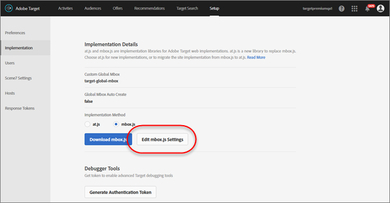
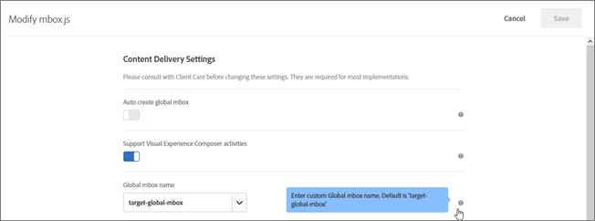
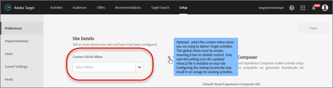

# Customize a Global mbox

>1. Edit mbox.js.

>       Go to ** `Target` ** > ** `Setup` ** > ** `Implementation` **. 
>    
>    * For mbox.js, click ** `Edit mbox.js Settings` **.
>    * For `at.js`, select ** `at.js` ** under the Implementation Method, and then click ** `Edit mbox.js Settings` **.

>        
>1. Edit `mbox.js` or `at.js`.

>       Disable ** `Auto create global mbox` **, then add the name of the custom global mbox that you would like to use to deliver activities from `Target Standard/Premium`. This custom global mbox is also used for click tracking. 
>        
>       Click ** `Save` ** when you are finished. 
>1. Implement the `mbox.js` or `at.js` library on your site.

>    
>    * For mbox.js, see [Mbox.js Implementation](t_mbox_download.md#task_4EAE26BB84FD4E1D858F411AEDF4B420).
>    * For at.js, see [at.js Implementation](c_target-atjs-implementation.md#concept_8AC8D169E02944B1A547A0CAD97EAC17).

>1. Time the transition with your release.

>       As soon as you are ready for `Target Standard/Premium` to start using your global mbox for all activities moving forward, you can proceed with this step. 
>       Update the name of the custom global mbox to match the name used in Step 2, above.
>        

>       >[!IMPORTANT]
>       >
>       >When you save, all activities in your account sync with this mbox. If this mbox is not on your site, all activities will stop functioning.

>       Click ** `Save` **. 
