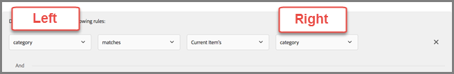

# Add Dynamic Promotions


>[!NOTE]
>
>Detailed information about dynamic promotions and inclusion rules can also be found in[Use Dynamic and Static Filters](c_add-additional-filtering-rules-to-inclusion-rules.md#concept_DBC4C8CEE4F3477884002F47ED9E74E9). 


1. While [creating a promotion](t_adding_promotions.md#task_CC5BD28C364742218C1ACAF0D45E0E14), select ** `Promote by Attribute` ** to add a dynamically matched promotion. 

1. Add rules to define the attributes of the items you want to promote.
   Different data type attributes might not be compatible during runtime with the dynamically "equals" and dynamically "does not equal" operators in promotions. You should use Value, Margin, Inventory, and Environment values wisely on the right hand side if the left hand side has predefined attributes or custom attributes. See "Caveats" below for more information.


The following sections contain more information:

* [Examples](c_add-dynamic-matches.md#section_3BFA09B5A61A418D980C265697069809)
* [Use-Cases](c_add-dynamic-matches.md#section_FBB7DB4B1DD84EA680B4475C1D6EBF16)
* [Caveats](c_add-dynamic-matches.md#section_A889FAF794B7458CA074DEE06DD0E345)


## Examples {#section_3BFA09B5A61A418D980C265697069809}

Dynamic promotions are much more powerful than static promotions and yield better results and engagement. The following examples will give you ideas about how you can use dynamic promotions in your marketing efforts:
**Equals:**Using the "equals" operator in dynamic promotions, when a visitor is viewing an item on your website (such as a product, article, or movie), you can promote other items from: 

<ul class="simplelist"> 
 <li>the same brand</li> 
 <li>the same category</li> 
 <li>the same category AND from the house brand</li> 
 <li>the same store</li> 
</ul>


**Does Not Equal:**Using the "does not equal" operator in dynamic promotions, when a visitor is viewing an item on your website (such as a product, article, or movie), you can promote other items from: 

<ul class="simplelist"> 
 <li>a different TV series</li> 
 <li>a different genre</li> 
 <li>a different product series</li> 
 <li>a different style ID</li> 
</ul>


**Is Between:**Using the "is between" operator in dynamic promotions, when a visitor is viewing an item on your website (such as a product, article, or movie), you can promote other items that are: 

<ul class="simplelist"> 
 <li>more expensive</li> 
 <li>less expensive</li> 
 <li>cost plus or minus 30%</li> 
 <li>later episodes in the same season</li> 
 <li>prior books in a series</li> 
</ul>


## Use-Cases {#section_FBB7DB4B1DD84EA680B4475C1D6EBF16}

**Example 1:**The following illustration demonstrates how to use the "equals" and "is between" operators to promote more expensive items that are from the same category and the same brand. For example, a sporting apparel company can promote more expensive running shoes in an effort to up-sell a visitor looking at running shorts. 
 
The following rules are used in this example:

```
category - equals - current item's - category
And
brand - equals - current item's - brand
And
value - is between - 100% and 1000% of - current item's - value
```

>[!NOTE]
>
>You cannot change the key in a dynamic promotion with multiple rules (the third drop-down list in the first two rules labeled "Current Item's" in the illustration).


**Example 2:**The second illustration demonstrates how to use the "equals" and "is between" operators to promote more expensive items that are from the same category, the same brand, and the house brand. For example, an office supply company can promote more expensive toner cartridges, of both the same brand and the company's house brand, in an effort to up-sell a visitor looking at printers. 
 
The following rules are used in this example:

```
category - equals - current item's - category
And
IsHouseBrand - equals - true
And
value - is between - 100% and 1000% of - current item's - value
```
Notice that this example uses two dynamic rules and one static rule.
**Example 3:**The third illustration demonstrates how to use the"does not equal" operator to promote a series that does not equal the series that the visitor is currently viewing. For example, a media website could promote a television series that is different than the series the visitor is currently viewing. 
 
The following rule is used in this example:

```
series - does not equal - current item's - series
```
**Example 4:**The fourth illustration demonstrates how to promote compatible accessory items for the visitor's last-purchased item. For example, if someone purchased a new TV, you could dynamically promote an HDMI cable. 
 
The following rules are used in this example:

```
id - equals - last purchased item's - compatibleAccessoryids
```
**Example 5:**The final illustration demonstrates how to promote items that are on sale for between 90 and 110 percent of the item the visitor is currently viewing. For example, if someone is looking at a TV, you could dynamically promote similar TVs that are on sale in approximately the same price range. 
 
The following rules are used in this example:

```
salesPrice - is between - 90% and 110% of - current item's - price
```

## Caveats {#section_A889FAF794B7458CA074DEE06DD0E345}


>[!IMPORTANT]
>
>Different data type attributes might not be compatible in dynamic promotions during runtime with the "equals" and "does not equal" operators. You should use Value, Margin, Inventory, and Environment values wisely on the right hand side if the left hand side has predefined attributes or custom attributes.


 
The following table shows effective rules and rules that might not be compatible during runtime:


<table id="table_CDDDC41C55EA4D23A910CC0747F31435"> 
 <thead> 
  <tr> 
   <th colname="col1" class="entry">Compatible Rules</th> 
   <th colname="col2" class="entry">Potential Incompatible Rules</th> 
  </tr>
 </thead>
 <tbody> 
  <tr> 
   <td colname="col1"> <p><span class="codeph">value - is between - 90% and 110% of current item's - salesValue</span> </p> </td> 
   <td colname="col2"> <p><span class="codeph">salesValue - is between - 90% and 110% of current item's - value</span> </p> </td> 
  </tr> 
  <tr> 
   <td colname="col1"> <p><span class="codeph">value - is between - 90% and 110% of current item's - value</span> </p> </td> 
   <td colname="col2"> <p><span class="codeph">clearancePrice - is between - 90% and 110% of current item's - margin</span> </p> </td> 
  </tr> 
  <tr> 
   <td colname="col1"> <p><span class="codeph">margin - is between - 90% and 110% of current item's - margin</span> </p> </td> 
   <td colname="col2"> <p><span class="codeph">storeInventory - equals - current item's - inventory</span> </p> </td> 
  </tr> 
  <tr> 
   <td colname="col1"> <p><span class="codeph">inventory - equals - current item's - inventory</span> </p> </td> 
   <td colname="col2"> </td> 
  </tr> 
 </tbody> 
</table>

