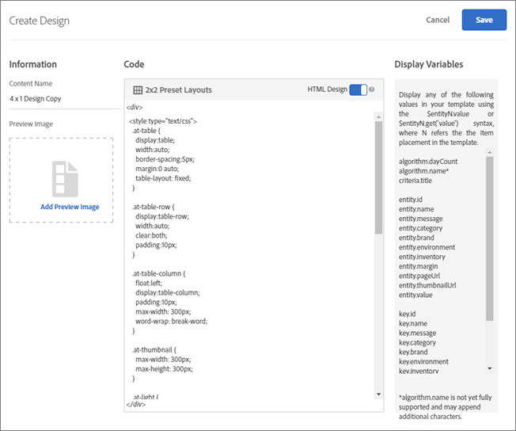

# Design Overview

## Design Overview {#concept_3A265774E088420C90983C9A8C04640A}Overview information about designs that define how recommendations appear on a page.Target can deliver the complete look and feel of your recommendations as shown in the following illustration. The design can include HTML, JavaScript, and CSS.
 
Target can also send your recommendations as JSON objects that can be used in email messages, IoT (Internet of Things) devices, console, or voice use cases (Amazon Alexa or Google Home).

## JSON Example {#section_75BFB2537CFF4FBD9B560F59EB32C8DD}

The following example shows how to JSON responses can be returned when configuring an activity via the form-based editor.

1. Create a design from within Design Library or within the form-based workflow. If you attempt to do this inside the Visual Experience Composer (VEC) workflow you cannot create anything other than an HTML design, which is wrapped in a &lt;div&gt; for click tracking purposes.

1. Ensure that the "HTML Design" option is turned off:
    

1. The following code is an example below of what you could paste into your design:

   ```
       #* 
       * "Return a simple list of recommended entity ids"   
       *#   
          
          
       {   
         "notes":{   
         "purpose": "Return a simple list of recommended entity ids",   
         "use-case": "Use this approach if you prefer to do a real-time lookup of entity attribute details (such as inventory, price, rating) from another system (such as a CMS, PIM or ecommerce platform)",   
         "version": "01"   
         },   
         "recommendedItems": {   
           "key": "$key.id",   
           "slot-01": "$entity1.id",   
           "slot-02": "$entity2.id",   
           "slot-03": "$entity3.id",   
           "slot-04": "$entity4.id",   
           "slot-05": "$entity5.id",   
           "slot-06": "$entity6.id",   
           "slot-07": "$entity7.id",   
           "slot-08": "$entity8.id",   
           "slot-09": "$entity9.id",   
           "slot-10": "$entity10.id"   
         }   
       }  
   ```


1. Set up a form-based Recommendations activity that uses this design.

    1. Navigate to the Activities page.

    1. Click ** ` Create Activity` **.
    1. Select ** ` Recommendations` **. 

    1. Under ** ` Choose Experience Composer` **, select ** ` Form` **.
    1. Under location, enter the text: "Sample_Recs_Response"

    1. Under ** ` Default Content` **, click the down-arrow, then click ** ` Add Recommendation` **. 

    1. Choose a Page Type. This determines the initial filtering of the next screen.

    1. Select a Criteria card, then click ** ` Next` **. 

    1. Select the design you created in the previous step, then click ** ` Save` **. 

    1. Complete the setup process.

    1. Click the right arrow next to ** ` Inactive` **, then select ** ` Activate` **. 


1. After your activity is set up and activated, you can set up a sample request to get back the clean JSON response.
   From the time that you save your activity, Target will need to build a model to support the selected criteria configuration. Depending on a number of factors, this could take some time. Results appear once the model has build.
   For example:

   ```
   http://[YOUR_CLIENT_CODE].tt.omtrdc.net/m2/YOUR_CLIENT_CODE/ubox/raw?mbox=[YOUR_MBOX_NAME]&amp;mboxContentType=text/html&amp;mboxXDomain=disabled&amp;entity.id=[ENTITY_ID]&amp;mboxHost=rawbox_sample&amp;at_property=[AT_PROPERTY_TOKEN]&amp;mboxNoRedirect=true&amp;mboxPC=1234-4321&amp;mboxSession=9876-7000
   ```

   where


<table id="table_74D9504F935C46C7A2E36FA912C96AE7"> 
 <thead> 
  <tr> 
   <th colname="col1" class="entry"> Parameter </th> 
   <th colname="col2" class="entry"> Value </th> 
  </tr> 
 </thead>
 <tbody> 
  <tr> 
   <td colname="col1"> [YOUR_CLIENT_CODE] </td> 
   <td colname="col2"> <p>Target Client code (available on <span class="filepath"> ../target/products.html#recsSettings </span> &gt; Recommendation API Token &gt; Client Code. </p> </td> 
  </tr> 
  <tr> 
   <td colname="col1"> [YOUR_MBOX_NAME] </td> 
   <td colname="col2"> <p>The name you've selected in the "locations" section of the form-based Recommendations, in this case YOUR_CLIENT_CODE.</p> </td> 
  </tr> 
  <tr> 
   <td colname="col1"> [ENTITY_ID] </td> 
   <td colname="col2"> <p>The <span class="codeph"> entity.id </span>of an item in your catalog. </p> </td> 
  </tr> 
  <tr> 
   <td colname="col1"> [AT_PROPERTY_TOKEN] </td> 
   <td colname="col2"> <p>(Optional) Add if you've selected a Property (part of Enterprise Permissions) during your activity setup.</p> </td> 
  </tr> 
 </tbody> 
</table>

   After your algorithm has run, and you have results, your response should look something like this:
    


## Additional JSON Object Tips and Tricks {#section_C305673C68944749969DB239E3221DC2}

You can also just send back a simple comma delimited list of items by setting up a design with the following syntax:

```
entity1.id, $entity2.id, $entity3.id, $entity4.id, $entity5.id,
```

Alternatively, you can send additional information in the response. The following code is a more complex example that returns much more than the entity ids with their associated slots (order). This Design example also returns activity details, Target Profile details (as applicable), and other ` entity.attributes` associated with the items returned. 

```
    {   
     "adobeRecommendations": {   
      "notes": {   
       "purpose": "Return a list of entity ids with their associated entity.attributes",   
       "use-case": "Use this approach to avoid looking up attribute details after receiving a response from Target",   
       "version": "01"   
      },   
      "recommendedItems": {   
       "slot-01": "$entity1.id",   
       "slot-02": "$entity2.id",   
       "slot-03": "$entity3.id",   
       "slot-04": "$entity4.id",   
       "slot-05": "$entity5.id",   
       "slot-06": "$entity6.id",   
       "slot-07": "$entity7.id",   
       "slot-08": "$entity8.id",   
       "slot-09": "$entity9.id",   
       "slot-10": "$entity10.id"   
      },   
      "activityDetails": {   
       "mbox.name": "email-mbox",   
       "campaign.name": "\${campaign.name}",   
       "campaign.id": "\${campaign.id}",   
       "campaign.recipe.name": "\${campaign.recipe.name}",   
       "campaign.recipe.id": "\${campaign.recipe.id}",   
       "offer.name": "\${offer.name}",   
       "offer.id": "\${offer.id}",   
       "criteria.title": "$criteria.title",   
       "algorithm.name": "$algorithm.name",   
       "algorithm.dayCount": "$algorithm.dayCount"   
      },   
      "visitorProfile": {   
       "profile.favorite-category": "\${profile.favorite-category}",   
       "profile.test": "\${profile.test}",   
       "user.endpoint.lastPurchasedEntity": "\${user.endpoint.lastPurchasedEntity}",   
       "user.endpoint.lastViewedEntity": "\${user.endpoint.lastViewedEntity}",   
       "user.endpoint.mostViewedEntity": "\${user.endpoint.mostViewedEntity}",   
       "user.endpoint.categoryAffinity": "\${user.endpoint.categoryAffinity}",   
       "profile.geolocation.city": "\${profile.geolocation.city}",   
       "profile.geolocation.dma": "\${profile.geolocation.dma}",   
       "profile.geolocation.state": "\${profile.geolocation.state}",   
       "profile.geolocation.country": "\${profile.geolocation.country}",   
       "profile.sessionCount": "\${profile.sessionCount}",   
       "profile.averageDaysBetweenVisits": "\${profile.averageDaysBetweenVisits}",   
       "profile.browserTime": "\${profile.browserTime}",   
       "user.activeActivities": "\${user.activeActivities}",   
       "user.pcId": "\${user.pcId}",   
       "user.isFirstSession": "\${user.isFirstSession}",   
       "user.isNewSession": "\${user.isNewSession}",   
       "user.header": "\${user.header}",   
       "user.parameter": "\${user.parameter}"   
      },   
      "recKey": {   
       "recKeyDetails": {   
        "id": "$key.id",   
        "name": "$key.name",   
        "category": "$key.category",   
        "pageUrl": "$key.pageUrl",   
        "thumbnailUrl": "$key.thumbnailUrl"   
       }   
      },   
      "recDetailedResults": {   
       "recEntity1Details": {   
        "id": "$entity1.id",   
        "name": "$entity1.name",   
        "category": "$entity1.category",   
        "pageUrl": "$entity1.pageUrl",   
        "thumbnailUrl": "$entity1.thumbnailUrl"   
       },   
       "recEntity2Details": {   
        "id": "$entity2.id",   
        "name": "$entity2.name",   
        "category": "$entity2.category",   
        "pageUrl": "$entity2.pageUrl",   
        "thumbnailUrl": "$entity2.thumbnailUrl"   
       },   
       "recEntity3Details": {   
        "id": "$entity3.id",   
        "name": "$entity3.name",   
        "category": "$entity3.category",   
        "pageUrl": "$entity3.pageUrl",   
        "thumbnailUrl": "$entity3.thumbnailUrl"   
       },   
       "recEntity4Details": {   
        "id": "$entity4.id",   
        "name": "$entity4.name",   
        "category": "$entity4.category",   
        "pageUrl": "$entity4.pageUrl",   
        "thumbnailUrl": "$entity4.thumbnailUrl"   
       },   
       "recEntity5Details": {   
        "id": "$entity5.id",   
        "name": "$entity5.name",   
        "category": "$entity5.category",   
        "pageUrl": "$entity5.pageUrl",   
        "thumbnailUrl": "$entity5.thumbnailUrl"   
       },   
       "recEntity6Details": {   
        "id": "$entity6.id",   
        "name": "$entity6.name",   
        "category": "$entity6.category",   
        "pageUrl": "$entity6.pageUrl",   
        "thumbnailUrl": "$entity6.thumbnailUrl"   
       },   
       "recEntity7Details": {   
        "id": "$entity7.id",   
        "name": "$entity7.name",   
        "category": "$entity7.category",   
        "pageUrl": "$entity7.pageUrl",   
        "thumbnailUrl": "$entity7.thumbnailUrl"   
       },   
       "recEntity8Details": {   
        "id": "$entity8.id",   
        "name": "$entity8.name",   
        "category": "$entity8.category",   
        "pageUrl": "$entity8.pageUrl",   
        "thumbnailUrl": "$entity8.thumbnailUrl"   
       },   
       "recEntity9Details": {   
        "id": "$entity9.id",   
        "name": "$entity9.name",   
        "category": "$entity9.category",   
        "pageUrl": "$entity9.pageUrl",   
        "thumbnailUrl": "$entity9.thumbnailUrl"   
       },   
       "recEntity10Details": {   
        "id": "$entity10.id",   
        "name": "$entity10.name",   
        "category": "$entity10.category",   
        "pageUrl": "$entity10.pageUrl",   
        "thumbnailUrl": "$entity10.thumbnailUrl"   
       }   
      }   
     }   
    }  
```

>## Create a Design {#task_CC5BD28C364742218C1ACAF0D45E0E14}A design defines how recommendations appear on a page. 
<draft-comment otherprops="merge">
  recs/t_create_design.xml 
</draft-comment>You can create a ` Recommendations` design using a default design or by creating a custom design. The ** ` Recommendations > Designs` ** screen displays both default design cards and any designs you have created. The default designs cannot be edited or deleted. 

>1. On the ** ` Recommendations > Designs` ** screen, mouse over the card for the design you want to create.

>        
>1. To copy and edit an existing design, click the ** ` Copy` ** icon.

>       Or
>       To create a custom design click ** ` Create Design` ** on the ** ` Recommendations > Designs` ** screen. 
>        
>1. Add a ** ` Content Name` **.

>       ** ` Content Name` **1. (Optional) Click  to select an image to display on the design card.
>1. Edit the design ** ` Code` **.

>       Recommendation designs use the open-source Velocity design language. Information about Velocity can be found at [ http://velocity.apache.org ](http://velocity.apache.org). 
>       A design can be HTML or non-HTML. By default, HTML designs are wrapped with a &lt;div&gt; tag to allow for click-tracking in a Web environment. Non-HTML designs are for non-Web environments where click-tracking is not possible.

>       >[!NOTE]
>       >
>       >The maximum number of entities that can be referenced in a design, either hardcoded or via loops, is 99.

>1. Click ** ` Save` **.
>## Design FAQ {#concept_5C1FC6535E194B37B02B4F9E7C05F49B}List of frequently asked questions (FAQs) about recommendations designs. 
<draft-comment otherprops="merge">
  recs/c_template_faq.xml 
</draft-comment>
## Why isn't category showing in the design? I'm using $entity1.categoryId . {#section_073309B8051049C7953D396A93EA0713}

Category ID can't be displayed in the design. Because multiple categories can be stored, the system wouldn't know which category to display.

## How should I change a design to get an instant update? {#section_28EE35A5B10B47ECA4A332F0E5B2598F}

Altering the design that is currently in use takes a while to update. To change the design instantly, create a new design, select it in the campaign, and save the recommendation.

## How can I capture key information for display in the design? Example: If we want to display the key product's category, how would I code that value in the velocity design? {#section_F08043B14BA24BC8815FEF25F4F84C39}

The ` $key. * ` value` *` parameter captures most of the key product's information to display within the design. Example: If you want to display the key product's thumbnail, you would use ` $key.thumbnailURL`. 

## Which version of Velocity is used? {#section_28F00E15A4A54A768782A3F5BB0CDB21}

Version 1.5 with no additional tools or libraries added in. Basic Velocity functionality is available.

## How do I replace an existing entity value with a blank? For example, an item's entity.message needs to be cleared when a promotion ends. {#section_B88F2C2925DC4508974B2F8B13F961CB}

Sending in a JavaScript nonbreaking space seems to do this. Have the developers send in ` \u00A0` as the value. Example: ` entity.message=\u00A0`.You might consider having that be the default value when no value is present instead of a null. 

## Can I use a profile script in a Recommendations design? {#section_6BD55203984A4D80A0C6F241AD7806DF}

Yes. However, you must add a backslash (\) before the $ in the profile script name.
>## Customizing a Design {#concept_94F1554C3F2E4CDB9A2C3D78F10EDA59}Use the open-source Velocity design language to customize recommendation designs. 
<draft-comment otherprops="merge">
  recs/c_customizing_a_template.xml 
</draft-comment>Information about Velocity can be found at [ http://velocity.apache.org ](http://velocity.apache.org). 
All Velocity logic, syntax, and so on can be used for a recommendation design. This means that you can create *for* loops, *if* statements, and other code using Velocity rather than JavaScript. 
Any variable sent to ` Recommendations` in the ` productPage` mbox or the CSV upload can be displayed in a design. These values are referenced with the following syntax: 

```
$entityN.variable
```

Variable names must follow Velocity shorthand notation, which consists of a leading *$* character, followed by a Velocity Template Language (VTL) Identifier. The VTL Identifier must start with an alphabetic character (a-z or A-Z). 
Velocity variable names are restricted to the following types of characters:

* Alphabetic (a-z, A-Z)
* Numeric (0-9)
* Hyphen ( - )
* Underscore ( _ )

The following variables are available as Velocity arrays. As such, they can be iterated over or referenced via index.

* ` entities` 

* ` entityN.categoriesList` 


For example:

```
#foreach ($category in $entity1.categoriesList) 
<br/>$category 
#end
```

Or

```
#if ($entities[0].categoriesList.size() >= 3 ) 
$entities[0].categoriesList[2] 
#end
```

For more information about Velocity variables, see [ https://velocity.apache.org/engine/releases/velocity-1.7/user-guide.html#variables ](https://velocity.apache.org/engine/releases/velocity-1.7/user-guide.html#variables). 
If you use a profile script in your design, the $ preceding the script name must be escaped with a \. For example, ` \${user.script_name}`. 

>[!NOTE]
>
>The maximum number of entities that can be referenced in a design, either hardcoded or via loops, is 99. The template script length can contain up to 65,000 characters.


For example, if you want a design that displays something similar to this:
 
you can use the following code:

```
<table style="border:1px solid #CCCCCC;"> 
 
<tr> 
 
<td colspan="3" style="font-size: 130%; border-bottom:1px solid  
#CCCCCC;"> You May Also Like... </td> 
 
</tr> 
 
<tr> 
 
<td style="border-right:1px solid #CCCCCC;"> 
 
<div class="search_content_inner" style="border-bottom:0px;"> 
 
<div class="search_title"><a href="$entity1.pageUrl"  
style="color: rgb(112, 161, 0); font-weight: bold;"> 
$entity1.id</a></div> 
 
By $entity1.message <a href="?x14=brand;q14=$entity1.message"> 
(More)</a><br/> 
 
sku: $entity1.prodId<br/> Price: $$entity1.value 
 
<br/><br/> 
 
</div> 
 
</td> 
 
<td style="border-right:1px solid #CCCCCC; padding-left:10px;"> 
 
<div class="search_content_inner" style="border-bottom:0px;"> 
 
<div class="search_title"><a href="$entity2.pageUrl"  
style="color: rgb(112, 161, 0); font-weight: bold;"> 
$entity2.id</a></div> 
 
By $entity2.message <a href="?x14=brand;q14=$entity2.message"> 
(More)</a><br/> 
 
sku: $entity2.prodId<br/> 
 
Price: $$entity2.value 
 
<br/><br/> 
 
</div> 
 
</td> 
 
<td style="padding-left:10px;"> 
 
<div class="search_content_inner" style="border-bottom:0px;"> 
 
<div class="search_title"><a href="$entity3.pageUrl"  
style="color: rgb(112, 161, 0); font-weight: bold;"> 
$entity3.id</a></div> 
 
By $entity3.message <a href="?x14=brand;q14=$entity3.message"> 
(More)</a><br/> 
 
sku: $entity3.prodId<br/> Price: $$entity3.value 
 
<br/><br/> 
 
</div> 
 
</td> 
 
</tr> 
 
</table>
```


>[!NOTE] {class="- topic/note "}
>
>If you want to add information after the variable value, you can do so using formal notation. For example: ` ${entity1.thumbnailUrl}.gif`. 


You can also use ` algorithm.name` and ` algorithm.dayCount` as variables in designs, so one design can be used to test multiple criteria, and the criteria name can be dynamically displayed in the design. This shows the visitor that he or she is looking at "top sellers" or "people who viewed this bought that." You can even use these variables to display the ` dayCount` (number of days of data used in the criteria, like "top sellers over the last 2 days," etc. 

## Scenario: Display Key Item with Recommended Products {#section_7F8D8C0CCCB0403FB9904B32D9E5EDDE}

You can modify your design to show your key item alongside other recommended products. For example, you might want to show the current item for reference next to the recommendations.
To do this, create a column in your design that uses the ` $key` attribute you are basing your recommendation on rather than the ` $entity` attribute. For example, the code for your key column might look like this: 

```
<div class="at-table-column"> 
   <a href="$key.pageURL"> 
       
      <br/><h3>$key.name</h3> 
      <br/><p class="at-light">$key.message</p> 
      <br/><p class="at-light">$key.value</p> 
   </a> 
</div>
```

The result is a design like the following, where one column shows the key item.
 
When you are creating your ` Recommendations` activity, if the key item is taken from the visitor's profile, such as "last purchased item," ` Target` displays a random product in the ` Visual Experience Composer` (VEC). This is because a profile is not available while you design the activity. When visitors view the page, they will see the expected key item. 
