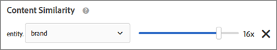

# Recommendations FAQ


## What should I do if special characters are breaking my array? {#section_D27214116EE443638A60887C7D1C534E}

Use escaped values in JavaScript. Quotation marks ( " ) can break the array. The following code snippet is an example of escaped values:

```
#set($String='')
#set($escaper=$String.class.forName('org.apache.commons.lang.StringEscapeUtils'))
<script type="text/javascript">
console.log("$escaper.escapeJavaScript($entity1.name)")
console.log("$escaper.escapeJavaScript($entity2.name)")
console.log('$escaper.escapeJavaScript($entity3.name)')
names.push("$escaper.escapeJavaScript($entity4.name)")
</script>
```


## Why aren't all criteria, including custom criteria, available for selection when creating a Recommendations activity? {#section_B2265AC8B8A94E0298D495A05C5D817F}

The available criteria is based on the current category. When you are creating recommendations offers, the algorithm picker displays criteria on the basis of category Id.
If the location on which you're applying this criteria doesn't contain the category Id, certain criteria is not available in the algorithm picker.
If you use a location where category Id is present in the mbox, the criterial picker will contain all applicable criteria.
Target has a [Filter Incompatible Criteria](c_recommendations.md#concept_C1E1E2351413468692D6C21145EF0B84) setting to control intelligent filtering of the algorithm picker. 

>[!NOTE]
>
>This setting applies to activities created in the Visual Experience Composer (VEC) only. This setting does not apply to activities created in the Form-Based Experience Composer (Target does not have location context).


To access the `Filter Incompatible Criteria` setting, click `Recommendations` > `Settings`: 
 
If the `Filter Incompatible Criteria` setting is NOT enabled, Target does not filter algorithms in the Algorithm Picker and all algorithms are displayed. 
If the `Filter Incompatible Criteria` setting is enabled, in VEC activities, Target reads entityId and category Id from the selected location and then displays algorithms based on `currentItem|currentCategory` (if respective values are present on that location). As a result, only compatible algorithms for the selected location are shown in the algorithm picker, by default. 
If the `Filter Incompatible Criteria` setting is enabled, you can still view non-compatible algorithms by deselecting the `Compatible` checkbox while selecting criteria. 
 
The following list contains special cases in which Target does not display the `Compatible` checkbox: 

* Both entityId and category Id are present on the location, then nothing is being filtered.

* You are using `mbox.js` version 55 or earlier. 

* No mbox call is being fired from the page (!config.isAutoCreateGlobalMbox &amp;&amp; !config.isRegionalMbox)

* Target parameters are not defined.


## What should I do if a collection in Recommendations goes to zero (0)? {#section_E2DB2FE67CF24EEC81412BFF3FA6385D}

Consider the following information if you see a collection go to zero that previously was not at zero:

* You can re-save the collection and see if it updates the number. Note that by resaving, the collection will re-run all algorithms that are using that collection.

* Are you looking at the right environment? Go to `/target/products.html#recsSettings` to double check (as shown below). 
   

* Is your index up to date? Go t o `/target/products.html#productSearch` and check how many hours old the index is (for example, “Indexed 3 hour(s) ago”). You can refresh the index as needed. 

* Did you change something in the feed or the data layer that resulted in your entities no longer matching the collection rules? Make sure your CASE matches (case-sensitive).

* Did your feed run successfully? Did someone change the FTP directory, password, etc?

* Target does its best to make updates to the delivery (on the customer’s page/app) happen as quickly as possible. Yet, we also have to provide some representation in the UI for the marketer. We don’t necessarily delay delivery updates to wait for the UI updates to be in sync. You can use [mboxTrace](https://marketing.adobe.com/resources/help/en_US/target/target/c_content_trouble.html#) to see what is in the system at the time a request comes in. 


## What's the difference between general Attribute Weighting and Content Similarity-specific attribute weighting? {#section_FCD96598CBB44B16A4C6C084649928FF}

Attribute weighting exists in two forms: "standard attribute weighting" and "content similarity attribute weighting."
"Standard attribute weighting" applies to most, if not all, criteria types (not just Content Similarity).This type of weighting gives more weight to certain attribute values. In the following example, Nike products will get a bump in the output recommendations.
 

"Content similarity attribute weighting” applies to Content Similarity criteria only.
This type of weighting is more dynamic, and is based on the current “recommendation key” (the currently viewed item). In the following example (brand x 16), if a visitor were viewing Nike sneakers, that visitor is more likely to be recommended other Nike products (not necessarily only sneakers) rather than competitors’ sneakers. If a visitor were viewing Adidas sneakers, he or she is more likely to be recommended Adidas products.
 
