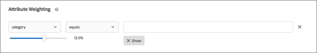

# Attribute Weighting

Apply a higher weighting to these on-sale items so they show more often in the recommendation. Non-sale items are not completely excluded, but they appear less often. Multiple weighted attributes can be applied to the same algorithm, and the weighted attributes can be tested on split traffic in the recommendation.
>1. Choose a value.

>       The value determines the type of item that is more likely to display, based on one of several available criteria.
>1. Choose an evaluator.
>1. Type the keyword to complete the rule attributes.

>       For example, the complete rule might be "Category contains shoes."
>        
>1. Select the weight to assign to the rule.

>       Options range from 0 to 100 in increments of 25.
>1. Add additional rules if desired.
