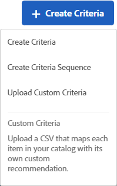

# Uploading Custom Criteria

There are multiple ways to reach the `Create New Criteria` screen. Some screen options vary depending on how you reach the screen. 

* When you are creating a `Recommendations` activity, click ** `Create New` ** on the `Select Criteria` screen. You will have the option to save your new criteria for use with other `Recommendations` activities. 

* When you are editing a `Recommendations` activity, click in a `Recommendations Location` box on your page, and select ** `Change Criteria` **. On the `Select Criteria` screen, click ** `Create New` **. You will have the option to save your new criteria for use with other `Recommendations` activities. 

* On the ** `Recommendations` ** > ** `Criteria` ** library screen, click ** `Create Criteria` **. Criteria you create here are automatically made available for all `Recommendations` activities. 

>1. Click ** `Create Criteria` **.

>        
>1. Select ** `Upload Custom Criteria` **.

>        
>1. Type a ** `Criteria Name` **.

>       This is the "internal" name used to describe the criteria. 
>1. Type a public-facing ** `Display Title` ** to appear on the page for any recommendations that use this criteria.

>       For example, you might want to display "People who viewed this viewed that" or "Similar products" when you use this criteria to show recommendations.
>1. Type a short ** `Description` ** of the criteria.

>       The description should help you identify the criteria, and might include information about the purpose of the criteria.
>1. Select an ** `Industry Vertical` **.

>1. Select a ** `Page Type` **.

>       You can select multiple page types.
>       Together, the industry vertical and page types are used to categorize your saved criteria, making it easier to reuse criteria for other `Recommendations` activities. 
>1. Select a ** `Recommendation Key` **.

>       For more information about basing criteria on a key, see [Base the Recommendation on a Recommendation Key](t_rec_key_recs.md#task_2B0ED54AFBF64C56916B6E1F4DC0DC3B). 
>1. Set your ** `Content` ** rules.

>       Content rules determine what happens if the number of recommended items does not fill your design. For example, if your design has space for five items, but your criteria causes only three items to be recommended, you can leave the remaining space empty, or you can use backup recommendations to fill the extra space. Select the appropriate toggles. See [Content Settings](c_content_settings.md#concept_BC16005C7A1E4F1A87E33D16221F4A96). 
>1. Set your ** `Inclusion Rules` **.

>       [Inclusion Rules](t_data_details.md#task_28DB20F968B1451481D8E51BAF947079)1. Select the ** `Location` ** of your CSV file.

>       The CSV file must be formatted correctly to upload successfully. Click ** `Download the CSV template` ** to get a correctly formatted CSV file. 
>       You have two location options:
>    
>    * **FTP:**To upload your CSV file from an FTP server, select ** `FTP` **, then enter the required information. You have the option to use SSL, which uses the FTPS protocol to transfer your CSV file securely. 

>    * **URL:**To upload your CSV file from a URL, select ** `URL` **, then and enter a feed URL. 

>1. Click ** `Save` **.

>       >[!NOTE]
>       >
>       >Custom criteria entities (rows) can contain up to 500 recommended items (columns).

