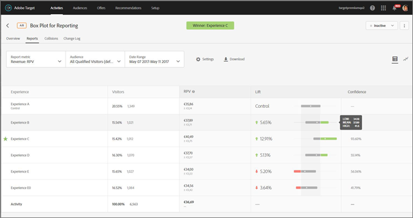
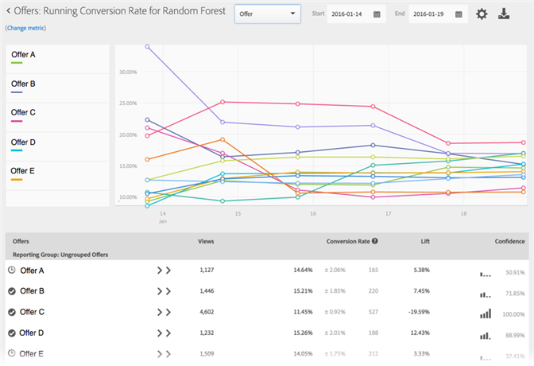

# Reports

## Reports {#concept_B5077F5503AA4C98901AA99EDCE6CDE6}Reports provide information about the performance of your activities.
>[!NOTE]
>
>You can block visitors from specified IP addresses from being counted in reports. Contact Client Care to set up IP filters. This filtering does not apply when using[ Analytics for Target ](a4t.md#concept_7540C8C04259434AB6EE33B09F47A1DE) (A4T) as your reporting source. 

**To display a report:** 

1. Click ** ` Activities` **, then click the desired activity from the list. 
   If you have many activities, you can filter the list by selecting options from the ` Type`, ` Status`, ` Reporting Source`, ` Experience Composer`, ` Metrics Type`, and ` Activity Source` drop-down lists. 
   For example, you could select ` A/B Test` and ` Experience Targeting` from the ` Type` drop-down list and ` Live` from the ` Status` drop-down list to display only A/B tests and Experience Targeting activities that are in an active state. 
   The following illustration shows the ` Type` drop-down list with two types selected: 
    

1. Click the ** ` Reports` ** tab. 
   Each report includes a legend to help you understand the report.
    
   The legend displays the following information:

    * The activity status, including the date range when the activity ran.

    * The projected winning experience.

    * The activity's source, such as ` Adobe Target` or ` Adobe Target Classic`. 

   >[!NOTE]
   >
   >Experience results appear after at least one entrant has seen the experience.

1. (Optional) [ Configure the report ](c_reports.md#concept_4BB6A7FDAB6F4806A632F9CD989B8BFA), as desired. 

1. (Optional) [ Download the report in CSV format ](c_reports.md#concept_3F276FF2BBB2499388F97451D6DE2E75) for analysis in Excel and other tools. 
   The following options are available:

    * ` Export Report to CSV` 

    * ` Export Order Details to CSV` 

1. (Optional) Click the ** ` Table View` ** (   ) and ** ` Graph View` ** (  ) icons to switch between reporting formats. 
   For Multivariate tests only, click the ** ` Location Contribution` ** (   ) icon to switch the report to show contribution by location. 

>## Report Settings {#concept_4BB6A7FDAB6F4806A632F9CD989B8BFA}Information to help you set the elements you want to appear in your report. Report settings can be saved for later use. 
<draft-comment otherprops="merge">
  target/c_report-settings.xml 
</draft-comment>To display a report, click ** ` Activities` **, click the desired activity from the list, then click the ** ` Reports` ** tab. 
 
The following options and settings are available on the report page:

<table id="table_C54ED6B14A6B476DBB706BCE2E20F980"> 
 <thead> 
  <tr> 
   <th colname="col1" class="entry"> Option or Setting </th> 
   <th colname="col2" class="entry"> Description </th> 
  </tr> 
 </thead>
 <tbody> 
  <tr> 
   <td colname="col1"> 
Report Metric
 </td> 
   <td colname="col2"> 
Click the  Report Metric  drop-down list to select a different <a href="r_success_metrics.xml#reference_D011575C85DA48E989A244593D9B9924" format="dita" scope="local"> success metric </a> or multiple metrics to display in the graph and chart. 
 
By default, the primary metric is determined in the success metrics setup when you create the activity. If you change the setup and re-save the activity, the primary metric for reporting is updated.
 
For more information about selecting multiple metrics to view in reports, see <a href="c_reports.xml#concept_9E3C3F6F3EC1412FAF252975AC0720B7" format="dita" scope="local"> View Multiple Metrics in a Report </a>. 
 </td> 
  </tr> 
  <tr> 
   <td colname="col1"> 
Audience
 </td> 
   <td colname="col2"> 
Click the  Audience  drop-down list to change the displayed <a href="c_target.xml#concept_A782F8481A5041EBA75103CB26376522" format="dita" scope="local"> audience </a> for the report. 
 </td> 
  </tr> 
  <tr> 
   <td colname="col1"> 
Date Range
 </td> 
   <td colname="col2"> 
Select new  Start  and  End  dates for the report. 
 
Reports have the following date restrictions:
 
 
     <ul id="ul_D87ACEE170DE4C0A86B89963A53F1C87"> 
      <li id="li_4D53359CB23448E59DC3DE7596A32598">Start date of the report must be within the last two years.</li> 
      <li id="li_8C4F0F5831A94E3E9FA0FDF6159BF39A">Daily reports are limited to 100 days.</li> 
      <li id="li_965EB8A8964146E2B416402C61FA0F07">Hourly reports are limited to 15 days.</li> 
     </ul> 
 </td> 
  </tr> 
  <tr> 
   <td colname="col1"> 
Settings
 </td> 
   <td colname="col2"> 
Click the  Settings  icon (  ) to configure report settings, then click  Save Settings  when done. 
 
The following illustration shows the Settings dialog box for an A/B activity:
 
  
 
Depending on the selected activity type, the options vary:
 
 
     <ul id="ul_561C94367E61415EBE2E528A76635FBD"> 
      <li id="li_1BE80026F6CA4E1B9CE38F653E78DF29"> 
<b>Counting Methodology:</b>Select the desired methodology: 
 
 
        <ul id="ul_958E45EF725642ACBF6EF773F5C8B38D"> 
         <li id="li_A877AECC573F4686982E9BEACB1F194A">Visitors</li> 
         <li id="li_BE0FB66BDAA64B8AB2906D904972139D">Visits</li> 
         <li id="li_4DEF774018A9437582D58771ECC24E7C">Activity Impressions</li> 
        </ul> 
 </li> 
      <li id="li_CA1E3FEC74ED4F27BF4F830369373641"> 
<b>Control:</b>Select the control experience to use when calculating and comparing lift. 
        <!--This setting is not available for Experience Targeting (XT) activities. --> 
 </li> 
      <li id="li_CE7F820CCA8F432788A0AC6F5D415FC8"> 
<b>Environment:</b>Select the environment (host group) to use for the report. 
        <!--This setting is not available for Recommendation activities.--> For more information, see <a href="../ov2/c_hosts.xml#concept_516BB01EBFBD4449AB03940D31AEB66E" format="dita" scope="local"> Hosts </a>. 
 </li> 
      <li id="li_60E43F6BD01C424CB11FC3B559C74D8B"> 
<b>Reset Report Data:</b>Reset reporting data to remove old data. Current visitors will remain in the activity. 
        <!--The <wintitle>Reset Report Data</wintitle> option does not apply to Analytics for Target (A4T) activities.--> This option is available only for those with approver permissions. 
 
 
Note:  This is a permanent action and cannot be undone. 
 
 </li> 
      <li id="li_DA247399B9C3400BA8C35ABA27432759"> 
<b>Exclude Extreme Values:</b> The  Exclude Extreme Values  toggle applies to activities with Revenue and Engagement metric types only. For more information, see <a href="c_reports.xml#task_2AE7743FFCDD466DAEEB720BE5F33DAA" format="dita" scope="local"> Excluding Extreme Orders </a>. 
 </li> 
     </ul> 
 </td> 
  </tr> 
  <tr> 
   <td colname="col1"> 
Download
 
  
 </td> 
   <td colname="col2"> 
Click the Download icon (  ) to download report data in a  .csv  format for quick import into Excel, Access, or other data analysis programs. For more information, see <a href="c_reports.xml#concept_3F276FF2BBB2499388F97451D6DE2E75" format="dita" scope="local"> Downloading Data in a CSV File </a>. 
 </td> 
  </tr> 
  <tr> 
   <td colname="col1"> 
More Options
 
  
 </td> 
   <td colname="col2"> 
Click the More Options icon (  ) to access the  Edit Activity  and  View Experience URLs  options. 
 </td> 
  </tr> 
  <tr> 
   <td colname="col1"> 
Table View
 
  
 </td> 
   <td colname="col2"> 
Click the  Table View icon (  ) to view the report as a table. 
 </td> 
  </tr> 
  <tr> 
   <td colname="col1"> 
Graph View
 
  
 </td> 
   <td colname="col2"> 
Click the  Graph View  icon (  ) to view the report as a graph. 
 </td> 
  </tr> 
  <tr> 
   <td colname="col1"> 
Lift Bounds and Confidence Interval for the Goal Metric
 
Available only when viewing reports in Table View.
 
This feature is not available for activities that use Analytics as the reporting source (A4T).
 </td> 
   <td colname="col2"> 
Reports include visual representations that let you visually view the lift bounds and confidence level so that you can more accurately determine a winner.
 
The following illustration shows Lift Bounds and Confidence Level information:
 
  
 
The confidence interval displayed in Target is different than the confidence level. The confidence level shows the likelihood that the test results are not based on noise. The confidence interval assumes a 95% confidence level and shows how much your results could vary and still be within that 95% confidence level. Essentially, this calculation describes how large the standard deviation is in an easily understood way.
 
The confidence interval is derived from the standard deviation and the sample size (# of visitors). The smaller the standard deviation and the larger the sample size, the narrower your confidence interval.
 
There are certain conditions that determine whether lift bounds display. Lift bounds are based on the current Confidence level. If the current confidence level is greater than 95%, lift bounds display with red or green arrows and a box and whisker graph indicating higher or lower lift than the control experience, as shown above.
 
If the confidence level is less than 95%, lift bounds display with grey arrows indicating that the confidence level is low and, thus, the results are not significant. If the confidence level contains zero, no lift bound information displays:
 
  
 
Notice that you can also view confidence intervals for continuous variables (for example Average Order Value), as shown below:
 
  
 
    <!--
<image href="graphics/whisker.JPG" id="image_FFA446B6BF0D48CD8B987F8E2FD3A6FA"></image> 
 
The new visual representations within reports are color coded to help you determine whether any experience is a clear leader with no overlaps with others, or whether there are a few experiences that have overlaps, but with one having an edge. The red and green portion of the experience bar indicate whether the experience is better or worse than the control's performance. 
 
An experience with a high confidence value coupled with an interval with low or no overlap with other experiences is a great candidate for declaring a winner in an A/B Test, for example. 
 
Low, Mean, and High on hover indicate the upper and lower bounds based on the confidence interval displayed in the Metric column as a +/- value. 
 
Note that the confidence and confidence interval calculations vary for different activity types and this feature does not make any changes in that regard. 
--> </td> 
  </tr> 
  <tr> 
   <td colname="col1"> 
Location Contribution
 
  
 </td> 
   <td colname="col2"> 
 
     <!--(Multivariate tests only) -->Click the  Location Contribution  (  ) icon to switch the report to show contribution by location. 
 </td> 
  </tr> 
  <tr> 
   <td colname="col1"> 
Experiences
 
(Available only when viewing the report in Graph View)
 </td> 
   <td colname="col2"> 
Select or deselect experiences on the left side of the chart to display or hide the corresponding experiences from the chart.
 
If the following illustration, only experiences B and C display in the report:
 
  
 </td> 
  </tr> 
  <tr> 
   <td colname="col1"> 
Running Average
 
(Available only when viewing the report in Graph View)
 </td> 
   <td colname="col2"> 
Select the desired graph view:
 
 
     <ul id="ul_BB422529932844E7A447016268F2A40B"> 
      <li id="li_325DD60B965544A3BD425550834BA4EC">Running Average</li> 
      <li id="li_8197935D95EB4BB2BE4BBE674B30D58F">Running Average Lift</li> 
      <li id="li_D6EBB63A447945A69D3679C0F247B104">Daily</li> 
      <li id="li_F12D3E41975B497F825F3CAD1ABA112F">Daily Lift</li> 
     </ul> 
 
  
 
 
Note:  The name of this drop-down list varies depending on the selected view, but it'll be one of the four views listed above. 
 
 </td> 
  </tr> 
  <tr> 
   <td colname="col1" morerows="1"> 
Counting Methodology
 
(Available only when viewing the report in Graph View)
 </td> 
   <td colname="col2"> 
You can choose the counting methodology for graphs in reports. Note that this is not supported for Automated Personalization (AP) activities.
 
To access the Counting Methodology option, while viewing a report in graph mode, click the  My Primary Goal  drop-down, then select the counting methodology. 
 
The counting methodology will be the same as the one selected in the  Settings  dialog, described above. 
 
  
 
By default, the graph is plotted in  Daily  mode. 
 
You can change the mode by clicking the  Daily  drop-down list, then selecting  Cumulative . 
 
  
 
 
Note:  The name of this drop-down list varies depending on the selected mode. 
 
 
There are four modes for Auto-Target activities: Daily Control, Daily Targeted, Cumulative Control, and Cumulative Targeted.
 
The default order in which the graph is plotted is as follows:
 
 
     <ul id="ul_BE4C2F84C22743A6BF4F52AAF7C6E3AE"> 
      <li id="li_FBE79E49F543421FA22DE822EC738D3A"> 
A/B Tests (including Auto-Allocate and Automated Personalization): Order of experience creation, in descending order.
 </li> 
      <li id="li_2A9EA06D6AB64CE1AC48812871D67F29"> 
Experience Targeting (XT): Order of experiences in the activity.
 </li> 
      <li id="li_7EA4D0A33BA844F6A7371629949C2B9B"> 
Multivariate Test (MVT): Alphabetical by experience name.
 </li> 
      <li id="li_7B303007D1044D26987AEE9F6CEE3418"> 
Recommendations: Order of experience creation, in descending order.
 </li> 
     </ul> 
 
As you work with the Counting Methodology options, consider the following caveats:
 
 
     <ul id="ul_E00BAB57DEED426C8E3602B6E1511C0C"> 
      <li id="li_903CADE645D54993B3025E146FA65202"> 
For an Auto-Target activity, there is no option for selecting "Visitors" as the counting methodology. Auto-Target is the only activity type that you cannot plot by visitors.
 </li> 
      <li id="li_23C38A7E22A34CD9BA79216059BD8605"> 
For activities that use Analytics as the reporting source (A4T), you cannot plot Visitor, Visit, or Impression cumulatively.
 </li> 
     </ul> 
 </td> 
  </tr> 
  <tr> 
   <td colname="col2"> 
<b>Working with Graphs That Have More Than 16 Experiences in the Activity</b> 
 
If an activity has fewer than 16 experiences, each experience is plotted in a different color in the graph.
 
If an activity has more than 16 experiences, the colored lines for the first 16 experiences display in the graph. The remaining experiences are greyed out in the Experiences pane on the left side and no corresponding plot lines display in the graph. The lines for only 16 experiences can be shown at any given time.
 
If you hover over any of the greyed experiences, a new grey plot line corresponding to that experience temporarily displays in the graph. To display the plot line of a greyed experience in a color, you can deselect an experience that displays in color by clicking its name and then select the desired greyed experience by clicking its name.
 
As an example, the following illustration shows an activity's graph that has 26 experiences:
 
  
 
The graph displays the lines for the first 16 experiences (some overlap, so it appears that there are fewer than 16 lines). The colored dot in the Experiences pane on the left side next to each experience name indicate that the experience's plot line displays in the corresponding color.
 
If you scroll down in the Experiences pane, you'll notice that the names for the 17th through 26th experiences are greyed out, as shown in the following illustration:
 
  
 
If you hover over one of the greyed experiences, a new grey plot line corresponding to that experience temporarily displays in the graph.
 
Suppose you want to display the plot line for Experience R and you don't want to see the line for Experience P. You can click Experience P's name to deselect it and then click Experience R's name to select it, as shown below:
 
  
 </td> 
  </tr> 
 </tbody> 
</table>

>## View Multiple Metrics in a Report {#concept_9E3C3F6F3EC1412FAF252975AC0720B7}Select multiple metrics to view in a report. 
<draft-comment otherprops="merge">
  target/c_view-multiple-metrics.xml 
</draft-comment>Be aware of the following information as you work with multiple metrics in reports:

* The ability to view multiple metrics is available for A/B and Experience Targeting (XT) activities only.

* You cannot add more than 20 metrics to a report for an activity that uses Analytics for Target (A4T). You can add as many metrics as you have in your activity to reports for activities that do not use A4T.

* You cannot use the ` Download` option to download reports to CSV if you have selected multiple metrics. You must select a single metric only to enable the ` Download` option. 

* You cannot view multiple metrics for activities created before the July 2015 Target release (July 30, 2015).

**To select multiple metrics to display in the report:** 

1. To display a report, click ** ` Activities` **, click the desired activity from the list, then click the ** ` Reports` ** tab. 

1. Click the ** ` Report Metric` ** drop-down list to display the ` Shown Metrics` and ` Hidden Metrics` lists. 
    
   You can use the ` Search` box to quickly find available metrics to add to the ` Shown Metrics` list. 
   Note that you can select multiple metrics from both the ` Table View` and ` Graph View` modes of the report. 

1. Hover your mouse pointer over the desired metrics in the ` Hidden Metrics` list, then click ** ` Select` ** to move them to the ` Shown Metrics` list. 
   Or
   Drag and drop the desired metrics from the ` Hidden Metrics` list to the ` Shown Metrics` list. 
   There must be at least one metric in the ` Shown Metrics` list. 
   You can rearrange the metrics by dragging and dropping them into the desired order in the ` Shown Metrics` list. The selected order will be reflected in the Table View and Graph View. To remove a metric from the ` Shown Metrics` list, hover your mouse pointer over the metric, then click the **X** icon. 

1. Click ** ` Save` ** when finished. 

1. While viewing the report in the Table View, hover your mouse pointer on any metric's column header to display a blue arrow. Click the arrow to expand the table to display the ` Lift` and ` Confidence` for that metric. 
    
   You can expand only one metric/column at a time. Click the arrow again to collapse the columns.

1. While viewing the report in the Graph View, the you can select individual metrics to display from the drop-down list:
    
   Likewise, when viewing the report in the Graph View, the Revenue dimension displays as a drop-down list:
    

>## Exclude Extreme Values {#task_2AE7743FFCDD466DAEEB720BE5F33DAA}You can exclude extreme values from affecting reports so a few unusual orders don't affect your activity results. An example of an unusual order might be a coach buying uniforms for an entire team instead of individual shoppers buying individual uniforms. 
<draft-comment otherprops="merge">
  target/t_excluding_extreme_orders.xml 
</draft-comment>
>[!NOTE]
>
>The ` Exclude Extreme Values` flag applies to activities with Revenue and Engagement metric types only. 

Extreme values are automatically flagged based on the rules described below. You can toggle between seeing and excluding the extreme values from your reports. An activity will have its extreme values excluded after the activity has run for an hour or after 15 orders, whichever comes first.
A value is considered extreme if it is more than +/- 3 standard deviations from the average order value using the last month of data (up to the point in time in which the calculation was made).
For example, the extreme value filter is often useful when using RPV. RPV combines conversion rate and average order value, and often exposes the volatility of those metrics. If you use RPV and determine that orders don't appear to be distributed normally, you might see more normal results if you apply the extreme order filter.
When a value is marked extreme, its order value is replaced with the average order value of the experience for the last month, excluding the extremes. The order is also marked as extreme in the Order Details report and in the CSV download for daily results.
**To exclude extreme values from your reports:** 

>1. Open an activity that includes Revenue or Engagement metric types, then click the ** ` Reports` ** tab.
>1. Click the gear icon (  ) to display the ` Report Settings` options.

>       1. Toggle the ** ` Exclude Extreme Values` ** option on or off, as desired.
>1. Click ** ` Save Settings` **.
>## Automated Personalization Reports {#concept_C02BAFC922114A44846998FD956E345A}Specialized reports are available to users of 
<wintitle>
  Automated Personalization 
</wintitle>. 
<codeph otherprops="merge">
  target/c_reports_ap.xml 
</codeph>
>[!NOTE]
>
>Automated Personalization is available as part of the ` Target Premium` solution. It is not included with ` Target Standard` without a ` Target Premium` license. 

1. Click ** ` Activities` **, click the desired ` Automated Personalization` activity from the list, then click the ** ` Reports` ** tab. 
   If you have many activities, you can filter the list by selecting ` Automated Personalization` from the ` Type` drop-down list. 

1. (Optional) Click the ` Download` icon (   ) to download the summary view (for example, comparing Control and Automated traffic) as broken down by all available success metrics. 

>[!NOTE]
>
>The ` Settings` icon (   ) is not available for ` Automated Personalization` reports. 

` Automated Personalization` provides three reports: 

## Activity Level Report {#section_6F72FC5C790B4492B3DCECBFFA971337}

The ` Activity Level` report compares the aggregate performance of using an ` Automated Personalization` algorithm to randomly served content (control). The control can be any of the following: 

* Random content
* Default content
* A manually created experience
 
The standard rules of results interpretation for A/B testing still apply, including lift, confidence, trending, duration, and so on. For more information about interpreting results, see [ About the Conversion Rate ](c_reports.md#concept_2D9FEDE8F94A485DAC86D611BFBDC844). 

## Offer Level Report {#section_CAA6409879E349C6906E2BE8156D87A1}

The ` Offer Level` report for the Random Forest experience compares the performance of each algorithm-applied offer to the same randomly served offer (Control). Thus, offers should not be compared against each other in this view. In the example below, it can be stated that Offer D exhibits a 12.43% lift when served according to the algorithm logic (Random Forest) as opposed to randomly (Control). 
Click the experience algorithm (Random Forest or control) to view the Offer Level report.
 
Offers can be shown within report groups, and these report groups can be collapsed and expanded. Select ` Reporting Group` in the drop-down list to view rolled-up information by reporting groups, rather than by offers. 

>[!NOTE]
>
>The clock icon indicates that the algorithm model is still building. The checkmark icon indicates that the base algorithm has been established.

>## Report Parameters {#reference_895184AB2EF046D68D0A5562E2AA6E3D}Each Target report uses a specific set of Adobe Target parameters. 
<draft-comment otherprops="merge">
  target/r_report_parameters.xml 
</draft-comment>

|  Report  | Parameters  | Settings  |
|---|---|---|
|  Click Tracking  | ` countingMethod`  | ` visitor`  |
|  ` step`  | ` conversion`  |
|  ` successMetric`  | ` conversionRate`  |
|  Conversion  | ` countingMethod`  | ` visitor`  |
|  ` step`  | ` display mbox` or ` conversion`  |
|  ` successMetric`  | ` conversionRate`  |
|  Revenue Per Visitor  | ` countingMethod`  | ` visitor`  |
|  ` step`  | ` display mbox` or ` conversion`  |
|  ` successMetric`  | ` RPV`  |
|  Average Order Value  | ` countingMethod`  | ` visitor`  |
|  ` step`  | ` display mbox` or ` conversion`  |
|  ` successMetric`  | ` AOV`  |
|  Total Sales  | ` countingMethod`  | ` visitor`  |
|  ` step`  | ` display mbox` or ` conversion`  |
|  ` successMetric`  | ` sales`  |
|  Page Views  | ` countingMethod`  | ` visit`  |
|  ` step`  | ` display mbox` or ` conversion`  |
|  ` successMetric`  | ` engagement`  |
|  Time On Site  | ` countingMethod`  | ` visit`  |
|  ` step`  | ` display mbox` or ` conversion`  |
|  ` successMetric`  | ` engagement`  |
|  Page Score  | ` countingMethod`  | ` visit`  |
|  ` step`  | ` display mbox` or ` conversion`  |
|  ` successMetric`  | ` engagement`  |

>## About the Conversion Rate {#concept_2D9FEDE8F94A485DAC86D611BFBDC844}The conversion rate, lift, confidence (statistical significance) and confidence interval are reported for each experience. 
<draft-comment otherprops="merge">
  target/c_conversion_rate.xml 
</draft-comment>The following illustration shows the chart header for a sample activity with the ` Conversion Rate`, ` Lift`, and ` Confidence` headers highlighted. 
 

>[!NOTE] {class="- topic/note "}
>
>In all data, duplicate orders are ignored if an ` orderID` is passed. The audit report lists the ignored duplicate orders. 

## Conversion Rate {#section_07A36846C4E84D0881906809B9CE5A74}

Shows the median conversion rate, confidence, interval, and the number of conversions.
For example, examine the following Conversion Rate report column:
 
The first line is the control experience. It shows a 15% conversion rate, with three conversions. The second line, Experience B, shows a 15% conversion rate, with a confidence interval of plus or minus 15.65% and three conversions.

>[!NOTE]
>
>Currently, the confidence interval is calculated only for binary metrics.

## Lift {#section_0F409572C720433D9378092ABC999982}

Compares the conversion rate for each experience against the control experience.
Lift = (Experience CR - Control CR) / Control CR
If control is 0, there is no percentage lift.

## Confidence (Statistical Significance) {#section_35DB6724813D40C7B0808DE18FE595C1}

This number represents the likelihood that the results would be duplicated if the test were run again. The confidence rounds up to 100.00% when the confidence is greater than or equal to 99.995%.
See [ Confidence Level and Confidence Interval ](c_reports.md#concept_0D0002A1EBDF420E9C50E2A46F36629B). 

## Retail Data {#section_30A674731BA6440E9BB93C421BE990EE}

AOV, RPV, and Sales data are displayed for each experience if you inserted a [ Place Order ](https://marketing.adobe.com/resources/help/en_US/target/ov/t_orderconfirm_create.html) ( ` orderConfirmPage`) mbox and selected it as the conversion mbox. 
>## Confidence Level and Confidence Interval {#concept_0D0002A1EBDF420E9C50E2A46F36629B}For each experience, confidence level and confidence interval are displayed. 
<draft-comment otherprops="merge">
  target/c_confidence_level_and_confidence_interval.xml 
</draft-comment>Conversions and continuous variables for Target-based metrics, such as revenue and engagement metrics, are calculated as follows:

* **Conversion:** Either yes or no
* **All others:** Values across a range

You can perform offline calculations for Analytics for Target (A4T), but it requires a step with data exports in ` Analytics`. For more information, see "Performing Offline Calculations for Analytics for Target (A4T)" below. 

## Confidence Level {#section_26FE5E44BDD5478792A65FCFD83DCCDC}

The *confidence level* is represented by the darker percentage in the Conversion Rate column for each experience. 
   
The confidence level, or statistical significance, indicates how likely it is that an experience's success was not due to chance. A higher confidence level indicates:

* The experience is performing significantly different from control.
* The experience performance is not just due to noise.
* If you ran this test again, it is likely that you would see same results.

If the confidence level is over 90% or 95%, then the result can be considered statistically significant. Before making any business decisions, try to wait until your sample size is large enough and that the four bars of confidence on one or more experiences stays consistent for a continuous length of time to ensure the results are stable.

>[!NOTE]
>
>The confidence rounds up to 100.00% when the confidence is greater than or equal to 99.995%.

## Confidence Interval {#section_F582738DFE1648C78B93D81EBC6CACF7}

>[!NOTE]
>
>Currently, the confidence interval is calculated only for binary metrics.

The *confidence interval* is a range within which the true value can be found at a given confidence level. The confidence interval appears as a light gray +/- percentage in the Conversion Rate column. In the example below, the confidence interval for Experience B's lift is plus or minus 15.65%. 
 
**Example:** An experience's RPV is $10, its confidence level is 95% and its **confidence interval** is $5 to $15. If we ran this test multiple times, 95% of the time the RPV would be between $5 and $15. 
**What impacts the confidence interval?** The formula follows standard statistical methods for calculating confidence intervals. 

* **Sample size:** As sample grows the interval will shrink or narrow. This is preferred as it means your reports are getting closer to the true value of the success metric.
* **Standard deviation smaller:** More similar results, such as similar AOVs or similar numbers or visitors converting each day, reduces the standard deviation.

## Confidence Calculation and How to Perform It Offline {#section_86F7C231943043A5B8B6BFE67B706E3B}

The [ downloaded CSV report ](c_reports.md#concept_3F276FF2BBB2499388F97451D6DE2E75) includes only raw data and does not include calculated metrics, such as revenue per visitor, lift, or confidence used for A/B tests. 
To calculate these calculated metrics, download the [ Target's Complete Confidence Calculator ](https://marketing.adobe.com/resources/help/en_US/target/target/complete_confidence_calculator.xlsx) Excel file to input the activity's value, or review the [ statistical calculations used by Target ](https://marketing.adobe.com/resources/help/en_US/target/target/Statistical Calculations.pdf). 

## Performing Offline Calculations for Analytics for Target (A4T) {#section_B34BD016C8274C97AC9564F426B9607E}

You can perform offline calculations for A4T, but it requires a step with data exports in ` Analytics`. 
For A4T, we use a Student's t-test calculation for continuous variables (rather than binary metrics). In Analytics, a visitor is always tracked, and every action taken is counted. Therefore, if the visitor purchases multiple times or visit a success metric multiple times, those additional hits are counted. This makes the metric a continuous variable. To perform the Student's t-test calculation, the "sum of squares" is required. This can be retrieved from ` Analytics`. To get the sum of squares data, you need to perform a visitor-level export for the metric you are optimizing to, for a sample time period. 
For example, if you’re optimizing to page views per visitor, you’d export a sample of the total number of page views on a per visitor basis for a specified time frame, perhaps a couple of days (a few thousand data points is all you need). You would then square each value and sum the totals (the order of operations is critical here). This "sum of squares" value is then used in the Complete Confidence Calculator. Use the "revenue" section of that spreadsheet for these values.
**To use the ` Analytics` data export feature to do this:** 

1. Log in to ` Adobe Analytics`. 

1. Click ** ` Tools` ** > ** ` Data Warehouse` **. 

1. On the ** ` Data Warehouse Request` ** tab, fill in the fields. 
   For more information about each field, see "Data Warehouse Descriptions" in [ Data Warehouse ](https://marketing.adobe.com/resources/help/en_US/reference/data_warehouse.html). 

<table id="table_0644A7F8ABCB429B85DFF8C73762619F"> 
 <thead> 
  <tr> 
   <th colname="col1" class="entry"> Field </th> 
   <th colname="col2" class="entry"> Instructions </th> 
  </tr> 
 </thead>
 <tbody> 
  <tr> 
   <td colname="col1"> 
Request Name
 </td> 
   <td colname="col2"> 
Specify a name for your request.
 </td> 
  </tr> 
  <tr> 
   <td colname="col1"> 
Reporting Date
 </td> 
   <td colname="col2"> 
Specify a time period and granularity.
 
As best practice, choose no more than an hour or one day of data for your first request.
 
Data Warehouse files take longer to process the longer the time period requested, so it is always a best practice to request a small time period data first to make sure your file returns the expected result. Then, go to the Request Manager, duplicate your request, and ask for more data the second time. Also, if you toggle granularity to anything other than “None,” the file size will increase drastically.
 
  
 </td> 
  </tr> 
  <tr> 
   <td colname="col1"> 
Available Segments
 </td> 
   <td colname="col2"> 
Apply a segment, as needed.
 </td> 
  </tr> 
  <tr> 
   <td colname="col1"> 
Breakdowns
 </td> 
   <td colname="col2"> 
Select the desired dimensions:
 
Standard is out-of-the-box (OOTB), while Custom includes eVars &amp; props. It is recommended you use “Visitor ID” if visitor ID level information is needed, rather than “Marketing Cloud Visitor ID.”
 
 
     <ul id="ul_2F4D7201447240AF974F73BD2D607F3D"> 
      <li id="li_6FF1F0D5F91C41398AA6CDE0A69E154A"> 
Visitor ID is the final ID used by Analytics. It will either be AID (if the customer is legacy) or MID (if the customer is new or cleared cookies since the MC visitor ID service was launched).
 </li> 
      <li id="li_5E0099C92E6C4F88A54BAA352D04E4E0"> 
Marketing Cloud Visitor ID will only be set for customers who are new or cleared cookies since the MC visitor ID service was launched.
 </li> 
     </ul> 
 </td> 
  </tr> 
  <tr> 
   <td colname="col1"> 
Metrics
 </td> 
   <td colname="col2"> 
Select your desired metrics. Standard is OOTB, while Custom includes custom events.
 </td> 
  </tr> 
  <tr> 
   <td colname="col1"> 
Report Preview
 </td> 
   <td colname="col2"> 
Review your settings before scheduling the report.
 
  
 </td> 
  </tr> 
  <tr> 
   <td colname="col1"> 
Schedule Delivery
 </td> 
   <td colname="col2"> 
Enter an email address to deliver the file to, name the file, then select  Send Immediately . 
 
 
Note:  The file can be delivered via FTP under  Advanced Delivery Options . 
 
 
  
 </td> 
  </tr> 
 </tbody> 
</table>

1. Click ** ` Request this Report` **. 
   File delivery can take up to 72 hours, depending on the amount of data requested. You can check on the progress of your request at any time by clicking ` Tools` > ` Data Warehouse` > ` Request Manager`. 
   If you would like to re-request data that you’ve requested in the past, you can duplicate an old request from the ` Request Manager` as needed. 

For more information about ` Data Warehouse`, see the following links in the ` Analytics` Help documentation: 

* [ Create a Data Warehouse Request ](https://marketing.adobe.com/resources/help/en_US/reference/t_dw_create_request.html) 

* [ Data Warehouse Best Practices ](https://marketing.adobe.com/resources/help/en_US/reference/data_warehouse_bp.html) 

>## Counting Methodology {#concept_EC19BC897D66411BABAF2FA27BCE89AA}You can choose to view reports by different counting methodologies to understand how your activities affect your users across their lifetimes or during a single session. 
<draft-comment otherprops="merge">
  target/c_counting_methodology.xml 
</draft-comment>Counting methodology is supported for the following activity types:

* A/B Test
  As an exception, Auto-Target A/B activities support only the default "Visit" counting methodology.

* Experience Targeting (XT)

* Multivariate Test (MVT)
  For the MVT Element contribution report, Target does not support Activity Impressions for Revenue Metric types.

* Recommendations

Only the default counting methodology (Visits) is currently supported for Automated Personalization (AP) activities.
You can view reports by the following counting methodologies:

* **Visitor:** A unique participant in the activity, for the life of the activity. A person will be counted as a new entrant if he or she visits the site from a new computer or a new browser; deletes the cookie; or converts and returns to the activity with the same cookie. An entrant is identified by the PCID in the visitor's mbox cookie. If the PCID changes, the person is considered a new visitor.

* **Visit:** A unique participant in an experience during a single 30-minute browser session. If a conversion is achieved or a visitor comes back to the site after being away at least 30 minutes, a returning visitor counts as a new visit. A visit is identified by the ` sessionID` in the visitor's mbox cookie. When the ` sessionID` changes, the visit is considered new. 

* **Impression/Page View:** Counted each time a visitor loads any page of the activity. A single visit might include several impressions of, for example, your homepage.

>[!NOTE] {class="- topic/note "}
>
>Usually, counts are determined by cookies and session activity. However, if you reach the final conversion point of an activity and then re-enter the activity, you are considered a new entrant and a new visit to the activity. This is true even if your PCID and ` sessionID` values do not change. 

>## Downloading Data in a CSV File {#concept_3F276FF2BBB2499388F97451D6DE2E75}Download data in a .csv format for quick import into Excel, Access, or other data analysis programs. 
<draft-comment otherprops="merge">
  target/c_downloading-data-in-csv-file.xm 
</draft-comment>To download data in a CSV file:

1. Click ` Activities`, then click the desired activity from the list. 
   If you have many activities, you can filter the list by selecting options from the ` Type`, ` Status`, ` Reporting Source`, ` Experience Composer`, ` Metrics Type`, and ` Activity Source` drop-down lists. 

1. Click the ** ` Reports` ** tab. 

1. Click the ` Download` icon (   ), then select a report type to download for analysis in Excel and other tools. 

## Export Report to CSV {#section_38BD9743EB254453B5F4A0A6F2720CD3}

The Success Metrics report shows you information about your success metrics, as well as the following metrics that are not available in the Target UI:

* Mean time to conversion in hours, so you can see how long it takes the average visitor to reach the conversion point

* Sum of revenues, squared, for offline statistical confidence calculations

Data is saved until the end of the activity.

>[!NOTE]
>
>The CSV report includes only raw data and does not include calculated metrics like revenue per visitor, lift, or confidence used for A/B tests. To calculate these calculated metrics, download the[ Target's Complete Confidence Calculator ](https://marketing.adobe.com/resources/help/en_US/target/target/complete_confidence_calculator.xlsx) Excel file to input the activity's value, or review the [ statistical calculations used by Target ](https://marketing.adobe.com/resources/help/en_US/target/target/Statistical Calculations.pdf). 

## Export Order Details to CSV {#section_96B3F578F91F4CA3AFE38BACA2A0F11E}

The Order Details report (known as the Audit report in ` Target Classic`) shows you information about your orders, including: 

* Order date and time

* Order amount (if you inserted a Place Order mbox)
  The Order Details report works only if you have orders.

* Order flag (duplicate or extreme orders)
  An order is flagged as extreme if it is more than +/- 3 standard deviations from the average order value using the last month of data (up to the point in time in which the calculation was made). An activity will have its extreme orders excluded once the activity has run for an hour or until after 15 orders, whichever comes first. For more information, see [ Excluding Extreme Orders ](c_reports.md#task_2AE7743FFCDD466DAEEB720BE5F33DAA). 

* Product ID
  The total length of product IDs, concatenated with commas, should not exceed 255 characters or the IDs will not display properly in the report. For example, if your order had products with IDs "aa, bb" then the total length is "aa,bb" = 5.

* Experience
  In the ` Order Details` report for ` A/B Test`, ` Experience Targeting` (XT), and ` Multivariate Test` (MVT) activities, the ` Experience` column contains the experience ` localId`. This is the value output from the ` $campaign.recipe.id` in offer tokens. 
  There is not an ` Experience` column for ` Automated Personalization` (AP) activities. The current ` Algorithm Name` column has been replaced with "Control" versus "Targeted" terminology, as shown elsewhere in ` Target`. 
  There was no impact on ` Recommendations` activities. 

Keep the following information in mind when analyzing downloaded reports:

* Revenue metrics that are set to "Increment count and keep the user in the activity" log order details only for the first order made by the same visitor. All subsequent orders increase conversion count, but will not add revenue to RPV/AOV/Sales, and will not be included in the Order Details report.

* In order to record an order record, the ` orderTotal` parameter must be passed. 

* Values passed via the ` ProductPurchasedId` mbox parameter are listed in the Order Details report. 

* Order report data includes four weeks of data for the default environment (host group) and two weeks for all non-default environments.

* Best practice is to include an ` orderID` as well as an ` orderTotal`. This allows duplicate orders to automatically be ignored. 

## Caveats {#section_49B9590904A645B18E694B4EFFFC1DEF}

The following information applies to the Download option:

* You can download both reports for A/B, Automated Personalization, Experience Targeting, and Multivariate activities. You cannot download the Success Metrics report for Recommendation activities.

* The Download option is not available for A/B and Experience Targeting activities created before Target version 15.7.1 (July, 2015).

* Experiences with no associated data are not recorded in the downloaded report.

>## Reporting Frequently Asked Questions {#concept_036050B4DCED403C9B9D03DC1998274A}List of frequently asked questions about reporting in 
<keyword>
  Target 
</keyword>. 
<draft-comment otherprops="merge">
  target/c_reporting-frequently-asked-questions.xml 
</draft-comment>
## Why are the number of visits lower in Target than in other Marketing Cloud solutions? {#section_7E626FDB417E41B8B58BBF30FB207409}

Metric numbers, for example visits, reported by ` Target` will always be lower than the reported numbers in other ` Marketing Cloud` solutions for a number of reasons: 

* ` Target` counts visits only for visitors that qualified for the activity. Other solutions count visits for visitors that display the page, regardless of which activity brought them to the page. 

* There might be situation where different activities compete for the same location (mutually exclusive). As a result, visitors see different content on a web page, which affects the metric numbers reported by ` Target`. 

## Why is there no data available for my activity's report? {#section_E4722F6445884130951DF79981C8289B}

If an activity's content was successfully delivered to users but its report contains no data, ensure that you have the correct environment (host group) selected in the report's settings.
If you have a development environment selected, you might see the following error message: "There is no data available for the selected report settings."
To change the environment for an activity's report:

1. Click ** ` Activities` **, click the desired activity from the list, then click the ** ` Reports` ** tab. 

1. Click the ` Settings` icon (   ) to configure report settings. 
    

   >[!NOTE]
   >
   >The Settings icon (  ) is not available for Automated Personalization reports. 

1. From the ** ` Environment` ** drop-down list, select ** ` Production` **. 
   Report data might not be available if you have a development environment selected.

1. Click ** ` Save Settings` **. 

For more information about environments, see [ Hosts ](c_hosts.md#concept_516BB01EBFBD4449AB03940D31AEB66E). 
