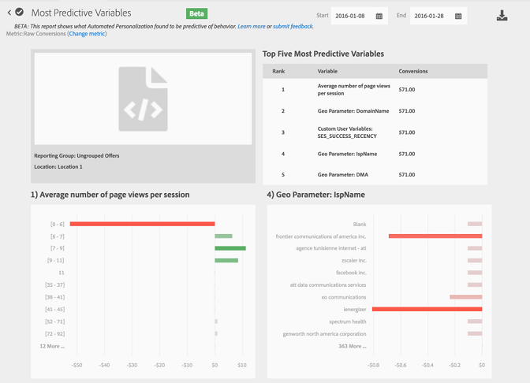

# Automated Personalization Reports

>[!NOTE]
>
>Automated Personalization is available as part of the `Target Premium` solution. It is not included with `Target Standard` without a `Target Premium` license. 

1. Click ** `Activities` **, click the desired `Automated Personalization` activity from the list, then click the ** `Reports` ** tab. 
   If you have many activities, you can filter the list by selecting `Automated Personalization` from the `Type` drop-down list. 

1. (Optional) Click the `Download` icon (   ) to download the summary view (for example, comparing Control and Automated traffic) as broken down by all available success metrics. 

>[!NOTE]
>
>The `Settings` icon (   ) is not available for `Automated Personalization` reports. 

`Automated Personalization` provides three reports: 

* [Activity Level Report](c_reports.md#section_6F72FC5C790B4492B3DCECBFFA971337)
* [Offer Level Report](c_reports.md#section_CAA6409879E349C6906E2BE8156D87A1)
* [Offer Detail Report](c_reports.md#section_45C3D9640E194F4F885D811F3F0B3E8F)

## Activity Level Report {#section_6F72FC5C790B4492B3DCECBFFA971337}

The `Activity Level` report compares the aggregate performance of using an `Automated Personalization` algorithm to randomly served content (control). The control can be any of the following: 

* Random content
* Default content
* A manually created experience
 
The standard rules of results interpretation for A/B testing still apply, including lift, confidence, trending, duration, and so on. For more information about interpreting results, see [About the Conversion Rate](c_conversion_rate.md#concept_2D9FEDE8F94A485DAC86D611BFBDC844). 

## Offer Level Report {#section_CAA6409879E349C6906E2BE8156D87A1}

The `Offer Level` report for the Random Forest experience compares the performance of each algorithm-applied offer to the same randomly served offer (Control). Thus, offers should not be compared against each other in this view. In the example below, it can be stated that Offer D exhibits a 12.43% lift when served according to the algorithm logic (Random Forest) as opposed to randomly (Control). 
Click the experience algorithm (Random Forest or control) to view the Offer Level report.
 
Offers can be shown within report groups, and these report groups can be collapsed and expanded. Select `Reporting Group` in the drop-down list to view rolled-up information by reporting groups, rather than by offers. 

>[!NOTE]
>
>The clock icon indicates that the algorithm model is still building. The checkmark icon indicates that the base algorithm has been established.

## Offer Detail Report {#section_45C3D9640E194F4F885D811F3F0B3E8F}

The `Offer Detail` report examines the performance of a single offer. The top five most predictive variables for that offer are shown, and the predictive items are further broken down in bar graphs. 
On the Offer Level screen, select an offer to view its Offer Detail report.
 
If the optimization goal is a conversion metric, the `Offer Detail` report shows the impact of the top predictive variables in lift and incremental conversions, ensuring that activities with no revenue data still produce relevant and actionable insights. 
Estimated revenue is based on the incremental revenue value created with the metric. See [Success Metrics](r_success_metrics.md#reference_D011575C85DA48E989A244593D9B9924) for more information on setting a conversion value. 
