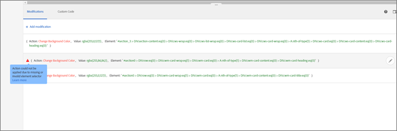

# Code Editor

The code editor is intended for advanced users who are comfortable with HTML, JavaScript, and CSS. The code view can help you tweak or fine-tune changes, or fix selector issues. It can also be used to add new custom code and actions.

>[!NOTE]
>
>The code editor is currently available for A/B, Experience Targeting, Multivariate Test, and Automated Personalization activities. The code editor is disabled for overlay and if a redirect offer is applied.


The code editor supports the following use cases:

* Add custom JavaScript, HTML, or CSS to be executed at top of the page
* View or edit the code generated by VEC after making modifications
* Set HTML content for a selector (CSS selectors only)
* Set an attribute on an HTML element
* Add offer content to be delivered in a regional mbox
* Swap on DOM-ready, using jQuery
* Swap on DOM-ready, no jquery (Does not support Internet Explorer 8)
* Swap with DOM-polling via "elementOnLoad" plugin
* Custom redirect

The code editor provides:

* Line numbers for better usability.

* Syntax highlighting to help you avoid incorrect syntax for HTML offers.


To open the code editor:


<table id="table_19D5B04993BE4001AC9D7EACE2C839F8"> 
 <thead> 
  <tr> 
   <th colname="col1" class="entry"> Composer </th> 
   <th colname="col2" class="entry"> Details </th> 
  </tr> 
 </thead>
 <tbody> 
  <tr> 
   <td colname="col1"> <p>Visual Experience Composer (VEC)</p> </td> 
   <td colname="col2"> <p><b>Visual Experience Composer:</b>To open the code editor in the Visual Experience Composer's view, click the &lt;/&gt; icon. </p> <p style="text-align: center;">  </p> </td> 
  </tr> 
  <tr> 
   <td colname="col1"> <p>Form-based Experience Composer</p> </td> 
   <td colname="col2"> <p><b>Form-based Experience Composer:</b>To open the code editor in the Form-based Experience Composer, create or edit an HTML offer. For more information, see <a href="t_form_experience_composer.xml#task_FAC842A6535045B68B4C1AD3E657E56E" format="dita" scope="local"> Form-Based Experience Composer </a>. </p> </td> 
  </tr> 
 </tbody> 
</table>

After you click the icon in the VEC or create/edit an HTML offer in the Form-based Experience Composer, the code editor opens, splitting the screen between the visual mode and the code mode. Both modes remain in sync. Every modification made visually has a corresponding row in the code view. Similarly, every change that is committed in the code view (by clicking on the checkbox on the right) displays in the visual experience. Clicking on any row in the code view selects the corresponding element on the visual page.
By default, the code editor opens at the bottom of the window. You can also dock the code editor on the right of the Window by clicking the dock icon.
 
The code editor has two tabs:

* [ Modifications ](c_vec_code_editor.md#section_EE27E7572AA74397BBDED563B2B3D509) View, edit, and add actions to elements on your page or to an mbox.

* [ Custom Code ](c_vec_code_editor.md#section_26CB3360097D400FB02E20AE5FDBA352) Add custom JavaScript or CSS code. Code entered on the ` Custom Code` tab is added to the ` <head>` section and its execution will not wait for body or page-load events. Add only ` <script>` and ` <style>` elements. Adding ` <div>` tags and other elements might cause remaining ` <head>` elements to pop into the ` <body>`. If you are using ` mbox.js` version 60 or later or any version of ` at.js`, all offers will deliver asynchronously. 


The code editor supports HTML, scripts, and styles. Any valid HTML code or script can be added or edited.

>[!NOTE]
>
>Scripts are run asynchronously. This means that you cannot, for example, use ` document.write` or similar script methods. 


## Modifications {#section_EE27E7572AA74397BBDED563B2B3D509}

The ** ` Modifications` ** tab shows all changes that have been made to your page in the Visual Experience Composer. Each change you make appears as a separate action or element in the Modifications list. 
The Modifications tab is commonly used to make small changes to the selector that Target chooses when you use the Visual Experience Composer to configure how content is delivered. You can change either the content or an HTML attribute.
You can also edit the code to create the equivalent of an HTML offer within an mbox.
Use the ** ` Modifications` ** tab to: 

* View an action taken in the visual composer  

* Edit an existing action Hover over the desired modification, then click the ** ` Edit` ** icon. 
   
  Make your changes.
   

* Delete an existing action Hover over the desired modification, then click the ** ` Delete` ** icon. 
   

* Add a new action Click ** ` Add Modification` **, then specify your changes. 
   


If you add a new action, enter the Element Selector for the DOM element where you want the action to occur, then select whether to set content or set an attribute, then add the content.

## Custom Code {#section_26CB3360097D400FB02E20AE5FDBA352}

The ** ` Custom Code` ** tab contains code that is executed at the beginning of the page load. 
Beginning with version 16.4.1, you can execute the JavaScript code in the ` <head>` tag. Execution of code does not wait for the ` <body>` tag to be present in the DOM. 
Selectors for subsequent visual actions depend on the HTML elements added in this tab.
The Custom Code tab is commonly used to add JavaScript or CSS to the top of the page.
 
Use the ** ` Custom Code` ** tab to: 

* Use JavaScript inline or link to an external JavaScript file For example, to change an element's color:

  ```
  <script type="text/javascript"> 
  document.getElementById("element_id").style.color = "blue"; 
  </script> 
  
  ```


* Configure a style inline or link to an external stylesheet For example, to define a class for an overlay element:

  ```
  <style> 
  .overlay 
  { position: absolute; top:0; left: 0; right: 0; bottom: 0; background: red; } 
  </style> 
  
  ```


* Add HTML snippets to define new elements For example, use the following HTML snippet to create an overlay ` <div>` using the CSS class defined above: 

  ```
  <div class="overlay"></div>
  ```


* Swap on DOM-ready, using jQuery 
  ```
  <style>#default_content {visibility:hidden;}</style> 
  <script> 
  jQuery( document ).ready(function() { 
      jQuery("#default_content").html( "<span style='color:red'>Hello <strong>Again</strong></span>" ); 
      jQuery("#default_content").css("visibility","visible"); 
  }); 
  </script> 
  
  ```


* Swap on DOM-ready, no jQuery (does not support Internet Explorer 8) 
  ```
  <style>#default_content {visibility:hidden;}</style> 
  <script> 
  document.addEventListener("DOMContentLoaded", function(event) {  
      document.getElementById("default_content").innerHTML = "<span style='color:red'>Hello <strong>Again</strong></span>"; 
      document.getElementById("default_content").style.visibility="visible"; 
  }); 
  </script> 
  
  ```


* Swap with DOM-polling via ` elementOnLoad` plugin The advantage of this is the swap occurs earlier than on DOM-ready. The plugin handles pre-hiding and reveal, and requires an id on the element.

  ```
  <style>#default_content {visibility:hidden;}</style> 
  <script> 
  /*elementOnLoad DOM Swizzling v3 ==>Mbox.js Extra Javascript*/window.elementOnLoad=function(e,l){var m=document.getElementById(e);if(m){setTimeout(function(){l(m);setTimeout(function(){m.style.visibility='visible';m.style.display='block'},20)},20)}else{setTimeout(function(){elementOnLoad(e,l)},20)}},addEvent=function(a){var d=document,w=window,wa=w.addEventListener,da=d.addEventListener,e='load',o='on'+e;if(wa){wa(e,a,false)}else if(da){da(e,a,false)}else if(d.attachEvent){w.attachEvent(o,a)}};addEvent(function(){setTimeout("elementOnLoad=function(){}",500)}); 
  elementOnLoad('default_content',function(e){ 
      e.innerHTML = "<span style='color:red'>Hello <strong>Again</strong></span>"; 
  }); 
  </script> 
  
  ```


* Custom redirect passing existing params, ` s_tnt` param (for legacy integration to Analytics), referrer param, and mbox session 
  ```
  <style type="text/css">body{display:none!important;}</style> 
  <script type="text/javascript"> 
   var qs='';window.location.search?qs=window.location.search+'&amp;':qs='?'; 
   window.location.replace('//www.mywebsite.com/'+qs+'s_tnt=${campaign.id}:${campaign.recipe.id}:${campaign.recipe.trafficType}&amp;s_tntref='+encodeURIComponent(document.referrer)+'&amp;mboxSession='+mboxFactoryDefault.getSessionId().getId()+''+window.location.hash+''); 
  </script> 
  
  ```


## Best Practices {#section_10DFFD9FB92A43C1BB444A45E0272B28}

**Always wrap the custom code in one element.** 
For Example:

```
<div id="custom-code"> 
// My Code goes here 
</div>
```

In the case that any modifications are needed, make changes inside this container.
If you do not need the custom code anymore, just leave this container empty, but do not remove it. This ensures other experience modifications are not affected.
**Do not use the element ID "CDQID" for modifications to the page made in the Code Editor.** 
Target applies a new element ID with the value "CDQID" to any element on the page that's modified by Target. Because this ID is applied by Target, it should not be used for any further modifications or adjustments in the Code Editor.
**Do not perform document.write actions in custom code scripts.** 
Scripts are executed asynchronously. This often causes ` document.write` actions to appear in the wrong place on your page. Using ` document.write` in scripts created in the code editor is not recommended. 
**If you create an element and then modify it, do not delete the original element.** 
Each change creates a new element in the code editor. Because the second action modifies Element 1, if you delete Element 1, that action no longer has anything to modify, so the change no longer works. See "Troubleshooting," below, for more information.
**Be careful if you use the custom code feature for two activities that target the same URL.** 
If you use the custom code feature for two activities that target the same URL, the JavaScript is injected into the page from both activities. Target automatically determines the order of delivered content. Make sure the code does not depend on placement. It is up to you to make sure there are no conflicts in the code.

## Troubleshooting {#section_6C965CBC31C348D7AA5B57B63DAB9E7F}

***I received a warning that an action cannot be applied due to structural changes in a page. What does this mean?*** 
You might see the following message in the Target UI, indicating that the structure of your page has changed since the activity was last saved.
 
The missing selectors might be reached using Browse mode. We recommend that you delete and then re-create each experience to ensure that your content looks as you expect, as indicated in the warning message.
 
* **When I delete an element, I see a warning tells me that says "Deleting this action may impact subsequent actions." What does this mean?** * 
For example, if you have taken two actions:

* Added a class to Element 1
* Edited the HTML for Element 1

Each change creates a new element in the code editor. Because the second action modifies Element 1, if you delete Element 1, the second action no longer has anything to modify, so the change no longer works.
In other words, if you add an element with text, then in a separate action you edit that element with different text, the code editor shows both actions as separate elements. When you edited the element, you created a new element that modifies the original one you created, containing the edited text. If you then delete the original element, the edited text won't be able to find the element that was edited, and will not display. The second element remains in the list of elements, but it does not affect the page because the element it changes no longer exists.
* **An element I created using ` document.write` in a script does not appear where I expect it to.** * 
Scripts are executed asynchronously. This often causes ` document.write` actions to appear in the wrong place on your page. Adobe does not recommend using ` document.write` in scripts created in the code editor. 
* **My JavaScript displays errors in the code editor.** * 
Any inline JavaScript which is not a valid JavaScript shows errors in the code editor.
* **I cannot undo a change in the code editor.** * 
Currently, undo is not supported for edit and delete actions from the code editor. Undoing one of these operations could cause the experience in the Visual Experience Composer to appear inconsistent with the actual actions visible in the code editor. However, the actions in the code editor are in the correct state and there is no impact on delivery. This is a UI issue. To refresh the experience, save it and open it again, or go to the next step and come back. Either of these actions reloads the experience and so it appears as expected and is consistent with the actions in the code editor.
***Custom code does not produce the expected results in Internet Explorer 8.*** 
Target no longer supports IE8.
