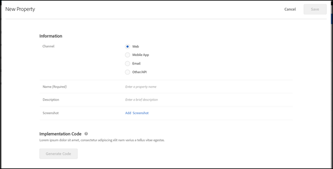
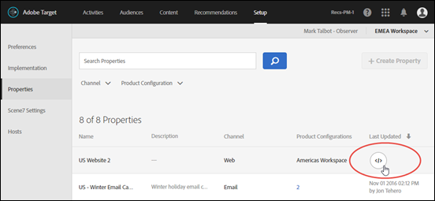
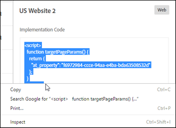
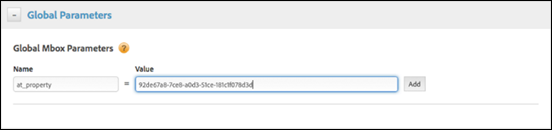

# Configure Enterprise Permissions

>[!NOTE]
>
>Properties and Permissions functionality is available as part of the ` Target Premium` solution. They are not available in ` Target Standard` without a ` Target Premium` license. 

The following table lists the tasks you should perform to create properties and assign user roles and permissions:

<table id="table_D3FFB40000DC4CBAA18B1D0E52D40565"> 
 <thead> 
  <tr> 
   <th colname="col1" class="entry"> Task </th> 
   <th colname="col2" class="entry"> Performed In </th> 
  </tr> 
 </thead>
 <tbody> 
  <tr> 
   <td colname="col1"> 
 <a href="properties-overview.xml#concept_22F2855DBF0D4754B9460F5D68749C71/section_A92AF0F921B743FEB9E9033433BD816A" format="dita" scope="local"> 1. Add Users (Optional) </a> 
 </td> 
   <td colname="col2"> 
  Adobe Admin Console for Enterprise  
 </td> 
  </tr> 
  <tr> 
   <td colname="col1"> 
 <a href="properties-overview.xml#concept_22F2855DBF0D4754B9460F5D68749C71/section_B82EB409B67C4D9D9D20CE30E48DB1DC" format="dita" scope="local"> 2. Create a Workspace (Product Profile) </a> 
 </td> 
   <td colname="col2"> 
  Adobe Admin Console for Enterprise  
 </td> 
  </tr> 
  <tr> 
   <td colname="col1"> 
 <a href="properties-overview.xml#concept_22F2855DBF0D4754B9460F5D68749C71/section_5F5CB9AA7A9F4D26953E22016DA59605" format="dita" scope="local"> 3. Create User Groups (Optional) </a> 
 </td> 
   <td colname="col2"> 
  Adobe Admin Console for Enterprise  
 </td> 
  </tr> 
  <tr> 
   <td colname="col1"> 
 <a href="properties-overview.xml#concept_22F2855DBF0D4754B9460F5D68749C71/section_E8F2C92BE0F4466AB87604059C9CF3FD" format="dita" scope="local"> 4. Create Properties </a> 
 </td> 
   <td colname="col2"> 
Target UI
 </td> 
  </tr> 
  <tr> 
   <td colname="col1"> 
 <a href="properties-overview.xml#concept_22F2855DBF0D4754B9460F5D68749C71/section_9B17A59807A94712BE642942442EBBC8" format="dita" scope="local"> 5: Update Your Implementation to Include the at_property Parameter </a> 
 </td> 
   <td colname="col2"> 
Target UI /  at.js  functions / Dynamic Tag Management 
 </td> 
  </tr> 
  <tr> 
   <td colname="col1"> 
 <a href="properties-overview.xml#concept_22F2855DBF0D4754B9460F5D68749C71/section_8C425E43E5DD4111BBFC734A2B7ABC80" format="dita" scope="local"> 6: Specify Roles and Permissions </a> 
 </td> 
   <td colname="col2"> 
  Adobe Admin Console for Enterprise  
 </td> 
  </tr> 
 </tbody> 
</table>

For those tasks performed in the Adobe Admin Console for Enterprise, access the console by following these steps:

1. Go to [ https://adminconsole.adobe.com/enterprise/ ](https://adminconsole.adobe.com/enterprise/) &gt; sign in using your Adobe ID, if you have not already logged in. 
   Or
   If you are already logged in to the Marketing Cloud, go to [ http://www.marketing.adobe.com ](http://www.marketing.adobe.com/), then click the ` App` icon (   ) in the top navigation bar > click ** ` Administration` ** on the right side > then click ** ` Launch Admin Console` **. 

1. (Conditional) If you have access to the ` Admin Console for Enterprise` for more than one organization, click the user avatar in the right corner or the top navigation bar, then select the desired organization. 

## 1. Add Users (Optional) {#section_A92AF0F921B743FEB9E9033433BD816A}

When you start using the new ` Properties` functionality, all user management must be performed in the ` Adobe Admin Console for Enterprise`. However, all of your existing users in ` Target` will be migrated from ` Target` to the ` Admin Console for Enterprise`. 

1. [ In the Admin Console ](properties-overview.md#section_79796E0227D048F59BAE0AB02E544EBE), click ** ` User Management` ** > ** ` Users` ** to create new users or to edit existing users. 

1. Follow the instructions in [ Manage Users and Groups in the Marketing Cloud ](https://helpx.adobe.com/enterprise/help/users.html) in the *Enterprise User Guide*. 

## 2. Create a Workspace (Product Profile) {#section_B82EB409B67C4D9D9D20CE30E48DB1DC}

A workspace (Product Profile) lets an organization assign a specific set of users to a specific set of properties. In many ways, a workspace is similar to a report suite in ` Analytics`. 
Organizations can begin taking advantage of Enterprise permissions functionality by creating new workspaces within Admin Console, assigning Target properties to these workspaces, and moving users from the "Default Workspace" configuration to these newer, limited-access workspaces.
Customers can use these workspaces to separate access to different teams by region, by business unit, by sight section, or via any other method they choose.
Users can be part of multiple workspaces and can even have different roles within each workspace.
This video explains how to create workspaces:

<table id="table_38936C8A1EAC4164B9BD5A646A71D181"> 
 <thead> 
  <tr> 
   <th class="entry" colspan="2"> How to Configure Target Workspaces </th> 
   <th colname="col3" class="entry"> 6:55 </th> 
  </tr> 
 </thead>
 <tbody> 
  <tr> 
   <td colspan="2"> 
 
     
 
      <iframe src="https://video.tv.adobe.com/v/19463/" frameborder="0" webkitallowfullscreen="true" mozallowfullscreen="true" oallowfullscreen="true" msallowfullscreen="true" allowfullscreen="allowfullscreen" scrolling="no" width="550" height="345">https://video.tv.adobe.com/v/19463/</iframe>
     
 
 </td> 
   <td colname="col3"> 
 
     <ul id="ul_AE48A4920BD643A0AB3CEBFCF28A5D7C"> 
      <li id="li_5440ACDE887442F495FCC50DF72974C8"> 
Access the Adobe Admin Console from the Adobe Target interface (3 ways)
 </li> 
      <li id="li_31F8EBF4B5A44CFB9BB15723C078ABA9"> 
Configure a workspace in Adobe Admin Console
 
       <ul id="ul_A50E942C80954C6AB57801F2CE953469"> 
        <li id="li_5C713316FB5447C1A209AA2689F4B644"> 
Add users to workspaces
 </li> 
        <li id="li_DD52CDD690EB4EB4A7D11BAEA6179D6F"> 
Add properties to workspaces
 </li> 
       </ul> </li> 
      <li id="li_80054E078EE84DD0A75119F28BA8351C"> 
Understand default workspaces
 </li> 
     </ul> 
 </td> 
  </tr> 
 </tbody> 
</table>

1. [ In the Admin Console ](properties-overview.md#section_79796E0227D048F59BAE0AB02E544EBE), click ** ` Products` **, then select the name of the desired product. 
    

1. Create the desired workspace (Product Profile):

    * **Default Access:**All existing activities will be merged into a single project called "Default Access." This will have no impact on customers. All user roles and functionality will remain exactly the same as they are prior to this change. 
      All activities created via ` Adobe Experience Manager` (AEM), ` Adobe Mobile Services`, and ` Target Classic` will also be part of the "Default Access" workspace. You cannot currently move projects from "Default Access" to another project. 

    * **New workspaces (Product Profiles):**You can begin taking advantage of the new permissions functionality by doing the following: 
    
        * Creating new workspaces within the ` Admin Console for Enterprise`. 

        * Assigning Target properties to the workspaces.

   You can use these workspaces to divide access to different teams by region, business unit, site section, or via any other method you choose. Users can be part of multiple workspaces and can have different roles within each workspace.

1. Follow the instructions in [ Create and Manage Product Configurations ](https://helpx.adobe.com/enterprise/help/manage-products-and-configurations.html) in the *Enterprise User Guide*. 

## 3. Create User Groups (Optional) {#section_5F5CB9AA7A9F4D26953E22016DA59605}

You can create user groups, such as Developers, Analysts, Marketers, Executives, etc., and then assign privileges across multiple Adobe products and workspaces. Assigning a new team member all the appropriate privileges across different Adobe products can be as easy as adding them to a specific user group.

1. [ In the Admin Console ](properties-overview.md#section_79796E0227D048F59BAE0AB02E544EBE), click ** ` User Management` ** > ** ` User Groups` ** to create new user groups or to edit existing groups. 

1. Follow the instructions in [ Manage Users and Groups of a Product Configuration ](https://helpx.adobe.com/enterprise/help/manage-products-and-configurations.html) in the *Enterprise User Guide*.

## 4. Create Properties {#section_E8F2C92BE0F4466AB87604059C9CF3FD}

This video explains how to create properties:

<table id="table_C56F4BE9B867463380013C584D97DAD2"> 
 <thead> 
  <tr> 
   <th class="entry" colspan="2"> How to Create Properties </th> 
   <th colname="col3" class="entry"> 3:05 </th> 
  </tr> 
 </thead>
 <tbody> 
  <tr> 
   <td colspan="2"> 
 
     
 
      <iframe src="https://video.tv.adobe.com/v/18990/" frameborder="0" webkitallowfullscreen="true" mozallowfullscreen="true" oallowfullscreen="true" msallowfullscreen="true" allowfullscreen="allowfullscreen" scrolling="no" width="550" height="345">https://video.tv.adobe.com/v/18990/</iframe>
     
 
 </td> 
   <td colname="col3"> 
 
     <ul id="ul_B17C3EFA4B664415AE0159E418FF45C4"> 
      <li id="li_916224D2105348BE93D60015B2F43D4F"> 
How to create a property within the  Adobe Target  interface 
 </li> 
      <li id="li_0FED234A3A054DEAB62C4F58BAB47F7F"> 
How to generate a property token to include in your property implementation
 </li> 
      <li id="li_6C4D1871E45D40118D7D9D4DF81547B5"> 
Familiarize yourself with the three implementation methods:
 
 
        <ul id="ul_ACF4CEAD7B3948488C70606FF473BE77"> 
         <li id="li_1EE1205D3F5A49F8801886E4668ACEA8"> 
Web
 </li> 
         <li id="li_F3D894969C33480C8A3CD88FA955F129"> 
Mobile app
 </li> 
         <li id="li_9801FEA2BF79453C99AEDEBD95549C36"> 
Email, set top box, or API calls
 </li> 
        </ul> 
 </li> 
     </ul> 
 </td> 
  </tr> 
 </tbody> 
</table>

Properties are enabled by adding a specific name/value pair as a parameter with any call (mbox, api, etc.) to Target.
Properties belong to specific channels (Web, Mobile, Email, and API/Other).

1. In ` Target`, click ** ` Setup` ** > ** ` Properties` ** to display the ` Properties` list. 

1. Click **Create Property**. 
    
   Fill in the fields:

    * **Channel:**Specify the desired channel for the property: Web, Mobile App, Email, or Other/API (for example a set-top box or PlayStation console). 

    * **Name (Required):**Specify a descriptive name for the property. 

    * **Description:**Specify an optional description for the property. 

1. Click ** ` Generate Code` ** to generate the code you'll use while performing the steps in [ 5: Update Your Implementation to Include the at_property Parameter ](properties-overview.md#section_9B17A59807A94712BE642942442EBBC8). 

1. Copy the code to your clipboard.

1. Click ** ` Save` ** when done. 

## 5: Update Your Implementation to Include the at_property Parameter {#section_9B17A59807A94712BE642942442EBBC8}

To use the ` Target` user-permissions functionality, you must add the ` at_property` parameter to any call that is hitting Target (mbox, api, etc.). 
**To obtain the ` at_property` parameter code:** 

1. (Conditional) Use the implementation code you generated and saved to your clipboard while performing the steps in [ 4. Create Properties ](properties-overview.md#section_E8F2C92BE0F4466AB87604059C9CF3FD) and proceed to Step 2. 
   Or
   In ` Target`, click ** ` Setup` ** > ** ` Properties` ** to display the ` Properties` list. 

    1. Hover your mouse pointer over the ` Last Updated` column for the desired property to display and click the ` Code` icon (  ). 
        

    1. Right-click the highlighted implementation code to copy it to your clipboard.
        

1. Update your Target implementation with the implementation code obtained in the previous step.
   There are several ways to update your ` Target` implementation. For example, the following methods can be used for web pages: 

    * **Via a "Global Parameter" in ` Dynamic Tag Management` (Adobe Activation):** 
       
      For more information, see [ Global Parameters - Adobe Target ](https://marketing.adobe.com/resources/help/en_US/dtm/target_global_params.html) in the *Dynamic Tag Management Product Documentation*. 

    * **Via the targetPageParams() function:**Place the following code in the &lt;body&gt; tags, above the at.js or mbox.js reference. 
       
      For more information about how to do this with at.js, see [ targetPageParams() ](r_target-atjs-targetpageparams.md#reference_B235C9F6DA79449ABE3E23F914FEABAE). 

    * **Via the mboxCreate() function:** 
       
      For more information about how to do this with at.js, see [ targetPageParams() ](r_target-atjs-targetpageparams.md#reference_B235C9F6DA79449ABE3E23F914FEABAE). [ mboxCreate(mbox,params) ](r_target-atjs-mboxcreate.md#reference_E68805FE86C64792B2066DB17B253D74) 

## 6: Specify Roles and Permissions {#section_8C425E43E5DD4111BBFC734A2B7ABC80}

1. [ In the Admin Console ](properties-overview.md#section_79796E0227D048F59BAE0AB02E544EBE), click ** ` Products` **, then select the name of the desired product. 
    

   >[!NOTE]
   >
   >The Properties and Permissions functionality applies to ` Target Standard/Premium` only. You cannot use this functionality with ` Target Classic`. 

1. Click the name of the desired profile.

1. Click ** ` Configuration Users` **. 
   The ` Configuration Users` tab displays all of the users in that workspace. 
    

1. Select the desired permissions role (Approver, Editor, or Observer) by using the drop-down list for each user in the ` Product Role` column. 

<table id="table_92B2935FEB0A4DFEAC24C074EDEBD409"> 
 <thead> 
  <tr> 
   <th colname="col1" class="entry"> Role </th> 
   <th colname="col2" class="entry"> Description </th> 
  </tr> 
 </thead>
 <tbody> 
  <tr> 
   <td colname="col1"> 
Observer
 </td> 
   <td colname="col2"> 
Can view activities, but cannot create or edit them.
 </td> 
  </tr> 
  <tr> 
   <td colname="col1"> 
Editor
 </td> 
   <td colname="col2"> 
Can create and edit activities before they are live, but cannot approve the launch of an activity.
 </td> 
  </tr> 
  <tr> 
   <td colname="col1"> 
Approver
 </td> 
   <td colname="col2"> 
Can create, edit, and activate or stop activities.
 </td> 
  </tr> 
 </tbody> 
</table>

   For more information, see [ Manage Product Permissions and Roles in the Admin Console ](https://helpx.adobe.com/enterprise/help/manage-permissions-and-roles.html) in the *Enterprise User Guide*. 

