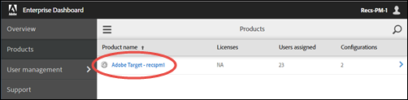
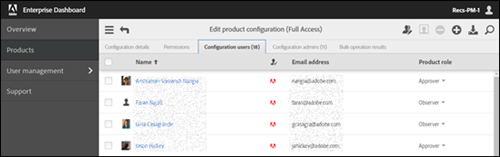

# Specify Roles

>[!NOTE]
>
>This "Beta" offering is enabled for a few customers in this release for testing and feedback. This documentation is a work-in-progress and will be frequently updated until this feature is released for all Target users.

**To specify or edit roles for individual users:** 

1. To access the `Admin Console for Enterprise`, go to [https://adminconsole.adobe.com/enterprise/](https://adminconsole.adobe.com/enterprise/) &gt; sign in using your Adobe ID, if you have not already logged in. 
   Or
   If you are already logged in to the Marketing Cloud, go to [http://www.marketing.adobe.com](http://www.marketing.adobe.com/), then click the `App` icon (   ) in the top navigation bar > click ** `Administration` ** on the right side > then click ** `Launch Admin Console` **. 

1. (Conditional) If you have access to the `Admin Console for Enterprise` for more than one organization, click the user avatar in the right corner or the top navigation bar, then select the desired organization. 

1. Click ** `Products` **, then select the name of the desired product. 
    

   >[!NOTE]
   >
   >The Properties and Permissions functionality applies to `Target Standard/Premium` only. You cannot use this functionality with `Target Classic`. 

1. Click the name of the desired configuration.

1. Click ** `Configuration Users` **. 
   The `Configuration Users` tab displays all of the users in that workspace. 
    

1. Select the desired permissions role (Approver, Editor, or Observer) by using the drop-down list for each user in the `Product Role` column. 

