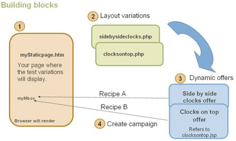

# Create a Remote Offer

Remote offers use your dynamic page technology to pass values to the offer. The offer is executed after you render the page, loading your passed values into an invisible iframe. See [Create Remote Offers](c_about-remote-offers.md#concept_657016A0E6174C22B89036E9C8A0170F). 
 
Some examples of remote offers stored on your site include:

* Remote cross-sells served by your server
* Dynamic shopping cart messages served by your server
* A templatized dynamic product page from your server
* Anything with lots of variants or high volume output, that cannot be output by the page code

To create a dynamic offer that is stored on your site:

>1. On your dynamic or static page, place an mbox where you want to show the dynamic offer.
>1. Create the variations of your dynamic output.

>       These must be saved on the same host as the page in Step 1.
>1. From the Offers menu, select `Offer on Your Site`.
>1. In the Choose Offer Type dropdown, select `dynamic (iframe)`.
>1. For each offer, insert a relative URL referring to one of the variations in Step 2.
