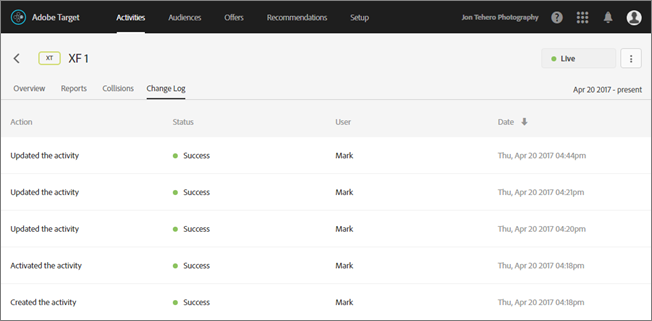

# Activity Change Log

>1. Open the activity, then click ` Change Log`.

>        

>       The date and user are listed any time an activity is created, updated, activated or deactivated. Changes to custom targets and offers used in the activity are also listed. The Status column shows whether the action is completed, pending, or failed. 

>       Refresh the page to see status changes. 
