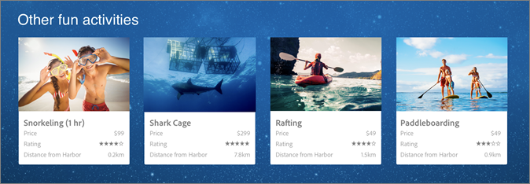

# Recommendations

>[!NOTE]
>
>[!DNL  Recommendations] activities are available as part of the [!DNL  Target Premium] solution. They are not available in [!DNL  Target Standard] without a [!DNL  Target Premium] license. 

>[!NOTE]
>
>If you currently have [!DNL  Recommendations Classic], see [ Recommendations Classic versus Recommendations Activities in Target Premium](c_recommendations/c_recommendations-classic-versus-recommendations-activities-target-premium.md#concept_A80223EF66634EA380580C2823A581C5) for more information about the two solutions. 

[!DNL  Recommendations] helps you optimize and customize real-time suggestions across channels, apps, pages, email messages, and other delivery options to increase engagement and conversion while reducing management effort. 

[!DNL  Recommendations] helps you: 

* Create sophisticated criteria (rules) to automate recommendations 

* Automatically display the recommendations by using a few JavaScript snippets 

* Test and optimize the recommendations criteria and designs that display the recommendations 

* Report on the results of your recommendations activities 

The following illustration shows recommendations on a web page: 

 

A recommendation determines how a product is suggested to a customer, depending on that customer's activities on the site. For example: 

<table id="table_4753CB411DA247C08C8AC46B0D034879"> 
 <thead> 
  <tr> 
   <th colname="col1" class="entry"> Desired Action </th> 
   <th colname="col2" class="entry"> Recommendation </th> 
  </tr>
 </thead>
 <tbody> 
  <tr> 
   <td colname="col1"> 
Encourage people who purchase a backpack to consider buying hiking shoes and trekking poles. 
 </td> 
   <td colname="col2"> 
Create a recommendation that shows items that are often purchased together, using the "People who bought this also bought that" criteria. 
 </td> 
  </tr> 
  <tr> 
   <td colname="col1"> 
Increase the time visitors spend on your media site by recommending media content similar to what they are watching. 
 </td> 
   <td colname="col2"> 
Create a recommendation that suggests other videos, using the "People who viewed this viewed that" criteria. 
 </td> 
  </tr> 
  <tr> 
   <td colname="col1"> 
Suggest that customers who viewed information about savings plans at your bank also read about IRA accounts. 
 </td> 
   <td colname="col2"> 
Show other products people purchased after viewing one product without showing the first product in the recommendations, using the "people who viewed this also bought" criteria. 
 </td> 
  </tr> 
 </tbody> 
</table>

For more information about these and other [!DNL  Recommendations] criteria, see [ Criteria](c_recommendations/c_algorithms.md#concept_4BD01DC437F543C0A13621C93A302750). 

This video explains the activity types available in [!DNL  Target Standard/Premium]. [!DNL  Recommendations] is discussed beginning at 7:20. 

<table id="table_C56F4BE9B867463380013C584D97DAD2"> 
 <thead> 
  <tr> 
   <th class="entry" colspan="2"> Activity Types </th> 
   <th colname="col3" class="entry"> 9:03 </th> 
  </tr>
 </thead>
 <tbody> 
  <tr> 
   <td colspan="2"> 
 
     
 
      <iframe src="https://www.youtube.com/embed/vtHg1pPFJp8/" frameborder="0" webkitallowfullscreen="true" mozallowfullscreen="true" oallowfullscreen="true" msallowfullscreen="true" allowfullscreen="allowfullscreen" scrolling="no" width="550" height="345">https://www.youtube.com/embed/vtHg1pPFJp8/</iframe>
     
 
 </td> 
   <td colname="col3"> 
 
     <ul id="ul_B17C3EFA4B664415AE0159E418FF45C4"> 
      <li id="li_916224D2105348BE93D60015B2F43D4F"> 
Describe the types of activities included in Adobe Target 
 </li> 
      <li id="li_0FED234A3A054DEAB62C4F58BAB47F7F"> 
Select the appropriate activity type to achieve your goals 
 </li> 
      <li id="li_6C4D1871E45D40118D7D9D4DF81547B5"> 
Describe the three-step guided workflow that applies to all activity types 
 </li> 
     </ul> 
 </td> 
  </tr> 
 </tbody> 
</table>

