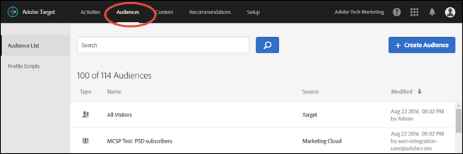

# About Audiences

Audiences are used anywhere targeting is available. When targeting an activity, you can either select a reusable audience from the [!UICONTROL  Audiences] list, create an activity-specific audience and target it, or [ combine multiple audiences](../c_target/c_audiences/c_combining-multiple-audiences.md#concept_A7386F1EA4394BD2AB72399C225981E5) to create an ad hoc audience. 

You can also use audience data collected by [!DNL  Analytics] for real-time targeting and personalization in [!DNL  Adobe Target] and other [!DNL  Experience Cloud] solutions. See [ Audiences in the Experience Cloud Product Documentation](https://marketing.adobe.com/resources/help/en_US/mcloud/audience_library.html). 

This video includes information about using audiences. 

<table id="table_A3A70CC0C9F54131BB9F098B4DA8C9D6"> 
 <thead> 
  <tr> 
   <th class="entry" colspan="2"> Using Audiences </th> 
   <th colname="col3" class="entry"> 6:22 </th> 
  </tr>
 </thead>
 <tbody> 
  <tr> 
   <td colspan="2"> 
    
 
     <iframe src="https://www.youtube.com/embed/TAMBpW9vpOI/" frameborder="0" webkitallowfullscreen="true" mozallowfullscreen="true" oallowfullscreen="true" msallowfullscreen="true" allowfullscreen="allowfullscreen" scrolling="no" width="550" height="345">https://www.youtube.com/embed/TAMBpW9vpOI/</iframe>
    
 </td> 
   <td colname="col3"> 
 
     <ul id="ul_FF4FEC7BC7A34461BAA54FBE18A8E63B"> 
      <li id="li_7D6D4CB2E771430F84D2B658F8611532"> 
Explain the term "audience" 
 </li> 
      <li id="li_61D9DDCD3AFB40E2BC55AFED5CD6C405"> 
Explain the two ways audiences are used for optimization 
 </li> 
      <li id="li_745F20CC95DF4BE48173991CB42EC50A"> 
Find audiences in the Audiences List 
 </li> 
      <li id="li_699D4D5D089A4FB7BA4C5E95337AC34A"> 
Target an activity to an audience 
 </li> 
      <li id="li_87E7AFFEEC9C42ABB51C279221E17A14"> 
Use audiences for passive reporting in an activity 
 </li> 
     </ul> 
 </td> 
  </tr> 
 </tbody> 
</table>

[!DNL  Target] defines two types of audiences: 

* **Targeting Audiences: **Used to deliver different content to different types of visitors. 

* **Reporting Audiences: **Used to determine how different types of visitors respond to the same content so you can analyze your test results. 

  In [!DNL  Target], you can configure reporting audiences only if you use [!DNL  Target] as your reporting source. If you use [ [!DNL  Adobe Analytics] as your reporting source (A4T)](../c_integrating_target_with_mac/a4t.md#concept_7540C8C04259434AB6EE33B09F47A1DE), you must configure your reporting audiences within [!DNL  Analytics]. 

To access the [!UICONTROL  Audiences] list, click ** [!UICONTROL  Audiences] ** in the top menu bar: 

 

The [!UICONTROL  Audiences] list contains all of the audiences that you can use in your activities. Use the [!UICONTROL  Audiences] list to create, edit, delete, copy, or combine audiences. The list also shows the source where the audience was created ( [!DNL  Target], [!DNL  Target Classic], [!DNL  Experience Cloud], and so forth). Predefined audiences, such as "New Visitors" and "Returning Visitors," cannot be renamed. 

You can also target custom profile parameters and ` user.` parameters. When adding an audience, click ** [!UICONTROL  Visitor Profile] **, then under [!UICONTROL  Custom User Parameters] or [!UICONTROL  Custom Profile Parameters] in the [!UICONTROL  Visitor Profile] drop-down list, choose the parameter you use want to use to target your activity. If the desired parameter does not appear, the parameter has not been fired by an mbox. Other custom mbox parameters are available in the [!UICONTROL  Custom Parameters] drop-down list. 

Use the search box to search your [!UICONTROL  Audiences] list. You can search for any part of an audience name, or you can enclose a specific string in quotes. 

You can sort the [!UICONTROL  Audiences] list by audience name or by the date when it was last modified. To sort by name or date, click the column header, then select to display audiences in ascending or descending order. 

## Viewing Audience Definitions {#section_11B9C4A777E14D36BA1E925021945780}

You can view audience definition details on a pop-up card in various places in the Target UI without opening the audience. This functionality applies to audiences created in Target Standard/Premium and audiences imported from Target Classic or created via API. 

For example, the following audience definition card is accessed by hovering over an audience on the Audience List, then clicking the View icon: 

 

The following audience definition card is accessed by clicking the View icon on an activity's Overview page: 

 

Click the [!UICONTROL  Audience Usage] tab to see other activities that reference that audience, if applicable. This way you can avoid accidental impact to other activities while editing audiences. Information includes Live Activities, Inactive Activities, Archived Activities, And Syncing Activities. This feature is available for all audiences (Library audiences and [ activity-only audiences](../c_target/c_audiences/creating-activity-only-audience.md#concept_A6BADCF530ED4AE1852E677FEBE68483)). 

If an audience is combined with another audience and the combined audience is used to create an activity, the usage information for both audiences will list that newly created activity. 

 

The following audience definition card is for an audience imported from the Adobe Experience Cloud. In this instance, the audience was imported from Adobe Audience Manager (AAM). Notice that Target does not show detailed audience definition information because that information is not present in Target. 

 

The following details are available for these imported audience types: 

<table id="table_BEE4E80E557B4BC9B703A5B80BF59F0F"> 
 <thead> 
  <tr> 
   <th colname="col1" class="entry"> Audience Type </th> 
   <th colname="col2" class="entry"> Details </th> 
  </tr>
 </thead>
 <tbody> 
  <tr> 
   <td colname="col1"> 
Mobile audience 
 </td> 
   <td colname="col2"> 
Marketing Name, Vendor, and Model. 
 
The  matches|does not match operator displays instead of  equals|does not equal. 
 
 
 </td> 
  </tr> 
  <tr> 
   <td colname="col1"> 
Visitor-behavior audience 
 </td> 
   <td colname="col2"> 
user.categoryAffinity:  categoryAffinity with  FAVORITE parameter. 
 
 
 
Monitoring:  Monitoring service equals true. 
 
No Monitoring Service:  Monitoring service equals false. 
 
 
 </td> 
  </tr> 
  <tr> 
   <td colname="col1"> 
Audiences using the NOT operator 
 </td> 
   <td colname="col2"> 
Single Rule: Target displays the audience in the format  [All Visitor AND [NOT [rule]. Single NOT rule displays with AND with AllVisitor audience. 
 
 
 </td> 
  </tr> 
 </tbody> 
</table>

Keep the following points in mind as you work with imported audiences: 

* Expression target audiences are no longer supported in Target Standard/Premium. 

* Target Standard/Premium does not support some deprecated audiences or has improved operators for ease of use. Because of this, the definition of an imported audience, although working as per definition, does not mean that same is now available for creation in the Standard/Premium interface. For example, Social Audiences are visible with their rules but Target Standard/Premium does not allow social audiences to be created. 

