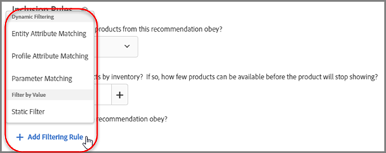
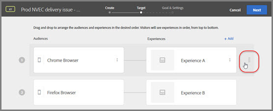

# Release notes for previous releases{#release-notes-for-previous-releases}

Release notes for previous Target releases, including release notes for Target Standard/Premium, the Target platform, and the Target Javascript libraries (at.js and mbox.js). Release notes are arraigned in descending order by month and year of release.

## Release notes for previous releases {#topic_607D0324907E472EA3682033A27B5F07}

Release notes for previous Target releases, including release notes for Target Standard/Premium, the Target platform, and the Target Javascript libraries (at.js and mbox.js). Release notes are arraigned in descending order by month and year of release.

>[!NOTE]
>
>See [Target release notes (current)](../r-release-notes/release-notes.md#reference_8FE40B43A5A34DDF8F26A53D55EE036A) for information about the current month's Target releases (platform and Target Standard/Premium).

## Release notes - 2018 {#reference_36ACC83E135A41F28104C44755C26D5B}

## Target Standard/Premium 18.10.1 (October 24, 2018) {#section_FA37BF4E840B424E8BC4791D7234FE2A}

This release includes the following features and enhancements:

>[!NOTE]
>
>The issue numbers in parentheses are for internal Adobe use.

<table id="table_B1911F55CCE1428881D258380A8254A9"> 
 <thead> 
  <tr> 
   <th colname="col1" class="entry"> Feature / Enhancement </th> 
   <th colname="col2" class="entry"> Description </th> 
  </tr> 
 </thead>
 <tbody> 
  <tr> 
   <td colname="col1"> <p>Experiences </p> </td> 
   <td colname="col2"> <p>You can now copy an experience in an Experience Targeting (XT) activity so you can make minor changes to it without having to re-create the experience from scratch. This capability was already available for A/B Tests. (TGT-31504) </p> <p>See <a href="https://marketing.adobe.com/resources/help/en_US/target/target/t_xt_add_experience.html" format="html" scope="external"> Create experience </a>. </p> </td> 
  </tr> 
  <tr> 
   <td colname="col1" class="premium"> <p>Offers in Automated Personalization (AP) activities </p> </td> 
   <td colname="col2"> <p>In the September 2018 release, we added an enhancement that lets you filter offers by reporting groups. You can now filter for Unassigned Offers so you can assign a reporting group to an offer that is not currently assigned to any reporting group. (TGT-31882) </p> <p>See <a href="https://marketing.adobe.com/resources/help/en_US/target/target/t_create_ap_activity.html" format="html" scope="external"> Create an Automated Personalization activity </a>. </p> </td> 
  </tr> 
  <tr> 
   <td colname="col1"> <p>Reporting source for activities </p> </td> 
   <td colname="col2"> <p>In <span class="wintitle"> Setup </span> &gt; <span class="wintitle"> Preferences </span>, you can select the reporting source for your activities, either <span class="keyword"> Target </span> or <span class="keyword"> Adobe Analytics </span>. You can also choose to select your reporting source per activity. </p> <p>Starting with this release, there are some important workflow considerations you should be aware of when you choose the reporting source in <span class="wintitle"> Preferences </span> or per activity. </p> <p>See <a href="https://marketing.adobe.com/resources/help/en_US/target/ov/r_target-account-preferences.html" format="html" scope="external"> Preferences </a>. </p> </td> 
  </tr> 
 </tbody> 
</table>

**Enhancements, Fixes, and Changes**

This [!DNL Target] release includes the following enhancements, fixes, and changes:

* Improved the handling of audiences referenced in Target activities that have been deleted in Adobe Audience Manager (AAM). (TGT-23338)

    * If an audience was deleted in AAM, a warning icon in both the [!UICONTROL Audience] list and the audience picker displays. A tool-tip in the UI also indicates that the audience was deleted in AAM. 
    * If you attempt to combine multiple audiences with a deleted audience, or if you attempt to save an activity that references a deleted audience, a warning message displays.

  See [About audiences](https://marketing.adobe.com/resources/help/en_US/target/target/c_audiences.html). 

* Fixed an issue that prevented users in certain situations from being able to create an activity when Adobe Analytics was selected as the reporting source on the [!UICONTROL Setup] page. Users saw a "Please select a report suite" message even though they were not given the option of selecting the report suite. (TGT-31968)

## Platform (October 19, 2018) {#section_484A56774E004282B98FFFF851E4E670}

<table id="table_7320E43397D2471FA313A9D6FC21E55F"> 
 <thead> 
  <tr> 
   <th colname="col1" class="entry"> Feature / Enhancement </th> 
   <th colname="col2" class="entry"> Description </th> 
  </tr> 
 </thead>
 <tbody> 
  <tr> 
   <td colname="col1"> <p>at.js 1.6.2 </p> </td> 
   <td colname="col2"> <p>This is a maintenance release and addresses the following issue: </p> <p> 
     <ul id="ul_2C7CB74B1AAF4B52B6EB382977F7DC28"> 
      <li id="li_07CF8EDB25E24A7AB9B7A0F3402BAEB1"> <p>Fixed an issue that on some customer sites lead to an infinite "async" loop. </p> </li> 
     </ul> </p> <p> <p>Important:  In addition, at.js Version 1.6.2 also contains all of the enhancements and fixes included in at.js Version 1.6.1 and 1.6.0. These versions are no longer available for download. We recommend that you upgrade to version 1.6.2 if using 1.6.1 or 1.6.0. </p> </p> <p>For more information, see <a href="https://marketing.adobe.com/resources/help/en_US/target/ov2/r_target-atjs-versions.html" format="html" scope="external"> at.js Version Details </a>. </p> </td> 
  </tr> 
 </tbody> 
</table>

## Target Standard/Premium 18.9.1 (September 26, 2018) {#section_95CF405C95E44DBEA3CB308FDD5071CD}

<!-- 

target/r_release-notes-2018.xml

 -->

This release includes the following features and enhancements:

>[!NOTE]
>
>The issue numbers in parentheses are for internal Adobe use.

<table id="table_7ABC8E7477194D4C8C9E82ECE60E3498"> 
 <thead> 
  <tr> 
   <th colname="col1" class="entry"> Feature / Enhancement </th> 
   <th colname="col2" class="entry"> Description </th> 
  </tr> 
 </thead>
 <tbody> 
  <tr> 
   <td colname="col1" class="premium"> <p>Offers in Automated Personalization (AP) activities </p> </td> 
   <td colname="col2"> <p> 
     <ul id="ul_9C39ACD865CE4167BDBAA093EDFD3B68"> 
      <li id="li_19710BA5965E4F858B128E1E9FF89471"> <p>You can now use multiple offers from the same location in an exclusion group. For a large number of exclusions (order of 1,000s), you will also observe faster loading of the Manage Content dialog box and preview page while authoring an Automated Personalization (AP) activity. (TGT-31329) See <a href="../c-activities/t-automated-personalization/managing-exclusions.md#topic_30B4E4F89C914EB2B20B038C0299ED2E" format="dita" scope="local"> Manage Exclusions </a>. </p> </li> 
      <li id="li_542C66E2998541BC87D0A96F4672C665"> <p>You can now filter offers by reporting groups. (TGT-31643) See <a href="../c-activities/t-automated-personalization/create-ap-activity.md#task_8AAF837796D74CF893CA2F88BA1491C9" format="dita" scope="local"> Creating an Automated Personalization Activity </a>. </p> </li> 
     </ul> </p> </td> 
  </tr> 
  <tr> 
   <td colname="col1"> <p>Visual Experience Composer (VEC) </p> </td> 
   <td colname="col2"> <p>We have added an <span class="wintitle"> Insert Before </span> action to the (VEC). This is similar to the previously existing <span class="wintitle"> Insert After </span> option. When you select an element on the page, you can click <span class="wintitle"> Insert Before </span> and choose whether you want to insert an image, HTML, or text. The inserted element appears before the selected element. (TGT-30473) See <a href="../c-experiences/c-visual-experience-composer/r-viztarget-options.md#reference_3BD1BEEAFA584A749ED2D08F14732E81" format="dita" scope="local"> Visual Experience Composer Options </a>. </p> </td> 
  </tr> 
 </tbody> 
</table>

**Enhancements, Fixes, and Changes**

This [!DNL Target] release includes the following enhancements, fixes, and changes:

* We updated the look and feel of Criteria cards to be more intuitive and user-friendly. (TGT-30469) 
* Performance improvements in UI for faster loading of pages.

## Target Standard/Premium 18.8.1 (August 21, 2018) {#section_66A0030993D54565BE30E56AC9CAC1DA}

This release includes the following features and enhancements:

>[!NOTE]
>
>The issue numbers in parentheses are for internal Adobe use.

<table id="table_4785030753B24AA1A973E1DF790B83DD"> 
 <thead> 
  <tr> 
   <th colname="col1" class="entry"> Feature / Enhancement </th> 
   <th colname="col2" class="entry"> Description </th> 
  </tr> 
 </thead>
 <tbody> 
  <tr> 
   <td colname="col1" class="premium"> <p>Personalization Insights reports </p> </td> 
   <td colname="col2"> <p>Access specialized reports for your Automated Personalization (AP) and Auto-Target (AT) activities: </p> <p> 
     <ul id="ul_54652C5AE0984657BB9A0E46673CB2F1"> 
      <li id="li_0807959BA7D94114BE47A43D3454CAB4"> <p><b>Automated Segments:</b> See how different automated segments defined by Target's personalization models respond to offers/experiences in your activity. </p> </li> 
      <li id="li_48210B1E4EB24288B96CDECAF1CEE34A"> <p><b>Model Attribute Ranking:</b> See the top attributes that influenced Target's personalization models and the relative importance of each attribute. </p> </li> 
     </ul> </p> <p> <p>Note:  This feature will be available soon. Stay tuned for an announcement of the exact date when this feature will be ready for you to use. </p> </p> <p>See <a href="../c-reports/c-personalization-insights-reports/c-personalization-insights-reports.md#concept_A897070E1EDC403EB84CFB7A6ECAD767" format="dita" scope="local"> Personalization Insights Reports </a>. </p> </td> 
  </tr> 
  <tr> 
   <td colname="col1"> <p>Visual Experience Composer (VEC) </p> </td> 
   <td colname="col2"> <p> 
     <ul id="ul_406B95728467496CA6CC5892F88B69FE"> 
      <li id="li_6D717868FB204A3A95832E709773B424"> <p>You can dock the Modifications panel vertically along the side of the Target UI or horizontally at the bottom. </p> <p>See <a href="../c-experiences/c-visual-experience-composer/c-vec-code-editor/c-vec-code-editor.md#concept_B3A6E9EE3A60406DB640E205EA1745B5" format="dita" scope="local"> Modifications </a>. </p> </li> 
      <li id="li_27750AFBCB3E4CB8B0B53592B2447E59"> <p>We have grouped various VEC actions to make your job quicker and more efficient. (TGT-30472) </p> <p>See <a href="../c-experiences/c-visual-experience-composer/r-viztarget-options.md#reference_3BD1BEEAFA584A749ED2D08F14732E81" format="dita" scope="local"> Visual Experience Composer Options </a>. </p> </li> 
      <li id="li_27FEBEE245E64ADF9ADF561C6CBBDE8F"> <p>You can edit offers more efficiently, thanks to a larger edit window. (TGT-31052) </p> </li> 
     </ul> </p> </td> 
  </tr> 
  <tr> 
   <td colname="col1"> <p>Tips and Tricks </p> </td> 
   <td colname="col2"> <p>Get the most out of Adobe Target by learning more about various features and see why you should give them a try. The Tips and Tricks functionality displays on the Activities list page and provides links to videos, use-cases, blogs, documentation, and much more. Become a Target Power User! </p> <p>See <a href="../c-activities/activities.md#section_F77F30A246A14B538D9363B7F3639F97" format="dita" scope="local"> Tips and Tricks </a>. </p> </td> 
  </tr> 
  <tr> 
   <td colname="col1"> <p>Target Basics Webinar Series </p> </td> 
   <td colname="col2"> <p>Participate in the new Target Basics Webinar Series, a Customer Success Webinar Series brought to you by the Community. </p> <p> The next webinar, Best Practices in Reporting &amp; Value Socialization, is scheduled for August 22, 2018 from 8 to 9 a.m. (PDT). </p> <p>See <a href="../cmp-resources-and-contact-information.md#concept_11902FAC95C64479AABE020557A7EEE4" format="dita" scope="local"> Target Basics Webinar Series </a>. </p> </td> 
  </tr> 
 </tbody> 
</table>

**Enhancements, Fixes, and Changes**

This [!DNL Target] release includes the following enhancements, fixes, and changes:

* We have added several improvements to make Target even more secure than it was before. (TGT-31090, TGT-31089, TGT-31143)

## Target Standard/Premium 18.7.1 (July 25, 2018) {#section_A4A9C20EB677455F84FF0BA389F645E5}

This release includes the following features and enhancements:

>[!NOTE]
>
>The issue numbers in parentheses are for internal Adobe use.

<table id="table_7E3513EABA4948DC92EADCCE0234A9FF"> 
 <thead> 
  <tr> 
   <th colname="col1" class="entry"> Feature / Enhancement </th> 
   <th colname="col2" class="entry"> Description </th> 
  </tr> 
 </thead>
 <tbody> 
  <tr> 
   <td colname="col1"> <p>A/B and Experience Targeting (XT) activities </p> </td> 
   <td colname="col2"> <p>Edit and delete experiences right from the activity diagram. Now you can jump into the Visual Experience Composer (VEC) for a specific experience or delete an experience right from the diagram. </p> <p>  </p> <p>See: </p> <p> 
     <ul id="ul_CB0C1146716F4C09BF924CF3DFA7DC1A"> 
      <li id="li_3767DD36F597481FB312CC577CD668F0"> <p>A/B activity: <a href="../c-activities/t-test-ab/t-test-create-ab/ab-add-experience.md#task_454646F2895242D3B92DC395A0CE1A00" format="dita" scope="local"> Add Experience </a> </p> </li> 
      <li id="li_E2990CA178C6446BA7206643A3164FEF"> <p>XT activity: <a href="../c-activities/t-experience-target/t-xt-create/xt-add-experience.md#task_454646F2895242D3B92DC395A0CE1A00" format="dita" scope="local"> Create Experience </a> </p> </li> 
     </ul> </p> <p>(TGT-30229) </p> </td> 
  </tr> 
  <tr> 
   <td colname="col1"> <p>Audiences </p> </td> 
   <td colname="col2"> <p>Compare one profile attribute to another profile attribute instead of to a static number. </p> <p>See <a href="../c-target/c-audiences/c-creating-a-profile-attribute-comparison-audience.md#concept_4C2124B79A5B4556A6C1D10C0F5E40A0" format="dita" scope="local"> Creating a Profile Attribute Comparison Audience </a>. </p> <p> (TGT-28406) </p> </td> 
  </tr> 
  <tr> 
   <td colname="col1"> <p>Custom Code </p> </td> 
   <td colname="col2"> <p>"Custom Code" is now available from the "Add Modifications" panel instead of having its own tab. You can also add more than one custom code and optionally name each custom code. (TGT-28504) </p> <p>See <a href="../c-experiences/c-visual-experience-composer/c-vec-code-editor/c-vec-code-editor.md#concept_B3A6E9EE3A60406DB640E205EA1745B5" format="dita" scope="local"> Modifications </a>. </p> </td> 
  </tr> 
  <tr> 
   <td colname="col1" class="premium"> <p>Recommendations </p> </td> 
   <td colname="col2"> <p> 
     <ul id="ul_371C18DFC6D24E94B3D4FFFD83FC8D3A"> 
      <li id="li_9D11939014E7479AB7FD8910852A5386"> <p>View a list of activities that reference a selected criteria on its Criteria card. The card lists active and inactive activities. (TGT-27672) </p> </li> 
      <li id="li_B97BF9305EB04F6D8B1F6178B2E0CB34"> <p>From the activity diagram, Criteria cards now show when results are ready to display. (TGT-27673) </p> <p>See <a href="../c-recommendations/c-algorithms/c-algorithms.md#concept_4BD01DC437F543C0A13621C93A302750" format="dita" scope="local"> Criteria </a>. </p> </li> 
     </ul> </p> </td> 
  </tr> 
  <tr> 
   <td colname="col1"> <p>Experience Templates </p> </td> 
   <td colname="col2"> <p>Adobe Target Experience Templates are pre-coded offer samples with configurable inputs to be used in Target to execute some common marketer use cases. These experience templates are provided free to developers and marketers as a starting point to execute some common external use cases in Adobe Target - either via the Visual Experience Composer or Form-Based Experience Composer. Customization might be required to integrate successfully with your webpage or platform architecture. </p> <p>See <a href="../c-experiences/c-visual-experience-composer/c-vec-code-editor/c-experience-templates.md#concept_109BBD7EABC04DD39E6B7B1687786652" format="dita" scope="local"> Experience Templates </a>. </p> </td> 
  </tr> 
  <tr> 
   <td colname="col1"> <p>Target Basics Webinar Series </p> </td> 
   <td colname="col2"> <p>Participate in the new <a href="../cmp-resources-and-contact-information.md#concept_11902FAC95C64479AABE020557A7EEE4" format="dita" scope="local"> Target Basics Webinar Series </a>, a Customer Success Webinar Series brought to you by the Community. </p> </td> 
  </tr> 
 </tbody> 
</table>

**Enhancements, Fixes, and Changes**

This [!DNL Target] release includes the following enhancements, fixes, and changes:

* Increased the Rich Text Editor modal's size for better usability. (TGT-24775) 
* The diagrams in the Target step (step 2 of the three-step guided workflow) for Automated Personalization (AP) and Multivariate Test (MVT) activities have been redesigned to be more consistent with the designs used for A/B, Experience Targeting (XT), and Recommendations activities. (TGT-30712) 
* The metric value for the Multivariate Test (MVT) Location Contribution report is now more consistent with the values for other metrics, which is rounded to two decimal places. (TGT-30921)

## at.js Version 1.5.0 (June 22, 2018) {#section_53C622F4978F4BC9ACD932D4B7194C12}

<table id="table_B332A93D4A6E4568BA3F7FA8EC0787F4"> 
 <thead> 
  <tr> 
   <th colname="col1" class="entry"> Feature / Enhancement </th> 
   <th colname="col2" class="entry"> Description </th> 
  </tr> 
 </thead>
 <tbody> 
  <tr> 
   <td colname="col1"> <p>at.js </p> </td> 
   <td colname="col2"> <p>at.js version 1.5.0 is now available. </p> <p> <p>Note:  The issue numbers in parentheses are for internal Adobe use. </p> </p> <p> 
     <ul id="ul_41FE0EED2D8B4ADE84FC4CA0FA0CE8A0"> 
      <li id="li_2DC17381CB7949AFA35B054B9CA723FA"> <p>The details of the <span class="codeph"> at-request-succeeded </span> event contain the redirect flag. This flag can be used to determine if the page will be redirected to a different URL. If you want to know the URL, subscribe to <span class="codeph"> at-content-rendering-redirect </span>. (TNT-29834) </p> </li> 
      <li id="li_2852878862724BB2BD475C8FC7BF20DA"> <p>Fixed an issue that caused <span class="codeph"> window.targetGlobalSettings.enabled </span> to fail with a runtime exception if it was set to false. (TNT-29829) </p> </li> 
      <li id="li_96E5E409B36444F1B0E3E2606DC03996"> <p>Fixed an issue that caused the page to fail while loading in the Visual Experience Composer (VEC) if using custom code to a fire global mbox request and using body hiding. (TNT-29795) </p> </li> 
      <li id="li_818AA4EDDAC04D8B9BB4BA708D6BEF99"> <p>Added support for <span class="codeph"> screenOrientation </span>, <span class="codeph"> devicePixelRatio </span>, and <span class="codeph"> webGLRenderer </span>. These new Target request parameters are used for iPhone X and other modern device detection. For more information, see <a href="../c-target/c-audiences/c-target-rules/c-mobile.md#concept_2A794199DC1A4D349FFFBC7DCF1FEB89" format="dita" scope="local"> Mobile </a>. (TNT-29781) </p> </li> 
      <li id="li_87E3FB8B423C472AB1EE0DF2D7C64885"> <p>Fixed an issue where the Adobe Audience Manager (AAM) location hint wasn't always sent. (TNT-29695) </p> </li> 
      <li id="li_E9E5A5035AC24F54ADEF5447E3F15D3B"> <p>For browsers that support it, at.js 1.5.0 switches to MutationObserver for selector polling. Versions prior to at.js 1.0.0 used a MutationObserver polyfill, which proved to be problematic. To avoid the polyfill issues, version1.5.0 uses the following pseudo code to decide which scheduling mechanism to use: </p> <p> 
        <code>
          if MutationObserver is supported scheduler = MutationObserver else if document is visible scheduler = requestAnimationFrame else scheduler = setTimeout 
        </code> </p> </li> 
     </ul> </p> </td> 
  </tr> 
 </tbody> 
</table>

## Target Standard/Premium 18.6.1 (June 20, 2018) {#section_B63C660815B245DA9922BE33E03734A1}

This release includes the following features and enhancements:

>[!NOTE]
>
>The issue numbers in parentheses are for internal Adobe use.

<table id="table_5A60FFE5E86148F4BDC6A7031D03D6BA"> 
 <thead> 
  <tr> 
   <th colname="col1" class="entry"> Feature / Enhancement </th> 
   <th colname="col2" class="entry"> Description </th> 
  </tr> 
 </thead>
 <tbody> 
  <tr> 
   <td colname="col1"> <p>Visual Experience Composer (VEC) </p> </td> 
   <td colname="col2"> <p>When you click an action in the Modifications panel, the VEC automatically scrolls the web page and the corresponding element is highlighted. You no longer need to manually scroll down to find the HTML element that was affected by the modification. </p> <p>  </p> <p>(TGT-30441) </p> </td> 
  </tr> 
  <tr> 
   <td colname="col1"> <p>Supported browsers </p> </td> 
   <td colname="col2"> <p>Added Microsoft Edge support for the Target UI and for content delivery. </p> <p>For more information, see . <a href="../c-implementing-target/c-considerations-before-you-implement-target/r-supported-browsers.md#reference_01B4BF99E7D545A7998773202A2F6100" format="dita" scope="local"> Supported Browsers </a> (TGT-14102) </p> </td> 
  </tr> 
  <tr> 
   <td colname="col1" class="premium"> <p>Recommendations </p> </td> 
   <td colname="col2"> <p>The Recently Viewed Items criteria now returns results specific to a given <a href="../administrating-target/hosts.md#concept_516BB01EBFBD4449AB03940D31AEB66E" format="dita" scope="local"> environment </a>. If two sites belong to different environments and a visitor switches between the two sites, each site shows only recently viewed items from the appropriate site. If two sites are in the same environment and a visitor switches between the two sites, the visitor will see the same recently viewed items for both sites. </p> <p>For more information, see <a href="../c-recommendations/c-algorithms/t-create-new-algorithm.md#task_2B0ED54AFBF64C56916B6E1F4DC0DC3B" format="dita" scope="local"> Base the Recommendation on a Recommendation Key </a>. (RECS-5865) </p> </td> 
  </tr> 
 </tbody> 
</table>

**Enhancements, Fixes, and Changes**

This [!DNL Target] release includes the following enhancements, fixes, and changes:

* The Backup row of the Recommendations CSV download now has a leading "&#42;" (double quotes enclosing an asterisk) instead of &#42; (a single asterisk). 
* The Top Sold / Top Viewed row in the Recommendations CSV download no longer has a leading comma.

## Target Platform Changes (June 19, 2018) {#section_0638BD69F3C640479A2A258AD78C0884}

This release includes the following enhancement:

>[!NOTE]
>
>The issue numbers in parentheses are for internal Adobe use.

* Updated the device list to include the latest phone models. Added the capability to deliver targeted content to specific iPhone models by using the Device Marketing Name or Device Model.

  Customers using the Mobile SDK do not need to do anything to leverage this functionality. Customers using at.js must upgrade to at.js version 1.5.0.

  For more information, see [Mobile](../c-target/c-audiences/c-target-rules/c-mobile.md#concept_2A794199DC1A4D349FFFBC7DCF1FEB89). (TNT-26714 & TNT-28288)

## Target Download API (June 5, 2018) {#section_B8729DA10F18433C8D8E01B04F308ED2}

You can use the recommendations download API to download your recommendations in a .CSV file that can be viewed in a spreadsheet or text editor. For improved security, starting on **June 5, 2018**, Target will block HTTP requests and allow only HTTPS requests.

## Target Standard/Premium 18.5.1 (May 22, 2018) {#section_7C1427793C2A48DBAC39F8290717DC5B}

This release includes the following features and enhancements:

>[!NOTE]
>
>The issue numbers in parentheses are for internal Adobe use.

<table id="table_1C51F61184684072BC69AD15BA68BEBB"> 
 <thead> 
  <tr> 
   <th colname="col1" class="entry"> Feature </th> 
   <th colname="col2" class="entry"> Description </th> 
  </tr> 
 </thead>
 <tbody> 
  <tr> 
   <td colname="col1"> <p>Reports </p> </td> 
   <td colname="col2"> <p> 
     <ul id="ul_8D08FE4AC7D748EFB2BBFF87DBDC5CE5"> 
      <li id="li_B8929C19276D42168A28A3775CDEDFB3"> <p>You can save up to ten different presets of an individual activity's report after configuring it as desired (metrics, audiences, advanced settings, and so forth). All Target users can display, edit, and delete the various presets, regardless of who created them. (TGT-21268) </p> </li> 
      <li id="li_7ADA62F2ACA049C9B4A8986B09A9F4AA"> <p>You can configure an individual activity's report as desired and then save that configuration as your default/favorite preset. This is the view that displays whenever you view that activity's report going forward. (TGT-10082) </p> </li> 
      <li id="li_DC63C04F3A884BDDA55B5515E4643B7B"> <p>Alerts and messages inside reports let you know if one (or more) audience, metric, host group, or experience has been deleted from a previously configured preset report. The alert or message instructs you to choose another audience, metric, host group, or experience to make a preset again. (TGT-29424) </p> </li> 
     </ul> </p> <p>For more information, see the Target Preset section in <a href="../c-reports/c-report-settings/c-report-settings.md#concept_3A80D5A394EC4B639DC715E06085BDB0" format="dita" scope="local"> Report Settings </a>. </p> </td> 
  </tr> 
  <tr> 
   <td colname="col1"> <p>Profile scripts </p> </td> 
   <td colname="col2"> <p> 
     <ul id="ul_F382C8E7708846A08676E1534BC92878"> 
      <li id="li_70E89504525C4119B588C230DCE772E8"> <p>You can view profile script information pop-up cards similar to offer information cards. These profile script information cards let you view the list of activities that reference the selected profile script, along with other useful metadata. (TGT-28253) </p> <p>For more information, see the Viewing Profile Script Information Cards section in <a href="../c-target/c-visitor-profile/c-profile-parameters.md#concept_8C07AEAB0A144FECA8B4FEB091AED4D2" format="dita" scope="local"> Profile Script Attributes </a>. </p> </li> 
     </ul> </p> </td> 
  </tr> 
  <tr> 
   <td colname="col1"> <p>Audiences </p> </td> 
   <td colname="col2"> <p> 
     <ul id="ul_DFEB778393024E3EBBC482F31A5B39BC"> 
      <li id="li_4049E334A38F4F94842FF1E35F177FE9"> <p>Custom Audience creation now allows using the mbox parameter directly without having to mandatorily specify the mbox name. The mbox name is now optional. This change lets you use parameters from multiple mboxes or reference a parameter that has not yet been recorded on the edge. Alternately, you can also filter on mbox parameter with the mbox name filter. </p> <p>This same improvement has also been extended to Recommendations Criteria, Recommendations Promotions, and Template Testing rules. </p> </li> 
     </ul> </p> <p>For more information, see <a href="../c-target/c-audiences/c-target-rules/c-custom-parameters.md#concept_C4C6E00D7C5A4BE9B72D471DB2E3027B" format="dita" scope="local"> Custom Parameters </a>. </p> </td> 
  </tr> 
  <tr> 
   <td colname="col1" class="premium"> <p>Recommendations </p> </td> 
   <td colname="col2"> <p> 
     <ul id="ul_7765B69E679D4C94B1E863E340DFDE15"> 
      <li id="li_F2AF7E1AFBD6461990EF1D83D1989582"> <p>While selecting Recommendations criteria in the Form-Based Experience Composer, there is now a direct link to the selected Criteria card so you can quickly and easily edit the criteria. (TGT-28483) </p> <p>For more information, see <a href="../c-experiences/t-form-experience-composer.md#task_FAC842A6535045B68B4C1AD3E657E56E" format="dita" scope="local"> Form-Based Experience Composer </a>. </p> </li> 
      <li id="li_517F0A174587416B8621D6F710C1AC48"> <p>Recommendations Criteria, Recommendations Promotions, and Template Testing rules creation now allow using the mbox parameter directly without having to mandatorily specify the mbox name. The mbox name is now optional. This change lets you use parameters from multiple mboxes or reference a parameter that has not yet been recorded on the edge. Alternately, you can also filter on mbox parameter with the mbox name filter. </p> <p>This same improvement has also been extended to Custom Audience creation. </p> <p>For more information, see <a href="../c-recommendations/c-recommendations-faq/c-recommendations-faq.md#concept_EF272DE4AC6C47B19026BFBE816F5DB8" format="dita" scope="local"> Recommendations FAQ </a>. </p> </li> 
      <li id="li_AAB242830D1E47B78E58A980B717C736"> <p>Updated the UI for Recommendations Design cards. </p> </li> 
      <li id="li_1BE3178663E54F4CA8714FE3ACDBB97B"> <p>The Target Recommendations API documentation can be found on the <a href="https://www.adobe.io/apis/experiencecloud/target/docs/getting-started.html" format="html" scope="external"> Adobe I/0 Adobe Target website </a> (https://www.adobe.io/apis/experiencecloud/target/docs/getting-started.html). </p> </li> 
     </ul> </p> </td> 
  </tr> 
 </tbody> 
</table>

**Enhancements, Fixes, and Changes**

This [!DNL Target] release includes the following enhancements, fixes, and changes:

* Updated the UI for Step 2 of the Target three-step guided workflow used to create or edit an A/B Test, Experience Targeting (XT), or Recommendations activity. (TGT-18911)

## Target Standard/Premium 18.4.1 (April 25, 2018) {#section_445DBC5402BA456BAF2D24AEA33A91C9}

This release includes the following features and enhancements:

>[!NOTE]
>
>The issue numbers in parentheses are for internal Adobe use.

<table id="table_6D99C48B72D24728BF623608053931D3"> 
 <thead> 
  <tr> 
   <th colname="col1" class="entry"> Feature </th> 
   <th colname="col2" class="entry"> Description </th> 
  </tr> 
 </thead>
 <tbody> 
  <tr> 
   <td colname="col1"> <p>Adobe Experience Manager (AEM) Experience Fragments </p> </td> 
   <td colname="col2"> <p>Using experience fragments created in AEM in Target activities lets you combine the ease-of-use and power of AEM with powerful Automated Intelligence (AI) and Machine Learning (ML) capabilities in Target to test and personalize experiences at scale.&amp;nbsp;&amp;nbsp; </p> <p>AEM brings together all of your content and assets in a central location to fuel your personalization strategy. AEM lets you easily create content for desktops, tablets, and mobile devices in one location without writing code. There’s no need to create pages for every device—AEM automatically adjusts each experience using your content. </p> <p> Target lets you deliver personalized experiences at scale based on a combination of rules-based and AI-driven machine learning approaches that incorporate behavioral, contextual, and offline variables.&amp;nbsp; With Target you can easily set up and run A/B and Multivariate activities to determine the best offers, content, and experiences. </p> <p>Experience fragments represent a huge step forward to link the content/experience creators and managers to the optimization and personalization professionals who are driving business outcomes using Target. </p> <p>For more information, see <a href="../c-experiences/c-manage-content/aem-experience-fragments.md#topic_1E1E4EA01F074349B2CF8785387B5FE8" format="dita" scope="local"> AEM Experience Fragments </a>. </p> </td> 
  </tr> 
  <tr> 
   <td colname="col1"> <p>Reports </p> </td> 
   <td colname="col2"> 
    <ul id="ul_EAB90C510EA04D6A8AEFF23A77DB2337"> 
     <li id="li_47DA6EB92CC84FFDBFDC9CC9386AF654"> <p>You can now refresh a report to update the report's table and graph view without refreshing the entire page, its configuration, or its date range. (TGT-28125) </p> <p>For more information, see <a href="../c-reports/c-report-settings/c-report-settings.md#concept_3A80D5A394EC4B639DC715E06085BDB0" format="dita" scope="local"> Report Settings </a>. </p> </li> 
     <li id="li_AB2DE7A45D914FD7AEB0832187AF3844"> <p>The calendar in reports now contains pre-defined date ranges, such as Last 7 Days, Last 15 Days, and so forth. (TGT-29171) </p> <p>For more information, see <a href="../c-reports/c-report-settings/c-report-settings.md#concept_3A80D5A394EC4B639DC715E06085BDB0" format="dita" scope="local"> Report Settings </a>. </p> </li> 
     <li id="li_46DF9037E0ED4935B3BCDB35E8BED065"> <p>The table view column width was modified to reduce horizontal scrolling when multiple metrics are applied. (TGT-26575) </p> </li> 
    </ul> </td> 
  </tr> 
  <tr> 
   <td colname="col1"> <p>UI localization </p> </td> 
   <td colname="col2"> <p>The Target UI is now available in the following languages: </p> <p> 
     <ul id="ul_DB6C771FCFDF43F498F8754920A70BCD"> 
      <li id="li_A65D07DF66844AC8BEEC1D413F214191"> <p>Chinese Simplified </p> </li> 
      <li id="li_5986DD06AF5B4F76B3A02CFBF2DC3644"> <p>Chinese Traditional </p> </li> 
      <li id="li_341FDC1CEC2B4C4BBD45CB2A0A54F2A3"> <p>Korean </p> </li> 
      <li id="li_A4C31539B98E42348D5F1A18C63EAB6C"> <p>Italian </p> </li> 
      <li id="li_97E3E0A916B64601BBF601AAED581174"> <p>Portuguese </p> </li> 
     </ul> </p> <p>The <a href="https://marketing.adobe.com/resources/help/en_US/target/" format="https" scope="external"> Target Product Documentation </a> is currently being localized and will be posted in the above languages when ready. </p> </td> 
  </tr> 
  <tr> 
   <td colname="col1"> <p>Audiences </p> </td> 
   <td colname="col2"> <p>When creating a custom audience based on an mbox parameter, <span class="codeph"> mboxParameter </span> no longer prompts you for <span class="codeph"> mboxName </span>. mbox name is now optional. This change lets you use parameters from multiple mboxes or reference a parameter that has not yet been recorded on the edge. (TGT-25807) </p> <p> <p>Note:  This feature is visible in the Target UI but is currently disabled. This feature will be enabled soon (date to be communicated). </p> </p> 
  </td> 
  </tr> 
 </tbody> 
</table>

**Enhancements, Fixes, and Changes**

This [!DNL Target] release includes the following enhancements, fixes, and changes:

* Transport Layer Security (TLS) is the most-widely deployed security protocol used today for web browsers and other applications that require data to be securely exchanged over a network. Adobe has security compliance standards that require the end-of-life of older protocols and is mandating the use of TLS 1.2 in order to have the most up-to-date and secure version in use. Starting with the Target 18.4.1 release (April 25, 2018), Adobe Target will take steps to move towards TLS 1.2 encryption and phase out support for TLS 1.0 encryption completely by September 12, 2018. It is important that you go through the specifics and plan out the changes for a smooth transition. For more information, see [TLS (Transport Layer Security) Encryption Changes](../c-implementing-target/c-considerations-before-you-implement-target/c-tls-transport-layer-security-encryption.md#concept_CC1001E9D3AE4BABAF90B8311B0A6451). 
* UI for Recommendations Criteria Cards has been improved for better usability. (TGT-27829)

## at.js (April 3, 2018) {#section_932DF1004F4648668FE4984BFAF2EC49}

This release includes the following features and enhancements:

<table id="table_76576D9D931B4DA99900F2C03175938E"> 
 <thead> 
  <tr> 
   <th colname="col1" class="entry"> Feature </th> 
   <th colname="col2" class="entry"> Description </th> 
  </tr> 
 </thead>
 <tbody> 
  <tr> 
   <td colname="col1"> <p>at.js </p> </td> 
   <td colname="col2"> <p>at.js version 1.3.0 is now available. For more information, see <a href="../c-implementing-target/c-implementing-target-for-client-side-web/how-to-deployatjs/implementing-target-without-a-tag-manager.md#concept_1E1F958F9CCC4E35AD97581EFAF659E2" format="dita" scope="local"> Download at.js </a> and <a href="../c-implementing-target/c-implementing-target-for-client-side-web/r-target-atjs-versions.md#reference_DBB5EDB79EC44E558F9E08D4774A0F7A" format="dita" scope="local"> at.js Version Details </a>. </p> <p> 
     <ul id="ul_349BEB37B6C94FF0801F121042037803"> 
      <li id="li_4C2F82F4DD394ED5A0BFF978B15FEDDF"> <p>The following new events are available to help in tracing, debugging, and customizing interaction with at.js: </p> <p> 
        <ul id="ul_EFF7E2FCEA0D42298779DDE13B54503F"> 
         <li id="li_6A2B06A522004EDE96D9A552571A7C30"> <p>LIBRARY_LOADED </p> </li> 
         <li id="li_61AA203A21DF4B7EAE075374A09C8FF0"> <p>REQUEST_START </p> </li> 
         <li id="li_DAF9CC1E86834C62B93419429B43A2CB"> <p>CONTENT_RENDERING_START </p> </li> 
         <li id="li_A52DC337115248A1BE5AF5B358BE5A9A"> <p>CONTENT_RENDERING_NO_OFFERS </p> </li> 
         <li id="li_7D71E48016B1446995493EBBF7D32447"> <p>CONTENT_RENDERING_REDIRECT </p> </li> 
        </ul> </p> <p>For more information, see <a href="../c-implementing-target/c-implementing-target-for-client-side-web/cmp-at.js-functions.md#reference_A828E4BA535F4E7692A075F3D70CF6CD" format="dita" scope="local"> at.js custom events </a>. </p> </li> 
      <li id="li_E2704294F8BA47FFAABE7572F67FB5C0"> <p>You can augment an at.js request with additional parameters that come from data providers. Data providers should be added to <span class="codeph"> window.targetGlobalSettings </span> under the <span class="codeph"> dataProviders key </span>. </p> <p>For more information, see "Data Providers" in <a href="../c-implementing-target/c-implementing-target-for-client-side-web/cmp-at.js-functions.md#concept_8DACBC47ABDE4279BB102B42609FE506" format="dita" scope="local"> targetGlobalSettings() </a>. </p> </li> 
      <li id="li_02EAFE6DA0D44CF88980184FD14226A5"> <p>at.js requests now use GET, but it will switch to POST when the URL size exceeds 2048 characters. There is a new property named <span class="codeph"> urlSizeLimit </span> where you can increase the size limit if necessary. This change allows Target to align at.js to AppMeasurement, which uses the same technique. </p> </li> 
      <li id="li_43363A4F3A764394AA88D2595F93D8C0"> <p>Target now enforces that the <span class="codeph"> mbox </span> key in the <span class="codeph"> adobe.target.applyOffer(options) </span> function is used. This key has been required in the past, but Target now enforces its use to ensure that Target has proper validation and customers are using the function correctly. </p> <p>For more information, see <a href="../c-implementing-target/c-implementing-target-for-client-side-web/cmp-at.js-functions.md#reference_BBE83F513B5B4E03BBC3F50D90864245" format="dita" scope="local"> adobe.target.applyOffer(options) </a> . </p> </li> 
      <li id="li_7336D8D48A894291A378E0BB212B7F9B"> <p>at.js has improved event and click tracking functionality. at.js uses <span class="codeph"> navigator.sendBeacon() </span> to send event tracking data and will fallback to synchronous XHR when <span class="codeph"> navigator.sendBeacon() </span> is not supported. This fallback mostly affects Internet Explorer 10 and 11 and some versions of Safari. Safari will add support for <span class="codeph"> navigator.sendBeacon() </span> in the iOS 11.3 release. </p> </li> 
      <li id="li_28D7324137B14C75BF6F1EA0B2487C9B"> <p>at.js can now render offers even when a page is opened in background tabs. Some Target Customers encountered an issue when <span class="codeph"> requestAnimationFrame() </span> was disabled because of the browser throttling behavior for background tabs. </p> </li> 
      <li id="li_3278979E1C6C41DEA7E8025AEB337985"> <p>This release adds many performance improvements, including shorter callstacks when inspecting a Chrome CPU profile. </p> </li> 
      <li id="li_AAA9C0DCC3354DFA8907968C8E6427F6"> <p>at.js 1.3.0 no longer supports content delivery on Microsoft Internet Explorer 9. For a list of supported browsers, see <a href="../c-implementing-target/c-considerations-before-you-implement-target/r-supported-browsers.md#reference_01B4BF99E7D545A7998773202A2F6100" format="dita" scope="local"> Supported Browsers </a>. Going forward, all requests are executed via <span class="codeph"> XMLHttpRequest </span> with CORS support with no JSONP requests. This change greatly improves security. </p> </li> 
     </ul> </p> </td> 
  </tr> 
 </tbody> 
</table>

## Target Standard/Premium 18.3.1 (March 20, 2018) {#section_880706BE15544A03A2C951F267F4AEC5}

This release includes the following features and enhancements:

>[!NOTE]
>
>The issue numbers in parentheses are for internal Adobe use.

<table id="table_AE38682151A948AEA21E35A353F18D76"> 
 <thead> 
  <tr> 
   <th colname="col1" class="entry"> Feature </th> 
   <th colname="col2" class="entry"> Description </th> 
  </tr> 
 </thead>
 <tbody> 
  <tr> 
   <td colname="col1" class="premium"> <p>Popularity by Entity Attribute </p> </td> 
   <td colname="col2"> <p><b>New: March 22, 2018</b> </p> <p>You can now choose the Popularity by Entity attribute in the existing flow when a Custom attribute is selected as the key. </p> <p>After selecting the desired key (in this case, a custom profile attribute), for "Recommendation Logic," you can choose two new options: </p> <p> 
     <ul id="ul_7A6F2398ADE846EF8A7A3110C2736BF7"> 
      <li id="li_66BFF016564749B298B88F6B9638B64E"> <p>Most Viewed </p> </li> 
      <li id="li_937FE5C40ED8471391B282D1ACE8C133"> <p>Top Sellers </p> </li> 
     </ul> </p> <p>For more information, see the "Custom Attribute" row in <a href="../c-recommendations/c-algorithms/t-create-new-algorithm.md#task_2B0ED54AFBF64C56916B6E1F4DC0DC3B" format="dita" scope="local"> Base the Recommendation on a Recommendation Key </a>. </p> </td> 
  </tr> 
  <tr> 
   <td colname="col1"> <p>Audiences </p> </td> 
   <td colname="col2"> <p>While viewing an audience’s definitions pop-up card (for example, from the Audience Library), you can now see other activities that reference that audience, if applicable. This way you can avoid accidental impact to activities while editing audiences. </p> <p>Previously, when you tried to delete an audience that was referenced by activities, a warning displayed informing you that the audience cannot be deleted with at maximum of 10 activities referencing the audience. </p> <p>For more information, see <a href="../c-target/c-audiences/c-audiences.md#concept_65BE870D290E412D8BBF557EEA67C271" format="dita" scope="local"> About Audiences </a>. </p> </td> 
  </tr> 
  <tr> 
   <td colname="col1"> <p>Reports </p> </td> 
   <td colname="col2"> <p>Improved the lift and bounds information in reports to be more comprehensive and useful, including a tooltip that explains how bounds are calculated. (TGT-28729) </p> <p>For more information, see <a href="../c-reports/c-report-settings/average-lift-bounds-and-confidence-interval.md#topic_AFFDC672A8A34D028B100EF6BE5D8129" format="dita" scope="local"> Average Lift, Lift Bounds, and Confidence Interval </a>. </p> </td> 
  </tr> 
  <tr> 
   <td colname="col1" class="premium"> <p>Automated Personalization (AP) and Auto-Target activities </p> </td> 
   <td colname="col2"> <p>Additional guidance is available in the UI and in Help to help you allocate traffic percentages more effectively in Automated Personalization (AP) and Auto-Target activities. </p> <p>For more information, see <a href="../c-activities/auto-target-to-optimize.md#section_AB3656F71D2D4C67A55A24B38092958F" format="dita" scope="local"> Determining Traffic Allocation </a> and <a href="../c-activities/t-automated-personalization/create-ap-activity.md#task_8AAF837796D74CF893CA2F88BA1491C9" format="dita" scope="local"> Creating an Automated Personalization Activity </a>. </p> </td> 
  </tr> 
  <tr> 
   <td colname="col1" class="premium"> <p>Recommendations: Inclusion rules, collections, and exclusions for Custom Criteria </p> </td> 
   <td colname="col2"> <p>You can now perform real-time filtering on top of your own custom criteria output. For example, you can limit your recommended items to only those from a visitor's favorite category or brand. This gives you the power to combine off-line calculations with real-time filtering. </p> <p>With the addition of inclusion rules on Custom Criteria, this turns otherwise static recommendations into dynamic recommendations based a visitor's interests. </p> <p> 
     <ul id="ul_BDD55AB34F4A43C691D2399C16AA3D6C"> 
      <li id="li_133C33E0D02E4861A4C855BD8A492E69"> <p>Custom Criteria are now configurable, like other criteria in recommendations. </p> </li> 
      <li id="li_AC201F0917BF465C985E8947635F762E"> <p>You can use collections, exclusions, and inclusions (including the special rules for Price and Inventory) in the same way as any other criteria. Collections and exclusions were already supported. This release adds inclusions. </p> </li> 
     </ul> </p> <p>For more information, see <a href="../c-recommendations/c-algorithms/c-algorithms.md#concept_4BD01DC437F543C0A13621C93A302750" format="dita" scope="local"> Criteria </a>. </p> <p>(TGT-28488) </p> </td> 
  </tr> 
  <tr> 
   <td colname="col1" class="premium"> <p>Recommendations: Inclusion rules, collections, and exclusions for Recently Viewed Criteria </p> </td> 
   <td colname="col2"> <p>Recently Viewed items can now be filtered so that only items with a particular attribute are displayed. For example, a multi-national company with multiple businesses might have a visitor view items across multiple digital properties. In this case, you can limit the recently viewed items to display only for the respective property where it was viewed. This prevents Recently Viewed items from displaying on another digital property's site. </p> <p> 
     <ul id="ul_A2D260F01CA047EEA72EF56BD0EE88FA"> 
      <li id="li_DB107DD357B741CCB2B7A4FDAD16F9D6"> <p>Recently Viewed Criteria are now configurable, like other criteria in recommendations. </p> </li> 
      <li id="li_85452C03F0924D4C8D854509F1293021"> <p>You can use collections, exclusions, and inclusions (including the special rules for Price and Inventory) in the same way as any other criteria. Collections and exclusions were already supported. This release adds inclusions. </p> </li> 
     </ul> </p> <p>For more information, see <a href="../c-recommendations/c-algorithms/c-algorithms.md#concept_4BD01DC437F543C0A13621C93A302750" format="dita" scope="local"> Criteria </a>. </p> <p>(TGT-22843) </p> </td> 
  </tr> 
  <tr> 
   <td colname="col1"> <p>Target Extension for Adobe Launch </p> </td> 
   <td colname="col2"> <p>Launch is the next-generation of tag management capabilities from Adobe. Launch gives customers a simple way to deploy and manage all of the analytics, marketing, and advertising tags necessary to power relevant customer experiences. </p> <p>The Target extension lets you quickly and easily implement Target in your environment. </p> <p>For more information, see <a href="../c-implementing-target/c-implementing-target-for-client-side-web/how-to-deployatjs/cmp-implementing-target-using-adobe-launch.md#topic_5234DDAEB0834333BD6BA1B05892FC25" format="dita" scope="local"> Implementing Target using Adobe Launch </a>. </p> </td> 
  </tr> 
 </tbody> 
</table>

**Enhancements, Fixes, and Changes**

This [!DNL Target] release includes the following enhancements, fixes, and changes:

* When creating or editing A/B and Experience Targeting (XT) activities, Target retains information about the last opened experience, page, or experience version (via multiple audiences feature) and opens the appropriate page the next time you open the Target UI. (TGT-28225) 
* Security fixes have been made for compliance purposes.

## Target Standard/Premium 18.2.1 (February 15, 2018) {#section_837CBBB7A89D45D99855A8C5F5E7BFFB}

This release includes the following features and enhancements:

<table id="table_1C7A462AE8D4492FA5555F060031F665"> 
 <thead> 
  <tr> 
   <th colname="col1" class="entry"> Feature </th> 
   <th colname="col2" class="entry"> Description </th> 
  </tr> 
 </thead>
 <tbody> 
  <tr> 
   <td colname="col1"> <p>The Adobe Marketing Cloud has been re-branded and is now called the Adobe Experience Cloud. </p> </td> 
   <td colname="col2"> <p>The Experience Cloud is Adobe's integrated family of digital marketing solutions and services. It's also an intuitive interface that lets you quickly access your cloud solutions and core services. </p> <p>Re-branding and UI Changes: Adobe Marketing Cloud has been re-branded and is now called the Adobe Experience Cloud. In addition, you will see UI changes in the Target interface and in the Solution Switcher. </p> <p>For more information about this change, see <a href="https://marketing.adobe.com/resources/help/en_US/mcloud/solutions-core-services.html" format="html" scope="external"> About the new cloud names in Experience Cloud </a>. </p> </td> 
  </tr> 
 </tbody> 
</table>

**Enhancements, Fixes, and Changes**

This [!DNL Target] release includes some back-end enhancements, fixes, and changes.

## Target Platform (January 18, 2018) {#section_F6A0DC31636D403F92BDB9DCE7A3F6ED}

This release includes the following features and enhancements:

<table id="table_0F5BF9370E214302BDFE0AC2D66EC773"> 
 <thead> 
  <tr> 
   <th colname="col1" class="entry"> Feature </th> 
   <th colname="col2" class="entry"> Description </th> 
  </tr> 
 </thead>
 <tbody> 
  <tr> 
   <td colname="col1"> <p>at.js </p> </td> 
   <td colname="col2"> <p>at.js 1.2.3 adds support for JSON offers. JSON offers are supported only in activities created using the Form-based Experience Composer. Currently the only way to use JSON offers is via direct API calls. See <a href="../c-experiences/c-manage-content/c-create-json-offer.md#concept_63C7BEE1F0DB4A7596D997219B7C136D" format="dita" scope="local"> Create JSON Offer </a>. </p> </td> 
  </tr> 
  <tr> 
   <td colname="col1"> <p>Other changes </p> </td> 
   <td colname="col2"> <p>Exclusion rules, catalogs, algorithm inclusion rules, and run-time filtering are now case in-sensitive. </p> </td> 
  </tr> 
 </tbody> 
</table>

## Target Standard/Premium 18.1.1 (January 23, 2018) {#section_3A2216543B064D6F82EC03E1F8AEC74D}

This release includes the following features and enhancements:

>[!NOTE]
>
>The issue numbers in parentheses are for internal Adobe use.

<table id="table_872FE2BE61CC4A5CA369D9A6C730686E"> 
 <thead> 
  <tr> 
   <th colname="col1" class="entry"> Feature </th> 
   <th colname="col2" class="entry"> Description </th> 
  </tr> 
 </thead>
 <tbody> 
  <tr> 
   <td colname="col1"> <p>Audiences </p> </td> 
   <td colname="col2"> <p> 
     <ul id="ul_42D7C86043C94A7BBA5ED405B2902E3A"> 
      <li id="li_50F2A7D05AB244E18D263A476BD906B3"> <p>You can now create Time Frame audiences without start or end dates. This lets you use the same audience in multiple activities (without making a copy of the audience) while controlling the start and end dates at the activity level. See <a href="../c-target/c-audiences/c-target-rules/c-time-frame.md#concept_0FE1E8DACD104F8B870B0BADE3197F0A" format="dita" scope="local"> Time Frame </a>. (TGT-25975) </p> </li> 
      <li id="li_6F08D63BC4F040859D51C47C3521C5E1"> <p>Copy and Edit functionality is available for activity-only audiences when you hover over an audience on the Choose Audience &gt; Activity Only Audience page. Previously, this functionality existed only for Library audiences. See <a href="../c-target/creating-activity-only-audience.md#concept_A6BADCF530ED4AE1852E677FEBE68483" format="dita" scope="local"> Creating an Activity-Only Audience </a>. (TGT-27410) </p> </li> 
      <li id="li_A8CF45E6DC37401AA273F7D6CF617524"> <p>Activity-only audiences across activities can have the same name. Previously, duplicate names would result in the addition of time stamps—a duplicate audience named “Target on Weekday” would get saved as “Target on Weekday-1456732099201.” </p> <p>Library audiences continue to require unique names. (TGT-17967) </p> </li> 
     </ul> </p> </td> 
  </tr> 
  <tr> 
   <td colname="col1"> <p>Reports </p> </td> 
   <td colname="col2"> <p> 
     <ul id="ul_C595EEF916494342AD99FF0FDF999927"> 
      <li id="li_8C74478D3480406591DC876F69C19329"> <p>You can now view confidence intervals for continuous variables. (TGT-22085) </p> </li> 
      <li id="li_21B31F91685C46CAA47688FDE5735312"> <p>Target now displays lift bounds when statistically significant in reports.(TGT-27301, TGT-27794, and TGT-26387) </p> </li> 
     </ul> </p> <p>See <a href="../c-reports/c-report-settings/c-report-settings.md#concept_4BB6A7FDAB6F4806A632F9CD989B8BFA" format="dita" scope="local"> Report Settings </a>. </p> </td> 
  </tr> 
  <tr> 
   <td colname="col1"> <p>Offers </p> </td> 
   <td colname="col2"> <p> 
     <ul id="ul_BD0C5B260E7E4F139FBC1FBA286C0B81"> 
      <li id="li_FCDBABE6C5034A3596F5BBF024245FB9"> <p>Target now supports creation of JSON offers in the Offer Library for use in the Form-Based Experience Composer. See <a href="../c-experiences/c-manage-content/c-create-json-offer.md#concept_63C7BEE1F0DB4A7596D997219B7C136D" format="dita" scope="local"> Create JSON Offer </a>. (TGT-27064) </p> </li> 
      <li id="li_5500AE7DCF4146E88E4619382CE8E836"> <p>You can now view the activities that reference a code offer in each offer's definition pop-up card. This functionality does not apply to image offers. See <a href="../c-experiences/c-manage-content/c-manage-content.md#concept_17874A6FCBB743AA84C5988E8571CCF3" format="dita" scope="local"> Offers </a>. (TGT- 26277) </p> </li> 
     </ul> </p> </td> 
  </tr> 
  <tr> 
   <td colname="col1" class="premium"> <p>Recommendations </p> </td> 
   <td colname="col2"> <p> 
     <ul id="ul_63613AD2D744442AA12CD23F4DAC75B4"> 
      <li id="li_4DD5CF06D93A4083BCB34A4FFA293C89"> <p>The UI now displays the status of uploading custom algorithm data for recommendations. See <a href="../c-recommendations/c-algorithms/t-recommendations-csv.md#task_1BBA49883E794670A09F0ABE1B3F4288" format="dita" scope="local"> Uploading Custom Criteria </a>. (TGT-23891) </p> </li> 
      <li id="li_14FCFDD0A0E84B47AF1488DB4DDF197B">The Value is Present and Value is Not Present operators are now available while creating algorithm inclusion rules. See <a href="../c-recommendations/c-algorithms/c-use-dynamic-and-static-inclusion-rules.md#concept_4CB5C0FA705D4E449BD0B37B3D987F9F" format="dita" scope="local"> Use Dynamic and Static Inclusion Rules </a>. (TGT-24110) </li> 
     </ul> </p> </td> 
  </tr> 
  <tr> 
   <td colname="col1"> <p>Adobe Target Insider newsletter </p> </td> 
   <td colname="col2"> <p>The Adobe Target Insider is a monthly newsletter for members of the Adobe Target community. Learn about product updates and future plans, personalization and optimization tips and tricks, customer successes, upcoming events, information-filled white papers, popular blog posts, and more. Read the <a href="https://theblog.adobe.com/stay-optimized-adobe-target-insider-newsletter/" format="https" scope="external"> announcement letter </a> to learn more. </p> <p> <a href="https://www.adobe.com/subscription/adobe_target_newsletter.html" format="html" scope="external"> Subscribe to the newsletter </a> to help you deliver the exceptional customer experiences that drive business success. </p> </td> 
  </tr> 
 </tbody> 
</table>

**Enhancements, Fixes, and Changes**

This [!DNL Target] release includes the following customer-facing enhancements, fixes, and changes:

* You can now scroll the page while rearranging experiences on Step 2 of the three-step guided workflow while creating activities. (TGT-27652) 
* You can right-click an activity from the Activity List to open the activity in a new tab. For example, in Firefox, right-click the desired activity > Open Link in New Tab. (TGT-27409) 
* Made performance improvements to the Designs page (Recommendations > Designs). The speed to display and search for designs has been improved. (TGT-21792) 
* at.js is now the default implementation option to download. (TGT-24676) 
* URL validation now allows the use of double hyphens in the URL. Previously, a URL with double hyphens could not be loaded into the Visual Experience Composer (VEC). (TGT-28176) 
* Multiple UI localization fixes for supported languages.

## Releases 2017 {#reference_59C7622A111C4147804A8AAC6D27BB8D}

## Target Platform (November 8, 2017) {#section_536B3C0F32ED441C8D82704B94F6AF7E}

<!-- 

target/r_release-notes-2017.xml

 -->

This release includes the following features and enhancements:

<table id="table_793CDDF1BD9E48BDBABBF6CD979BE186"> 
 <thead> 
  <tr> 
   <th colname="col1" class="entry"> Feature </th> 
   <th colname="col2" class="entry"> Description </th> 
  </tr> 
 </thead>
 <tbody> 
  <tr> 
   <td colname="col1"> <p>at.js </p> </td> 
   <td colname="col2"> <p>at.js version 1.2.2 is now available. For more information, see <a href="../c-implementing-target/c-implementing-target-for-client-side-web/how-to-deployatjs/implementing-target-without-a-tag-manager.md#concept_1E1F958F9CCC4E35AD97581EFAF659E2" format="dita" scope="local"> Download at.js </a>. </p> <p> 
     <ul id="ul_3C4C9385A0F3489AA2137A2C88AE93CF"> 
      <li id="li_E658799D930547E6901ACFBF7C541F1F"> <p>Fixed an issue that returned a JavaScript error when the Target library loaded on a page using QUIRKS mode. (TNT-28312) </p> </li> 
      <li id="li_050620115ED84CBDA736D94E9AAC6550"> <p>Fixed an issue that caused Target click tracking to break Analytics data collection calls. (TNT-28261) </p> </li> 
      <li id="li_97BC1B7295364ACDAD3FB07005ED592F"> <p>Fixed an issue that caused <span class="codeph"> getOffer() params </span> to fail when <span class="codeph"> targetPageParams() </span> returns an empty string. (TNT-28359) </p> </li> 
      <li id="li_B542D4A4E37141BA8BE79D416E1B58DB"> <p>Fixed an issue with session ID generation when using x-only. (TNT-28361) </p> </li> 
     </ul> </p> <p>The default timeout for at.js is changed from 15 seconds to 5 seconds. </p> <p>If your current setting was 15 seconds, it will be updated to the new default of 5 seconds. If you previously changed it to something different, your setting will not be affected. </p> </td> 
  </tr> 
  <tr> 
   <td colname="col1"> <p>mbox.js </p> </td> 
   <td colname="col2"> <p>The default timeout for mbox.js changed from 15 seconds to 5 seconds. </p> <p>If your current setting was 15 seconds, it will be updated to the new default of 5 seconds. If you previously changed it to something different, your setting will not be affected. </p> </td> 
  </tr> 
 </tbody> 
</table>

## Target Standard/Premium 17.11.1 (November 8, 2017) {#section_324A9B1DA0B14F5999FEE41F15B13A44}

This release includes the following features and enhancements (issue numbers in parentheses are for internal Adobe use):

<table id="table_6ADDF3552AD04666B76F2D3F457BB042"> 
 <thead> 
  <tr> 
   <th colname="col1" class="entry"> Feature </th> 
   <th colname="col2" class="entry"> Description </th> 
  </tr> 
 </thead>
 <tbody> 
  <tr> 
   <td colname="col1"> <p>Offers </p> </td> 
   <td colname="col2"> <p> If a user has the "Editor" permission, that user cannot edit an offer referenced to a live or scheduled activity. </p> <p> <p>Note:  For Target Premium customers using <a href="https://marketing.adobe.com/resources/help/en_US/target/target/property_channel.html" format="html" scope="external"> Enterprise User Permissions </a>, if a user selects the All Workspaces option, Target uses the highest permission of the user across workspaces. If the highest permission is "Editor," Target restricts editing as mentioned above </p>. </p> <p>These restrictions apply to all offers, not just offers created in Target. (TGT-27276) </p> </td> 
  </tr> 
  <tr> 
   <td colname="col1"> <p>Response tokens </p> </td> 
   <td colname="col2"> <p>Added the following built-in parameters: </p> <p> 
     <ul id="ul_17AD5B9788514E9DB14ED435A4224BFE"> 
      <li id="li_334F10A5B7934215B4D37278901BAF96"> <p>profile.tntId </p> </li> 
      <li id="li_AA9B4611035344549CC933FFC499289F"> <p>profile.marketingCloudVisitorId </p> </li> 
      <li id="li_DD751027371D4293BF9DB872278BD1B3"> <p>profile.thirdPartyId </p> </li> 
      <li id="li_B6D983A1B68D49AAA40CB401437676F1"> <p>profile.categoryAffinity </p> </li> 
      <li id="li_F5E86BFD14CA4C198F36F3F9987750F9"> <p>profile.categoryAffinities </p> </li> 
     </ul> </p> <p>For more information, see <a href="../administrating-target/response-tokens.md#concept_2B21B222F6A344D68CA5929817E836C4" format="dita" scope="local"> Response Tokens </a>. </p> </td> 
  </tr> 
 </tbody> 
</table>

## Target Standard/Premium 17.10.1 (October 25, 2017) {#section_EF74751744024C209A02F45322642D37}

This release includes the following features and enhancements (issue numbers in parentheses are for internal Adobe use):

<table id="table_307DF0CD143048BC9E419444C556B8FB"> 
 <thead> 
  <tr> 
   <th colname="col1" class="entry"> Feature </th> 
   <th colname="col2" class="entry"> Description </th> 
  </tr> 
 </thead>
 <tbody> 
  <tr> 
   <td colname="col1"> <p>Audiences </p> </td> 
   <td colname="col2"> <p> 
     <ul id="ul_6E91AEC68A6E45D8B2907C77E752FEC6"> 
      <li id="li_A5778B528358433DB31D700D8F9BCB79"> <p>You can create activity-only audiences from within the three-step guided workflow when creating an activity. This audience can be used in other places within the same activity, but is not stored in the Audiences Library for use in other activities. (TGT-25474) </p> <p>  </p> <p>For more information, see <a href="../c-target/creating-activity-only-audience.md#concept_A6BADCF530ED4AE1852E677FEBE68483" format="dita" scope="local"> Creating an Activity-Only Audience </a>. </p> </li> 
      <li id="li_691812682A5B42C0941324F2BC7D5740"> <p>For all activities, you can choose a success metric that qualifies the user for the audience. In the past, Target qualified users for an audience when they entered the activity, whereas now you can choose when to evaluate the audience by choosing a success metric. (TGT-15805) </p> <p>  </p> </li> 
     </ul> </p> <p>For more information, see <a href="../c-target/c-apply-reporting-audience-success-metric.md#concept_5F11149ACCA84FE79C7B9F766B6B0595" format="dita" scope="local"> Apply a Reporting Audience to a Success Metric </a>. </p> </td> 
  </tr> 
  <tr> 
   <td colname="col1" class="premium"> <p>Auto-Target </p> </td> 
   <td colname="col2"> <p> 
     <ul id="ul_6F89BD36373E47C4B3A6F8584D431D82"> 
      <li id="li_5F7B590AF8F24066ADD270E9F75CB12F"> <p>Auto-Target activities now support segment-level reporting. (TGT-22777) </p> <p>For more information, see <a href="../c-activities/auto-target-to-optimize.md#concept_67779E5B7F67427A97D7EA2A6FB919B3" format="dita" scope="local"> Auto-Target For Personalized Experiences </a>. </p> </li> 
      <li id="li_35042E7D6BB04265B42F08A23A774E92"> <p>You can change the Control percentage for Auto-Target activities. (TGT-26467) </p> <p>  </p> <p>For more information, see <a href="../c-activities/auto-target-to-optimize.md#concept_67779E5B7F67427A97D7EA2A6FB919B3" format="dita" scope="local"> Auto-Target For Personalized Experiences </a>. </p> </li> 
     </ul> </p> </td> 
  </tr> 
  <tr> 
   <td colname="col1"> <p>Offers </p> </td> 
   <td colname="col2"> <p> 
     <ul id="ul_667DDEDDC5284C8393F8BCA5CD9EF12A"> 
      <li id="li_E00DB93297EC4100B46E42D867757DAA"> <p>You can now view offer definition details on a pop-up card in the Offers Library without opening the offer. (TGT-26377) </p> <p>  </p> <p>For more information, see <a href="../c-experiences/c-manage-content/c-manage-content.md#concept_17874A6FCBB743AA84C5988E8571CCF3" format="dita" scope="local"> Offers </a>. </p> </li> 
      <li id="li_F71AC4FDAC0E4BEE81D39490E82686C0"> <p>You can copy and edit offers and folders in the Offer selector while creating an activity. (TGT-26936) </p> <p>  </p> <p>For more information, see <a href="../c-experiences/c-manage-content/c-manage-content.md#concept_17874A6FCBB743AA84C5988E8571CCF3" format="dita" scope="local"> Offers </a>. </p> </li> 
     </ul> </p> </td> 
  </tr> 
  <tr> 
   <td colname="col1"> <p>Form-based Experience Composer </p> </td> 
   <td colname="col2"> <p>In the Form-based Experience Composer, Refinements have been replaced with full audience functionality. Refinements for existing activities have been migrated to activity-only audiences. (TGT-13646) </p> <p>For more information, see <a href="../c-experiences/t-form-experience-composer.md#task_FAC842A6535045B68B4C1AD3E657E56E" format="dita" scope="local"> Form-Based Experience Composer </a>. </p> </td> 
  </tr> 
  <tr> 
   <td colname="col1"> <p>Response Tokens </p> </td> 
   <td colname="col2"> <p>You can now create response tokens from Target without waiting for them to be created in or imported to Target. Previously, in the Response Token UI, you could see only the tokens created via API. Changes to the feature also help you avoid response tokens duplicates. (TGT-26534) </p> <p>For more information, see <a href="../administrating-target/response-tokens.md#concept_2B21B222F6A344D68CA5929817E836C4" format="dita" scope="local"> Response Tokens </a>. </p> </td> 
  </tr> 
 </tbody> 
</table>

**Enhancements, Fixes, and Changes**

This [!DNL Target] release includes the following customer-facing enhancements, fixes, and changes:

* You can delete imported audiences (Target Classic, Experience Cloud, etc.) from the Audience Library. Target warns you if you try to delete an audience used for an active activity. (TGT-25171) 
* Audiences imported from Target Classic are now labeled as Adobe Target Classic in the Audience Library. In the past, the UI did not differentiate between Target Standard/Premium and Target Classic. (TGT-27093) 
* Collections now apply to all criteria (including recently viewed items). (TGT-26646) 
* You can filter by Workspace in the Audience Library and Offer Library (applies to Target Premium users with Enterprise User Permissions). (TGT-26813) 
* Made improvements in the Reports UI for better scrolling in tables and placements of filter drop-down lists. (TGT-23713 & TGT-26819)

## Target Platform Changes (October 13, 2017) {#section_6C298C5C3D01415CB4B658EB2166096C}

<table id="table_8457FAE3508F454F9DFDEF093FBD7E40"> 
 <thead> 
  <tr> 
   <th colname="col1" class="entry"> Change </th> 
   <th colname="col2" class="entry"> Details </th> 
  </tr> 
 </thead>
 <tbody> 
  <tr> 
   <td colname="col1"> <p> <span class="filepath"> at.js </span> </p> </td> 
   <td colname="col2"> <p><b>October 13, 2017</b> </p> <p> <span class="filepath"> at.js </span> version 1.2.1 is now available. For more information, see <a href="../c-implementing-target/c-implementing-target-for-client-side-web/r-target-atjs-versions.md#reference_DBB5EDB79EC44E558F9E08D4774A0F7A" format="dita" scope="local"> at.js Version Details </a>. </p> <p> 
     <ul id="ul_14D6BB3B51974789BBFC036A45B7A56B"> 
      <li id="li_AE9826C8FC4A4DF4BE61BB72C2946C93"> <p>Fixed an issue when click tracking on a link with target="_blank" prevented Target from opening the link in a new tab. </p> </li> 
     </ul> </p> </td> 
  </tr> 
 </tbody> 
</table>

## Target Standard/Premium 17.9.1 (September 25, 2017 & October 12, 2017) {#section_ECC5DD8B6ED443788B46F53E25FC896E}

This release includes the following features and enhancements (issue numbers in parentheses are for internal Adobe use):

<table id="table_0A8817F64F434875A485FD671C6988AB"> 
 <thead> 
  <tr> 
   <th colname="col1" class="entry"> Feature </th> 
   <th colname="col2" class="entry"> Description </th> 
  </tr> 
 </thead>
 <tbody> 
  <tr> 
   <td colname="col1"> <p> Mobile Experience Preview </p> </td> 
   <td colname="col2"> <p><b>Updated: October 12, 2017</b> </p> <p> You can now select multiple mobile app activities from the UI and preview them on your device. This feature will allow you to enroll yourself into multiple experiences for previewing and QA without relying on special test builds and simulators. </p> <p>This feature requires that you download and install the appropriate 4.14 (or later) version of the Adobe Mobile SDK. </p> <p>For more information, see <a href="../c-target-mobile-app/target-mobile-preview.md#concept_5FBF12C2FDFC42429FE4F5CFBD78E19D" format="dita" scope="local"> Target Mobile Preview </a>. </p> </td> 
  </tr> 
  <tr> 
   <td colname="col1"> <p>Mobile Batch and Prefetch Delivery </p> </td> 
   <td colname="col2"> <p><b>Updated: October 12, 2017</b> </p> <p> Content for multiple mboxes can be pre-fetched in a single call and cached locally on the device without worrying how, when, and if the end user will see the content. </p> <p>This feature requires that you download and install the appropriate 4.14 (or later) version of the Adobe Mobile SDK. </p> <p>For more information, see <a href="../c-target-mobile-app/prefetch-offer-content.md#concept_A355D9D55E1C429AA31FA4055A1DDFAF" format="dita" scope="local"> Prefetch Offer Content </a>. </p> </td> 
  </tr> 
  <tr> 
   <td colname="col1"> <p>Activities </p> </td> 
   <td colname="col2"> <p>The following enhancements have been made in the activity-creation workflow: </p> <p> 
     <ul id="ul_2D251AC11FC54E86AE84DEFFB6FDF43C"> 
      <li id="li_AB8F12B3CF654120BD16EAE570517741"> <p>While editing an activity, you can make the desired changes on the currently displayed step, click the drop-down on the split button, then select <span class="wintitle"> Next </span> to advance to the next step, click <span class="wintitle"> Save and Close </span> to save your changes and display the activity's <span class="wintitle"> Overview </span> page, or click <span class="wintitle"> Save </span> to save your changes and remain on that step. </p> <p>  </p> <p>For more information, see <a href="../c-activities/edit-activity.md#concept_BB064C0D4A194BD1A1AE7CCA1E6BB8F0" format="dita" scope="local"> Edit an Activity or Save as Draft </a>. </p> </li> 
      <li id="li_4C71E2570ECF4BBAB08443D89230CE82"> <p>While editing an activity, you can open the desired workflow step, make your changes (for example experience percentages, audiences, and so forth), then save or close the activity without having to advance through the three-step guided workflow. </p> <p>  </p> <p>For more information, see <a href="../c-activities/edit-activity.md#concept_BB064C0D4A194BD1A1AE7CCA1E6BB8F0" format="dita" scope="local"> Edit an Activity or Save as Draft </a>. </p> </li> 
      <li id="li_43C15B13E4F7475E9376A98222AA0253"> <p>When you are creating a new activity that has not yet been saved, or you are editing an activity that was previously saved in draft form, the <span class="wintitle"> Save Draft </span> options display in the split button. </p> <p>  </p> <p>For more information, see <a href="../c-activities/edit-activity.md#concept_BB064C0D4A194BD1A1AE7CCA1E6BB8F0" format="dita" scope="local"> Edit an Activity or Save as Draft </a>. </p> </li> 
      <li id="li_36EF9AD13B2D40ADB99343C9F758D5FD"> <p>You can now edit or copy an audience by hovering over the desired audience in the <span class="wintitle"> Choose Audience </span> dialog box while choosing targeting in step 2 of the three-step guided workflow. </p> <p>  </p> </li> 
     </ul> </p> <p>For more information, see <a href="../c-activities/t-test-ab/t-test-create-ab/ab-audience.md#concept_A268236C1224451DB7844BF67F41A087" format="dita" scope="local"> Select Audience </a>. </p> </td> 
  </tr> 
  <tr> 
   <td colname="col1"> <p>Reporting </p> </td> 
   <td colname="col2"> <p>The following new features and enhancements are available for reporting: </p> <p> 
     <ul id="ul_2D1AF91D1B4E478FBFFA0B83EE30075E"> 
      <li id="li_98E67A4DA8BF4CFF90C279FAC12F4C54"> <p>You can choose the counting methodology for graphs in reports. Note that this is not supported in Auto-Target and Automated Personalization (AP) activities. </p> <p>For more information, see the "Counting Methodology" row in <a href="../c-reports/c-report-settings/c-report-settings.md#concept_4BB6A7FDAB6F4806A632F9CD989B8BFA" format="dita" scope="local"> Report Settings </a>. </p> </li> 
      <li id="li_5803CE90DB764C9E983702CB6C1AFEE3"> <p>You can view multiple metrics in a single report for Auto-Target A/B activities. (TGT-23464) </p> <p>For more information, see <a href="../c-reports/c-report-settings/c-view-multiple-metrics.md#concept_9E3C3F6F3EC1412FAF252975AC0720B7" format="dita" scope="local"> View Multiple Metrics in a Report </a>. </p> </li> 
     </ul> </p> </td> 
  </tr> 
  <tr> 
   <td colname="col1"> <p>Audiences </p> </td> 
   <td colname="col2"> <p>You can now view the definitions of audiences imported from Target Classic or created via API. (TGT-22630) </p> <p>  </p> <p>For more information, see "Viewing Audience Definitions" in <a href="../c-target/c-audiences/c-audiences.md#concept_65BE870D290E412D8BBF557EEA67C271" format="dita" scope="local"> About Audiences </a>. </p> </td> 
  </tr> 
  <tr> 
   <td colname="col1"> <p>Code Editor </p> </td> 
   <td colname="col2"> <p>The Form-based Experience Composer and the HTML offers editor now use the same code editor that the Visual Experience Composer (VEC) uses in custom code. (TGT-25808) </p> <p>This enhancement gives you the following features when using the code editor in the Form-based Experience Composer and when creating HTML offers: </p> <p> 
     <ul id="ul_CBB17806FBF34774A8160A61204ED014"> 
      <li id="li_22665F583F1742E280D5BC7EC4203007"> <p>Line numbers are now visible for better usability. </p> </li> 
      <li id="li_B0D863CDAD2E46A4B133BB86886EB527"> <p>Syntax highlighting helps you avoid incorrect syntax for HTML offers. </p> </li> 
     </ul> </p> <p>For more information, see <a href="../c-experiences/c-visual-experience-composer/c-vec-code-editor/c-vec-code-editor.md#concept_B3A6E9EE3A60406DB640E205EA1745B5" format="dita" scope="local"> Code Editor </a>. </p> </td> 
  </tr> 
  <tr> 
   <td colname="col1"> <p>Geo Targeting </p> </td> 
   <td colname="col2"> <p>You can now use latitude and longitude in geo-targeting. (TGT-12129) </p> <p>For more information, see <a href="../c-target/c-audiences/c-target-rules/c-geo.md#concept_5B4D99DE685348FB877929EE0F942670" format="dita" scope="local"> Geo </a>. </p> </td> 
  </tr> 
  <tr> 
   <td colname="col1"> <p>Node.JS SDK </p> </td> 
   <td colname="col2"> <p>You can install the node.js SDK from <a href="https://www.npmjs.com/package/@adobe/target-node-client" format="https" scope="external"> npm @adobe/target-node-client </a> to easily implement and run server-side tests on your node.js applications. The VisitorID service is enabled in the node SDK to connect all your Adobe data and you can use choose to use Adobe Analytics as your reporting source (A4T). </p> </td> 
  </tr> 
 </tbody> 
</table>

**Enhancements, Fixes, and Changes**

This [!DNL Target] release includes the following customer-facing enhancements, fixes, and changes (issue numbers in parentheses are for internal Adobe use):

* Users with Approver permissions can now generate and enable profile API authentication tokens. (TGT-24074)

  For more information, see [Profile API Settings](../c-implementing-target/c-considerations-before-you-implement-target/c-methods-to-get-data-into-target/c-profile-api-settings.md#concept_5C4ABA5FA64E4D6CAE9C5902572F2794). 

* When creating an activity in the Visual Experience Composer and the user reloads the page, the activity URL and associated properties are retained in the UI. The need to reload can occur if the activity uses mixed content (secure and insecure content) or there are permission issues. (TGT-28230) 
* Improved the messaging when an activity uses mixed content (secure and insecure content). The message provides information to help users perform the necessary steps needed to open an HTTP site or a site that has mixed calls (HTTPS and HTTP). (TGT-26271)

  For more information, see [Enabling Mixed Content in Your Browser](../c-experiences/c-visual-experience-composer/r-troubleshoot-composer/c-mixed-content.md#concept_46D022D50280468C9EF6D5DF6EFC911C). 

* Improved the workflow when a user's Target session times out while configuring options on the Setup, Audiences, and Recommendations pages. When the user clicks Save, the session-expired message displays, but after logging back in, a dialog informs the user of a successful login and the UI remains on the same page in Target with no data loss. (TGT-25557)

## Target Platform Changes (September 27, 2017) {#section_AC32516DFBA64AD2AC9A74171D452778}

<table id="table_701D8D53D1DF4F28ADAC6EC221B0208A"> 
 <thead> 
  <tr> 
   <th colname="col1" class="entry"> Change </th> 
   <th colname="col2" class="entry"> Details </th> 
  </tr> 
 </thead>
 <tbody> 
  <tr> 
   <td colname="col1"> <p> <span class="filepath"> at.js </span> </p> </td> 
   <td colname="col2"> <p><b>September 27, 2017</b> </p> <p> <span class="filepath"> at.js </span> version 1.2.0 is now available as a maintenance release that contains mostly bug fixes. For more information, see <a href="../c-implementing-target/c-implementing-target-for-client-side-web/r-target-atjs-versions.md#reference_DBB5EDB79EC44E558F9E08D4774A0F7A" format="dita" scope="local"> at.js Version Details </a>. </p> <p> 
     <ul id="ul_D11024549C3643C7A756988087498D24"> 
      <li id="li_E1B3994125B64F6AB20B29FE8BCD8459"> <p>Fixed an issue that prevented default actions for click-tracking special cases. (TNT-28089) </p> </li> 
      <li id="li_53806C902AA04B31B59AA87A1E707348"> <p>Fixed an issue when click-tracking on a link with <span class="codeph"> target="_blank" </span> that prevented Target from opening the link in a new tab. (TNT-28072) </p> </li> 
      <li id="li_94F5794330D14C71BA07B3F17D0705FD"> <p> IP addresses can be used as the cookie domain. (TNT-28002) </p> </li> 
      <li id="li_7D2A11B17672419583F9632CDA00D28F"> <p>Fixed an issue that caused flicker in redirect offers with a global mbox or other regional mboxes. (TNT-27978) </p> </li> 
      <li id="li_BA27A749A7A242478080F3D8E04148FC"> <p> Fixed an issue in Experience Targeting activity setup failing within the VEC when switching between Browse and Compose. (TNT-27942) </p> </li> 
      <li id="li_FA11ABA5B9CD435080426805C5359A51"> <p> Fixed incorrect handling on flicker style classes for click-track elements. (TNT-27896) </p> </li> 
      <li id="li_E2DFBAE52FCA4996BA083868CBFCCD10"> <p>Fixed an issue that caused global mbox parameters to become mixed up with all mbox parameters. (TNT-27846) </p> </li> 
      <li id="li_B3153BBD66AA4D51AE81EF6C903CF78D"> <p>Made changes to ensure that Handlebars, Mustache, and other client-side templating libraries are properly handled by <span class="filepath"> at.js </span>. (TNT-27831) </p> </li> 
      <li id="li_B859939C1B5A4DF78CF8ADF236B88306"> <p>Made changes to ensure that <span class="codeph"> sdidParamExpiry </span> is properly initialized and passed to the Visitor API. This is a regression that has been added to <span class="codeph"> at.js 1.1.0 </span>. Previous <span class="filepath"> at.js </span> versions are not affected. This affects only clients using redirect offers and A4T. (TNT-27791) </p> </li> 
      <li id="li_24A748DFB7824AE6AC7331B7EA940BFF"> <p>Made changes to ensure that <span class="codeph"> SCRIPT </span> is executed regardless of the type attribute being used. (TNT-27865) </p> </li> 
     </ul> </p> </td> 
  </tr> 
  <tr> 
   <td colname="col1"> <p>Experience Targeting (XT) </p> </td> 
   <td colname="col2"> <p><b>September 21, 2017</b> </p> <p>With the release on September 21, Target will change the way users are placed into experiences in Experience Targeting (XT) activities (Landing Page campaigns in Target Classic). For all new and existing activities in both Target Standard/Premium and Target Classic, users must meet the experience targeting rules on every impression to continue to see the experience's content and to be counted in reports. Previously, if the user no longer qualified for any experience, the user would continue to see the content from, and be counted in reports for, the last experience they did qualify for. </p> <p>This change will happen automatically as part of the release for all existing activities and for any new activities created post-release. If the previous method (prior to September 21) is desired, you can create audiences using profile scripts so a user only must meet a condition once to continue to fall into that audience in the future. Then, use those audiences for each experience in the activity. </p> </td> 
  </tr> 
 </tbody> 
</table>

## Target Standard/Premium 17.8.1 (August 22, 2017) {#section_71A554D072F04B18B359C1626529E5D8}

<table id="table_AAC16F89060D4CC09762A370B86C0885"> 
 <thead> 
  <tr> 
   <th colname="col1" class="entry"> Feature </th> 
   <th colname="col2" class="entry"> Description </th> 
  </tr> 
 </thead>
 <tbody> 
  <tr> 
   <td colname="col1" class="premium"> <p>Enterprise User Permissions for Target Premium </p> </td> 
   <td colname="col2"> <p>Create separate workspaces in Target and then assign users different roles and permissions for individual digital properties. </p> <p>For more information, see <a href="../administrating-target/c-user-management/property-channel/property-channel.md#concept_E396B16FA2024ADBA27BC056138F9838" format="dita" scope="local"> Enterprise User Permissions </a>. </p> <p>See <a href="../r-release-notes/known-issues-resolved-issues.md#concept_625C3A16B7F24D4B82EFF130F0945541" format="dita" scope="local"> Known Issues and Resolved Issues </a> for more information about the rollout. </p> </td> 
  </tr> 
  <tr> 
   <td colname="col1"> <p>QA Mode </p> </td> 
   <td colname="col2"> <p>Perform easy activity QA with preview links that never change, optional audience targeting, and QA reporting that stays segmented from live activity data. </p> <p>For more information, see <a href="../c-activities/c-activity-qa/activity-qa.md#concept_9329EF33DE7D41CA9815C8115DBC4E40" format="dita" scope="local"> Activity QA </a>. </p> </td> 
  </tr> 
 </tbody> 
</table>

**Enhancements, Fixes, and Changes**

This [!DNL Target] release includes the following customer-facing enhancements, fixes, and changes: (issue numbers in parentheses are for internal Adobe use):

* We've added more places where you can view audience definition details on a pop-up card in the Target UI without opening the audience. Note that this functionality applies only to audiences created in [!DNL Target Standard/Premium. (TGT-25772)] 
* You can now view definitions of adhoc audiences inside activity creation/overview. (TGT-25570) 
* The following variables are now available as [Velocity](../c-recommendations/c-design-overview/c-customizing-a-template.md#concept_94F1554C3F2E4CDB9A2C3D78F10EDA59) arrays: `entiites` and `entityN.categoriesList`.

## Target Platform Changes (August 3, 2017) {#section_FA5BF6808EA74F3A9E8E941530879208}

<table id="table_1B43199F1AE64E69AE65313B23741444"> 
 <thead> 
  <tr> 
   <th colname="col1" class="entry"> Change </th> 
   <th colname="col2" class="entry"> Details </th> 
  </tr> 
 </thead>
 <tbody> 
  <tr> 
   <td colname="col1"> <p> <span class="filepath"> at.js </span> </p> </td> 
   <td colname="col2"> <p><b>August 3, 2017</b> </p> <p> <span class="filepath"> at.js </span> version 1.1 is now available. For more information, see <a href="../c-implementing-target/c-implementing-target-for-client-side-web/how-to-deployatjs/implementing-target-without-a-tag-manager.md#concept_1E1F958F9CCC4E35AD97581EFAF659E2" format="dita" scope="local"> Download at.js </a>. </p> <p>The following enhancements and fixes are included in <span class="filepath"> at.js </span> version 1.1: </p> <p> 
     <ul id="ul_B7408267413347888938E2E7D48ABDBD"> 
      <li id="li_4DDF6DCFE6014C6795B6A9C9DFB54C21"> <p>Added response token handling. For more information, see <a href="../administrating-target/response-tokens.md#concept_2B21B222F6A344D68CA5929817E836C4" format="dita" scope="local"> Response Tokens </a>. </p> </li> 
      <li id="li_741CD22B7D074FBA90180B2E36FACE0D"> <p>Resolved issue so that <span class="codeph"> document.currentScript polyfill </span> doesn't interfere with Angular 1.X. </p> </li> 
      <li id="li_EF1B3D3DCC7F4D2490D2BFE660EC661C"> <p>Made changes to ensure that click tracking doesn't interfere with visibility property. Click tracking elements are marked with the <span class="codeph"> at-element-click-tracking </span> CSS class instead of <span class="codeph"> at-element-marker </span>. </p> </li> 
     </ul> </p> </td> 
  </tr> 
  <tr> 
   <td colname="col1"> <p> <span class="filepath"> mbox.js </span> </p> </td> 
   <td colname="col2"> <p><b>July 18, 2017</b> </p> <p> <span class="filepath"> mbox.js </span> version 63 is now available. For more information, see <a href="../c-implementing-target/c-implementing-target-for-client-side-web/t-mbox-download/t-target-download-config-mbox.md#task_4EAE26BB84FD4E1D858F411AEDF4B420" format="dita" scope="local"> Download mbox.js </a>. </p> <p>The following enhancements and fixes are included in <span class="filepath"> mbox.js </span> version 63: </p> <p> 
     <ul id="ul_F876FABA804A459D84387102DC38B7DC"> 
      <li id="li_E840AFDFAD394F5E9CDF52FABCA27EF7">Fixes an issue with SDID generation when using <span class="codeph"> mboxDefine() </span> and <span class="codeph"> mboxUpdate() </span>. This affects only clients that have Visitor API on the page. </li> 
     </ul> </p> </td> 
  </tr> 
 </tbody> 
</table>

## Target Standard/Premium 17.7.3 (August 3, 2017) {#section_D90CB766679442C7A0642E5D79657674}

<table id="table_C81EA97B251547169BC9681E5DDB4B8F"> 
 <thead> 
  <tr> 
   <th colname="col1" class="entry"> Feature </th> 
   <th colname="col2" class="entry"> Description </th> 
  </tr> 
 </thead>
 <tbody> 
  <tr> 
   <td colname="col1"> <p>Response Tokens </p> </td> 
   <td colname="col2"> <p>Response tokens let you automatically output eligible variables (e.g., profile attributes) in the Target responses that deliver activities (i.e. display mboxes). Response tokens can be used for debugging purposes or for integration with 3rd-party providers (such as Clicktale). </p> <p>Response tokens are similar to <span class="keyword"> Adobe Target Classic </span> server plug-ins and provide feature parity between the two solutions. </p> <p> <p>Note:  Response tokens are available with <span class="filepath"> at.js </span> 1.1 or later. Response tokens are not supported with <span class="codeph"> mbox.js </span>. </p> </p> <p>For more information, see <a href="../administrating-target/response-tokens.md#concept_2B21B222F6A344D68CA5929817E836C4" format="dita" scope="local"> Response Tokens </a>. </p> </td> 
  </tr> 
 </tbody> 
</table>

## Target Standard/Premium 17.7.2 (July 27, 2017) {#section_6980EC04D3CF4A00919953B9B10BC472}

<table id="table_DB51BD66756F4EBD875ED008B2C7C5D0"> 
 <thead> 
  <tr> 
   <th colname="col1" class="entry"> Feature </th> 
   <th colname="col2" class="entry"> Description </th> 
  </tr> 
 </thead>
 <tbody> 
  <tr> 
   <td colname="col1" class="premium"> <p>Auto-Target </p> </td> 
   <td colname="col2"> <p>Auto-Target in now available to all Target Premium customers. </p> <p>Auto-Target uses advanced machine learning to identify multiple high performing marketer-defined experiences, and serves the most tailored experience to each visitor based on their individual customer profile and the behavior of previous visitors with similar profiles, in order to personalize content and drive conversions. </p> <p>While creating an A/B activity using the three-step guided workflow, you can choose to allocate traffic using the <span class="wintitle"> Auto-Target For Personalized Experiences </span> option: </p> <p>  </p> <p>For more information, see <a href="../c-activities/auto-target-to-optimize.md#concept_67779E5B7F67427A97D7EA2A6FB919B3" format="dita" scope="local"> Auto-Target For Personalized Experiences </a>. </p> </td> 
  </tr> 
 </tbody> 
</table>

## Target Standard/Premium 17.7.1 (July 20, 2017) {#section_BB75DE30174F4ADD963451909FB81D74}

<table id="table_BCE36E0D56804E7B8861858DCF2F380E"> 
 <thead> 
  <tr> 
   <th colname="col1" class="entry"> Feature </th> 
   <th colname="col2" class="entry"> Description </th> 
  </tr> 
 </thead>
 <tbody> 
  <tr> 
   <td colname="col1"> <p>Audiences </p> </td> 
   <td colname="col2"> <p>You can now view audience definition details on a pop-up card in various places in the Target UI without opening the audience. Note that this functionality applies only to audiences created in <span class="keyword"> Target Standard/Premium. </span> </p> <p>  </p> </td> 
  </tr> 
  <tr> 
   <td colname="col1"> <p>Success metrics </p> </td> 
   <td colname="col2"> <p>Previously, Target allowed dependency on a single metric and that metric had to be reached before its count incremented. You can now provide dependency on multiple metrics along with the flexibility to choose whether the metric should be reached or not reached for the count to increment. </p> <p>Multiple-metric dependency functionality is not supported for the following: </p> <p> 
     <ul id="ul_EC856F910B704D648065EA7DA13EE5B0"> 
      <li id="li_1A82414FE50B414CAA1A0A88E80BCC1B"> <p>Recommendations activities. This functionality is supported for all other activity types. </p> </li> 
      <li id="li_2D6CF42264D445FCB6C400ED321DE952"> <p>If you use Analytics as your reporting source (A4T). </p> </li> 
      <li id="li_E3A983A70BB04AE8B25A7CEC1F5FE1D9"> <p>The “Viewed a Page” metric type. </p> </li> 
      <li id="li_9AAF6BB275F7489BA691676E308172D5"> <p>The “Clicked an Element” metric type for Visual Experience Composer (VEC) activities. </p> </li> 
     </ul> </p> <p>For more information, see the following topics: </p> <p> 
     <ul id="ul_4B0EFFDD257C42579E19569DCBE15BE3"> 
      <li id="li_2402575F27F547968BD536C460BF81B5"> <p>A/B: <a href="../c-activities/t-test-ab/t-test-create-ab/ab-goals-and-settings.md#reference_B25389FD6F3A4989801E740364B089CC" format="dita" scope="local"> Goals and Settings </a> </p> </li> 
      <li id="li_FB5E7CBC0154406C989F5A5C6CAA0C8F"> <p>Automated Personalization (AP): <a href="../c-activities/t-automated-personalization/create-ap-activity.md#task_8AAF837796D74CF893CA2F88BA1491C9" format="dita" scope="local"> Creating an Automated Personalization Activity </a> </p> </li> 
      <li id="li_57C36A7945A24A52BCBD62CA0F15B668"> <p>Experience Targeting (XT): <a href="../c-activities/t-experience-target/t-xt-create/xt-goals-and-settings.md#reference_B25389FD6F3A4989801E740364B089CC" format="dita" scope="local"> Goals and Settings </a> </p> </li> 
      <li id="li_06674A3152A547268A1AE5EE818EF1A5"> <p>Multivariate (MVT): <a href="../c-activities/c-multivariate-testing/t-create-multivariate-test/goals-and-settings.md#reference_B25389FD6F3A4989801E740364B089CC" format="dita" scope="local"> Goals and Settings </a> </p> </li> 
     </ul> </p> </td> 
  </tr> 
  <tr> 
   <td colname="col1"> <p>Reporting (Auto-Allocate A/B Tests) </p> </td> 
   <td colname="col2"> <p>The ability to view multiple metrics is now available for Auto-Allocate A/B activities. </p> <p>For more information, see <a href="../c-reports/c-report-settings/c-view-multiple-metrics.md#concept_9E3C3F6F3EC1412FAF252975AC0720B7" format="dita" scope="local"> View Multiple Metrics in a Report </a>. </p> </td> 
  </tr> 
  <tr> 
   <td colname="col1"> <p>Audiences </p> </td> 
   <td colname="col2"> <p>Audience site page types and comparison operators now match types and comparison operators in Target Classic. </p> <p>You can now create site pages audiences using you own "user-defined query parameter" or "user-defined header." </p> <p>For more information, see <a href="../c-target/c-audiences/c-target-rules/c-site-pages.md#concept_6425D5304568490899E8340CC94798A9" format="dita" scope="local"> Site Pages </a>. </p> </td> 
  </tr> 
  <tr> 
   <td colname="col1"> <p>Activities </p> </td> 
   <td colname="col2"> <p>The Activity list now lets you filter on Auto Allocate and Auto Target activity types. </p> <p>For more information, see <a href="../c-activities/activities.md#concept_D317A95A1AB54674BA7AB65C7985BA03" format="dita" scope="local"> Activities </a>. </p> </td> 
  </tr> 
  <tr> 
   <td colname="col1" class="premium"> <p>Recommendations Criteria &amp; Promotions </p> </td> 
   <td colname="col2"> <p>You can now handle empty values when filtering by Entity Attribute Matching, Profile Attribute Matching, and Parameter Matching. </p> <p>For more information, see <a href="../c-recommendations/c-algorithms/c-use-dynamic-and-static-inclusion-rules.md#concept_4CB5C0FA705D4E449BD0B37B3D987F9F" format="dita" scope="local"> Use Dynamic and Static Inclusion Rules </a>. </p> </td> 
  </tr> 
 </tbody> 
</table>

This [!DNL Target] release includes the following customer-facing enhancements and fixes: (issue numbers in parentheses are for internal Adobe use):

* Improved the workflow when a user's [!DNL Target] session times out while creating or editing an activity or offer. When the user clicks [!UICONTROL Save], the session-expired message displays, but after logging back in, a dialog informs the user of a successful login and the UI remains on the same page in [!DNL Target] with no data loss.

  If a user performs intermittent action on a [!DNL Target] page and experiences a session timeout, the user is directed to re-log in and is then directed to the last page worked on in the [!DNL Target] UI.  

* Fixed an issue that caused custom code changes to be lost if the user browses away (changes experiences, switches page, switches audience, clicks Next, etc.) and forgets to save changes. The user is now prompted to save the changes. (TGT-23766) 
* When an activity is archived, "Archived the activity" displays instead of "Updating the activity." (KB-1517) 
* The drop-down picker in the following locations within the Target UI has been replaced with auto-complete functionality to improve speed and performance: (TGT-22939)

    * Activity Page > *activity* > Step3 > Report Suite picker 
    * Audiences > Create Audience > Visitor Profile 
    * Recommendations > Feed Creation > When source type > Analytics > Report Suite picker

* Improved error messaging when a site has "X-Frame-options" set to SAMEORIGIN and the site cannot be loaded in the Visual Experience Composer (VEC). The message prompts the user to switch to the Enhanced Experience Composer in Setup > Preferences. (TGT-17356) 
* Reports in Target Standard/Premium now display in your account's time zone rather than the Target server time zone (US EST). (TGT-24868) 
* If activities created in [!DNL Target] are updated from outside of [!DNL Target] (for example, via Adobe I/O), the following activity attributes are imported back into [!DNL Target]:

  `thirdpartyId`

  `startDate`

  `endDate`

  `status`

  `priority`

  `marketingCloudMetadata(remoteModifiedBy)`

  This import job will run when the activities page is opened, with a maximum delay of ten minutes. (KB-1526)

## Target Platform Changes (July 18, 2017) {#section_08A2B80060FE4833B1BDD12D1AF5E3D6}

<table id="table_17607030DA7948819F73FA9F2B22AB5B"> 
 <thead> 
  <tr> 
   <th colname="col1" class="entry"> Change </th> 
   <th colname="col2" class="entry"> Details </th> 
  </tr> 
 </thead>
 <tbody> 
  <tr> 
   <td colname="col1"> <p> <span class="filepath"> mbox.js </span> </p> </td> 
   <td colname="col2"> <p><b>July 18, 2017</b> </p> <p> <span class="filepath"> mbox.js </span> version 63 is now available. For more information, see <a href="../c-implementing-target/c-implementing-target-for-client-side-web/t-mbox-download/t-target-download-config-mbox.md#task_4EAE26BB84FD4E1D858F411AEDF4B420" format="dita" scope="local"> Download mbox.js </a>. </p> <p>The following enhancements and fixes are included in <span class="filepath"> mbox.js </span> version 63: </p> <p> 
     <ul id="ul_6C88DB6332A94858B278F7F846E2F8EB"> 
      <li id="li_597D15CAD9DA44008FEC01E6BB3CB9A7">Fixes an issue with SDID generation when using <span class="codeph"> mboxDefine() </span> and <span class="codeph"> mboxUpdate() </span>. This affects only clients that have Visitor API on the page. </li> 
     </ul> </p> </td> 
  </tr> 
  <tr> 
   <td colname="col1"> <p> <span class="filepath"> at.js </span> </p> </td> 
   <td colname="col2"> <p><b>July 7, 2017</b> </p> <p> <span class="filepath"> at.js </span> version 1.0 is now available. For more information, see <a href="../c-implementing-target/c-implementing-target-for-client-side-web/how-to-deployatjs/implementing-target-without-a-tag-manager.md#concept_1E1F958F9CCC4E35AD97581EFAF659E2" format="dita" scope="local"> Download at.js </a>. </p> <p>The following enhancements and fixes are included in <span class="filepath"> at.js </span> version 1.0: </p> <p> 
     <ul id="ul_4407D3923CE34CD8AD7120A2580A34DF"> 
      <li id="li_34C8D0572A0340DF99294DD33E352D2C"> <p>Support for loading at.js asynchronously for faster page loads. </p> </li> 
      <li id="li_BC944624B3104418854140484E682D69"> <p>Support for pre-hiding page content when loading at.js asynchronously. </p> </li> 
      <li id="li_F9D0AD095A2A425CB78772DDE8FCCF97"> <p>Better error messaging when content delivery is disabled. </p> </li> 
      <li id="li_4B32468665A34FC0AF66C1CD15DE7AFC"> <p>Performance improvements when delivering multiple activities. </p> </li> 
      <li id="li_48EAD25A4077411E954CCCDB95058924"> <p>Support for YUI Compressor. </p> </li> 
      <li id="li_3598B4223C0A478D956A7EC618BFBCD6"> <p>Bug/error reporting for custom events during activity delivery. </p> </li> 
      <li id="li_28A5DDF1A9D64D66BF8BD0E89E5BD69B"> <p>Fix for performance issues in Microsoft Internet Explorer 11. </p> </li> 
      <li id="li_BB1C11A76FB14341AB7699F2C7753377"> <p>Fix for <span class="codeph"> getOffer() </span> function giving an error on some websites. </p> </li> 
      <li id="li_4C7F3DE9A0A346C38E9EDCE21C83843D"> <p>Load the Target library asynchronously. </p> </li> 
     </ul> </p> </td> 
  </tr> 
 </tbody> 
</table>

## Target Standard/Premium 17.6.2 (June 22, 2017) {#section_F0372B07B56E454CB048CE79FF56E9CD}

<table id="table_8C4DB1B83B874E4C85CE9FF352E7B857"> 
 <thead> 
  <tr> 
   <th colname="col1" class="entry"> Feature </th> 
   <th colname="col2" class="entry"> Description </th> 
  </tr> 
 </thead>
 <tbody> 
  <tr> 
   <td colname="col1" class="premium"> <p>Automated Personalization (AP) activities </p> </td> 
   <td colname="col2"> <p> 
     <ul id="ul_F5BB1074DD4140C798CB55D68DEEF824"> 
      <li id="li_9596AABA14C64DEEB2E70E8ADED8AA74">Automated Personalization activities can be created using the form-based composer. </li> 
      <li id="li_315F5FF590404670A677FEA6E4E0DF5D">New confidence numbers for Automated Personalization </li> 
     </ul> </p> </td> 
  </tr> 
  <tr> 
   <td colname="col1" class="premium"> <p>Recommendations: Criteria and Promotions </p> </td> 
   <td colname="col2"> <p> You can now create dynamic criteria and promotions based on profile attribute matching and parameter matching. </p> <p>  </p> <p> <p>Note:  If you are familiar with how inclusion rules were configured prior to the Target 17.6.1 release (June 2017), you'll notice that some of the options and operators have changed. Only those operators applicable to the selected option display and some operators were renamed ("matches" is now "equals") to be more consistent and intuitive. All existing exclusion rules created prior to this release were automatically migrated into the new structure. No restructuring is necessary on your part. </p> </p> </td> 
  </tr> 
  <tr> 
   <td colname="col1"> <p>VEC Code Editor improvements </p> </td> 
   <td colname="col2"> <p> If the page format changes and actions cannot be applied, an alert now appears next to each failing action. Previously, a general error notified the user that the page structure had changed. Now, the code editor highlights each failed action. </p> </td> 
  </tr> 
 </tbody> 
</table>

This [!DNL Target] release includes the following customer-facing enhancements and fixes:

* Improved performance on host groups and recommendations entity search pages. 
* More descriptive error messages throughout Target, especially when related to sync failures. 
* Fixed an issue that caused the count on activity diagram to sometimes be incorrect in UI when auto-dedupe is applied after creating exclusion groups. 
* Fixed an issue where the manual inclusions might not be correctly reflected in UI when an existing activity with Exclusion Group is edited.

## Target Standard/Premium 17.6.1 (June 8, 2017) {#section_1D05FE23CE3744DDB5D28E933341F575}

<table id="table_47117524922A472AA977C652B581B356"> 
 <thead> 
  <tr> 
   <th colname="col1" class="entry"> Feature </th> 
   <th colname="col2" class="entry"> Description </th> 
  </tr> 
 </thead>
 <tbody> 
  <tr> 
   <td colname="col1"> <p>Experience Targeting (XT) activities </p> </td> 
   <td colname="col2"> <p>Drag-and-drop functionality lets you arrange audiences and experiences in the desired order while creating or editing XT activities. Visitors will be evaluated for experiences in order, from top to bottom. </p> <p>  </p> <p>For more information, see <a href="../c-activities/t-experience-target/t-xt-create/xt-add-experience.md#task_454646F2895242D3B92DC395A0CE1A00" format="dita" scope="local"> Create Experience </a>. </p> </td> 
  </tr> 
  <tr> 
   <td colname="col1"> <p>Reporting: A/B, XT, and Recommendations </p> </td> 
   <td colname="col2"> <p>Reports for A/B, XT, and Recommendations activities include visual representations that let you visually see the confidence interval and lift so that you can more accurately determine a winner. You can mouse over the representations to see the actual numbers. This feature is not available for activities that use Analytics as the reporting source (A4T). </p> <p>  </p> <p>For more information, see <a href="../c-reports/c-report-settings/c-report-settings.md#concept_4BB6A7FDAB6F4806A632F9CD989B8BFA" format="dita" scope="local"> Report Settings </a>. </p> </td> 
  </tr> 
  <tr> 
   <td colname="col1" class="premium"> <p>Automated Personalization (AP) activities </p> </td> 
   <td colname="col2"> <p>You can create Exclusion Groups in AP activities to ensure that experiences with the designated offers are automatically excluded. </p> </td> 
  </tr> 
  <tr> 
   <td colname="col1" class="premium"> <p>Recommendations: Criteria and Promotions </p> </td> 
   <td colname="col2"> <p><b>(Scheduled to be released June 22, 2017)</b> You can now create dynamic criteria and promotions based on profile attribute matching and parameter matching. </p> <p>  </p> <p>For more information, see <a href="../c-recommendations/c-algorithms/c-use-dynamic-and-static-inclusion-rules.md#concept_4CB5C0FA705D4E449BD0B37B3D987F9F" format="dita" scope="local"> Use Dynamic and Static Inclusion Rules </a>. </p> <p> <p>Note:  If you are familiar with how inclusion rules were configured prior to the Target 17.6.1 release (June 2017), you'll notice that some of the options and operators have changed. Only those operators applicable to the selected option display and some operators were renamed ("matches" is now "equals") to be more consistent and intuitive. All existing exclusion rules created prior to this release were automatically migrated into the new structure. No restructuring is necessary on your part. </p> </p> </td> 
  </tr> 
  <tr> 
   <td colname="col1"> <p>Naming activities </p> </td> 
   <td colname="col2"> <p>You are now prompted to name the activity before saving. You cannot save an activity without a name. </p> </td> 
  </tr> 
  <tr> 
   <td colname="col1"> <p>New location for Target Forum </p> </td> 
   <td colname="col2"> <p> The Target Forum has moved to the new <a href="https://forums.adobe.com/community/experience-cloud/marketing-cloud/target" format="https" scope="external"> Adobe Community Platform </a>. </p> </td> 
  </tr> 
 </tbody> 
</table>

This [!DNL Target] release includes the following customer-facing enhancements and fixes: (issue numbers in parentheses are for internal Adobe use):

* Fixed an XSS security issue with [!DNL mbox.js]. This fix is a server-side fix that does not require an [!DNL mbox.js] update.

## Target Standard/Premium 17.4.1 (April 27, 2017) {#section_24E6889AF1E0405497F6F77A407A9A46}

This release includes the following features and enhancements:

<table id="table_9554D0094421417C88548BDC97B710F5"> 
 <thead> 
  <tr> 
   <th colname="col1" class="entry"> Feature </th> 
   <th colname="col2" class="entry"> Details </th> 
  </tr> 
 </thead>
 <tbody> 
  <tr> 
   <td colname="col1"> Reporting </td> 
   <td colname="col2"> <p><b>View Multiple Goals/Metrics:</b> You can now view multiple metrics in A/B and Experience Targeting (XT) activities, with the exception of <a href="../c-activities/automated-traffic-allocation/automated-traffic-allocation.md#concept_A1407678796B4C569E94CBA8A9F7F5D4" format="dita" scope="local"> Auto-Allocate </a> and <a href="../c-activities/auto-target-to-optimize.md#concept_67779E5B7F67427A97D7EA2A6FB919B3" format="dita" scope="local"> Auto-Target </a> A/B activities. </p> <p>For more information, see <a href="../c-reports/c-report-settings/c-view-multiple-metrics.md#concept_9E3C3F6F3EC1412FAF252975AC0720B7" format="dita" scope="local"> View Multiple Metrics in a Report </a>. </p> </td> 
  </tr> 
 </tbody> 
</table>

This [!DNL Target] release focuses on back-end fixes and includes the following customer-facing enhancements and fixes: (issue numbers in parentheses are for internal Adobe use):

* Fixed an issue that caused the "Increment Count, Release User & Allow Reentry" setting in Advanced Settings for activities to not function correctly. (TNT-26556) 
* Fixed an issue that prevented Customer Attribute data from being removed from Target after being updated with NULL in the Experience Cloud user interface. (TNT-26462)

## Target Platform Changes (April 13, 2017) {#section_B59C26405EB7482AA80820D6D39B9C44}

<table id="table_6167ECB7B44F40DCADF299F46F1F795C"> 
 <thead> 
  <tr> 
   <th colname="col1" class="entry"> Change </th> 
   <th colname="col2" class="entry"> Details </th> 
  </tr> 
 </thead>
 <tbody> 
  <tr> 
   <td colname="col1"> <p> <span class="filepath"> at.js </span> </p> </td> 
   <td colname="col2"> <p> <span class="filepath"> at.js </span> version 0.9.6 is now available. For more information, see <a href="../c-implementing-target/c-implementing-target-for-client-side-web/how-to-deployatjs/implementing-target-without-a-tag-manager.md#concept_1E1F958F9CCC4E35AD97581EFAF659E2" format="dita" scope="local"> Download at.js </a>. </p> <p>The following enhancements and fixes are included in <span class="filepath"> at.js </span> version 0.9.6: </p> <p> 
     <ul id="ul_108DF85393614C69988E299485D338FD"> 
      <li id="li_4117C900982240B5AFFCFE1B2716A443"> <p>Redirect offer support for A4T. After you download and install <span class="filepath"> at.js </span> version 0.9.6, you can use redirect offers in activities that use <span class="keyword"> Adobe Analytics </span> as the Reporting Source for <span class="keyword"> Target </span> (A4T). Besides <span class="filepath"> at.js </span> version 0.9.6, there are other minimum requirements your implementation must meet in order to use redirect offers and A4T. For more information and additional important information you should know, see <a href="../c-integrating-target-with-mac/a4t/r-a4t-faq/c-a4t-faq-redirect-offers.md#concept_21BF213F10E1414A9DCD4A98AF207905" format="dita" scope="local"> Redirect Offers - A4T FAQ </a>. </p> </li> 
      <li id="li_DA5321D72E81496DB7C49D589E1A59C4"> <p>Prior to <span class="filepath"> at.js </span> 0.9.6, when the Visitor API was present on the page and the <span class="codeph"> visitorApiTimeout </span> setting was too aggressive, Target could run into a situation when no MCID data was sent in the <span class="keyword"> Target </span> request. This could lead to issues like unstitched hits in <span class="keyword"> Analytics </span> when using A4T. </p> <p>This behavior has been changed in <span class="filepath"> at.js </span> 0.9.6, even if the <span class="codeph"> visitorApiTimeout </span> is set to say 1 ms, Target will try to collect SDID, tracking servers, and customer IDs data and send those in the Target request. </p> </li> 
      <li id="li_B11CE11D9A594CB1ABB85BD0D93C4A15"> <p>Added the <span class="codeph"> selectorsPollingTimeout </span> setting. For more information, see <a href="../c-implementing-target/c-implementing-target-for-client-side-web/cmp-at.js-functions.md#concept_8DACBC47ABDE4279BB102B42609FE506" format="dita" scope="local"> targetGlobalSettings() </a>. </p> </li> 
      <li id="li_D6F862099A374FE394F4DA3520A1BBF0"> <p>The format of the response from <span class="codeph"> getOffer() </span> has been changed. For more information, see <a href="../c-implementing-target/c-implementing-target-for-client-side-web/cmp-at.js-functions.md#reference_C81525D1598A4A1199740DCAB81A7FDF" format="dita" scope="local"> adobe.target.getOffer(options) </a>. </p> </li> 
      <li id="li_80166567ED8945ECB37FEEE2C5F06ACE"> <p>Console logging has been added for unsupported <span class="codeph"> &lt;!DOCTYPE&gt; </span> declarations. </p> </li> 
      <li id="li_02904EBAE8D3400092B762F0B28B0C86"> <p>Fixed an issue where <span class="keyword"> Target Classic </span> plugins weren’t being applied correctly when multiple default offers were delivered to a single mbox. (TGT-22664) For more information, see <a href="https://marketing.adobe.com/resources/help/en_US/tnt/help/t_Using_Plug-Ins.html" format="html" scope="external"> Plug-Ins </a> in the Adobe Target Classic documentation. </p> </li> 
      <li id="li_7016022D9DDE4529B77984F195825AB7"> <p>Improved cookie-setting for two letter top-level-domains (TLDs) to ensure that the mbox cookie is set correctly for these domains (for example, <span class="filepath"> test.no </span>, <span class="filepath"> autodrives.ca </span>, and so forth). </p> </li> 
      <li id="li_3B1F618DEC744056B5BB172C4DBB359A"> <p>The algorithm for extracting the top-level domain that should be used when saving cookies has changed in <span class="codeph"> at.js </span> version 0.9.6. Because of this change, cookies cannot be saved to addresses that use IP. Most of the time, IP addresses are used for testing purposes, but as workarounds you can use DNS entries or adjust the hosts file on a local box. </p> </li> 
      <li id="li_A52181499E63402DB4E16E33E36A9400"> <p>Fixed move and rearrange actions handling when properties are string values instead of integers. </p> </li> 
     </ul> </p> <p>For information about this and previous versions of <span class="filepath"> at.js </span>, see <a href="../c-implementing-target/c-implementing-target-for-client-side-web/r-target-atjs-versions.md#reference_DBB5EDB79EC44E558F9E08D4774A0F7A" format="dita" scope="local"> at.js Version Details </a>. </p> </td> 
  </tr> 
 </tbody> 
</table>

## Target Standard/Premium 17.3.1 (March 30, 2017 - Updated April 13, 2017) {#section_5C13660A8AA34F35A9CBEFEEC88738D0}

This release includes the following features and enhancements:

<table id="table_4BA8DA701BC64427957355E144570EFE"> 
 <thead> 
  <tr> 
   <th colname="col1" class="entry"> Feature </th> 
   <th colname="col2" class="entry"> Description </th> 
  </tr> 
 </thead>
 <tbody> 
  <tr> 
   <td colname="col1"> <p>Analytics for Target (A4T) </p> <p>Redirect Offers </p> </td> 
   <td colname="col2"> <p><b>Updated April 13, 2017.</b> </p> <p>You can now use redirect offers in activities that use <span class="keyword"> Analytics </span> as the reporting source. </p> <p>These libraries must be included on both the page with the redirect offer and the page to which the visitor is redirected. As a part of this change, new URL parameters will automatically be added to your redirect URLs if the Visitor Id service is implemented on your site, regardless of whether or not you are using Analytics as the reporting source for that activity. </p> <p>For more information, see <a href="../c-integrating-target-with-mac/a4t/r-a4t-faq/c-a4t-faq-redirect-offers.md#concept_21BF213F10E1414A9DCD4A98AF207905" format="dita" scope="local"> Redirect Offers - A4T FAQ </a>. </p> </td> 
  </tr> 
  <tr> 
   <td colname="col1"> <p>Audiences </p> </td> 
   <td colname="col2"> <p>The following enhancements have been made to audience targeting: </p> <p> 
     <ul id="ul_C920198404654C97A33190A29ACA6990"> 
      <li id="li_DB52EF909C9640649981940460CDF2B5"> <p><b>Week and Day Parting:</b> You can set <span class="wintitle"> Week and Day Parting </span> options to create recurring patterns for audience targeting. </p> <p>For more information, see <a href="../c-target/c-audiences/c-target-rules/c-time-frame.md#concept_0FE1E8DACD104F8B870B0BADE3197F0A" format="dita" scope="local"> Time Frame </a>. </p> </li> 
      <li id="li_2541A6EF2D604CE098012A16909C237E"> <p><b> Exclusions in Combined Audiences:</b> You can now add exclusion rules and exclude audiences when combining multiple audiences. </p> <p>For more information, see <a href="../c-target/c-combining-multiple-audiences.md#concept_A7386F1EA4394BD2AB72399C225981E5" format="dita" scope="local"> Combining Multiple Audiences </a>. </p> </li> 
     </ul> </p> </td> 
  </tr> 
  <tr> 
   <td colname="col1" class="premium"> <p>Recommendations </p> </td> 
   <td colname="col2"> <p><b>Dynamic Promotions:</b> Target Recommendations now supports dynamic matches for promotions. </p> <p>For more information, see <a href="../c-recommendations/c-algorithms/c-use-dynamic-and-static-inclusion-rules.md#concept_4CB5C0FA705D4E449BD0B37B3D987F9F" format="dita" scope="local"> Use Dynamic and Static Inclusion Rules </a>. </p> </td> 
  </tr> 
 </tbody> 
</table>

>[!NOTE]
>
>The ability to view multiple metrics in a report, included in the Target 17.3.1 release (March 30, 2017) has been removed due to unexpected behavior. This feature will be available again in an upcoming release.

This [!DNL Target] release includes the following enhancements and fixes: :

* The [!DNL Target] user interface has been updated to support redirect offers in activities that use [!UICONTROL Analytics for Target] (A4T) as the reporting source. This functionality will require [!DNL at.js] 0.9.6, which will be available soon. 
* The [!DNL Target] user interface was updated in some places:

    * In reports and activities, some options ( [!UICONTROL Edit], [!UICONTROL Share to Feed], [!UICONTROL View Experience URLs], etc.) are now accessed by clicking the [!UICONTROL More Options] icon (      
    
      ). 
    * In the [!UICONTROL Offers] library, offers now display in a list rather as cards. Other minor UI changes were made throughout the [!UICONTROL Offers] library UI.

* Significantly improved performance on the [!UICONTROL Activity] and [!UICONTROL Audience] lists. Also, load times for search results return significantly faster. 
* "Views" is now "Visits" in the [!UICONTROL Offer Level Report] for [!UICONTROL Automated Personalization] reports. 
* [!DNL Target] now supports switching of environments (host groups) for [!UICONTROL Automated Personalization] activities. 
* [!UICONTROL Automated Personalization] activities now support host groups.

## Target Standard/Premium 17.2.1 (February 21, 2017) {#section_FC6412353DE64E848FFD5E8EFF72C7C7}

>[!NOTE]
>
>[!DNL Adobe Experience Manager] 6.2 with FP-11577 (or later) now supports [!DNL at.js] implementations with its [!UICONTROL Adobe Target Cloud Services] integration. For more information, see [Feature Packs](https://docs.adobe.com/docs/en/aem/6-2/release-notes/feature-packs.html) and [Integrating with Adobe Target](https://docs.adobe.com/docs/en/aem/6-2/administer/integration/marketing-cloud/target.html) in the *Adobe Experience Manager 6.2* documentation.

This [!DNL Target] release focuses on usability and performance improvements and includes the following enhancements and fixes (issue numbers in parentheses are for internal Adobe use):

* Added additional items to the Help menu that can be accessed from the top right corner of the [!DNL Target] user interface. New options include: "Blogs" and "Videos." The "Adobe Experience Cloud Status" option is now "Adobe Target Standard/Premium Status." (TGT-22629) 
* When deleting an audience, [!DNL Target] displays a list of activities that reference that audience. Users can click each activity in the list to display its [!UICONTROL Overview] page. (TGT-17997) 
* Improved `user.activeCampaigns` to return the campaign ID for all campaigns/activities that the user is in, even if he or she has not interacted with the campaign/activity in the current session. (TNT-26237) 
* The [!UICONTROL Create Activity] button on the [!UICONTROL Activities] page is now active before all activity names are loaded in the list. This improvement lets users create new activities faster, especially when the account has many configured activities. (TGT-21470) 
* Made enhancements to the Enhanced Experience Composer (EEC) to improve loading time for websites running HTTPS accessed via proxy. Target no longer fetches static resources via proxy. (TGT-21793) 
* Made performance improvements on the [!UICONTROL Goals & Settings] page, especially load time when many metrics are defined for an activity. (TGT-21654) 
* Added a tool tip on the [!UICONTROL Goals & Settings] page of all activities using [!UICONTROL Analytics for Target] (A4T) reporting informing users that a tracking server is not required if the activity's pages have at.js (version 0.9.1 or later) or mbox.js (version 61 or later) loaded. (TGT-22607) 
* Metric names now display on the [!UICONTROL Goals & Settings] page without users needing to expand each metric to view the entire metric name. This improvement lets users edit metrics quicker and more efficiently. (TGT-21276) 
* You can now apply [!DNL Recommendations] inclusion rules to custom criteria (uploaded via CSV), just like any other criteria. (TGT-21896) 
* Improved the user interface and usability of the [!UICONTROL Offers] page, especially when creating or managing folders and creating offers. (TGT-22509 and TGT-22187) 
* Improved the user experience in the [!UICONTROL Visual Experience Composer] (VEC) when selecting items to hide. 
  (TGT-22224) 
* Improved the user experience when creating activities using the [!UICONTROL Form-Based Experience Composer]. When choosing an mbox location, the validation border remains highlighted after clicking [!UICONTROL Next]. (TGT-22221) 
* Enhanced the downloaded reports to differentiate between active and deleted offers. (TGT-22449) 
* Fixed an issue that prevented older assets from displaying in the infinitely scrollable asset list in the Experience Cloud Assets core service user interface. (TGT-19733) 
* Fixed an issue where the extreme order setting was not honored in downloaded CSV reports. (TGT-21871) 
* Fixed an issue where extreme orders were not marked correctly in the downloaded [!UICONTROL Order Details]CSV report. (TGT-22500) 
* Fixed an issue that caused the incorrect order time to display in the downloaded [!UICONTROL Campaign Audit] CSV report, even though the report displayed the correct order date. (TNT-26469) 
* Fixed an issue that prevented the [!UICONTROL Disable JavaScript] option from working correctly on multi-page activities. (TGT-15130) 
* If you use the Form-Based Experience Composer with an mbox other than the auto-created global mbox ( `target-global-mbox`), and then choose an engagement metric as a success metric, the metric increments only on pages that have the mbox used in the activity. As an example, if your mbox is `homepage_mbox`, the [!UICONTROL Pages Per Visit] metric is the number of hits to the `homepage_mbox` during that visit.

  If this is not what you want, you can add another location to the activity and assign the global mbox to that location and give it default content. This workaround connects the global mbox to the activity and allows Target to count the metric for reporting.

## Target Platform Changes (January 18, 2017) {#section_EA41802B2B24426FBA88D25E17DBE360}

<table id="table_3A2CD47252894F119B0E60BF6A9285B0"> 
 <thead> 
  <tr> 
   <th colname="col1" class="entry"> Change </th> 
   <th colname="col2" class="entry"> Details </th> 
  </tr> 
 </thead>
 <tbody> 
  <tr> 
   <td colname="col1"> <p> <span class="codeph"> at.js </span> version 0.9.4 </p> </td> 
   <td colname="col2"> <p>January 18, 2017 </p> <p> <span class="codeph"> at.js </span> version 0.9.4 contains the following changes: </p> <p> 
     <ul id="ul_8F149C28E2D946B9888B4D2F45167C3C"> 
      <li id="li_93E866BBFE374E93BCDB65BCFAC33B62"> <p> mbox names can now contain special characters, including ampersands ( &amp; ), to be consistent with naming requirements for mbox names using <span class="codeph"> mbox.js </span>. (TNT-26144) </p> <p>For more information, see <a href="../c-implementing-target/c-implementing-target-for-client-side-web/how-to-deployatjs/implementing-target-without-a-tag-manager.md#concept_2FA0456607D04F82B0539C5BF5309812" format="dita" scope="local"> at.js Configurations </a>. </p> </li> 
      <li id="li_99309046030B4D93B59113C01A8789DA"> <p>Added <span class="codeph"> secureOnly </span> setting that indicates whether <span class="codeph"> at.js </span> should use HTTPS only or be allowed to switch between HTTP and HTTPS based on the page protocol. This is an advanced setting that defaults to False and can be overridden via <span class="codeph"> targetGlobalSettings </span>. (TNT-26183) </p> <p>For more information, see <a href="../c-implementing-target/c-implementing-target-for-client-side-web/cmp-at.js-functions.md#concept_8DACBC47ABDE4279BB102B42609FE506" format="dita" scope="local"> targetGlobalSettings() </a>. </p> </li> 
      <li id="li_D84D578C43A24D4896795999F841CEB8"> <p>The <span class="wintitle"> Legacy Browser Support </span> option is available in <span class="codeph"> at.js </span> version 0.9.3 and earlier. This option was removed in <span class="codeph"> at.js </span> version 0.9.4. </p> <p>For more information, see <a href="../c-implementing-target/c-implementing-target-for-client-side-web/how-to-deployatjs/implementing-target-without-a-tag-manager.md#concept_2FA0456607D04F82B0539C5BF5309812" format="dita" scope="local"> at.js Configurations </a>. </p> </li> 
     </ul> </p> <p>For detailed information about the changes in each version of <span class="codeph"> at.js </span>, see <a href="https://marketing.adobe.com/resources/help/en_US/target/ov2/r_target-atjs-versions.html" format="html" scope="external"> at.js Version Details </a>. </p> </td> 
  </tr> 
  <tr> 
   <td colname="col1"> <p> <span class="codeph"> mbox.js </span> version 62 </p> </td> 
   <td colname="col2"> <p>January 18, 2017 </p> <p> <span class="codeph"> mbox.js </span> version 62 contains the following enhancement and fixes: </p> <p> 
     <ul id="ul_1D4351AEB0D74FE4B09196113A4672C1"> 
      <li id="li_653D9C605A0B447AB1FFEE5D22D3AD05"> <p>Fixed flicker issues in redirect activities when viewed in Google Chrome browsers. (TNT-24928) </p> </li> 
      <li id="li_2196D7CD9B144C0A96AE8B8D13976C69"> <p>Added <span class="codeph"> secureOnly </span> setting that indicates whether <span class="codeph"> mbox.js </span> should use HTTPS only or be allowed to switch between HTTP and HTTPS based on the page protocol. This is an advanced setting that defaults to False. (TNT-26183) </p> <p>For more information, see <a href="../c-implementing-target/c-implementing-target-for-client-side-web/t-mbox-download/r-advanced-mboxjs-settings.md#reference_A9C8DAC6DF7743EDBCF1D71F8F20843C" format="dita" scope="local"> Configure mbox.js </a>. </p> </li> 
     </ul> </p> <p>For detailed information about the changes in each version of <span class="codeph"> mbox.js </span>, see <a href="https://marketing.adobe.com/resources/help/en_US/target/ov/r_mboxjs_change_log.html" format="html" scope="external"> mbox.js Version Details </a>. </p> </td> 
  </tr> 
 </tbody> 
</table>

## Target Standard/Premium 17.1.1 (January 19, 2017) {#section_88AFA2F54CF24DF7822CFEBB07DFABE2}

This release includes the following features and enhancements:

<table id="table_4F7D4A71F5DF4E8782C7DBEEEF24AD04"> 
 <thead> 
  <tr> 
   <th colname="col1" class="entry"> Feature </th> 
   <th colname="col2" class="entry"> Description </th> 
  </tr> 
 </thead>
 <tbody> 
  <tr> 
   <td colname="col1"> <p>Content/Offers </p> </td> 
   <td colname="col2"> <p>The following enhancements are now available for offers: </p> <p> 
     <ul id="ul_7D8E81443E0F48B6A0C1D1DF6F27D292"> 
      <li id="li_EA529EF4EBC2416E9D3B9E7251E7AAAB"> <p>The Content page has been renamed to Offers. In addition, there are now two tabs along the right side to separate code offers from image offers. </p> <p>If you had code and images in the same folder before this release, Target will split them into two duplicate folders. </p> </li> 
      <li id="li_9574FA6BDCFB4BAB938273BF7F4B21C8"> <p>Offers created via Target Classic, Adobe Experience Manager (AEM), Adobe Mobile Services (AMS), and APIs are now visible in the Target Standard/Premium user interface. Offers created in Target Classic are editable in Target Standard/Premium. (TGT-15738) </p> <p> Offers updated in the last two years using these methods will be visible in Target Standard/Premium (i.e. January 2015 and beyond). </p> </li> 
      <li id="li_CAD67C9EBB564525ABD2269D918275F8"> <p>You can now filter offers by source and type. </p> </li> 
     </ul> </p> <p>For more information, see <a href="../c-experiences/c-manage-content/c-manage-content.md#concept_17874A6FCBB743AA84C5988E8571CCF3" format="dita" scope="local"> Offers </a>. </p> <p>The following enhancement has been made to geo-location targeting: </p> <p> 
     <ul id="ul_DD8B50F980B8447A8C37EA96530D8949"> 
      <li id="li_348E04AB29B14E6F83E3A7E7BF7D75B8"> <p>You can now use <span class="codeph"> profile.geolocation </span> values directly as tokens in offers, plugins, and so forth. (TNT-25967) </p> </li> 
     </ul> </p> <p>For more information, see <a href="../c-target/c-audiences/c-target-rules/c-geo.md#concept_5B4D99DE685348FB877929EE0F942670" format="dita" scope="local"> Geo </a>. </p> </td> 
  </tr> 
  <tr> 
   <td colname="col1"> <p>Reporting </p> <p> <p>Note:  These enhancements do not apply to Analytics for Target (A4T) reports. </p> </p> </td> 
   <td colname="col2"> <p>The following reporting enhancements are now available for Target reports. </p> <p> 
     <ul id="ul_ACFCA821B120419EA252EF5031309D52"> 
      <li id="li_0B634602BB044AEDB26DAF78189AB833"> <p>The user interface for reports has been redesigned. </p> </li> 
      <li id="li_309435D10AE84E8795C4CCC1F36747F7"> <p>Target reports now have an option to reset reporting data to remove old data. (TGT-5933) </p> </li> 
      <li id="li_9D30BFCC4CD6461B9DDCD5797A5E2B3A"> <p>The counting methodology options for reporting includes Visitors (the default), Visits, and Activity Impressions. (TGT-10002) </p> </li> 
     </ul> </p> <p>For more information, see <a href="../c-reports/c-report-settings/c-report-settings.md#concept_4BB6A7FDAB6F4806A632F9CD989B8BFA" format="dita" scope="local"> Report Settings </a> and <a href="../c-reports/c-conversion-rate.md#concept_EC19BC897D66411BABAF2FA27BCE89AA" format="dita" scope="local"> Counting Methodology </a>. </p> <p>The following reporting enhancements are now available for downloadable CSV reports: </p> <p> 
     <ul id="ul_18B0636A41B94F9F903ABFE3E13285DA"> 
      <li id="li_2422075AA0A34F868809C5D580FC5D4B"> <p>The offer-level CSV report now has additional details about each offer. (TGT-18995) </p> </li> 
      <li id="li_659D126E846348D4BE4544962F41539F"> <p>Downloaded offer-level CSV files now always include data from control and targeted segments for <span class="wintitle"> Automated Personalization </span> reports. (TGT-22000) </p> </li> 
     </ul> </p> <p>The following reporting enhancements are now available for Automated Personalization (AP) reports. </p> <p> 
     <ul id="ul_5743684487CD4905BA998C298FD423D7"> 
      <li id="li_EB48BA21E00C4878B4408D24DD23BA9C"> <p>Improved reporting load time for Automated Personalization activities. </p> </li> 
      <li id="li_B8ECCE250A674B83A66705AD5C45B9C3"> <p>The confidence interval for continuous variables (Revenue and Engagement metric types) is now displayed in Automated Personalization (AP) summary reports. </p> </li> 
     </ul> </p> </td> 
  </tr> 
  <tr> 
   <td colname="col1"> <p>Activities </p> </td> 
   <td colname="col2"> <p>The following enhancements are now available for Target activities: </p> <p> 
     <ul id="ul_436556860E6C4AEEB35411A02E78A199"> 
      <li id="li_5CC3B995D0AF4B658B3D6C3F6895AA41"> <p>Activities created in <span class="keyword"> Adobe Mobile Services </span> now display within the <span class="keyword"> Target Standard/Premium </span> user interface. (TGT-10806) </p> <p>For more information, see <a href="../c-activities/activities.md#concept_D317A95A1AB54674BA7AB65C7985BA03" format="dita" scope="local"> Activities </a>. </p> </li> 
      <li id="li_684F9FC5CF414F4A892E6495352B5939"> <p>When creating multivariate tests, you can now exclude more than 10 percent of experiences from the test, provided you acknowledge the warning that you must then use offline reporting for analysis. (TGT-21719) </p> <p>For more information, see <a href="../c-activities/c-multivariate-testing/t-create-multivariate-test/preview-experiences.md#task_21A700587E88453A9FC2210C0DE53A28" format="dita" scope="local"> Preview Experiences for a Multivariate Test </a>. </p> </li> 
      <li id="li_B2FC7414C76848B39AD6EA20EE483F06"> <p>The Campaign ID is now visible on each activity's Overview page. This is useful for API and troubleshooting operations. (TGT-20928) </p> </li> 
      <li id="li_5A9880AFE5FB46168D92255AA088B854"> <p>The design for the Collisions and Change Log pages have been improved. </p> </li> 
      <li id="li_1489EA6C30C94B2AB394189E5FAFF6F6"> <p>The maximum allowed length of anonymous offer names in Automated Personalization (AP) activities has been increased from 30 to 250 characters. </p> </li> 
     </ul> </p> </td> 
  </tr> 
  <tr> 
   <td colname="col1"> <p>Audiences </p> </td> 
   <td colname="col2"> <p>The following enhancements are now available for audiences: </p> <p> 
     <ul id="ul_F1D1F97266134D4ABE627CF2DCE2C6D4"> 
      <li id="li_99A611FCC1254D229D79B8FD075B952A"> <p> <span class="wintitle"> Device Marketing Name </span> is now available as a built-in option from the drop-down list when creating audiences targeting mobile devices. </p> <p>This change lets you easily pick a device model name rather than searching for the appropriate device model number. For example, the Galaxy S7's marketing device name is "Samsung Galaxy S7 Edge," while the device model is "SM-G9350." (TGT-18393) </p> <p>For more information, see <a href="../c-target/c-audiences/c-target-rules/c-mobile.md#concept_2A794199DC1A4D349FFFBC7DCF1FEB89" format="dita" scope="local"> Mobile </a>. </p> </li> 
     </ul> </p> </td> 
  </tr> 
  <tr> 
   <td colname="col1" class="premium"> <p>Recommendations </p> </td> 
   <td colname="col2"> <p>The following enhancements have been made to Recommendations: </p> <p> 
     <ul id="ul_9D3644890C0C472D8B485DE9A52898B3"> 
      <li id="li_1E5662348F6E4ABDB2B74FE3326F2FD3"> <p>The Backup Algorithm result line is now included in Top Viewed and Top Bought CSV downloads. The backup Recommendation starts with "*," </p> </li> 
      <li id="li_91DFD809378D4C20918F8F875747CE07"> <p>Additional statuses let you know the progress of your Recommendation feeds. </p> <p>For more information, see <a href="../c-recommendations/c-products/c-feeds.md#concept_1228B31E3D0B483B9DD42C5E2AE436E3" format="dita" scope="local"> Feeds </a>. </p> </li> 
     </ul> </p> </td> 
  </tr> 
  <tr> 
   <td colname="col1"> <p>Enhanced Visual Experience Composer (VEC) </p> </td> 
   <td colname="col2"> <p>Updated the IP addresses for the Enhanced Visual Experience Composer (VEC). </p> <p>If you whitelist IP addresses used for the VEC, add the new IP addresses. </p> <p>For more information, see <a href="../c-experiences/c-visual-experience-composer/r-troubleshoot-composer/r-troubleshoot-composer.md#reference_77743144F10143A3A89D56E116D296E4" format="dita" scope="local"> Troubleshooting the Visual Experience Composer </a>. </p> </td> 
  </tr> 
 </tbody> 
</table>

## Releases 2016 {#reference_607661929B504CCFAB3791B13C0DCDBE}

## Target Standard/Premium 16.10.2 (November 8, 2016) {#section_2FDEFB3D56CC4BD7BC04DBEECFF6E942}

<!-- 

target/r_release-notes-2016.xml

 -->

**Fixes**

This release includes the following fixes:

* Fixed an issue in [!DNL Recommendations] where feeds could not be created for any non-default environments (host groups).  
* Made several improvements to reduce activity syncing errors. 
* You can no longer create redirect offers for activities using [!DNL Analytics for Target] (A4T).

## Target Standard/Premium 16.10.1 (October 25, 2016) {#section_F76F7329FCAC452FB88F8BE0BA727044}

This release includes the following features and enhancements:

<table id="table_F8C01B2A9F07443490DB3025AC3AAC2A"> 
 <thead> 
  <tr> 
   <th colname="col1" class="entry"> Feature </th> 
   <th colname="col2" class="entry"> Description </th> 
  </tr> 
 </thead>
 <tbody> 
  <tr> 
   <td colname="col1"> Auto-Allocate: Winner Badge </td> 
   <td colname="col2"> <p>We've now made it easier to determine a winner in an Auto-Allocate A/B activity. </p> <p>Many marketers make the mistake of prematurely declaring a winning experience before the results indicate the clear winner. </p> <p>When using the <span class="wintitle"> Automated Traffic Allocation </span> feature, <span class="keyword"> Target </span> displays a badge at the top of the activity's page indicating "No Winner Yet" until the activity reaches the minimum number of conversions with sufficient confidence. When a clear winner is declared, <span class="keyword"> Target </span> displays "Winner: Experience X." </p> <p>For more information, see <a href="../c-activities/automated-traffic-allocation/automated-traffic-allocation.md#concept_A1407678796B4C569E94CBA8A9F7F5D4" format="dita" scope="local"> Automated Traffic Allocation </a> and <a href="../c-activities/automated-traffic-allocation/determine-winner.md#concept_5741A89ED7224E1285A3BC34B2CCD0F9" format="dita" scope="local"> Determine a Winner </a>. </p> <p> <p>Note:  Auto-Allocate A/B activities are no longer supported in Analytics for Target (A4T) going forward. With this release, any active Auto-Allocate A/B activities with A4T enabled will be switched to <span class="wintitle"> Manual </span> mode (equal traffic allocation). </p> </p> </td> 
  </tr> 
  <tr> 
   <td colname="col1"> Target mobile devices by carrier </td> 
   <td colname="col2"> <p>Create an audience to target mobile devices based on mobile carrier (Verizon, Sprint, AT&amp;T, T-Mobile, etc.). The <span class="wintitle"> Mobile Carrier </span> option is under the <span class="wintitle"> Geo </span> settings. </p> <p>For more information, see <a href="../c-target/c-audiences/c-target-rules/c-geo.md#concept_5B4D99DE685348FB877929EE0F942670" format="dita" scope="local"> Geo </a>. </p> </td> 
  </tr> 
  <tr> 
   <td colname="col1"> Generate mboxTrace authentication token from Target UI </td> 
   <td colname="col2"> <p>Enable advanced <span class="keyword"> Target </span> debugging tools by creating a temporary authentication token. </p> <p>Click <span class="uicontrol"> Generate Authentication Token </span> on the <span class="wintitle"> Implementation Details </span> page ( <span class="uicontrol"> Setup </span> &gt; <span class="uicontrol"> Implementation </span>). You can then add the resulting parameter to your web page URLs for troubleshooting purposes. </p> <p>For more information, see "Retrieve the Authorization Token to Use With Debugging Tools" in <a href="../c-activities/c-troubleshooting-activities/content-trouble.md#concept_D2548B486C984B1E97ED7A72075B8EEA" format="dita" scope="local"> Troubleshooting Content Delivery </a>. </p> </td> 
  </tr> 
  <tr> 
   <td colname="col1" class="premium"> Recommendations: Criteria set sequencing </td> 
   <td colname="col2"> <p>Use sets of up to five pre-created criteria in a single experience for greater control over the recommendations presented to visitors. </p> <p>For more information, see <a href="../c-recommendations/c-algorithms/t-create-criteria-sequence.md#task_8A9CB465F28D44899F69F38AD27352FE" format="dita" scope="local"> Creating Criteria Sequences </a>. </p> </td> 
  </tr> 
  <tr> 
   <td colname="col1" class="premium"> Recommendations: Insert external promotions </td> 
   <td colname="col2"> <p>Add promoted items and control their placement in your Recommendations designs. </p> <p>For more information, see <a href="../c-recommendations/t-create-recs-activity/t-adding-promotions.md#task_CC5BD28C364742218C1ACAF0D45E0E14" format="dita" scope="local"> Adding Promotions </a>. </p> </td> 
  </tr> 
  <tr> 
   <td colname="col1" class="firstlook"> <p><b>First Look</b> </p> Auto-targeting in A/B activities </td> 
   <td colname="col2"> <p> <p>Note:  This "First Look" offering is enabled for a few customers in this release for testing and feedback. </p> </p> <p>Automatically target experiences in A/B tests to serve the right experience to the right visitor. </p> <p>For more information, see <a href="../c-activities/auto-target-to-optimize.md#concept_67779E5B7F67427A97D7EA2A6FB919B3" format="dita" scope="local"> Auto-Target For Personalized Experiences </a>. </p> </td> 
  </tr> 
 </tbody> 
</table>

## Target Platform Changes (October 10, 2016) {#section_0761AED70C3E44EA9D8546107B162CC1}

<table id="table_E3E52A4362724D05A8472DB5F51A2429"> 
 <thead> 
  <tr> 
   <th colname="col1" class="entry"> Change </th> 
   <th colname="col2" class="entry"> Details </th> 
  </tr> 
 </thead>
 <tbody> 
  <tr> 
   <td colname="col1"> <p> <span class="codeph"> at.js </span> version 0.9.3 </p> </td> 
   <td colname="col2"> <p>October 10, 2016 </p> <p> <span class="codeph"> at.js </span> version 0.9.3 is available. </p> <p> 
     <ul id="ul_E4D300700390433E9EF8D5C9D3AA7669"> 
      <li id="li_E916EB3A77ED4CFF90CF6B4D30F188B1"> <p>Ensures mbox calls fire in Microsoft Internet Explorer 11 when legacy browsers are disabled in the <span class="codeph"> at.js </span> settings. </p> </li> 
      <li id="li_1130509832CE429DB6DE636404CC54E1"> <p>Ensures that default content is rendered if a dynamic remote offer fails (for example, if the URL is incorrect and returns a 404 error). </p> </li> 
      <li id="li_21B5225D894B43CB863A775C937F66F4"> <p>Ensures that elements are revealed quickly when VEC click-tracking selectors can't be found in the DOM. </p> </li> 
     </ul> </p> <p>For more information, see <a href="../c-implementing-target/c-implementing-target-for-client-side-web/r-target-atjs-versions.md#reference_DBB5EDB79EC44E558F9E08D4774A0F7A" format="dita" scope="local"> at.js Version Details </a>. </p> </td> 
  </tr> 
 </tbody> 
</table>

## Target Standard/Premium 16.9.1 (September 22, 2016) {#section_3CD20678B6254DE1A9BD41FDD2255DDD}

This release includes the following features and enhancements:

<table id="table_FED049F97C054CA895E0AEA3F2B180BF"> 
 <thead> 
  <tr> 
   <th colname="col1" class="entry"> Feature </th> 
   <th colname="col2" class="entry"> Description </th> 
  </tr> 
 </thead>
 <tbody> 
  <tr> 
   <td colname="col1"> Combine audiences </td> 
   <td colname="col2"> <p>Combine multiple audiences (including <span class="keyword"> Adobe Experience Cloud </span> audiences and <span class="keyword"> Target </span> audiences) on the fly during the activity-creation workflow. </p> <p>For example, you can target all loyalty customers by including a specific <span class="keyword"> Audience Manager </span> segment for loyalty status and combine it with a <span class="keyword"> Target </span> segment made up of people who signed up for your loyalty program during the current session, instead of creating a third, permanent audience. </p> <p>For more information, see <a href="../c-target/c-combining-multiple-audiences.md#concept_A7386F1EA4394BD2AB72399C225981E5" format="dita" scope="local"> Combining Multiple Audiences </a>. </p> </td> 
  </tr> 
  <tr> 
   <td colname="col1"> Target visitors during a specific time period </td> 
   <td colname="col2"> <p>Add start and end dates to target an audience. </p> <p>For example, using the new combined, ad-hoc audiences mentioned above, you can target low-spenders with specific content during the three days leading up to Black Friday and other content after Black Friday. </p> <p>For more information, see <a href="../c-target/c-audiences/c-target-rules/c-time-frame.md#concept_0FE1E8DACD104F8B870B0BADE3197F0A" format="dita" scope="local"> Time Frame </a>. </p> </td> 
  </tr> 
  <tr> 
   <td colname="col1"> Save smart collections </td> 
   <td colname="col2"> <p>Search functionality on the <span class="wintitle"> Content </span> page now includes saved folders, called smart collections, to save time when performing similar searches. </p> <p>For more information, see <a href="../c-experiences/c-manage-content/c-filter-and-search-content.md#concept_3B59B8F025BF4CEA82ECC5199D365276" format="dita" scope="local"> Search Content and Create Smart Collections </a>. </p> </td> 
  </tr> 
  <tr> 
   <td colname="col1"> Form-based Experience Composer </td> 
   <td colname="col2"> <p>Add a link to an image. The link can be a click-through link, destination link, or a landing link. </p> <p>For more information, see <a href="../c-experiences/t-form-experience-composer.md#task_FAC842A6535045B68B4C1AD3E657E56E" format="dita" scope="local"> Form-Based Experience Composer </a>. </p> </td> 
  </tr> 
 </tbody> 
</table>

**Enhancements**

This release includes the following enhancements:

|  Enhancement  | Description  |
|---|---|
|  Visual Experience Composer (VEC)  | Improved error messaging.  |

**Known Issues**

* The [!UICONTROL Render Using JavaScript] option is currently not supported if it is used along with custom code in the Visual Experience Composer.

## Target Platform Changes (September 2016) {#section_1955146045A247D393DB824669A2A916}

<table id="table_8FDAEED5D84C4C718AB863BD6C383F20"> 
 <thead> 
  <tr> 
   <th colname="col1" class="entry"> Change </th> 
   <th colname="col2" class="entry"> Details </th> 
  </tr> 
 </thead>
 <tbody> 
  <tr> 
   <td colname="col1"> <p> <span class="codeph"> at.js </span> version 0.9.2 </p> </td> 
   <td colname="col2"> <p>September 21, 2016 </p> <p> <span class="codeph"> at.js </span> version 0.9.2 is available. </p> <p> 
     <ul id="ul_0778A9049C9D48A7B6CB4B79A95F0F4C"> 
      <li id="li_689FF306179F4EC3B391DEE3C53F4B1D"> <p>Added an <span class="codeph"> optoutEnabled </span> setting to enable or disable the Device Graph opt-out. If this setting is set to <span class="codeph"> true </span> and the visitor has opted out of tracking, the visitor's browser will not make any mbox calls. Device Graph is currently in Beta. This setting is set to <span class="codeph"> false </span> by default, but must be set to <span class="codeph"> true </span> if you are using Device Graph. A similar option is part of <span class="codeph"> mbox.js </span> v61. </p> </li> 
      <li id="li_663462C0680049F89CA8FE1853F31807"> <p>Added <span class="codeph"> CustomEvent </span> support for the notification mechanism. Previously, the <span class="codeph"> at.js </span> event notification mechanism could not be used via standard DOM APIs, such as <span class="codeph"> document.addEventListener() </span>. Now you can use <span class="codeph"> document.addEventListener() </span> to subscribe to <span class="codeph"> at.js </span> events, such as request events and content rendering events. </p> </li> 
      <li id="li_3FB2914F8D2F4AFFAA9B4622E8CA1EFF"> <p>Fixed an issue related to offers created in the Visual Experience Composer (VEC). Prior to this release, Target hid the selectors and un-hid them only when all selectors matched. In <span class="codeph"> at.js </span> 0.9.2 Target un-hides the selectors as soon as they are matched. </p> </li> 
     </ul> </p> <p>For more information, see <a href="../c-implementing-target/c-implementing-target-for-client-side-web/r-target-atjs-versions.md#reference_DBB5EDB79EC44E558F9E08D4774A0F7A" format="dita" scope="local"> at.js Version Details </a>. </p> </td> 
  </tr> 
 </tbody> 
</table>

## Target Standard/Premium 16.9.1 (September 22, 2016) {#section_60ADF842E4A0424E8D2A81FB8B813A7A}

This release includes the following features and enhancements:

<table id="table_896218AECE4C4EC691B76E79CC7DC356"> 
 <thead> 
  <tr> 
   <th colname="col1" class="entry"> Feature </th> 
   <th colname="col2" class="entry"> Description </th> 
  </tr> 
 </thead>
 <tbody> 
  <tr> 
   <td colname="col1"> Combine audiences </td> 
   <td colname="col2"> <p>Combine multiple audiences (including <span class="keyword"> Adobe Experience Cloud </span> audiences and <span class="keyword"> Target </span> audiences) on the fly during the activity-creation workflow. </p> <p>For example, you can target all loyalty customers by including a specific <span class="keyword"> Audience Manager </span> segment for loyalty status and combine it with a <span class="keyword"> Target </span> segment made up of people who signed up for your loyalty program during the current session, instead of creating a third, permanent audience. </p> <p>For more information, see <a href="../c-target/c-combining-multiple-audiences.md#concept_A7386F1EA4394BD2AB72399C225981E5" format="dita" scope="local"> Combining Multiple Audiences </a>. </p> </td> 
  </tr> 
  <tr> 
   <td colname="col1"> Target visitors during a specific time period </td> 
   <td colname="col2"> <p>Add start and end dates to target an audience. </p> <p>For example, using the new combined, ad-hoc audiences mentioned above, you can target low-spenders with specific content during the three days leading up to Black Friday and other content after Black Friday. </p> <p>For more information, see <a href="../c-target/c-audiences/c-target-rules/c-time-frame.md#concept_0FE1E8DACD104F8B870B0BADE3197F0A" format="dita" scope="local"> Time Frame </a>. </p> </td> 
  </tr> 
  <tr> 
   <td colname="col1"> Save smart collections </td> 
   <td colname="col2"> <p>Search functionality on the <span class="wintitle"> Content </span> page now includes saved folders, called smart collections, to save time when performing similar searches. </p> <p>For more information, see <a href="../c-experiences/c-manage-content/c-filter-and-search-content.md#concept_3B59B8F025BF4CEA82ECC5199D365276" format="dita" scope="local"> Search Content and Create Smart Collections </a>. </p> </td> 
  </tr> 
  <tr> 
   <td colname="col1"> Form-based Experience Composer </td> 
   <td colname="col2"> <p>Add a link to an image. The link can be a click-through link, destination link, or a landing link. </p> <p>For more information, see <a href="../c-experiences/t-form-experience-composer.md#task_FAC842A6535045B68B4C1AD3E657E56E" format="dita" scope="local"> Form-Based Experience Composer </a>. </p> </td> 
  </tr> 
 </tbody> 
</table>

**Enhancements**

This release includes the following enhancements:

|  Enhancement  | Description  |
|---|---|
|  Visual Experience Composer (VEC)  | Improved error messaging.  |

**Known Issues**

* The [!UICONTROL Render Using JavaScript] option is currently not supported if it is used along with custom code in the Visual Experience Composer.

## Target Platform Changes (August 2016) {#section_8D8BA8C628E747338C84564EC34CE0FD}

<table id="table_0035B0D7ECD444C68B1B6CB0F150C55E"> 
 <thead> 
  <tr> 
   <th colname="col1" class="entry"> Change </th> 
   <th colname="col2" class="entry"> Details </th> 
  </tr> 
 </thead>
 <tbody> 
  <tr> 
   <td colname="col1"> <p> <span class="filepath"> mbox.js </span> version 61 </p> </td> 
   <td colname="col2"> <p>August 23, 2016 </p> <p> <span class="filepath"> mbox.js </span> version 61 includes the following changes in the August release: </p> <p> 
     <ul id="ul_DC4E5AB3B48A4D2D9B08B6CDA5DFE8FB"> 
      <li id="li_B52F3AE60D324C2A8FAD03C1495F26D7"> <p> <span class="filepath"> mbox.js </span> version 61 is now the default download in the <span class="keyword"> Target Standard/Premium </span> and <span class="keyword"> Target Classic </span> user interfaces. </p> </li> 
      <li id="li_41C2D2E552BF4F8E8A4375AF368F7728"> <p>Added an <span class="codeph"> optoutEnabled </span> setting to support future Adobe Experience Cloud opt-out functionality. The default value is false. If this property is enabled, all requests execute asynchronously against the <span class="filepath"> /ajax </span> endpoint, just like version 60. </p> </li> 
     </ul> </p> <p>For more information about all the changes in <span class="filepath"> mbox.js </span> version 61, see <a href="../c-implementing-target/c-implementing-target-for-client-side-web/t-mbox-download/r-mboxjs-change-log.md#reference_DBB5EDB79EC44E558F9E08D4774A0F7A" format="dita" scope="local"> mbox.js Version Details </a>. </p> </td> 
  </tr> 
 </tbody> 
</table>

## Adobe Target Standard/Premium 16.8.1 (August 23, 2016) {#section_A8854D4EDF014AEBB81F49EB104D4A20}

The Adobe Target Standard/Premium 16.8.1 (August 23, 2016) release includes the following features and enhancements:

<table id="table_AE048CB9EA1C4C7BBC2E9D90D26F7395"> 
 <thead> 
  <tr> 
   <th colname="col1" class="entry"> Feature </th> 
   <th colname="col2" class="entry"> Description </th> 
  </tr> 
 </thead>
 <tbody> 
  <tr> 
   <td colname="col1"> <p>Hosts and environment (host group) management </p> </td> 
   <td colname="col2"> <p>Organize your sites and pre-production environments for easy management and separated reporting. </p> <p>Hosts are bundled into environments for ease of management. The preset environments include Production, Staging, and Development. You can also add new environments. </p> <p>This feature achieves feature parity with <span class="keyword"> Target Classic </span>. </p> <p>For more information, see <a href="../administrating-target/hosts.md#concept_516BB01EBFBD4449AB03940D31AEB66E" format="dita" scope="local"> Hosts </a>. </p> </td> 
  </tr> 
  <tr> 
   <td colname="col1"> <p>Category Affinity </p> </td> 
   <td colname="col2"> <p>The category affinity feature automatically captures the categories a user visits and calculates the user's affinity for the category so it can be targeted and segmented on. This helps to ensure that content is targeted to visitors who are most likely to act on that information. </p> <p>This feature achieves feature parity with <span class="keyword"> Target Classic </span>. </p> <p>For more information, see <a href="../c-target/c-visitor-profile/c-category-affinity.md#concept_75EC1E1123014448B8B92AD16B2D72CC" format="dita" scope="local"> Category Affinity </a>. </p> </td> 
  </tr> 
  <tr> 
   <td colname="col1"> <p>Enable/Disable Enhanced Experience Composer at the activity level </p> </td> 
   <td colname="col2"> <p>Enable/disable the <span class="wintitle"> Enhanced Experience Composer </span> at the account level (applies to all activities created in the account) or at the individual activity level. </p> <p>Previously, you could enable/disable the Enhanced Experience Composer only at the account level. </p> <p>For more information, see <a href="../c-experiences/experiences.md#concept_A2E10F6AFB3D4AEAB6951EE14688848D" format="dita" scope="local"> Experiences </a>. </p> </td> 
  </tr> 
  <tr> 
   <td colname="col1"> <p class="premium">Automated Personalization: Offer performance report </p> </td> 
   <td colname="col2"> <p>Download an offer performance report with all Automated Personalization activity success metrics. </p> </td> 
  </tr> 
 </tbody> 
</table>

**Enhancements**

This release includes the following enhancements:

<table id="table_E2E4BE72BD79413A821C6A6D1A3AB0F8"> 
 <thead> 
  <tr> 
   <th colname="col1" class="entry"> Enhancement </th> 
   <th colname="col2" class="entry"> Description </th> 
  </tr> 
 </thead>
 <tbody> 
  <tr> 
   <td colname="col1"> <p>Code Editor UI redesign </p> </td> 
   <td colname="col2"> <p>The code editor UI has been updated to be more intuitive and easier to use. </p> <p>For more information, see <a href="../c-experiences/c-visual-experience-composer/c-vec-code-editor/c-vec-code-editor.md#concept_B3A6E9EE3A60406DB640E205EA1745B5" format="dita" scope="local"> Code Editor </a>. </p> </td> 
  </tr> 
 </tbody> 
</table>

The following known issues have been reported:

* Some of the UI text for the [!UICONTROL Category Affinity] feature displays in English only. Text in other languages will be available in the September [!DNL Target] release.

## Target Platform Changes (July 2016) {#section_09C18773707B4059852A41C764F817E4}

<table id="table_33B60910EAE24BAFA778F280F72FB683"> 
 <thead> 
  <tr> 
   <th colname="col1" class="entry"> Change </th> 
   <th colname="col2" class="entry"> Details </th> 
  </tr> 
 </thead>
 <tbody> 
  <tr> 
   <td colname="col1"> <p> <span class="filepath"> at.js </span> version 0.9.1 </p> </td> 
   <td colname="col2"> <p>July 14, 2016 </p> <p> <span class="filepath"> at.js </span> version 0.9.1 is now available. </p> <p>For more information, see <a href="../c-implementing-target/c-implementing-target-for-client-side-web/r-target-atjs-versions.md#reference_DBB5EDB79EC44E558F9E08D4774A0F7A" format="dita" scope="local"> at.js Version Details </a>. </p> </td> 
  </tr> 
  <tr> 
   <td colname="col1"> <p> <span class="filepath"> mbox.js </span> version 61 </p> </td> 
   <td colname="col2"> <p>July 28, 2016 </p> <p> <span class="codeph"> mbox.js </span> version 61 is now available for download. Version 61 is not currently the default download. </p> <p>For more information, see <a href="../c-implementing-target/c-implementing-target-for-client-side-web/t-mbox-download/r-mboxjs-change-log.md#reference_DBB5EDB79EC44E558F9E08D4774A0F7A" format="dita" scope="local"> mbox.js Version Details </a>. </p> </td> 
  </tr> 
 </tbody> 
</table>

## Adobe Target Standard/Premium 16.7.1 (July 21, 2016) {#section_DB583EF9A30247A488EE319583911F22}

The Adobe Target Standard/Premium 16.7.1 (July 21, 2016) release includes the following features and enhancements:

<table id="table_EBA34BD2F5C745DD9EC5231AD79F6C00"> 
 <thead> 
  <tr> 
   <th colname="col1" class="entry"> Feature </th> 
   <th colname="col2" class="entry"> Description </th> 
  </tr> 
 </thead>
 <tbody> 
  <tr> 
   <td colname="col1"> Priority settings for activities </td> 
   <td colname="col2"> <p>You can now set activity priority levels from 0-999 to allow for finer control over which activity displays if multiple activities are assigned to the same location with the same audience. </p> <p>This option must be enabled in <span class="wintitle"> Setup </span> &gt; <span class="wintitle"> Preferences </span> . </p> <p>The Fine-grained priorities option applies to A/B Test, Automated Personalization, Experience Targeting, and Multivariate Test activities. </p> <p>For more information, see the following topics: </p> <p> 
     <ul id="ul_FD92CD06CF25480887AC171274262E18"> 
      <li id="li_D321FAED82944D2685DA69EB310D80BE"><b>A/B Test: </b> <a href="../c-activities/t-test-ab/t-test-create-ab/ab-goals-and-settings.md#reference_B25389FD6F3A4989801E740364B089CC" format="dita" scope="local"> Goals and Settings </a> </li> 
      <li id="li_12ECDFD71DB94E22A85AB13B487E8503"><b>Automated Personalization: </b> <a href="../c-activities/t-automated-personalization/automated-personalization.md#task_8AAF837796D74CF893CA2F88BA1491C9" format="dita" scope="local"> Automated Personalization </a> </li> 
      <li id="li_84B893C214994246AB36E28E84C51460"><b>Experience Targeting: </b> <a href="../c-activities/t-experience-target/t-xt-create/xt-goals-and-settings.md#reference_B25389FD6F3A4989801E740364B089CC" format="dita" scope="local"> Goals and Settings </a> </li> 
      <li id="li_26533B659C0E49D6A6D3B3FEBE9CA930"><b>Multivariate Test: </b> <a href="../c-activities/c-multivariate-testing/t-create-multivariate-test/goals-and-settings.md#reference_B25389FD6F3A4989801E740364B089CC" format="dita" scope="local"> Goals and Settings </a> </li> 
      <li id="li_FBACF2B73B2E491BBB85618153AC4568"><b>Activities: </b> <a href="../c-activities/activity-settings.md#task_C6B2FF8374724933BE79A83549B9CD02" format="dita" scope="local"> Activity Settings </a> </li> 
     </ul> </p> </td> 
  </tr> 
  <tr> 
   <td colname="col1" class="premium"> Multi-valued Recommendations attributes </td> 
   <td colname="col2"> <p>All custom <span class="keyword"> Recommendations </span> attributes can now contain multiple entity values. </p> <p>For more information, see <a href="../c-recommendations/c-products/c-custom-entity-attributes.md#concept_E5CF39BCAC8140309A73828706288322" format="dita" scope="local"> Custom Entity Attributes </a>. </p> </td> 
  </tr> 
  <tr> 
   <td colname="col1"> Dynamic/remote offer support </td> 
   <td colname="col2"> <p>Dynamic content can be part of any form-based activity in <span class="keyword"> Target Standard/Premium </span>. Dynamic content is stored outside of <span class="keyword"> Target </span>. </p> <p>For more information, see <a href="../c-experiences/c-manage-content/c-about-remote-offers.md#concept_657016A0E6174C22B89036E9C8A0170F" format="dita" scope="local"> Create Remote Offers </a>. </p> </td> 
  </tr> 
  <tr> 
   <td colname="col1"> Copy audiences and profile scripts </td> 
   <td colname="col2"> <p>You can now copy an existing audience that you can then edit to create a similar audience. </p> <p>For more information, see <a href="../c-target/c-audiences/t-create-audience.md#task_E18BD77A9A8F4ED0AC50569F94556558" format="dita" scope="local"> Creating an Audience </a>. </p> <p>You can also copy existing profile scripts. </p> <p>For more information, see <a href="../c-target/c-visitor-profile/c-profile-parameters.md#concept_8C07AEAB0A144FECA8B4FEB091AED4D2" format="dita" scope="local"> Profile Script Attributes </a>. </p> </td> 
  </tr> 
  <tr> 
   <td colname="col1"> Use classes to determine element selectors </td> 
   <td colname="col2"> <p>Element selectors can now be based on classes or IDs in Automated Personalization and Multivariate Test activities. In previous versions, this option was only available for A/B Test activities. </p> <p>For more information, see <a href="../c-experiences/c-visual-experience-composer/c-vec-selectors.md#concept_4EB7663E255F439B8D24079D23479337" format="dita" scope="local"> Element Selectors Used in the Visual Experience Composer </a>. </p> </td> 
  </tr> 
  <tr> 
   <td colname="col1" class="premium"> Recommendations: Content similarity </td> 
   <td colname="col2"> <p> Use Content Similarity rules to make recommendations based on item or media attributes. </p> </td> 
  </tr> 
 </tbody> 
</table>

<table id="table_699755B33F8F48ECABB6FC7E78289A79"> 
 <thead> 
  <tr> 
   <th colname="col1" class="entry"> Enhancement </th> 
   <th colname="col2" class="entry"> Description </th> 
  </tr> 
 </thead>
 <tbody> 
  <tr> 
   <td colname="col1"> <p>Reporting improvements </p> </td> 
   <td colname="col2"> <p>Success metric report downloads now show metric and segment names instead of IDs. </p> </td> 
  </tr> 
  <tr> 
   <td colname="col1" class="premium"> Evaluate mbox entry condition on each request in Automated Personalization activities </td> 
   <td colname="col2"> <p>In Automated Personalization activities, entry criteria (URL targeting, template rules, audience target) are evaluated for each request for more accurate offer delivery. </p> <p>For more information, see <a href="../c-activities/t-automated-personalization/automated-personalization.md#task_8AAF837796D74CF893CA2F88BA1491C9" format="dita" scope="local"> Automated Personalization </a>. </p> </td> 
  </tr> 
 </tbody> 
</table>

## Adobe Target Standard/Premium 16.6.1 (June 16, 2016) {#section_C1E9F43111BF4160AF31482CD53E00BD}

There is no customer-facing release planned for June.

**Fixes**

This release includes the following fixes:

* Fixed an issue where some customers saw a white screen when trying to edit their page inside the Visual Experience Composer.

**Known Issues**

The following known issues have been reported:

* When "Disable JavaScript" is selected for page A in a multipage activity, JavaScript is disabled everywhere, even though "Disable JavaScript" isn't selected on other pages. 
* Issue with experience preview URLs for experiences with a redirect. As a workaround, in the Experience Composer, click **[!UICONTROL Configure]**, choose **[!UICONTROL Multiple Audiences]**, and add **[!UICONTROL All visitors]** as the only audience. Continue to save your activity. This does not change the delivery of your activity, but allows preview to work. This will be fixed in the July release of Adobe Target. 

* The documentation shows the expected behavior for the Redirect URL checkbox. However, due to a bug, the check box does not show as selected by default. This defect will be fixed soon.

  To check this option in an existing activity with a redirect offer, use the following workaround:

    1. Open the Redirect to URL popup. 
    1. Change the URL to a dummy URL and save. 
    1. Change the dummy URL again to your campaign's expected redirect URL. 
    1. Check the "Include Current Query Parameters" option, and save.

  If you check the option while creating a new redirect offer, you can expect your query parameters to be included in the redirection.

  For older activities, if this option is checked in the experience composer of your activity, it means your redirection will include the query parameters. If it is not checked, current query parameters will not be included in redirection.

## Adobe Target Standard/Premium 16.5.1 (May 19, 2016) {#section_406CE09317994F55A26C2FDB77C77FEA}

The Adobe Target Standard/Premium 16.5.1 (May 19, 2016) release includes the following features and enhancements:

<table id="table_DDC5356FD6B8443EAA6EB81C03ADF73A"> 
 <thead> 
  <tr> 
   <th colname="col1" class="entry"> Feature </th> 
   <th colname="col2" class="entry"> Description </th> 
  </tr> 
 </thead>
 <tbody> 
  <tr> 
   <td colname="col1"> Experience Versions </td> 
   <td colname="col2"> <p>Versions targeted to different audiences can now be set up within experiences in A/B activities. </p> <p>See <a href="../c-activities/t-test-ab/t-test-create-ab/target-experience-to-multiple-audiences.md#task_0138112E283A4A5B9F8AB9AAF2FBC2FF" format="dita" scope="local"> Target an Experience to Multiple Audiences </a>. </p> </td> 
  </tr> 
  <tr> 
   <td colname="col1"> QA/Preview URLs </td> 
   <td colname="col2"> <p>Preview URLs are now available for the form-based experience composer. </p> <p>See <a href="../c-activities/t-automated-personalization/experience-preview.md#task_586C6655A6FD4AF08F5678FC3F481EFC" format="dita" scope="local"> View Experience URLs </a>. </p> </td> 
  </tr> 
  <tr> 
   <td colname="col1" class="premium"> Recommendations custom algorithms </td> 
   <td colname="col2"> <p>Custom algorithm mappings can be uploaded in a CSV file. It is no longer required to use the XML-based API. </p> <p>See <a href="../c-recommendations/c-algorithms/t-recommendations-csv.md#task_1BBA49883E794670A09F0ABE1B3F4288" format="dita" scope="local"> Uploading Custom Criteria </a>. </p> </td> 
  </tr> 
  <tr> 
   <td colname="col1"> Analytics for Target: Analytics tracking server </td> 
   <td colname="col2"> <p>To ensure proper reporting tracking, you must specify a tracking server when you create or edit activities that use Analytics for Target (A4T). Existing activities will continue to run using current settings. </p> <p>See <a href="../c-integrating-target-with-mac/a4t/t-analytics-tracking-server.md#task_72077BA7E93C4A65A715A18F32228823" format="dita" scope="local"> Using an Analytics Tracking Server </a>. </p> </td> 
  </tr> 
  <tr> 
   <td colname="col1"> New Instructional Videos </td> 
   <td colname="col2"> <p>The following instructional videos have been added to help: </p> <p> 
     <ul id="ul_47BAE946E764404497B7D81EE4C5D076"> 
      <li id="li_E16E50F94D3748E2985FB78F75140626">Using DTM to pass parameters to the global mbox </li> 
      <li id="li_A8CCDE3EFF25430580E6C372000CF964">Using DTM to deploy Target </li> 
      <li id="li_8897F7B5930B448D87274CEDFCC75AE4">Setting up a multivariate test </li> 
      <li id="li_2573DF52CE974ED0AF9EA433C97BC4C0">Creating an A/B activity </li> 
      <li id="li_52F28040D54D43E787B763E6AA998614">Understanding activity types </li> 
      <li id="li_577C8DDEB4CE429CA3C14BE5655F6E11">Configuring activity settings </li> 
      <li id="li_2F7FCA657FD04E02ADD6E6964A8EA1F0">Targeting an activity </li> 
      <li id="li_A08B8AFF48764D1B9EA706977F72AA66">Creating audiences </li> 
      <li id="li_493CDC3BEA5F4EA0821B971579177E03">Using audiences </li> 
      <li id="li_19045C86E1524649B56F82416934EF13">Using the Content Library </li> 
      <li id="li_8E89F3691A6F4400A2DFDFE5186DFA83">Using profile scripts </li> 
      <li id="li_2EBB2B61BFA24F5FB858C0551AB20F70">Setting account preferences </li> 
      <li id="li_E1886818C7BF4F36B07EC293F1A45911">Understanding Visual Experience Composer modes </li> 
      <li id="li_F74D2BA5ACD04595B658955A489602E5">Configuring and implementing mbox.js </li> 
      <li id="li_A87B876298344B2987BDC5FFD5580EC0">Creating and managing Target users </li> 
      <li id="li_F90E1083444E4DBAA8C406AC293C0FD6">Setting success metrics </li> 
     </ul> </p> </td> 
  </tr> 
  <tr> 
   <td colname="col1"> User Interface improvements </td> 
   <td colname="col2"> <p>User interface improvements have been made to the Visual Experience Composer and Recommendations search. </p> </td> 
  </tr> 
  <tr> 
   <td colname="col1" class="premium"> Recommendations CSV download </td> 
   <td colname="col2"> <p>CSV downloads now have a line for all environments, including those that do not have entity recommendations (for example: 
     <code>
       # environment: 1724 
     </code>). </p> </td> 
  </tr> 
 </tbody> 
</table>

**Enhancements**

Improvement made to improve the A4T provisioning process.

**Known Issues**

The following known issues have been reported:

* When "Disable JavaScript" is selected for page A in a multipage activity, JavaScript is disabled everywhere, even though "Disable JavaScript" isn't selected on other pages. 
* Issue with experience preview URLs for experiences with a redirect. As a workaround, in the Experience Composer, click **[!UICONTROL Configure]**, choose **[!UICONTROL Multiple Audiences]**, and add **[!UICONTROL All visitors]** as the only audience. Continue to save your activity. This does not change the delivery of your activity, but allows preview to work. This will be fixed in the July release of Adobe Target.

## New Target Implementation Library, at.js 0.8.0 (May 5, 2016) {#section_6A44C277E82D409AB6DCD0901F43794A}

at.js is a new implementation library for Target designed for both typical Web implementations and single-page applications.

at.js replaces mbox.js for Adobe Target implementations.

>[!NOTE]
>
>Although at.js replaces mbox.js, mbox.js will continue to be supported. For most people, at.js provides advantages over mbox.js. This gives you time to test at.js and to change the implementation on your pages.

Among other benefits, at.js improves page load times for Web implementations, improves security, and provides better implementation options for single-page applications.

at.js contains the components that were included in target.js, so there is no longer a call to target.js.

When implementing at.js, be aware of the following:

* Visual Experience Composer redirects do not work. 
* Internet Explorer versions earlier than 8 are not supported. 
* Asynchronous implementation means legacy integrations like the Test&Target to SiteCatalyst plugin may not work. 
* Target plugins that reference mbox.js objects and methods are not supported. 
* All calls to Target are made via XMLHTTPRequest and content is returned via JSON.

## Target Platform Changes {#section_8295A808A4CE405C9DA2893E7935238E}

* [Mbox.js version 60](../c-implementing-target/c-implementing-target-for-client-side-web/t-mbox-download/r-mboxjs-change-log.md#section_3BDAB885FA13444A8D35940A4BFF5825) is now the default download. 
* Mbox.js versions earlier than 50 are no longer actively tested. If your implementation is not yet updated, ensure additional QA is performed on all Target content delivery and reporting collection. 
* Flash campaigns and other Flash-related items have been removed from Target. 
* Internet Explorer 10 is no longer supported in the Target interface. 
* Support for content delivery in Internet Explorer 8, 9, and 10 is expected to end in an upcoming release.

  Active testing will be discontinued in a future release for these browsers, following the end of active support for these browsers by Microsoft. Target will continue to deliver content to these browsers, but you should test content delivery and data collection for reports.

## Adobe Target Standard/Premium 16.4.1 Fix (May 5, 2016) {#section_70552F61E83140C7B4D2A245198B630E}

* at.js v 0.8.0 is now available for download from the Target interface. 
* Target APIs changed. `applyOffer` now requires `mbox param [0]`.

  ```
  adobe.target.applyOffer({ 
      "mbox": "target-global-mbox", 
   "params": {"test": "true"}, 
      "selector": ".banner-text", 
      "offer": offer 
  });
  ```

## Adobe Target Standard/Premium 16.4.1 (April 21, 2016) {#section_C968860FAB81485BA12BD588F4ECA401}

This release includes the following features and enhancements:

<table id="table_162CC5A0DB324B38A8A4252A18976686"> 
 <thead> 
  <tr> 
   <th colname="col1" class="entry"> Feature </th> 
   <th colname="col2" class="entry"> Description </th> 
  </tr> 
 </thead>
 <tbody> 
  <tr> 
   <td colname="col1"> Experience Cloud Notifications </td> 
   <td colname="col2"> <p>Notifications from Target are visible in all Adobe Experience Cloud solutions. Notifications are automatically sent when an activity is activated or deactivated. These notifications are available to all users with access to Target Standard/Premium. </p> <p>Notifications are also visible in Target Standard/Premium. </p> <p>See <a href="../c-activities/notifications.md#concept_557351F8BB7D40F39A65951A77B79D62" format="dita" scope="local"> Notifications </a> </p> </td> 
  </tr> 
  <tr> 
   <td colname="col1"> User Interface Improvements </td> 
   <td colname="col2"> <p>The user interface has been changed significantly in this release. Among the most noticeable changes are: </p> <p> 
     <ul id="ul_28F382C60ADE43F5A3A4BD0CD5A5CE52"> 
      <li id="li_C47240826E5844D6843314F453F042FC">Navigation has moved from the left to the top </li> 
      <li id="li_3BB03504E98C40CC85583DCD9A4CEA06">Improved dialog boxes </li> 
      <li id="li_AE71506DF1E748A788C40E1F09951732">Improved activity creation flow </li> 
     </ul> </p> <p>The way Experience Cloud solutions, including Target, are selected has also changed. To access Experience Cloud solutions and services, click the menu icon: </p> <p>  </p> <p>For more information about accessing Target and making Target your default page after logging in to the Experience Cloud, see <a href="../c-intro/t-target-access-from-mac.md#task_5467C72DAFCB4BB583762CAAFC00A5CF" format="dita" scope="local"> Access Target from the Adobe Experience Cloud </a>. </p> <p>For more information about the user interface improvements, see <a href="https://marketing.adobe.com/resources/help/en_US/mcloud/marketing-cloud-interface.html" format="https" scope="external"> What's New in the Adobe Experience Cloud - Spring 2016 </a>. </p> </td> 
  </tr> 
  <tr> 
   <td colname="col1" class="premium"> Inclusion rules can be disabled for backup recommendations </td> 
   <td colname="col2"> <p>When backup recommendations are enabled, you can choose not to apply inclusion rules to your backup recommendations. . </p>  </td> 
  </tr> 
  <tr> 
   <td colname="col1" class="premium"> Recommendations: New debugging capabilities in text area via <span class="codeph"> mboxTrace </span> </td> 
   <td colname="col2"> <p>Adding <span class="codeph"> &amp;mboxTrace </span> to a URL replaces recommendations on that page with debugging details, including information about served recommendations, criteria, design, exclusions, inclusions, backup recommendations served, and more. </p> </td> 
  </tr> 
  <tr> 
   <td colname="col1" class="premium"> Recommendations API: Upload a CSV for the Custom Criteria </td> 
   <td colname="col2"> <p>You can upload a CSV for the Custom Criteria via API. </p> <p>This ability will be added to the Target Premium user interface in an upcoming release. </p>  </td> 
  </tr> 
  <tr> 
   <td colname="col1" class="premium"> Recommendations API: New Design APIs </td> 
   <td colname="col2"> <p>New Design APIs make it possible to manage your Recommendations designs via API. </p>  </td> 
  </tr> 
  <tr> 
   <td colname="col1" class="premium"> AP: Dependent Success Metrics </td> 
   <td colname="col2"> Automated Personalization now supports the ability to limit a success metric to only count if a previous success metric has already been met. <p>For more information, see <a href="../c-activities/r-success-metrics/success-metrics.md#reference_D011575C85DA48E989A244593D9B9924" format="dita" scope="local"> Success Metrics </a>. </p> </td> 
  </tr> 
  <tr> 
   <td colname="col1" class="premium"> AP: Reports Summary View Download </td> 
   <td colname="col2"> The download option now allows users to download summary view (i.e. comparing Control and Automated traffic) as broken down by all available success metrics. </td> 
  </tr> 
  <tr> 
   <td colname="col1"> Customer attributes can be used as tokens in offers </td> 
   <td colname="col2"> <p>Previously, customer attributes could be referenced in profile scripts, formatted as <span class="codeph"> crs.get('&lt; <span class="varname"> Datasource Name </span>&gt;.&lt; <span class="varname"> Attribute name </span>&gt;') </span>. </p> <p>Now, the attributes are available as tokens in profile scripts and directly in offers without first requiring a profile script. The token should be in the form: <span class="codeph"> $crs. <span class="varname"> datasourceName </span>. <span class="varname"> attributeName </span> </span>. </p> <p>See <a href="../c-target/c-visitor-profile/r-variables-profiles-parameters-methods.md#section_62B4821EB6564FF4A14159A837AD4EDB" format="dita" scope="local"> CRS Tokens </a>. </p> </td> 
  </tr> 
  <tr> 
   <td colname="col1"> Custom Code enhancement </td> 
   <td colname="col2"> Custom code can now execute the JavaScript code in the <span class="codeph"> &lt;head&gt; </span> tag. Execution of code no longer waits for the <span class="codeph"> &lt;body&gt; </span> tag to be present in DOM. Earlier, the selector was only the first element in the <span class="codeph"> &lt;body&gt; </span> tag. </td> 
  </tr> 
  <tr> 
   <td colname="col1"> New Instructional Videos </td> 
   <td colname="col2"> Instructional videos have been added to help. Currently, you can view videos about the <a href="../c-experiences/experiences.md#concept_A2E10F6AFB3D4AEAB6951EE14688848D" format="dita" scope="local"> Visual Experience Composer and Form-Based Experience Composer </a>. More videos will be added in the coming weeks. </td> 
  </tr> 
 </tbody> 
</table>

**Fixes**

This release includes the following fixes:

* The issue introduced by Chrome version 48 that caused the Visual Experience Composer to function incorrectly in Chrome has been fixed. To benefit from this fix, update to Chrome version 50.

**Known Issues**

The following known issues have been reported:

* When "Disable JavaScript" is selected for page A in a multipage activity, JavaScript is disabled everywhere, even though "Disable JavaScript" isn't selected on other pages.

## Adobe Target Standard/Premium 16.3.1 (March 15, 2016) {#section_A5A9B03A5CCD4213AD656BE722B5FF67}

This release includes the following features and enhancements:

<table id="table_F2A89DF1EAB443B4B4C7E0BC6118384B"> 
 <thead> 
  <tr> 
   <th colname="col1" class="entry"> Feature </th> 
   <th colname="col2" class="entry"> Description </th> 
  </tr> 
 </thead>
 <tbody> 
  <tr> 
   <td colname="col1"> <p>First Look: </p> <p>New Target implementation library, at.js </p> </td> 
   <td colname="col2"> <p> <p>Note:  This "First Look" offering is available via API download. It will be available via the Target interface in an upcoming release. In the meantime, you can download the at.js library, test it in your environment, and deploy it in your production Target implementation. </p> </p> <p> at.js is a new implementation library for Target designed for both typical Web implementations and single-page applications. </p> <p> at.js replaces mbox.js for Adobe Target implementations. </p> <p> <p>Note:  Although at.js replaces mbox.js, mbox.js will continue to be supported, although, for most people, at.js provides advantages over mbox.js. This gives you time to test at.js and to change the implementation on your pages. </p> </p> <p>Among other benefits, at.js improves page load times for Web implementations, improves security, and provides better implementation options for single-page applications. </p> <p>at.js contains the components that were included in target.js, so there is no longer a call to target.js. </p> <p>When implementing at.js, be aware of the following: </p> <p> 
     <ul id="ul_8C50C669AA7B4464A5FDECFCFD8662ED"> 
      <li id="li_6065B208480D46178055B40A2654E0C6">Visual Experience Composer redirects do not work. </li> 
      <li id="li_A2FABD3C21994511A45DED84283E526E">Internet Explorer versions earlier than 8 are not supported. </li> 
      <li id="li_04499B391F784B89B09A1D6329B1C790">Asynchronous implementation means legacy integrations like the Test&amp;Target to SiteCatalyst plugin may not work. </li> 
      <li id="li_D3C00EF206154038A54F53CA40B34DC3"> Target plugins that reference mbox.js objects and methods are not supported. </li> 
     </ul> </p> <p>See <a href="../c-implementing-target/c-implementing-target-for-client-side-web/t-mbox-download/c-target-atjs-implementation/c-target-atjs-implementation.md#concept_8AC8D169E02944B1A547A0CAD97EAC17" format="dita" scope="local"> at.js Implementation </a> for documentation. </p> </td> 
  </tr> 
  <tr> 
   <td colname="col1"> Dependent Success Metrics </td> 
   <td colname="col2"> <p>This features provides the option per success metric to count someone as reaching the success metric only if they've previously reached a different success metric. </p> <p> For example, a test might change the hero image on the homepage. The marketer might only want to count conversions for people who clicked the hero image. So, the marketer can set a success metric for "clicked on homepage hero" and then another metric for purchasing. Then, the marketer can add a rule on the "purchasing" metric to ensure visitors have first reached the "clicked on homepage hero" success metric. </p> <p> <p>Note:  If audience targeting on a location in a success metric is set, this feature is not supported for that metric. </p> </p> <p> Dependent Success Metrics are only supported in AB, XT, and MVT activities. Automated Personalization and Recommendations support will be available later. </p> <p>For more information, see <a href="../c-activities/r-success-metrics/success-metrics.md#reference_D011575C85DA48E989A244593D9B9924" format="dita" scope="local"> Success Metrics </a>. </p> </td> 
  </tr> 
  <tr> 
   <td colname="col1"> Auto-Allocate usability improvements </td> 
   <td colname="col2"> <p>After the model for an Auto-Allocate activity is ready, the following operations from the UI are not allowed: </p> <p> 
     <ul id="ul_52B790B2B0D746769A3471E09CE1A122"> 
      <li id="li_B9F0FFF019CE4CB697F5D0B60061DC27">Switching the "Traffic Allocation" mode to "Manual" </li> 
      <li id="li_C271B0BE4C5C4B06BB21703239E7B061">Changing the reporting source from "Adobe Target" to "Analytics" and vice-versa </li> 
      <li id="li_E023DDA7ED9142B58D54F42904ADC994">Changing the goal metric type </li> 
      <li id="li_619F4765CEEC48E0A45E1821C282A082">Changing options in the "Advanced Settings" panel </li> 
     </ul> </p> <p>Refer to <a href="../c-activities/automated-traffic-allocation/automated-traffic-allocation.md#concept_A1407678796B4C569E94CBA8A9F7F5D4" format="dita" scope="local"> Automated Traffic Allocation </a> for documentation about Auto-Allocate. </p> </td> 
  </tr> 
 </tbody> 
</table>

**Known Issues**

The following known issues have been reported:

* When "Disable JavaScript" is selected for page A in a multipage activity, JavaScript is disabled everywhere, even though "Disable JavaScript" isn't selected on other pages. 
* Some interface issues might occur in Internet Explorer 10, including screen flicker and possible slowness. 
* The Chrome version 48 update introduced an issue that causes the Visual Experience Composer to function incorrectly in Chrome. Google is working on a solution. For information, refer to [https://code.google.com/p/chromium/issues/detail?id=582603](https://code.google.com/p/chromium/issues/detail?id=582603). To work around this issue:

    * Use Firefox or Internet Explorer. 
    * Enable the Enhanced Experience Composer, which can be configured from within the **[!UICONTROL Setup]** > **[!UICONTROL Preferences]** tab.

## Adobe Target Standard/Premium 16.2.1 (February 18, 2016) {#section_47E5CEE2EED24CB3B71D7457673F3200}

This release includes the following features and enhancements:

|  Feature  | Description  |
|---|---|
|  Activity entry targeting by percentage.  | You can now limit entries into [A/B](../c-activities/t-test-ab/t-test-create-ab/test-create-ab.md#task_68C8079BF9FF4625A3BD6680D554BB72) and [multivariate](../c-activities/c-multivariate-testing/t-create-multivariate-test/create-multivariate-test.md#task_BF870FA60A8245AB8F0B775BE32EA710) activities to a percentage of visitors or audience members. For example, you might limit entries to 50% of all visitors or 45% of your "Californians" audience.  |
|  Support for Revenue, Orders, and Engagement in Auto-Allocate  | You can now choose Revenue (RPV), Orders, and Engagement metrics as goals for A/B activities with Auto-Allocation selected. Previously, only conversion metrics were supported. See [Automated Traffic Allocation](../c-activities/automated-traffic-allocation/automated-traffic-allocation.md#concept_A1407678796B4C569E94CBA8A9F7F5D4).  |
|  Filter by source  | You can now filter the Activities list by the source where the activity was created. Choice are Adobe Target and Adobe Experience Manager. See [Activities](../c-activities/activities.md#concept_D317A95A1AB54674BA7AB65C7985BA03).  |
|  Automated Personalization performance enhancements  | Automated Personalization has been redesigned to perform better with a large number of offer/location combinations.  |

**Known Issues**

The following known issues have been reported:

* When "Disable JavaScript" is selected for page A in a multipage activity, JavaScript is disabled everywhere, even though "Disable JavaScript" isn't selected on other pages. 
* Some interface issues might occur in Internet Explorer 10, including screen flicker and possible slowness. 
* The Chrome version 48 update introduced an issue that causes the Visual Experience Composer to function incorrectly in Chrome. Google is working on a solution. For information, refer to [https://code.google.com/p/chromium/issues/detail?id=582603](https://code.google.com/p/chromium/issues/detail?id=582603). To work around this issue:

    * Use Firefox or Internet Explorer. 
    * Enable the Enhanced Experience Composer, which can be configured from within the **[!UICONTROL Setup]** > **[!UICONTROL Preferences]** tab.

## Adobe Target Standard/Premium 16.1.1 (January 28, 2016) {#section_8BF7705B452C449F961AEFC568A0778C}

This release includes the following features and enhancements:

<table id="table_8525ECC9B6D0435ABEF8C27F747B7A0C"> 
 <thead> 
  <tr> 
   <th colname="col1" class="entry"> Feature </th> 
   <th colname="col2" class="entry"> Description </th> 
  </tr> 
 </thead>
 <tbody> 
  <tr> 
   <td colname="col1"> User interface improvements. </td> 
   <td colname="col2"> <p>The Activities list and Audience list design have been improved, as has the search/sort functionality. Additional user interface changes will be included in upcoming releases. </p> <p>See <a href="../c-activities/activities.md#concept_D317A95A1AB54674BA7AB65C7985BA03" format="dita" scope="local"> Activities </a>. </p> </td> 
  </tr> 
  <tr> 
   <td colname="col1"> "Super" audiences </td> 
   <td colname="col2"> <p>Use nested AND/OR logic when configuring audiences. </p> <p>See <a href="../c-target/c-audiences/t-create-audience.md#task_E18BD77A9A8F4ED0AC50569F94556558" format="dita" scope="local"> Creating an Audience </a>. </p> </td> 
  </tr> 
  <tr> 
   <td colname="col1"> Select host groups in reports </td> 
   <td colname="col2"> <p>Host groups are available in reports. </p> <p> <p>Note:  This option is not available for Automated Personalization. </p> </p> </td> 
  </tr> 
  <tr> 
   <td colname="col1"> Support for Internet Explorer 11 </td> 
   <td colname="col2"> <p>Internet Explorer 11 is now supported in the Target interface. </p> <p>See <a href="../c-implementing-target/c-considerations-before-you-implement-target/r-supported-browsers.md#reference_01B4BF99E7D545A7998773202A2F6100" format="dita" scope="local"> Supported Browsers </a>. </p> </td> 
  </tr> 
  <tr> 
   <td colname="col1"> View Confidence Interval in Target reports for continuous variables </td> 
   <td colname="col2"> <p>Display the Confidence Interval Range for the revenue metric type (RPV, AOV, Sales, Orders), and for engagement metrics. </p> <p>For example, if RPV = 200.00 and CI Range = 50.00 , then this should be displayed for RPV: 200.00 +/- 50.00 </p> <p>This change applies to A/B, Experience Targeting, and Multivariate tests. </p> <p>See <a href="../c-reports/c-conversion-rate.md#concept_0D0002A1EBDF420E9C50E2A46F36629B" format="dita" scope="local"> Confidence Level and Confidence Interval </a>. </p> </td> 
  </tr> 
  <tr> 
   <td colname="col1"> Visual Experience Composer URL rules enhancement </td> 
   <td colname="col2"> <p>Previously, the URL template rules in the Visual Experience Composer formed an OR condition with the Page URL. Now you can choose AND or OR when specifying multiple URLs. OR is the default. </p> </td> 
  </tr> 
  <tr> 
   <td colname="col1"> <p class="premium">Recommendations: </p> <p>Change in global mbox delivery coding </p> </td> 
   <td colname="col2"> <p>When creating a design, it is now the default to wrap an HTML design in a <span class="codeph"> &lt;div&gt; </span> element. </p> <p>For information about creating a design, see <a href="../c-recommendations/c-design-overview/t-create-design.md#task_CC5BD28C364742218C1ACAF0D45E0E14" format="dita" scope="local"> Create a Design </a>. </p> </td> 
  </tr> 
  <tr> 
   <td colname="col1"> <p>Life Time Value (LTV) machine learning reinforcement technique </p> </td> 
   <td colname="col2"> <p>This new algorithm focuses on long-term conversion across many sessions instead of focusing on improving conversion just in this session. This technique is suitable for sites with many returning visitors because it optimizes on overall revenue for the entire interaction with the visitor. </p> <p>See <a href="../c-activities/t-automated-personalization/automated-personalization.md#task_8AAF837796D74CF893CA2F88BA1491C9" format="dita" scope="local"> Automated Personalization </a>. </p> </td> 
  </tr> 
  <tr> 
   <td colname="col1"> <p>Enhancement: Allow targeting on hash (#) fragments </p> </td> 
   <td colname="col2"> <p>You can now target on the part of a URL that follows a hash (#). </p> <p>See <a href="../c-experiences/c-visual-experience-composer/t-temtest.md#task_2539D51A18044F82B0D9895636546781" format="dita" scope="local"> Include the Same Experience on Similar Pages </a> and other relevant topics. </p> </td> 
  </tr> 
  <tr> 
   <td colname="col1"> <p> Download success metrics report </p> </td> 
   <td colname="col2"> <p> Download a single csv file with all success metric listed, instead of a report that only had the final activity goal. </p> <p>See <a href="../c-reports/c-reports.md#concept_B5077F5503AA4C98901AA99EDCE6CDE6" format="dita" scope="local"> Reports </a>. </p> </td> 
  </tr> 
 </tbody> 
</table>

**Fixes**

This release includes the following fixes:

* Fixed an issue that caused all AEM-based activities as Experience Targeting (XT) activities. AEM now uses the correct activity types for A/B and XT activities. 
* Removed an option to use non-conversion metrics as a goal in new Auto Allocated activities. This restriction will be lifted in an upcoming release. 
* Fixed an issue that prevented deletion of a profile script created in Target Classic from Target Standard. 
* Fixed an issue that wrapped a non-HTML Recommendations template in a `<div>` element when used in a form-based workflow. 
* Fixed an issue that caused collision calculations to time out with a large number of activities. 
* Fixed an issue that resulted in the CSV download showing the Summary report rather than the Success Metrics report. 
* Removed "Unique ID" pop-up message that sometimes appeared when editing elements.

**Known Issues**

The following known issues have been reported:

* When "Disable JavaScript" is enabled for pageA in a multipage activity, JavaScript remains enabled for all pages but the functionality remains disabled. 
* Some interface issues might occur in Internet Explorer 10, including screen flicker and possible slowness. 
* The Chrome version 48 update introduced an issue that causes the Visual Experience Composer to function incorrectly in Chrome. Google is working on a solution. For information, refer to [https://code.google.com/p/chromium/issues/detail?id=582603](https://code.google.com/p/chromium/issues/detail?id=582603). To work around this issue:

    * Use Firefox or Internet Explorer. 
    * Enable the Enhanced Experience Composer, which can be configured from within the **[!UICONTROL Setup]** > **[!UICONTROL Preferences]** tab.

## Releases 2015 {#reference_8E940F500A374F9FBCD68CDE9E7E1A00}

## Adobe Target Standard/Premium 15.10.1 (November 2, 2015) {#section_B5135D75FA0D42A1A3C2711CA3A1B812}

<!-- 

target/r_release-notes-2015.xml

 -->

This release includes the following features and enhancements:

<table id="table_EE13D9B959DA4FB0AD6BC03FBF78AEF6"> 
 <thead> 
  <tr> 
   <th colname="col1" class="entry"> Feature </th> 
   <th colname="col2" class="entry"> Description </th> 
  </tr> 
 </thead>
 <tbody> 
  <tr> 
   <td colname="col1"> <p>Auto-Allocate in A/B Tests </p> </td> 
   <td colname="col2"> <p> You now have the option to automatically allocate traffic to increase overall campaign lift and discover winning experiences faster. This algorithm increases the overall campaign performance while maintaining the integrity of an A/B test. </p> <p>The algorithm relies on measured performance (e.g. conversion rate) and confidence intervals to produce a traffic distribution that is changed up to twice per hour. </p> <p>Key Benefits </p> <p> 
     <ul id="ul_A41C74C0C7C844F3A923CD6EA5D5D952"> 
      <li id="li_86D3C6A4993F4DC0907BF42986E6CCD1">Preserves the integrity of an A/B test by ensuring that visitors remain in the same experience, like they do in a manual A/B test </li> 
      <li id="li_B849EB2709F84831A1B7A4F312EAFA7E">Finds a statistically significant winner faster than a manual A/B test </li> 
      <li id="li_3F258C6DEB7245E2924115C5628BC3C6">Provides higher average campaign lift than a manual A/B test </li> 
      <li id="li_C9E82388B93E4A298000984B69CBAEDE">Allows you to toggle to a manual test at any time </li> 
     </ul> </p> <p>See <a href="../c-activities/automated-traffic-allocation/automated-traffic-allocation.md#concept_A1407678796B4C569E94CBA8A9F7F5D4" format="dita" scope="local"> Automated Traffic Allocation </a>. </p> </td> 
  </tr> 
  <tr> 
   <td colname="col1"> <p>Customer Attributes </p> </td> 
   <td colname="col2"> <p> Upload 1st party data, called Customer Attributes, using the Experience Cloud core service and choose attributes to share to Target. This functionality launched in March for Analytics and now integrates directly with Target. </p> <p> For example, you might use customer data such as membership status (gold, silver, etc.), purchase history, favorite destination, local store, and so on in your CRM or eCommerce/POS system. Now you can upload that data to Experience Cloud. After the user authenticates on your site, Target can match that data to their web behavior. </p> <p>See <a href="https://marketing.adobe.com/resources/help/en_US/mcloud/attributes.html" format="https" scope="external"> Customer Attributes </a>. </p> </td> 
  </tr> 
  <tr> 
   <td colname="col1"> <p>Multiple companies are available when selecting Analytics as the reporting source for Target. </p> </td> 
   <td colname="col2"> <p>When selecting Analytics as the reporting source for Target, you select an Analytics report suite to receive Target activity data. To do this, first choose from any of the Analytics companies your account is tied to, and then select the appropriate report suite for the activity. Only report suites that are provisioned to connect to Adobe Target will be available for selection. If you don't see the report suite(s) you expect, first try logging out and logging back in to the Adobe Experience Cloud to try again. If the report suite is still missing from the list, please contact Customer Care. </p> </td> 
  </tr> 
  <tr> 
   <td colname="col1"> <p>New Built-in Options for Audience Creation </p> </td> 
   <td colname="col2"> <p>There are new built-in audience options: </p> <p> 
     <ul id="ul_16E7B53E324B4FB79E1B1E97A1CE65AC"> 
      <li id="li_60B55A81119E48FE83639B9740A2FD21">Target visitors based on which language they use on their browser. This is more accurate than geo-based language targeting. </li> 
      <li id="li_84CAAE7E02CA48FA9C7C00C0415046B6">Target visitors based on browser version, not just which browser is being used. </li> 
      <li id="li_AAF8170CAF4C45BB965D1A9A4E9204D5">You can now Target multiple browsers rather than only one. </li> 
     </ul> </p> <p>See <a href="../c-target/c-audiences/c-target-rules/c-browser.md#concept_221D8EEF53CC45AEACEB17CF336A3658" format="dita" scope="local"> Browser Options </a>. </p> </td> 
  </tr> 
  <tr> 
   <td colname="col1" class="premium"> <p class="Premium">Recommendations </p> <p class="Premium">Exclude Past Purchases </p> </td> 
   <td colname="col2"> <p>Target now automatically excludes previously purchased items from a visitor's recommendations. This option can be disabled for any criteria. </p> <p>All out-of-the-box criteria now have this option enabled, including those used in activities that were running prior to this release. If you do not want to exclude past purchases, you should edit those activities. </p> <p>See <a href="../c-recommendations/c-algorithms/t-create-new-algorithm.md#task_28DB20F968B1451481D8E51BAF947079" format="dita" scope="local"> Inclusion Rules </a>. </p> </td> 
  </tr> 
  <tr> 
   <td colname="col1" class="premium"> <p class="Premium">Recommendations </p> <p> Attribute Weighing </p> </td> 
   <td colname="col2"> <p> Recommendations ranking rules have changed for criteria. This change affects existing Recommendations. </p> <p> Use attribute weighting to "nudge" the algorithm. Marketers can influence the algorithm based on important description or metadata about the content catalog. Apply a higher weighting to these on-sale items so they show more often in the recommendation. Non-sale items are not completely excluded, but they display less often. Multiple weightings can be applied to the same algorithm, and the weightings can be tested on split traffic in the recommendation. </p> <p>These new weights have automatically been applied to all activities. </p> <p>See <a href="https://marketing.adobe.com/resources/help/en_US/target/recs/t_attribute_weighting.html" format="https" scope="external"> Attribute Weighting </a>. </p> </td> 
  </tr> 
  <tr> 
   <td colname="col1" class="premium"> <p class="Premium">Recommendations </p> <p>Set the Time for Feed Processing </p> </td> 
   <td colname="col2"> <p>Specify the time when you want a feed to update. </p> <p>See <a href="../c-recommendations/c-products/c-feeds.md#task_C6CD9EA905744C2CA0BB8259BB74C867" format="dita" scope="local"> Create Feed </a>. </p> </td> 
  </tr> 
  <tr> 
   <td colname="col1" class="premium"> <p class="Premium">Recommendations </p> <p>Use the Feed List to Set a Feed to Never Run </p> </td> 
   <td colname="col2"> <p>From the feed list, set a feed to never run if you do not want to update that feed. </p> <p>See <a href="../c-recommendations/c-products/c-feeds.md#task_C6CD9EA905744C2CA0BB8259BB74C867" format="dita" scope="local"> Create Feed </a>. </p> </td> 
  </tr> 
  <tr> 
   <td colname="col1" class="premium"> <p class="Premium">Recommendations </p> <p>Set a New Criteria Type Based on Content Similarity </p> </td> 
   <td colname="col2"> <p>An item-based criteria that can be used for the following: </p> <p> 
     <ul id="ul_86BDF2DE0FCE4665A2985D0C56E50A53"> 
      <li id="li_D83669F9019B431891E072C973B317D7">Current items with similar attributes </li> 
      <li id="li_4E45848423F2450999C699C64E0EE9E2">Last purchased item with similar attributes </li> 
      <li id="li_901D4AAF7BE244FCB9277DC7EDD91E32">Custom attributes that match a specified entity.id and use items with similar attributes </li> 
      <li id="li_49D52B0182F346E982C11A0C2DA50B4F">Last viewed item with similar attributes </li> 
      <li id="li_2DBAF32476AC435EB57D08D96CB55683">Most viewed item with similar attributes </li> 
     </ul> </p> <p>See <a href="../c-recommendations/c-algorithms/t-create-new-algorithm.md#task_28DB20F968B1451481D8E51BAF947079" format="dita" scope="local"> Inclusion Rules </a>. </p> </td> 
  </tr> 
  <tr> 
   <td colname="col1"> New Activity List Filters </td> 
   <td colname="col2"> <p>Several filters have been added to help you show the activities you are most interested in seeing in the Activities list. </p> <p>See <a href="../c-activities/activities.md#concept_D317A95A1AB54674BA7AB65C7985BA03" format="dita" scope="local"> Activities </a>. </p> </td> 
  </tr> 
  <tr> 
   <td colname="col1" class="premium"> <p class="Premium">Recommendations </p> <p>Enhancement: Industry-Relevant Criteria Configuration </p> </td> 
   <td colname="col2"> <p>Irrelevant options during setup have been eliminated. In the past, some setup options for some industry verticals, such as Media, were not always relevant. </p> </td> 
  </tr> 
  <tr> 
   <td colname="col1" class="premium"> <p class="Premium">Recommendations </p> <p>New Out-of-the-Box Criteria </p> </td> 
   <td colname="col2"> <p> 
     <ul id="ul_47E67312A04E414EB797F9AE2A1F7599"> 
      <li id="li_5EDF9006145B4498B2EAD95D642057C5">More Videos Like This </li> 
      <li id="li_6A8DAACE7CD741D0BB766EBCB52BCD88">More Articles Like This </li> 
      <li id="li_1B44AB35B045416B8D8B72C428750822">More Content Like This </li> 
      <li id="li_FEC84CCF3DF3444DAB39F4764DE897B0">More Slideshows Like This </li> 
      <li id="li_5E874ACB5B004CACBDB4F8FF217BC593">More Products Like This </li> 
     </ul> </p> <p>See <a href="../c-recommendations/c-algorithms/c-algorithms.md#concept_4BD01DC437F543C0A13621C93A302750" format="dita" scope="local"> Criteria </a>. </p> </td> 
  </tr> 
  <tr> 
   <td colname="col1"> Enhancement: Improved reporting details shown when using Analytics as your reporting source. </td> 
   <td colname="col2"> <p>The details shown by default in an Analytics report when using A4T now match the details shown in the Target report. </p> </td> 
  </tr> 
 </tbody> 
</table>

**Fixes**

This release includes the following fixes:

* Fixed an issue in the Global Experience Composer that prevented dragging a corner to resize a custom viewport.

**Known Issues**

The following known issues have been reported:

* When "Disable javascript" is enabled for pageA in a multipage activity, JavaScript remains enabled for all pages but the functionality remains disabled.

## Adobe Target Standard/Premium 15.9.1 (September 30, 2015) {#section_A54204291A99476688E8C0BD8255F93C}

This release includes the following features and enhancements:

<table id="table_907A952F54084C2A9C61F10E2B7A7BFF"> 
 <thead> 
  <tr> 
   <th colname="col1" class="entry"> Feature </th> 
   <th colname="col2" class="entry"> Description </th> 
  </tr> 
 </thead>
 <tbody> 
  <tr> 
   <td colname="col1"> Mobile Web Experience Composer </td> 
   <td colname="col2"> <p> View your site as it looks on various mobile devices and different screen sizes. Set responsive site breakpoints once and use them across your activities to make sure your optimization activities look great on all the devices your visitors use. </p> <p>See <a href="../c-experiences/c-visual-experience-composer/c-mobile-viewports.md#concept_8E45527C4ABC41D59AA3553BEDC76FA5" format="dita" scope="local"> Mobile Viewports for Responsive Experiences </a>. </p> </td> 
  </tr> 
  <tr> 
   <td colname="col1"> Location targeting on form-based activity creation </td> 
   <td colname="col2"> <p> Apply targeting to your mbox locations to limit where your activity displays. </p> <p>See <a href="../c-experiences/t-form-experience-composer.md#task_FAC842A6535045B68B4C1AD3E657E56E" format="dita" scope="local"> Form-Based Experience Composer </a>. </p> </td> 
  </tr> 
  <tr> 
   <td colname="col1"> Background color selection in Visual Experience Composer for MVT and Automated Personalization activities </td> 
   <td colname="col2"> <p>A color picker enables you to set background colors when editing Automated Personalization and Multivariate Test activities. </p> <p>This feature was previously only available for A/B and Experience Targeting activities. </p> <p>See <a href="../c-experiences/c-visual-experience-composer/r-viztarget-options.md#reference_3BD1BEEAFA584A749ED2D08F14732E81" format="dita" scope="local"> Visual Experience Composer Options </a>. </p> </td> 
  </tr> 
  <tr> 
   <td colname="col1"> Rich Text and HTML editing in Visual Experience Composer for MVT and Automated Personalization activities </td> 
   <td colname="col2"> <p> Text and HTML formatting in a word processor-like window when editing Automated Personalization and Multivariate Test activities. </p> <p> This feature was previously only available for A/B and Experience Targeting activities. </p> <p>These actions provide rich-text editing capabilities by adding HTML tags or applying styles. These modifications by the rich-text editor for any action can be seen in its source view. Users can press the HTML button in the rich-text editor to see the source view. The styles added by the rich-text editor can interfere with customer websites' styles. In this case, users can go to the source view and edit the modifications to align them with their websites' styles. </p> <p>See <a href="../c-experiences/c-visual-experience-composer/r-viztarget-options.md#reference_3BD1BEEAFA584A749ED2D08F14732E81" format="dita" scope="local"> Visual Experience Composer Options </a>. </p> </td> 
  </tr> 
  <tr> 
   <td colname="col1" class="premium"> <p class="Premium">Recommendations </p> <p class="Premium">Form-based recommendations </p> </td> 
   <td colname="col2"> <p> Create recommendations activities for non-site locations including emails, consoles, kiosks, etc. </p> <p>See <a href="../c-experiences/t-form-experience-composer.md#task_FAC842A6535045B68B4C1AD3E657E56E" format="dita" scope="local"> Form-Based Experience Composer </a>. </p> </td> 
  </tr> 
  <tr> 
   <td colname="col1" class="premium"> <p class="Premium">Recommendations </p> <p> Display information about the key in the design </p> </td> 
   <td colname="col2"> <p>Show the key item in your Recommendations design. </p> <p>See <a href="https://marketing.adobe.com/resources/help/en_US/target/recs/c_customizing_a_template.html" format="https" scope="external"> Customizing a Design </a>. </p> </td> 
  </tr> 
  <tr> 
   <td colname="col1" class="premium"> <p class="Premium">Automated Personalization </p> <p>Conversion-based report </p> </td> 
   <td colname="col2"> <p> If the optimization goal is a conversion metric, then the Offer Detail report now shows the impact of the top predictive variables in lift and incremental conversions. This report was only revenue-based before, so this ability ensures that activities with no revenue data still produce relevant and actionable insights. </p> <p>See <a href="../c-reports/c-reports-ap.md#concept_C02BAFC922114A44846998FD956E345A" format="dita" scope="local"> Automated Personalization Reports </a>. </p> </td> 
  </tr> 
  <tr> 
   <td colname="col1"> Adobe Campaign e-mail integration with Target Standard </td> 
   <td colname="col2"> <p> Previously, it was required to use Target Classic to set up a targeted e-mail campaign using Adobe Campaign. With the release of two new features in Target Standard (form-based activity creation and redirect offers) it is now possible to use Target Standard to set up a targeted e-mail campaign with Adobe Campaign. </p> <p>See <a href="https://marketing.adobe.com/resources/help/en_US/target/a4t/c_campaign_and_target.html" format="https" scope="external"> Integrating Target with Adobe Campaign </a>. </p> </td> 
  </tr> 
  <tr> 
   <td colname="col1"> Redirect Offers in Form-Based activity creation </td> 
   <td colname="col2"> <p> Support for the redirect offers functionality of Target Classic added in Target Standard form-based activity creation flow. </p> <p>See <a href="../c-experiences/t-form-experience-composer.md#task_FAC842A6535045B68B4C1AD3E657E56E" format="dita" scope="local"> Form-Based Experience Composer </a>. </p> </td> 
  </tr> 
  <tr> 
   <td colname="col1"> Enhancement: Experience URLs in activities no longer use on-site cookie </td> 
   <td colname="col2"> <p> The preview experience URLs available per activity are now more reliable. Easily copy the URLs and share with other team members, even if they don't use Adobe Target. </p> <p> <p>Note:  Updated experience URLs only work on activities created after July 30, 2015. Older activities continue to use the cookie-based preview functionality. </p> </p> </td> 
  </tr> 
  <tr> 
   <td colname="col1"> <p> Reporting enhancement for Analytics as the reporting source for Target </p> </td> 
   <td colname="col2"> <p> Click to view the full Analytics report directly from the activity report page. </p> <p>See <a href="https://marketing.adobe.com/resources/help/en_US/target/a4t/c_reporting.html" format="https" scope="external"> Reporting </a>. </p> </td> 
  </tr> 
  <tr> 
   <td colname="col1"> Activity List performance improvements </td> 
   <td colname="col2"> <p>Greatly improved the load time for activities in the list. Searching and filtering are much faster, particularly when there are a lot of activities in the list. </p> </td> 
  </tr> 
 </tbody> 
</table>

**Fixes**

This release includes the following fixes:

* Fixed an issue that prevented Target report suites from showing up in the Target report suite selector, after being enabled for Analytics for Target. 
* Fixed an issue that prevented searching for activities by URL.

**Known Issues**

The following known issues have been reported:

* When "Disable javascript" is enabled for pageA in a multipage activity, JavaScript remains enabled for all pages but the functionality remains disabled.

## Adobe Target Standard/Premium 15.8.1 (August 20, 2015) {#section_1C26CB72316A404DB655EBE655F5B8C1}

The goal of this release is to provide feature parity with Target Classic. The most commonly used features of Target Classic are now available in Target Standard.

This release includes the following features and enhancements:

<table id="table_DF5B434D639345B4ACE2467B8966A908"> 
 <thead> 
  <tr> 
   <th colname="col1" class="entry"> Feature </th> 
   <th colname="col2" class="entry"> Description </th> 
  </tr> 
 </thead>
 <tbody> 
  <tr> 
   <td colname="col1"> Create and edit profile scripts </td> 
   <td colname="col2"> <p>Profile scripts run profile attribute "catchers" on each mbox request. When an mbox request is received, Target runs any relevant profile scripts, determines which activity should run, and displays content that is appropriate to that activity and that experience, then tracks the success of the activity. This enables you to track information about the visit, such as the visitor's location, time of day, number of times that visitor has been to the site, if they've purchased before and so on. This information is then added to the visitor's profile so you can better track that visitor's activity on your site. </p> <p>See <a href="../c-target/c-visitor-profile/c-profile-parameters.md#concept_01A30B4762D64CD5946B3AA38DC8A201" format="dita" scope="local"> Profile Attributes </a>. 
     <!--(Copy help from Classic)--> </p> </td> 
  </tr> 
  <tr> 
   <td colname="col1"> Confidence interval for binary metrics </td> 
   <td colname="col2"> <p>Updated reports using Target-based data show the confidence interval of the lift, compared to the control. </p> <p>See <a href="../c-reports/c-conversion-rate.md#concept_0D0002A1EBDF420E9C50E2A46F36629B" format="dita" scope="local"> Confidence Level and Confidence Interval </a>. </p> </td> 
  </tr> 
  <tr> 
   <td colname="col1"> Download export activity report data </td> 
   <td colname="col2"> <p>Download data in a .csv format for quick import into Excel or other data analysis programs. This feature works for A/B, Experience Targeting, and Multivariate activities. </p> <p>See <a href="../c-reports/c-reports.md#section_3099BC87DCAE46A2B075E1FF5B6552A6" format="dita" scope="local"> Downloading Reports </a>. </p> </td> 
  </tr> 
  <tr> 
   <td colname="col1"> Rich text and HTML editing in Visual Experience Composer </td> 
   <td colname="col2"> <p>Text formatting options are available when editing text and HTML for A/B and Experience Targeting activities in the Visual Experience Composer. You can choose a font, select a font style, change text alignment, and other standard text formatting options. When modifying HTML, you can toggle between the code view and rich-editing view of the HTML. </p> <p>See <a href="../c-experiences/c-visual-experience-composer/r-viztarget-options.md#reference_3BD1BEEAFA584A749ED2D08F14732E81" format="dita" scope="local"> Visual Experience Composer Options </a>. </p> </td> 
  </tr> 
  <tr> 
   <td colname="col1"> Background color selection in Visual Experience Composer </td> 
   <td colname="col2"> <p>A color picker enables you to set background colors when editing A/B and Experience Targeting activities in the Visual Experience Composer. This option is not available if a background image is set. </p> <p>See <a href="../c-experiences/c-visual-experience-composer/r-viztarget-options.md#reference_3BD1BEEAFA584A749ED2D08F14732E81" format="dita" scope="local"> Visual Experience Composer Options </a>. </p> </td> 
  </tr> 
  <tr> 
   <td colname="col1"> Archive activity </td> 
   <td colname="col2"> <p>Send an activity to the archive. You can approve an archived activity to make it active again. Activities in the archive do not display by default in the Activities list. </p> <p>See <a href="../c-activities/activities.md#concept_D317A95A1AB54674BA7AB65C7985BA03" format="dita" scope="local"> Activities </a>. </p> </td> 
  </tr> 
  <tr> 
   <td colname="col1" class="premium"> <p>Automated Personalization </p> <p>Offer-level targeting </p> </td> 
   <td colname="col2"> <p>Allows marketers to apply targeting rules to offers in Automated Personalization. Makes it possible to exclude specific offers from being shown to a specified group of people. </p> <p>See <a href="../c-activities/t-automated-personalization/ap-target-offers.md#task_F207ED7A41B84FD39BB6FCBFABF4B23E" format="dita" scope="local"> Target AP Offers </a>. </p> </td> 
  </tr> 
  <tr> 
   <td colname="col1" class="premium"> <p>Recommendations Premium </p> <p>Show number of activities using design </p> </td> 
   <td colname="col2"> <p>The design library shows how many live and inactive activities are using each design. </p> <p>See <a href="https://marketing.adobe.com/resources/help/en_US/target/recs/t_create_recs_activity.html" format="https" scope="external"> Creating a Recommendations Activity </a>. </p> </td> 
  </tr> 
  <tr> 
   <td colname="col1" class="premium"> <p>Recommendations Premium </p> <p>Customized dynamic title displays in design </p> </td> 
   <td colname="col2"> <p>Choose a title to display when using a particular design. This title does not have to match the title displayed to visitors on the page. </p> <p>See <a href="https://marketing.adobe.com/resources/help/en_US/target/recs/t_create_new_algorithm.html" format="https" scope="external"> Create a New Criteria </a>. </p> </td> 
  </tr> 
  <tr> 
   <td colname="col1" class="premium"> <p>Recommendations Premium </p> <p>API Token </p> </td> 
   <td colname="col2"> <p>You can set your Client API token from Recommendations Premium. </p> <p>See <a href="https://marketing.adobe.com/resources/help/en_US/target/recs/c_setup.html" format="https" scope="external"> Settings </a>. </p> </td> 
  </tr> 
  <tr> 
   <td colname="col1"> Enhancement: Frequently used URLs </td> 
   <td colname="col2"> When entering a URL for an activity or a new page within an activity, a menu shows the most recent and most frequently used URLs. </td> 
  </tr> 
  <tr> 
   <td colname="col1"> New mobile device targeting options </td> 
   <td colname="col2"> <p>You can now target multiple mobile devices without requiring a profile script. </p> <p>See <a href="../c-target/c-audiences/c-target-rules/c-mobile.md#concept_2A794199DC1A4D349FFFBC7DCF1FEB89" format="dita" scope="local"> Mobile </a>. </p> </td> 
  </tr> 
 </tbody> 
</table>

## Adobe Target Standard/Premium 15.7.1 (July 30, 2015) {#section_9C888BFD04A94DD58616D3F67D209CCC}

This release includes the following features and enhancements:

<table id="table_46FF5AF77D824ADC941B1E472234F05C"> 
 <thead> 
  <tr> 
   <th colname="col1" class="entry"> Feature </th> 
   <th colname="col2" class="entry"> Description </th> 
  </tr> 
 </thead>
 <tbody> 
  <tr> 
   <td colname="col1"> Activity change log </td> 
   <td colname="col2"> <p>The change log lists changes made to an activity. The action and the user are listed with a timestamp for each change. </p> <p>See <a href="../c-activities/change-log.md#task_D6F224E8CE8346699187D21CD9A2B4AB" format="dita" scope="local"> Activity Change Log </a>. </p> </td> 
  </tr> 
  <tr> 
   <td colname="col1"> Multipage activity </td> 
   <td colname="col2"> <p>A multipage activity enables you to create a story over multiple pages, with a design that is specific to each page. </p> <p>For example, you might want to test an offer for free shipping with purchases above a certain amount. You might want that offer to appear on your landing page, a category page, and certain product pages, but you want it to be a different size and in a different location on each page type. You could display a prominent offer on your home page, then reinforce that offer with smaller offers on other relevant pages. </p> <p>You can also use a multipage activity to define different layouts for your desktop and non-responsive mobile sites. </p> <p>See <a href="../c-experiences/c-visual-experience-composer/c-multipage-activity.md#concept_277E096063E14813AC5D8EDFA1D2ED48" format="dita" scope="local"> Multipage Activity </a>. </p> </td> 
  </tr> 
  <tr> 
   <td colname="col1"> Form-based activity creation </td> 
   <td colname="col2"> <p>Create an activity without using the Visual Experience Composer. Instead, choose locations and offers through a form. With this, Target Standard activities can be delivered in emails, mobile apps, kiosks, and other places that don't work with a Visual Experience Composer. </p> <p>See <a href="../c-experiences/t-form-experience-composer.md#task_FAC842A6535045B68B4C1AD3E657E56E" format="dita" scope="local"> Form-Based Experience Composer </a>. </p> </td> 
  </tr> 
  <tr> 
   <td colname="col1"> <p>New mbox.js </p> </td> 
   <td colname="col2"> <p> Version 58 of mbox.js ensures the Experience Cloud Visitor ID service is ready before the Target calls are made. This ensures that audience data shared through the Profiles and Audiences core service are available on the same hit. However, flicker can occur on the page while Target waits for the service to return, so full QA is important before upgrading. This mbox.js version is only available via API. </p> <p>See the <a href="https://marketing.adobe.com/resources/help/en_US/target/ov/r_mboxjs_change_log.html" format="https" scope="external"> mbox.js change log </a> for information about each version of mbox.js. </p> </td> 
  </tr> 
  <tr> 
   <td colname="col1"> Configurable success metrics </td> 
   <td colname="col2"> <p> Fine-grained options let you determine how to count success metrics. Options include counting the metric per impression or once per visitor, and choosing whether to keep the user in the activity or removing them. This is equivalent to the "advanced options" for success metrics available in Target Classic. </p> <p>See <a href="../c-activities/r-success-metrics/success-metrics.md#reference_D011575C85DA48E989A244593D9B9924" format="dita" scope="local"> Success Metrics </a>. </p> </td> 
  </tr> 
  <tr> 
   <td colname="col1"> Enhancement: Experience Targeting experience limit removed. </td> 
   <td colname="col2"> The previous limit of ten experiences in Experience Targeting has been removed. </td> 
  </tr> 
  <tr> 
   <td colname="col1"> Mbox.js management and editing options </td> 
   <td colname="col2"> <p>All mbox.js configuration and editing is now available within Target Standard. You no longer need to make modifications in Target Classic. </p> <p>See <a href="https://marketing-beta.adobe.com/resources/help/target/ov/r_advanced_mboxjs_settings.html" format="https" scope="external"> Advanced mbox.js Settings </a>. </p> </td> 
  </tr> 
  <tr> 
   <td colname="col1"> Real-time profile syncing for 3rdPartyId data </td> 
   <td colname="col2"> When a site visitor logs in mid-session and gets a 3rdpartyId, all previously-loaded profile attributes tied to the 3rdPartyId are now immediately available. See <a href="../c-target/c-audiences/c-target-rules/c-visitor-profile.md#concept_E972690B9A4C4372A34229FA37EDA38E" format="dita" scope="local"> Visitor Profile </a>. </td> 
  </tr> 
  <tr> 
   <td colname="col1" class="premium"> Recommendations Premium: Facet Name Search </td> 
   <td colname="col2"> You can now search for a facet name. </td> 
  </tr> 
  <tr> 
   <td colname="col1" class="premium"> Automated Personalization: Post-goal metric tracking </td> 
   <td colname="col2"> <p> Previously, Target restarted an experience when the visitor hit the modeling goal. Now, users can be kept in the activity for tracking purposes after reaching the modeling goal. </p> <p> For example, often an Automated Personalization activity is used to improve click-rates, and that is set as the modeling goal. However, it's important to see how increased click-rates lead to final conversion, so tracking through the final conversion is essential. </p> See <a href="../c-activities/t-automated-personalization/automated-personalization.md#task_8AAF837796D74CF893CA2F88BA1491C9" format="dita" scope="local"> Automated Personalization </a>. </td> 
  </tr> 
 </tbody> 
</table>

**Fixes**

This release includes the following fixes:

* Analytics as the reporting source for Target is now supported for XT activities. 
* Fixed an issue that caused the control experience displayed in Analytics to change once the activity became live. 
* Fixed an issue that affected the enabling of target.js when newly provisioned users downloaded mbox.js. 
* Fixed an issue where values after a # in a URL were considered part of the path during audience/segment creation.

**Known Issues**

The following known issues have been reported:

* When "Disable javascript" is enabled for pageA in a multipage activity, JavaScript remains enabled for all pages but the functionality remains disabled.

## Adobe Target Standard/Premium 15.6.1 (June 25, 2015) {#section_43FEA310830E4E8E853FAB56B12B1301}

This release includes the following features and enhancements:

<table id="table_C0B37E1730014ADA8C36310093F5C43A"> 
 <thead> 
  <tr> 
   <th colname="col1" class="entry"> Feature </th> 
   <th colname="col2" class="entry"> Description </th> 
  </tr> 
 </thead>
 <tbody> 
  <tr> 
   <td colname="col1"> <p>Visual Experience Composer compatibility improvements </p> </td> 
   <td colname="col2"> <p> A new account-wide setting to make it easier for Target to generate the right CSS selectors. For example, it can be specified if Target should use classes or IDs. This improves compatibility with AEM. This setting can be overridden per activity </p> </td> 
  </tr> 
  <tr> 
   <td colname="col1"> <p>Experience Targeting support for Analytics as a reporting source </p> </td> 
   <td colname="col2"> <p>You can now use Analytics as a reporting source for Experience Targeting activities. </p> <p>See <a href="https://marketing.adobe.com/resources/help/en_US/target/target/r_xt_goals_and_settings.html" format="https" scope="external"> Goals and Settings </a>. </p> </td> 
  </tr> 
  <tr> 
   <td colname="col1" class="premium"> <p>Automated Personalization: Visual indication of model status </p> </td> 
   <td colname="col2"> <p> Once a predictive model passes the required quality criteria and is deemed valid, it is considered ready and is used to calculate a personalized score for offer decisioning. A clock icon changes to a check mark when the model is ready and Target is able to begin delivering personalized content. Since lift is expected only after the models are ready, the visual indication allows you to set the right expectation. Use the traffic estimator in the Visual Experience Composer to get a guideline of when the models will be ready. </p> <p>See <a href="https://marketing.adobe.com/resources/help/en_US/target/target/t_ap_traffic_estimator.html" format="https" scope="external"> Estimate the Traffic Required for Success </a>. </p> </td> 
  </tr> 
  <tr> 
   <td colname="col1" class="premium"> <p>Premium Recommendations: Browse and Navigate in the Visual Experience Composer </p> </td> 
   <td colname="col2"> <p> Allows you to open the visual experience composer on one page, and then follow links and form submissions to reach other pages on your site, such as a shopping cart. Once on the page you want to test, flip the Visual Experience Composer back to "Compose" mode and create your experiences. For example, you can change a message on the Shipping page, then test it against the default. </p> </td> 
  </tr> 
  <tr> 
   <td colname="col1" class="premium"> <p>Premium Recommendations: Faceted Catalog Search </p> </td> 
   <td colname="col2"> <p> Provides a more robust way to search your catalog. Also makes it easier to narrow down the search results to very specific set of products. </p> </td> 
  </tr> 
  <tr> 
   <td colname="col1"> <p> Show external campaigns in the Target Standard Activities list </p> </td> 
   <td colname="col2"> <p> You will now see Target Classic campaigns within the Target Standard Activities list. If you want to filter out Target Classic campaigns and only view Target Standard you can use the "Source" search filter option. For example, to view only Adobe Target Standard activities select the source filter and type "Adobe Target" as the source. The ability to view activities created in Recommendations Classic or Adobe Mobile Services will be added in a future release. </p> <p>You can activate and deactivate activities created in other solutions using the Target user interface. For all other changes you will be need to edit the activities in the source solution. </p> <p> For activities created in other solutions, audience information is not visible on the Overview page. View the audience information in the solution where the activity was created. </p> <p>See <a href="../c-activities/activities.md#concept_D317A95A1AB54674BA7AB65C7985BA03" format="dita" scope="local"> Activities </a>. </p> </td> 
  </tr> 
 </tbody> 
</table>

**Fixes**

This release includes the following fixes:

* Added message to indicate that an activity that cannot be viewed is available for viewing in Target Classic. 
* Fixed an issue that caused URLs to redirect slowly. 
* Fixed an issue that broke click-tracking success metrics if other success metrics in the activity were deleted. 
* Fixed an issue where the image uploaded to the Recommendations design did not display correctly in the Visual Experience Composer. 
* Fixed an issue with the traffic estimator in Automated Personalization activities where the number of combinations was used instead of the sum of offers across locations. 
* Fixed an issue where mbox parameters would not always display on the audience creation screens. 
* Fixed an issue that blocked updates on the thumbnail for Recommendations designs.

## Adobe Target Standard/Premium 15.5.1_Hotfix (May 28, 2015) {#section_D751F55A3812417FAA72BD6872AE3C2A}

This hotfix release includes the following fixes:

* Fixed an issue where the Estimated Lift in revenue checkbox was not visible. 
* Fixed an issue that prevented the Create Activity button from displaying properly for some users. 
* Fixed an issue that caused the Activity Name text box to disappear in the Visual Experience Composer while editing A/B and Experience Targeting activities.

## Adobe Target Standard/Premium 15.5.1 (May 21, 2015) {#section_FF0F959908784AF0906EFB9E8324F207}

This release includes the following features and enhancements:

<table id="table_3985F758176F4884A94AFDFB78B24209"> 
 <thead> 
  <tr> 
   <th colname="col1" class="entry"> Feature </th> 
   <th colname="col2" class="entry"> Description </th> 
  </tr> 
 </thead>
 <tbody> 
  <tr> 
   <td colname="col1"> <p>Custom code entry and editing in Visual Experience Composer </p> </td> 
   <td colname="col2"> <p>Enables you to see, edit, and add new actions using a code editor within the Visual Experience Composer. </p> <p>See <a href="../c-experiences/c-visual-experience-composer/c-vec-code-editor/c-vec-code-editor.md#concept_B3A6E9EE3A60406DB640E205EA1745B5" format="dita" scope="local"> Code Editor </a> for more information. </p> </td> 
  </tr> 
  <tr> 
   <td colname="col1"> <p>Add JavaScript and CSS to the top of your page </p> </td> 
   <td colname="col2"> <p> Add JavaScript code to your page(s) right below the <span class="codeph"> &lt;body&gt; </span> tag, without requiring the selection of an element on your page. </p> <p>See <a href="../c-experiences/c-visual-experience-composer/c-vec-code-editor/c-vec-code-editor.md#concept_B3A6E9EE3A60406DB640E205EA1745B5" format="dita" scope="local"> Code Editor </a> for more information. </p> </td> 
  </tr> 
  <tr> 
   <td colname="col1"> <p>New Audience Creation Options </p> </td> 
   <td colname="col2"> <p>You can now target by the following (located in the Geo section when creating an audience): </p> <p> 
     <ul id="ul_FE1E3605FB8042E9B5E80C0DB0C6C2AD"> 
      <li id="li_6D112A4DB2344B4E9F1B84E943A43DD8">ISP </li> 
      <li id="li_5C95F3F55D194D81905F8138FB546288">Network domain </li> 
      <li id="li_63E3606516BC4FFC8C91E49297542464">Connection speed (options are: broadband, dialup, mobile, t1, t3, satellite) </li> 
     </ul> </p> <p>See <a href="../c-target/c-audiences/c-audiences.md#concept_65BE870D290E412D8BBF557EEA67C271" format="dita" scope="local"> Audiences </a>. </p> </td> 
  </tr> 
  <tr> 
   <td colname="col1" class="premium"> <p>Recommendations Premium New Features </p> </td> 
   <td colname="col2"> <p> 
     <ul id="ul_6DC206CB52E34498BC762FCCF77807AA"> 
      <li id="li_B26568D642974F17B4B2D6E42CFDC5B9"> <p>New Preview mode to view designs with JavaScript </p> <p>See <a href="https://marketing.adobe.com/resources/help/en_US/target/recs/t_create_recs_activity.html" format="https" scope="external"> Create a Recommendations Activity </a>. </p> </li> 
      <li id="li_B8D1ADE874D244F198CBD3387ED3E310"> <p>Catalog Search now supports free search for English language </p> </li> 
      <li id="li_EB8D595EA8A84B37A3262F76543E1B05"> <p>Account-level support for inputting a static, base url to prepend to all relative <span class="codeph"> entity.thumbnailUrl </span> values </p> <p>See <a href="https://marketing.adobe.com/resources/help/en_US/target/recs/c_setup.html" format="https" scope="external"> Setup </a>. </p> </li> 
     </ul> </p> </td> 
  </tr> 
  <tr> 
   <td colname="col1" class="premium"> <p class="Premium"> Recommendations Premium Enhancements </p> </td> 
   <td colname="col2"> <p> 
     <ul id="ul_1CF5F2D0CDE84DDC9C445B5CD878EEAA"> 
      <li id="li_EB225752776449C6B21C2B2514B508C5"> <p>Improvements to design preview in VEC </p> </li> 
      <li id="li_2CD8267EF166421DBB6EFBF704625848"> <p>Layout improvements on out-of-the-box designs </p> </li> 
      <li id="li_D737754C200844638B536A3BE02E9C5F"> Collection shown in targeting diagram <p>See <a href="https://marketing.adobe.com/resources/help/en_US/target/recs/c_collections.html" format="https" scope="external"> Collections </a>. </p> </li> 
     </ul> </p> <p>See <a href="https://marketing.adobe.com/resources/help/en_US/target/recs/c_recommendations.html" format="https" scope="external"> Recommendations </a>. </p> </td> 
  </tr> 
  <tr> 
   <td colname="col1" class="premium"> <p class="Premium"> Recommendations Classic functionality now supported in Recommendations Premium </p> </td> 
   <td colname="col2"> <p> 
     <ul id="ul_E0D6A9C12B514DE3B3EA753BB4D56662"> 
      <li id="li_2A728C8938834162A0C0C1C926AC5DD9"> Partial template rendering <p>See <a href="../c-recommendations/c-algorithms/t-create-new-algorithm.md#concept_BC16005C7A1E4F1A87E33D16221F4A96" format="dita" scope="local"> Content Settings </a>. </p> </li> 
      <li id="li_B1DFC829D19B4570AB5A7F937C7EF2CC"> Specify backup rules per criteria </li> 
      <li id="li_F8C9690CEC974E37B72A85C2FACFAA6D"> Support FTPS for product feeds <p>See <a href="https://marketing.adobe.com/resources/help/en_US/target/recs/t_feeds_create.html" format="https" scope="external"> Create Feed </a>. </p> </li> 
      <li id="li_3C0FA493C87345E4BE994936DF0D0162"> Custom algorithms now appear automatically as criteria <p>See <a href="https://marketing.adobe.com/resources/help/en_US/target/recs/c_algorithms.html" format="https" scope="external"> Criteria </a>. </p> </li> 
      <li id="li_5B074C9FB3CB46EBA6EB4D8B1098480E"> Hourly automatic reindexing of product catalogs for customers without feeds <p>See <a href="https://marketing.adobe.com/resources/help/en_US/target/recs/c_catalog_search.html" format="https" scope="external"> Catalog Search </a>. </p> </li> 
     </ul> </p> </td> 
  </tr> 
  <tr> 
   <td colname="col1" class="premium"> <p>Automated Personalization: QA links added </p> </td> 
   <td colname="col2"> <p> You can now preview how your experiences will look when delivered. View and share links to your AP experiences on your site to get a "true preview" of the experiences outside of Target's Visual Experience Composer. </p> <p>See <a href="../c-activities/t-automated-personalization/automated-personalization.md#task_8AAF837796D74CF893CA2F88BA1491C9" format="dita" scope="local"> Automated Personalization </a>. </p> </td> 
  </tr> 
  <tr> 
   <td colname="col1"> <p>Analytics-powered MVT: Preview experience from Performance report </p> </td> 
   <td colname="col2"> <p>When using Analytics as the reporting source for multivariate tests, you can preview your MVT activities from the Performance report. </p> </td> 
  </tr> 
  <tr> 
   <td colname="col1"> <p> A/B tests and Experience Targeting: three-step activity creation flow </p> </td> 
   <td colname="col2"> <p> <a href="../c-activities/t-test-ab/t-test-create-ab/test-create-ab.md#task_68C8079BF9FF4625A3BD6680D554BB72" format="dita" scope="local"> Create A/B </a>and <a href="../c-activities/t-experience-target/t-xt-create/xt-create.md#task_D6B3429AC31549E1A70EDF04B3DDC765" format="dita" scope="local"> Experience Targeting </a> activity in three steps instead of four. This change makes the process of creating these activities more like the workflow of other activities types, such as Automated Personalization and Multivariate Tests. </p> </td> 
  </tr> 
  <tr> 
   <td colname="col1"> <p>Analytics as a reporting source is available with most activity types. </p> </td> 
   <td colname="col2"> <p> The A/B with Analytics activity type no longer exists. The option of using Analytics as your reporting source is now available on the Goal &amp; Settings page for all activity types except Automated Personalization and Experience Targeting. As a result, there is no longer a separate activity type called A/B Test with Analytics Data. </p> </td> 
  </tr> 
  <tr> 
   <td colname="col1"> <p> Show external campaigns in the Target Standard Activities list </p> </td> 
   <td colname="col2"> <p> You will now see Target Classic campaigns within the Target Standard Activities list. If you want to filter out Target Classic campaigns and only view Target Standard you can use the "Source" search filter option. For example, to view only Adobe Target Standard activities select the source filter and type "Adobe Target" as the source. The ability to view activities created in Recommendations Classic or Adobe Mobile Services will be added in a future release. </p> <p>See <a href="../c-activities/activities.md#concept_D317A95A1AB54674BA7AB65C7985BA03" format="dita" scope="local"> Activities </a>. </p> </td> 
  </tr> 
  <tr> 
   <td colname="col1"> <p> Export Order Audit Report </p> </td> 
   <td colname="col2"> <p> Ability to export/download Order Audit Report added to Target reports. </p> </td> 
  </tr> 
  <tr> 
   <td colname="col1"> <p>Beta: A4T lift and confidence </p> </td> 
   <td colname="col2"> <p> Lift and confidence now available for Analytics' standard metrics and custom events. </p> </td> 
  </tr> 
 </tbody> 
</table>

**Fixes**

This release includes the following fixes:

* Fixed an issue in audience creation where changing operators deleted attribute values. 
* Made improvements so custom-coded regional mboxes are selectable in the Visual Experience Composer. 
* Fixed an issue in Recommendations where attributes with double-byte characters (for multilingual cases) bypassed inclusion filtering rules. 
* All activity types now support activity names up to 200 characters in length.

## Adobe Target Standard/Premium15.3.1 (March 26, 2015) {#section_591371851693496C820175753F588E73}

This release includes the following features and enhancements:

<table id="table_5A2F2058ACFB455E9F69484CA0C8D3DE"> 
 <thead> 
  <tr> 
   <th colname="col1" class="entry"> Feature </th> 
   <th colname="col2" class="entry"> Description </th> 
  </tr> 
 </thead>
 <tbody> 
  <tr> 
   <td colname="col1"> <p>Visual Experience Composer improvements </p> </td> 
   <td colname="col2"> <p>Content that only appears on hover, such as flyout menus and mini-carts, is now selectable for editing in the Visual Experience Composer. </p> <p>See <a href="../c-experiences/experiences.md#concept_A2E10F6AFB3D4AEAB6951EE14688848D" format="dita" scope="local"> Experiences </a>. </p> </td> 
  </tr> 
  <tr> 
   <td colname="col1"> <p class="premium">Automated Personalization: Traffic Estimator </p> </td> 
   <td colname="col2"> <p>The Traffic Estimator, formerly available only in the Multivariate Test activity type, is now available for Automated Personalization activities. </p> <p>See <a href="../c-activities/t-automated-personalization/ap-traffic-estimator.md#task_71AA6922AFD447EA8C5E610A78ABA714" format="dita" scope="local"> Estimate the Traffic Required for Success </a>. </p> </td> 
  </tr> 
  <tr> 
   <td colname="col1"> <p class="premium">Automated Personalization: Visual Preview </p> </td> 
   <td colname="col2"> <p>Visually preview every content combination inside the Visual Experience Composer. </p> <p>See <a href="../c-activities/t-automated-personalization/ap-preview-experiences.md#task_21A700587E88453A9FC2210C0DE53A28" format="dita" scope="local"> Preview Experiences for an Automated Personalization Test </a>. </p> </td> 
  </tr> 
  <tr> 
   <td colname="col1"> <p class="premium">Recommendations: Improved content viewing </p> </td> 
   <td colname="col2"> <p>You can now see every item that qualifies for a collection or exclusion when viewing or editing the collection. </p> <p>See <a href="https://marketing.adobe.com/resources/help/en_US/target/recs/c_recommendations.html" format="https" scope="external"> Recommendations </a>. </p> </td> 
  </tr> 
  <tr> 
   <td colname="col1"> <p class="premium">Recommendations: Improved search results </p> </td> 
   <td colname="col2"> <p>The total number of items that meet each search string is displayed. </p> <p>See <a href="https://marketing.adobe.com/resources/help/en_US/target/recs/c_recommendations.html" format="https" scope="external"> Recommendations </a>. </p> </td> 
  </tr> 
  <tr> 
   <td colname="col1"> <p>Upload Customer Attributes in Adobe Analytics </p> </td> 
   <td colname="col2"> <p>Analytics users who capture enterprise customer data in a customer relationship management (CRM) database can upload that data into the Experience Cloud. </p> <p>Once the data is in the Experience Cloud, you can, for example, create an audience segment in Analytics that includes customer attributes in the segment definition, and then share that audience with Target. </p> <p> <p>Note:  Target is not yet able to consume raw customer attributes directly. </p> </p> <p>See <a href="https://marketing.adobe.com/resources/help/en_US/mcloud/attributes.html" format="https" scope="external"> Customer Attributes </a> in the Experience Cloud Product Documentation.. </p> </td> 
  </tr> 
 </tbody> 
</table>

**Fixes**

This release includes the following fixes:

* For Analytics for Target based activities, the Lift and Confidence columns are now hidden for Analytics metrics where the calculations cannot be performed. 
* Fixed an issue where the short format of the `charset` metatag was not recognized in the Enhanced Experience Composer

**Known Issues**

* Target-based conversion events for multivariate testing in Target Standard/Premium are not being reported when Analytics is being used as the reporting source for Target. This issue is expected to be fixed soon. 
* mbox.js version 56 moved the "extra JavaScript" section so it is executed before global mbox.

  All settings in v56+ are name spaced. If there are functions declared in "extra JavaScript," they must be prefixed with window. See [mbox.js Change Log](https://marketing.adobe.com/resources/help/en_US/target/ov/r_mboxjs_change_log.html).

## Adobe Target 15.2.1 (February 19, 2015) {#section_9AA19B060D814E08A673FB752E21D0C3}

This release includes the following features and enhancements:

<table id="table_1558E5A5BAB64CC281C193F5A49E2ECE"> 
 <thead> 
  <tr> 
   <th colname="col1" class="entry"> Feature </th> 
   <th colname="col2" class="entry"> Description </th> 
  </tr> 
 </thead>
 <tbody> 
  <tr> 
   <td colname="col1"> <p class="premium">New activity type: Recommendations </p> </td> 
   <td colname="col2"> <p>Recommendations activities automatically display products or content that might interest your customers based on previous user activity. Recommendations help direct customers to relevant items they might otherwise not know about. </p> <p>Recommendations is available as part of the Target Premium solution. It is not included with Target Standard without a Target Premium license. </p> </td> 
  </tr> 
  <tr> 
   <td colname="col1"> mbox.js v56 </td> 
   <td colname="col2"> <p> 
     <ul id="ul_4D4AEAC314964ECFA6C3A2669233060F"> 
      <li id="li_F71CE15AD70E4A6E9216521E8AE2B102"> Changes for Premium Recommendations to support passing parameters into global mbox </li> 
      <li id="li_11F777D04DE04B848F681997C6458C8B"> Adds a 5 second timeout to the target.js load call. In the rare case that the file doesn't load, the page will render and no Target Standard activities will display. </li> 
     </ul> </p> </td> 
  </tr> 
 </tbody> 
</table>

**Fixes**

This release includes the following fixes:

* Fixed an error that caused a redirect offer not to work when revisiting a page.

## Adobe Target 15.1.1 (January 22, 2015) {#section_059F9B41804B4FA58D05C4485EDF926D}

This release includes the following features and enhancements:

<table id="table_5D4C3C5695BA4A88BC65E2721CFB073A"> 
 <thead> 
  <tr> 
   <th colname="col1" class="entry"> Feature </th> 
   <th colname="col2" class="entry"> Description </th> 
  </tr> 
 </thead>
 <tbody> 
  <tr> 
   <td colname="col1"> New activity type: Multivariate test </td> 
   <td colname="col2"> <p> A full-factorial multivariate test compares all possible combinations of offers in your content areas to help you determine the best possible combination of content. Multivariate tests also show which content in which areas most contributes to activity success. A common use of multivariate tests is to optimize an entire page after you've used an A/B test to determine an optimal layout. With the multivariate test, you can optimize the individual assets on the page (such as the main image, headlines, or promotional content). </p> <p>See <a href="https://marketing.adobe.com/resources/help/en_US/target/mvt/c_multivariate_testing.html" format="https" scope="external"> Multivariate Test </a> for more information. </p> <p>For an introductory video, see <a href="https://my.adobeconnect.com/p2k6u8iiu6l/" format="https" scope="external"> https://my.adobeconnect.com/p2k6u8iiu6l/ </a>. </p> </td> 
  </tr> 
  <tr> 
   <td colname="col1"> Browse to pages and in-page elements in the Visual Experience Composer </td> 
   <td colname="col2"> <p> Allows you to open the visual experience composer on one page, and then follow links and form submissions to reach other pages on your site, such as a shopping cart. Once on the page you want to test, flip the Visual Experience Composer back to "Compose" mode and create your experiences. For example, you can change a message on the Shipping page, then test it against the default. </p> <p> The Browse mode also lets you interact with a page to get to the right state, such as going through an image carousel, open a mini-cart, or close a pop-up. Once the page is in the state you need, flip to "Compose" mode and create your test. </p> <p> Currently works with A/B tests, experience targeting, and A/B tests with Analytics. </p> <p>See <a href="../c-experiences/experiences.md#concept_A2E10F6AFB3D4AEAB6951EE14688848D" format="dita" scope="local"> Experiences </a> for more information. </p> </td> 
  </tr> 
  <tr> 
   <td colname="col1"> Mobile device targeting </td> 
   <td colname="col2"> You can select mobile device options when creating an audience. <p>See <a href="../c-target/c-audiences/c-audiences.md#concept_65BE870D290E412D8BBF557EEA67C271" format="dita" scope="local"> Audiences </a> for more information. </p> </td> 
  </tr> 
  <tr> 
   <td colname="col1"> Click tracking (Automated Personalization) </td> 
   <td colname="col2"> <p>You can now track clicks in Automated Personalization. </p> </td> 
  </tr> 
  <tr> 
   <td colname="col1"> mboxTrace debugging utility </td> 
   <td colname="col2"> <p> Examine details about your Target page implementation and activity/experience delivery status for improved troubleshooting. </p> <p>See <a href="../c-activities/c-troubleshooting-activities/content-trouble.md#concept_D2548B486C984B1E97ED7A72075B8EEA" format="dita" scope="local"> Troubleshooting Content Delivery </a> for more information. </p> </td> 
  </tr> 
 </tbody> 
</table>

**Fixes**

This release includes the following fixes:

* Fixed an issue where scrolling did not work properly in IE10.

## Releases 2014 {#reference_A841709C803C4ECEB236F62E6513EB0F}

## Adobe Target 14.10.2 (November 6, 2014) {#section_E7036B45DF974FB7B81E67261357A01B}

<!-- 

target/r_release-notes-2014.xml

 -->

This minor release is focused mainly on server stability. There are no new features as part of this patch.

## Adobe Target 14.10.1 (October 30, 2014) {#section_D557CB331A004155B91CFE5B197076F3}

This release includes the following features and enhancements:

|  Feature  | Description  |
|---|---|
|  Redirect offers  | Redirect an experience to a different URL so you can test one page against another page. See [Create a Redirect Offer](../c-experiences/c-visual-experience-composer/t-redirect-offer.md#task_9578678D42784F5EB9638F8AC8C911FA).  |
|  Apply targeting on success metrics  | Choose a saved audience to apply on a success metric. With this feature you can limit what actions count for a particular success event. An example might be limiting conversions to when the order is more than $0, or only counting success when a user views a particular page in the same session as entering the activity.  |
|  Automated Personalization: Select and report against RPV/AOV metrics  | You can now select the RPV and AOV metrics in the Automated Personalization experience creation flow. For more information about creating n Automated Personalization activity, see [Automated Personalization](../c-activities/t-automated-personalization/automated-personalization.md#task_8AAF837796D74CF893CA2F88BA1491C9).  |
|  Improved permission controls  | Only users with sufficient permissions can edit audiences.  |

This release includes the following enhancements:

* Overview page shows the activity goal. 
* A warning displays when JavaScript is entered in the HTML editing box.

## Adobe Target 14.9.1 (September 19, 2014) {#section_681F27FBFDFF46FE8A1A8E24A50A26F4}

This release includes the following features and enhancements: 

|  Feature/Enhancement  | Description  |
|---|---|
|  Allow insertion and editing of JavaScript  | Added the ability to edit and inject custom JavaScript in the experience editor when you choose **[!UICONTROL Edit HTML]** from the actions menu.  |
|  Automatic audience import  | Audiences are automatically imported in the background when a user opens the audience list and the imported audiences are more than 10 minutes old.  |
|  Increased size of HTML offers than can be synced to [!DNL Target Classic]  | Increased the former 64KB limit to 256KB.  |

This release includes the following fixes:

* Fixed an issue where video offers were not delivered correctly on Firefox. 
* Fixed an issue that prevented an undo on Edit Link from showing as undone in the Visual Experience Composer. 
* Fixed an issue in the Automated Personalization experience editor that caused a changed video offer to not appear as changed. 
* Fixed an error that caused an activity's Collision page from displaying in Google Chrome as a blank page.

## Adobe Target 14.8.1 (August 21, 2014) {#section_02D0DFA7A8D145B2B3FEFF83591243E1}

This release includes the following new features and enhancements: 

|  Feature/Enhancement  | Description  |
|---|---|
|  Enhanced syncing of HTML offers with [!DNL Target Classic] by increasing the character limit  | Raised the character limit of an HTML offer created under Content to align with the 256 KB limit of HTML offers synced to [!DNL Target Classic].  |
|  Improved user experience when an error is created in the Experience Editor.  | The Experience Editor displays a message when DOM structure changes on the page breaks the selectors.  |

**Fixes**

* Fixed an issue where the Reporting graph was not generated while navigating between activities. 
* Fixed a problem where selected links were not marked as selected when users clicked **[!UICONTROL Select Link]** on the [!UICONTROL Goals and Settings] page. 

* Fixed an error that prevented a new activity from appearing in the [!UICONTROL Activity List] after being activated on the [!UICONTROL Overview] page. 

* Fixed a problem that prevented users from selecting a link for click tracking. 
* Fixed an issue that caused duplicate offers to appear in an offer-level report. 
* Fixed an issue that prevented mbox elements from being inserted. 
* Fixed an error that caused link click conversions not to work. 
* Fixed a click-track conversion error that negated `target="_blank" functions.` 
* Fixed a problem where click tracking was navigating off the page.

## Adobe Target 14.6.1 (June 25, 2014) {#section_A520F01EEE0A4C2CBB3F2A37E6DD6F83}

This release includes the following new features:

>[!NOTE]
>
>Some features in this release are available only as part of the [!DNL Target Premium] solution.

<table id="table_A2A978B157D54E17BD7366ADC04C8FC9"> 
 <thead> 
  <tr> 
   <th colname="col1" class="entry"> Feature </th> 
   <th colname="col2" class="entry"> Description </th> 
  </tr> 
 </thead>
 <tbody> 
  <tr> 
   <td colname="col1"> <span class="keyword"> Automated Personalization (Target Premium) </span> </td> 
   <td colname="col2"> <p> <span class="keyword"> Automated Personalization </span> provides advanced machine learning algorithms to drive personalized experiences and improved conversion rates for digital experiences. </p> <p> <p>Note:  <span class="keyword"> Automated Personalization </span> is available as part of the <span class="keyword"> Target Premium </span> solution. It is not included with <span class="keyword"> Target Standard </span> without a <span class="keyword"> Target Premium </span> license. If you have a <span class="keyword"> Target Standard </span> or <span class="keyword"> Target Premium </span> license, use the <span class="keyword"> Target </span> card in the Adobe Experience Cloud. </p> </p> <p>Implement one file on your site and to enable the ability to point and click on any content and then visually create and select additional content options for that area. Then, the modeling system automatically determines which piece of content to deliver to each individual based on all behavioral data the system has about the visitor. This ability provides a personalized experience for each visitor. The marketer does not need to run a test, then analyze the results, then deliver a winner before realizing the lift found from optimization. </p> <p> <span class="keyword"> Automated Personalization </span> provides: </p> 
    <ul id="ul_9EF654B10FFA46169EE2E033683BA82E"> 
     <li id="li_8D201BF8F37B4B2489D039A0340E065E">Two machine-learning algorithms: 
      <ul id="ul_E1DF69071C9047EEA692B5EF01176E4B"> 
       <li id="li_1F4ED87AB6D044C1BE04D0360F42D56F"> <span class="keyword"> Random Forest </span> </li> 
       <li id="li_BE6388BA88684501B741713CECF5AE91"> <span class="keyword"> Residual Variance Model </span> </li> 
      </ul> </li> 
     <li id="li_36E18493A95B4C96BFA3133CDFD8826A">Single line of code implementation with WYSIWYG content editing </li> 
     <li id="li_79B1878FA64A40E88A973C57C39FC5FF">Primary goal for the activity currently uses the Conversion metric. Revenue and engagement are available as additional metrics. </li> 
     <li id="li_FE94A79767EF4534BD02B2AFD7E27E1B">Connection to the <span class="keyword"> Master Marketing Profile </span> for seamless collection of advance visitor behavioral data </li> 
    </ul> <p>See <a href="../c-activities/t-automated-personalization/automated-personalization.md#task_8AAF837796D74CF893CA2F88BA1491C9" format="dita" scope="local"> Automated Personalization </a>. </p> </td> 
  </tr> 
  <tr> 
   <td colname="col1"> Multiple activities on one page </td> 
   <td colname="col2"> <p>Content from multiple Target Standard activities can be delivered on one page from one <span class="keyword"> Target </span> server call. </p> <p> <p>Note:  This does not affect the Target Classic priorities evaluation. </p> </p> <p>To learn more about the Target priorities decision process, refer to the <a href="https://marketing.adobe.com/resources/help/en_US/target/target/c_priority.html" format="http" scope="external"> Target Standard help </a>. </p> <p>For information about how Target determines which experience to show when multiple activities target the same location on a page, see <a href="../c-activities/priority.md#concept_1780C11FEA57440499F0047DD6900E0F" format="dita" scope="local"> Priority </a>. </p> </td> 
  </tr> 
 </tbody> 
</table>

**Fixes**

* Fixed an issue where some shared audiences that have been deleted still show in the [!UICONTROL Audiences] list. 
* Fixed an error where an unexpected [!UICONTROL Save] dialog box appeared in Internet Explorer 10. 
* Fixed a synchronization error when saving a campaign. 
* Fixed an issue where the audience for an experience was not shown on reports. 
* Fixed an issue that prevented the metrics lists in [!DNL Target] and [!DNL Analytics] from matching. 

* Fixed an issue that allowed users to specify their global mbox to be an mbox that is used to deliver HTML content by [!DNL Target Standard]. Using the global mbox in that way negatively affects content delivery and [!DNL Target Classic]'s ability to deliver multiple campaigns to a single page in a single request. 

* Fixed an error that resulted in removed items continuing to be displayed.

## Adobe Target Standard 14.5 (May 28, 2014) {#section_530EAB9376414D4989CA0740361DDCC2}

This release includes the following bug fixes:

* Fixed an issue where previewing an experience did not work as expected.

## Adobe Target Standard 1.7 (April 28, 2014) {#section_2C2B9B6299ED4F48A3B983AB015F381A}

[Target Standard 1.7 Release Webinar](https://my.adobeconnect.com/p1oabaz3cxi/)

This release includes the following new features: 

<table id="table_11CD9EE0C9534FF19C9154784C4BFCF0"> 
 <thead> 
  <tr> 
   <th colname="col1" class="entry"> Feature </th> 
   <th colname="col2" class="entry"> Description </th> 
  </tr> 
 </thead>
 <tbody> 
  <tr> 
   <td colname="col1"> Adobe Analytics-enhanced reporting for Adobe Target </td> 
   <td colname="col2"> Adobe Analytics customers can select <a href="https://marketing.adobe.com/resources/help/en_US/target/a4t/" format="http" scope="external"> Analytics as the default reporting source </a> during the <a href="../c-activities/t-test-ab/t-test-create-ab/create-a4t.md#task_FE48F7B077C44A5BA015B087428412EF" format="dita" scope="local"> test set-up process </a>. Selecting all success metrics or audiences you want to use to filter your results is no longer required. Within reporting, you can select any success metric or audience segment defined in Analytics and retroactively apply it to your reporting for extensive filtering and drill-down analysis of your optimization results. <p> <p>Note:  To request access to this feature, visit <a href="https://www.adobe.com/go/audiences" format="http" scope="external"> https://www.adobe.com/go/audiences </a>. </p> </p> </td> 
  </tr> 
  <tr> 
   <td colname="col1"> Master marketing profile real-time audiences </td> 
   <td colname="col2"> Leverage the <a href="https://marketing.adobe.com/resources/help/en_US/target/a4t/" format="http" scope="external"> master marketing profile </a> that unifies visitor IDs and data into a single, actionable profile for use across solutions. A checkbox during the segment creation process in Adobe Analytics allows the segment to be available within the Adobe Target's custom audience library. A segment created in Analytics or Audience Manager can be used to target visitors in Target. <p> <p>Note:  To request access to this feature, visit <a href="https://www.adobe.com/go/audiences" format="http" scope="external"> https://www.adobe.com/go/audiences </a>. </p> </p> </td> 
  </tr> 
  <tr> 
   <td colname="col1"> Experience targeting activity type </td> 
   <td colname="col2"> <a href="../c-activities/t-experience-target/experience-target.md#task_A53DF336CB9F4D7BB87EF2106099EFC4" format="dita" scope="local"> Target different experiences to different audiences in one activity </a>. <p> <p>Note:  This provides similar functionality to the Landing Page campaign in Target Advanced. </p> </p> </td> 
  </tr> 
  <tr> 
   <td colname="col1"> Multi-page testing </td> 
   <td colname="col2"> <p> <a href="../c-experiences/c-visual-experience-composer/t-temtest.md#task_2539D51A18044F82B0D9895636546781" format="dita" scope="local"> Choose to run a test or targeted activity across a set of webpages </a>. You can now deliver tests to every product page, or modify your global nav on every page of the site. Use a simple rule builder to specify what the group of pages should be. </p> </td> 
  </tr> 
 </tbody> 
</table>

**Bug Fixes**

This release includes the following bug fixes:

* Fixed an issue that prevented `target.js` from being compressed by Edge. 
* Fixed an issue in reports that prevented the conversion count in the Activity row from displaying for A/B activities. 
* Fixed an issue where a report no longer displayed after an experience with data was deleted. 
* Created a workaround to automatically bypass a Chrome version 34 defect that prevented pages with mixed content from displaying. All versions of Chrome can now be used.

**Known Issues**

This release includes the following known issues. This issue will be fixed in an upcoming update.

* Click tracking does not work on elements that have been rearranged using the Visual Experience Composer. Avoid setting up click tracking on rearranged elements until this is bug is fixed. 
* A synchronization error occurs if Geo audiences are created in Target Standard when geolocation is disabled in Target Advanced. 
* Unable to swap an image when the image is referenced in CSS. 
* If you swap an image, and then resize it, the experiences in the Experience Editor do not display correctly.

## Adobe Target Standard 1.6 (March 17, 2014) {#section_DB1319CDD8944F6FB749E525EB551017}

This release includes the following new features: 

|  Feature  | Description  |
|---|---|
|  Localized versions available  | Target Standard has been localized in French, German, Japanese, and Spanish  |
|  Simplified implementation  | Target Standard has been improved to make it easier to implement for existing Target Advanced users. The new implementation uses your existing global mboxes to run Adobe Standard activities.  |

**Bug Fixes**

This release includes the following bug fixes:

* Fixed an issue that caused Remove Item and Edit HTML to not work in certain cases.

**Known Issues**

This release includes the following known issues. This issue will be fixed in an upcoming update.

* Winner works based on Goal only and does not change based on metrics selected. 
* Click tracking does not work on elements that have been rearranged using the Visual Experience Composer. Avoid setting up click tracking on rearranged elements until this is bug is fixed. 
* A synchronization error occurs if Geo audiences are created in Target Standard when geolocation is disabled in Target Advanced. 
* Unable to swap an image when the image is referenced in CSS. 
* The new viztarget mbox type does not work with the Target Advanced/Adobe Analytics integration v4, the current version. 
* In reports, the number format and currency shown on the graph does not match the table if the locale is set to something other than dollar. 
* Audiences search box does not support non-ASCII characters. 
* For users of the Spanish and Japanese versions, saving an activity after setting the start and end dates results in an error. It is recommended that you save without setting start and end dates, and then activate and stop your activity from the Activity Overview or Activity List page when required.

## Adobe Target Standard 1.5 (February 25, 2014) {#section_5E9E3DDBCB82494AA62A21AC9282063F}

This release includes the following new features: 

<table id="table_67115780726F48859DC8E46E34567DC3"> 
 <thead> 
  <tr> 
   <th colname="col1" class="entry"> Feature </th> 
   <th colname="col2" class="entry"> Description </th> 
  </tr> 
 </thead>
 <tbody> 
  <tr> 
   <td colname="col1"> Activity collisions </td> 
   <td colname="col2"> <p> Target Standard now provides a list of activity collisions. An activity collision occurs when multiple activities are set up to deliver content to the same page. If an activity collision occurs, you may not see the expected content on your page because you've entered a different activity. </p> <p> All activities on the same URL are listed, regardless of any audience targeting in each activity. </p> <p> If your activity contains collisions, a <span class="wintitle"> Collisions </span> tab is available the on the activity overview page. Open this tab for a list of activities that are colliding. Click an activity in the list to view the overview page for that activity. </p> <p>See <a href="../c-experiences/c-visual-experience-composer/c-activity-collisions.md#concept_0BC6B929592744DFA7DA01FF4F91052E" format="dita" scope="local"> Activity Collisions </a>. </p> </td> 
  </tr> 
  <tr> 
   <td colname="col1"> New targeting options: Profile, User </td> 
   <td colname="col2"> You can now target profile and user parameters. See <a href="../c-target/c-audiences/c-audiences.md#concept_65BE870D290E412D8BBF557EEA67C271" format="dita" scope="local"> Audiences </a>. </td> 
  </tr> 
  <tr> 
   <td colname="col1"> Insert elements </td> 
   <td colname="col2"> <p>You can now add any kind of element to your page in addition to modifying existing content. Add text, code, lists, and more to create entirely different experiences to test. </p> <p>See <a href="../c-experiences/c-visual-experience-composer/r-viztarget-options.md#reference_3BD1BEEAFA584A749ED2D08F14732E81" format="dita" scope="local"> Visual Experience Composer Options </a>. </p> </td> 
  </tr> 
 </tbody> 
</table>

This release includes the following known issues. This issue will be fixed in an upcoming update.

* Winner works based on Goal only and does not change based on metrics selected. 
* Click tracking does not work on elements that have been rearranged using the Visual Experience Composer. Avoid setting up click tracking on rearranged elements until this is bug is fixed. 
* A synchronization error occurs if Geo audiences are created in Target Standard when geolocation is disabled in Target Advanced. 
* Unable to swap an image when the image is referenced in CSS.

## Adobe Target Standard 1.4 (January 20, 2014) {#section_CD27AEE32B4F40BDAB422711B96739A5}

This release includes the following new features and enhancements: 

<table id="table_9E303FF0CD954795A29369A6D4166DB5"> 
 <thead> 
  <tr> 
   <th colname="col1" class="entry"> Feature </th> 
   <th colname="col2" class="entry"> Description </th> 
  </tr> 
 </thead>
 <tbody> 
  <tr> 
   <td colname="col1"> Estimate revenue lift </td> 
   <td colname="col2"> <p>Target can estimate the revenue lift you would attain if all users view the winning experience. </p> <p>This estimate calculates the amount of lift achieved by the winning experience and your total number of visitors over the life of the test, and shows the lift you might achieve if every visitor sees the winning experience, if the trends continue as they have during the test. </p> <p> The accuracy of the estimate depends on a number of factors, including projected figures if current trends continue. These values are estimates based on past performance and should not be used for financial guidance. Future results may vary. </p> <p>See <a href="../administrating-target/r-target-account-preferences/estimating-lift-in-revenue.md#concept_32F875D8F91349CE86AF391F65BEAEEE" format="dita" scope="local"> Estimating Lift in Revenue </a>. </p> </td> 
  </tr> 
  <tr> 
   <td colname="col1"> Undo/Redo </td> 
   <td colname="col2"> <p>You can undo changes you make to your activities during an editing session. You can also redo undone changes. </p> <p>See <a href="../c-experiences/c-visual-experience-composer/r-viztarget-options.md#reference_3BD1BEEAFA584A749ED2D08F14732E81" format="dita" scope="local"> Visual Experience Composer Options </a>. </p> </td> 
  </tr> 
  <tr> 
   <td colname="col1"> Move element </td> 
   <td colname="col2"> <p>You can move elements on your page. Unlike Rearrange Elements, Move does not shift other elements to make room for the element being moved. Use your arrow keys to fine tune the move. </p> <p>See <a href="../c-experiences/c-visual-experience-composer/r-viztarget-options.md#reference_3BD1BEEAFA584A749ED2D08F14732E81" format="dita" scope="local"> Visual Experience Composer Options </a>. </p> </td> 
  </tr> 
  <tr> 
   <td colname="col1"> Resize element </td> 
   <td colname="col2"> <p>You can resize an element on your page. When you select Resize, a handle appears in a corner of the element that lets you drag that corner to resize. </p> <p>See <a href="../c-experiences/c-visual-experience-composer/r-viztarget-options.md#reference_3BD1BEEAFA584A749ED2D08F14732E81" format="dita" scope="local"> Visual Experience Composer Options </a>. </p> </td> 
  </tr> 
  <tr> 
   <td colname="col1"> Target a location when setting up an audience </td> 
   <td colname="col2"> <p>When creating an audience, you can select a location (mbox) and specify parameters for that location. </p> <p>See <a href="../c-target/c-audiences/t-create-audience.md#task_1D507519D3AD4390B507F188BD294DC1" format="dita" scope="local"> Creating a New Audience </a>. </p> </td> 
  </tr> 
  <tr> 
   <td colname="col1"> Preview links (Enhancement) </td> 
   <td colname="col2"> <p>Preview links work as expected. </p> </td> 
  </tr> 
 </tbody> 
</table>

This release includes the following fixes:

* Fixed issues that prevented preview links from displaying as expected.

This release includes the following known issues. These issues will be fixed in an upcoming update.

* If Estimated Lift is enabled in Target Standard, and Target Advanced is set to a different time zone than the user's browser, the predicted revenue value might not appear on the Activities list or in the Reports status bar for up to one full day. Because Report View uses date but not time, the data appears in Report View but not for projected lift. 
* Click tracking does not work on elements that have been rearranged using the Visual Experience Composer. Avoid setting up click tracking on rearranged elements until this is bug is fixed. 
* A synchronization error occurs if Geo audiences are created in Target Standard when geolocation is disabled in Target Advanced. 
* Unable to swap an image when the image is referenced in CSS.

## Adobe Target Standard 1.3 (November 19, 2013) {#section_D633ACA56FA941648219EB3748D814EC}

This release includes the following new features and enhancements: 

|  Feature  | Description  |
|---|---|
|  Geo-targeting  | Target on Country, State, City, Zip code, or DMA.  |
|  Use the Visual Experience Composer to rearrange elements.  | You can rearrange child elements inside their parent element using the Visual Experience Composer.  |
|  Preview experiences directly on your site.  | Once you save an activity, you can preview it directly on your site, even if the activity is not live. This allows you to see how it will appear, without serving it through an iFrame. You can copy links to each test experience to view those experiences in your browser or to send them to your team members for them to view. People who view these pages will not be counted in the reports.  |

This release includes the following fixes:

* Fixed an issue where the click tracking metric was not deleted from an activity if the experience URL was reset. 
* Fixed an issue in the experience composer that caused the default experience to flash quickly before new content displays when navigating through experiences.

This release includes the following known issues. These issues will be fixed in an upcoming update.

* A synchronization error occurs if Geo audiences are created in Target Standard when geolocation is disabled in Target Advanced. 
* Unable to swap an image when the image is referenced in CSS. 
* Click tracking does not work on elements that have been rearranged using the Visual Experience Composer. Avoid setting up click tracking on rearranged elements until this is bug is fixed. 
* Users cannot select the **[!UICONTROL Remove]** action for content that is wrapped in an mbox.

## Adobe Target Standard 1.2 (Oct. 31, 2013) {#section_420B5E910D7341AA8DB059C8E1071D53}

There are four known issues with this release. These issues will be fixed in an upcoming update.

* On some clusters, editing a reusable offer may not be reflected on customer's site for activities that use that offer outside of an mbox. 
* Swapped images in area of a page that is not controlled by an mbox might result in a 404 error. 
* When you create a new audience, or edit and save an existing audience, it does not show in the Audiences list until you refresh the screen or search for the audience. 
* When you delete an HTML offer from Target Standard, it is not deleted from Target Advanced.

This release includes the following fixes and enhancements:

* Fixed multiple issues that caused some activities and experiences to fail to sync properly with Target Advanced. 
* Fixed an issue where [!DNL target.js] moves other scripts out of the `<head>` section of a page. 

* Fixed an issue that caused some referenced assets to copy when an activity is copied. 
* Fixed an issue that caused an updated image offer content to fail to update in both Scene7 and Target Advanced. 
* Fixed an issue where applying a search filter clears the audiences selected in "Audiences for Reporting." 
* Enhanced graphs to default to hourly results when a test has been live for less than two days. 
* Fixed an issue that caused copying a non-synced activity to fail. 
* Added keyboard input functionality to drop down menus for location. 
* Fixed an issue where an [!DNL mbox.js] file downloaded from Target Standard is named [!DNL mboxEditor.at.js]. 

* Improved the error message that displays when deleting an offer used in an activity.

## Adobe Target Standard 1.1 (Oct. 18, 2013) {#section_79FA6A61D2284D41A34F00014A342F07}

This release includes the following feature:

|  Feature  | Description  |
|---|---|
|  [!DNL mbox.js] download from within Target Standard  | The [!DNL mbox.js] file can now be downloaded directly from **[!UICONTROL Setup]** > **[!UICONTROL Implementation]** in the Target Standard interface. Previously, the file had to be downloaded from within Target Advanced or be supplied by your account representative or consultant.  |

This release includes the following fixes and enhancements:

* Fixed an issue that caused the activity sync to fail in the first sync attempt after adding valid experiences to a partial activity. 
* Fixed an issue that resulted in a 500 error on the Summary report after deleting and adding an experience. 
* Fixed an issue that caused inaccurate visitor data when a visitor views multiple experiences. 
* Activity start and end times now sync correctly between Standard and Advanced. 
* Improved the display of mixed content. 
* Fixed an issue that caused the Visual Experience Composer to malfunction if JavaScript in the HTML code overrides the browser definition of the JSON object. 
* Fixed an issue where the displayed number of activities was incorrect when sorting according to status. 
* Fixed an issue where white space in the Goal field did not validate correctly. 
* Fixed an issue that caused the creation of multiple offers for a single in Advanced when the image was swapped. 
* Fixed an issue that caused search not to work on images in the content picker. 
* Fixed a defect that inverted activity list sorting when sorting by Name or State. 
* Fixed an issue where anonymous offers were not being deleted when no longer used in an activity. 
* Fixed a defect that caused an incorrect experience name to display on a shared card when editing an activity. 
* Fixed a defect where an updated image offer did not correctly update the content in both Scene7 and Target Advanced. 
* Fixed an issue where copying an image asset also copied Scene7-related properties that should not have been copied.
