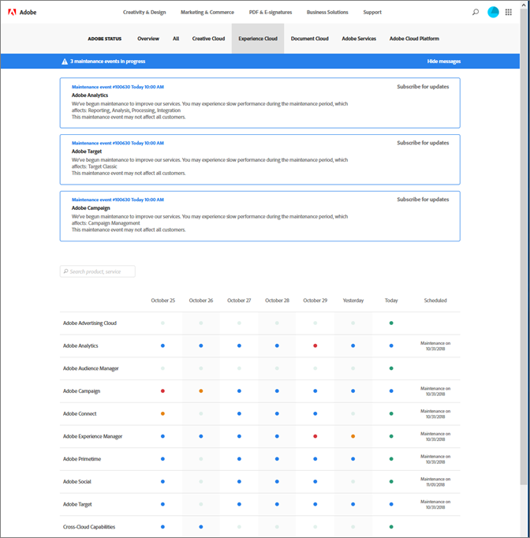
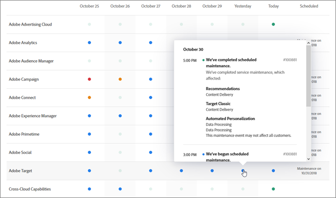

# System status updates and proactive notifications

Use the [!UICONTROL Adobe System Status] page and proactive notifications to keep abreast of the status of [!DNL Adobe] products and [!DNL Adobe Experience Cloud] solutions. Proactive notifications alert you to outage events and maintenance events.

## System status updates

Use the [!UICONTROL Adobe System Status] page to view the current status of [!DNL Target] and other [!DNL Adobe] products and [!DNL Adobe Experience Cloud] solutions. This page helps you determine whether problems you might encounter are due to system updates or routine maintenance.

Access the [!UICONTROL System Status] page by going to the following URL:

[https://status.adobe.com](https://status.adobe.com)

To see the status of [!DNL Experience Cloud] solutions, including [!DNL Target], click the [!UICONTROL Experience Cloud] tab.

The top of the page contains information about maintenance events in progress and includes a link to subscribe for updates for individual solutions.

In the illustration above, [!DNL Adobe Analytics], [!DNL Adobe Target], and [!DNL Adobe Campaign] were undergoing maintenance updates. All other products and solutions were functioning normally. It is always good practice to check this page if you experience problems when using [!DNL Target].

An in-product notification always displays during the monthly [!DNL Target] release, but minor updates sometimes occur and are listed on this page.

The bottom of the page contains a calendar of the last seven days with statuses for each solution per day. Hover over a status indicator for more information:

## Proactive notifications

Proactive notifications are email alerts sent to registered customers for the following events opened against services included in the customer's customer profile, including [!DNL Target]:

* Solution-Level Alerts (does not isolate specific services within the solution)
* CSOs (Outage Events) of Severity 1 and Severity 2
* CMRs (Maintenance Events)

>[!NOTE]
>
>You must register to receive this alerts. Contact your [!DNL Adobe] Customer Success Manager (CSM) or [!DNL Adobe] Account Executive (AE) to initiate the registration process.

The following illustrations are examples of the proactive notification email alert:

