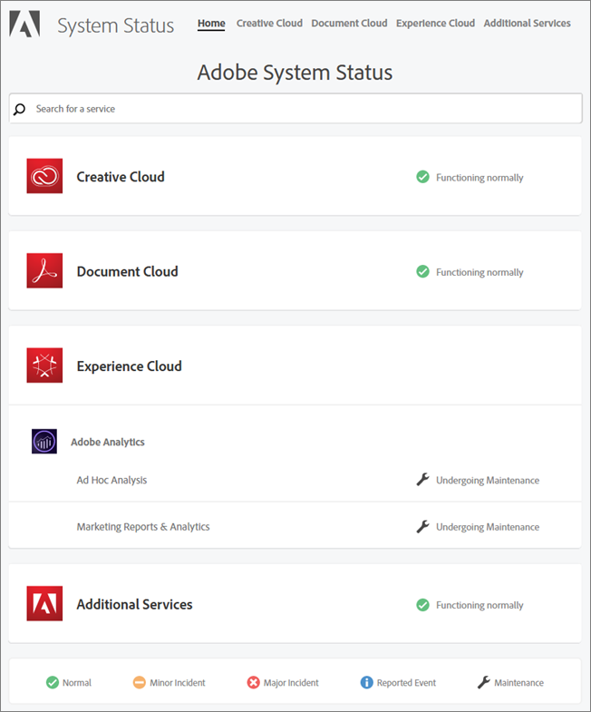

# System Status Updates

Access the [!UICONTROL  System Status] page by going to the following URL: 

[ [!DNL  http://status.adobe.com] ](http://status.adobe.com) 

 

The available statuses include: 

<ul class="simplelist"> 
 <li> Normal </li> 
 <li> Minor Incident </li> 
 <li> Major Incident </li> 
 <li> Reported Event </li> 
 <li> Maintenance </li> 
</ul>

[!DNL  Ad Hoc Analysis] and [!DNL  Marketing Reports &amp;amp; Analytics] were undergoing maintenance when this illustration was created. All other products and solutions were functioning normally. It is always good practice to check this page if you experience problems when using Target. 

An in-product notification always displays during the monthly [!DNL  Target] release, but minor updates sometimes occur and will be listed on this page. 
