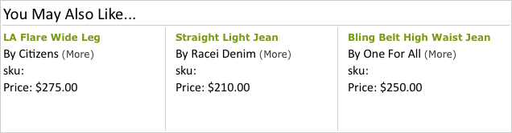

# Customizing a Template

Information about Velocity can be found at [ http://velocity.apache.org ](http://velocity.apache.org). 

All Velocity logic, syntax, and so on can be used for a recommendation template. This means that you can create for loops, if statements, and other code using Velocity rather than JavaScript. 

Any variable sent to recommendation in the ` productPage` mbox or the CSV upload can be displayed in a template. These values are referenced with the following syntax: 


```
$entityN.variable
```


Variable names must follow Velocity shorthand notation, which consists of a leading *$* character, followed by a Velocity Template Language (VTL) Identifier. The VTL Identifier must start with an alphabetic character (a-z or A-Z). 

Velocity variable names are restricted to the following types of characters: 


* Alphabetic (a-z, A-Z)
* Numeric (0-9)
* Hyphen ( - )
* Underscore ( _ )


The following variables are available as Velocity arrays. As such, they can be iterated over or referenced via index. 


* ` entities` 

* ` entityN.categoriesList` 


For example: 


```
#foreach ($category in $entity1.categoriesList) 
<br/>$category 
#end
```


Or 


```
#if ($entities[0].categoriesList.size() >= 3 ) 
$entities[0].categoriesList[2] 
#end
```


For more information about Velocity variables, see [ https://velocity.apache.org/engine/releases/velocity-1.7/user-guide.html#variables ](https://velocity.apache.org/engine/releases/velocity-1.7/user-guide.html#variables). 


>[!NOTE]
>
>The maximum number of entities that can be referenced in a template, either hardcoded or via loops, is 20.


For example, if you want a template that displays something similar to this: 

 

you can use the following code: 


```
<table style="border:1px solid #CCCCCC;"> 
 
<tr> 
 
<td colspan="3" style="font-size: 130%; border-bottom:1px solid  
#CCCCCC;"> You May Also Like... </td> 
 
</tr> 
 
<tr> 
 
<td style="border-right:1px solid #CCCCCC;"> 
 
<div class="search_content_inner" style="border-bottom:0px;"> 
 
<div class="search_title"><a href="$entity1.pageUrl"  
style="color: rgb(112, 161, 0); font-weight: bold;"> 
$entity1.id</a></div> 
 
By $entity1.message <a href="?x14=brand;q14=$entity1.message"> 
(More)</a><br/> 
 
sku: $entity1.prodId<br/> Price: $$entity1.value 
 
<br/><br/> 
 
</div> 
 
</td> 
 
<td style="border-right:1px solid #CCCCCC; padding-left:10px;"> 
 
<div class="search_content_inner" style="border-bottom:0px;"> 
 
<div class="search_title"><a href="$entity2.pageUrl"  
style="color: rgb(112, 161, 0); font-weight: bold;"> 
$entity2.id</a></div> 
 
By $entity2.message <a href="?x14=brand;q14=$entity2.message"> 
(More)</a><br/> 
 
sku: $entity2.prodId<br/> 
 
Price: $$entity2.value 
 
<br/><br/> 
 
</div> 
 
</td> 
 
<td style="padding-left:10px;"> 
 
<div class="search_content_inner" style="border-bottom:0px;"> 
 
<div class="search_title"><a href="$entity3.pageUrl"  
style="color: rgb(112, 161, 0); font-weight: bold;"> 
$entity3.id</a></div> 
 
By $entity3.message <a href="?x14=brand;q14=$entity3.message"> 
(More)</a><br/> 
 
sku: $entity3.prodId<br/> Price: $$entity3.value 
 
<br/><br/> 
 
</div> 
 
</td> 
 
</tr> 
 
</table>
```


>[!NOTE] {class="- topic/note "}
>
>If you want to add information after the variable value, you can do so using formal notation. For example: ` ${entity1.thumbnailUrl}.gif`. 


You can also use ` algorithm.name` and ` algorithm.dayCount` as variables in templates, so one template can be used to test multiple algorithms, and the algorithm name can be dynamically displayed in the template. This shows the visitor that he's looking at "top sellers" or "people who viewed this bought that." You can even use these variables to display the ` dayCount` (number of days of data used in the algorithm, like "top sellers over the last 2 days," etc. 


>[!NOTE]
>
>When referencing tokens in templates (tokens are listed in[ Dynamic Values in Targets and Profiles ](https://marketing.adobe.com/resources/help/en_US/tnt/help/r_Dynamic_Values_in_Targets_and_Profiles.html) in the Target Classic help), use a backslash to escape the token. For example: ` \${campaign.recipe.id}` 


>[!MORE_LIKE_THIS] {class="- topic/related-links "}
>
>* [ Using the Template Manager ](t_Using_the_Template_Manager.md#task_B26F18BBA6634EEEA46D094D94E1B75C)
>* [ Creating or Editing an HTML Template ](t_Creating_an_HTML_Template.md#task_98162FAC61F5407F927F53C9B839EE74)
>* [ Copying a Template ](t_Copying_a_Template.md#task_607C9FB356094942866C443246C25DEF)
>* [ Deleting a Template ](t_Deleting_a_Template.md#task_E31200EA7D844C039B169CB26162C292)
