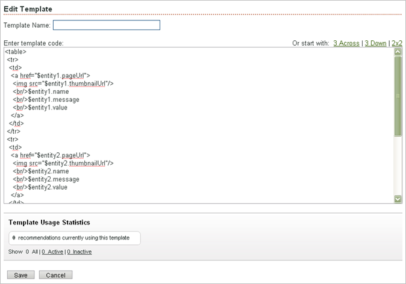

# Creating or Editing an HTML Template

>1. From the recommendations menu, select **[!UICONTROL  Templates]**.

>       The list of current templates opens. This list includes the template name and information about how often each template is used in active and inactive recommendations. 
>1. Select **[!UICONTROL  HTML Template]**, then click **[!UICONTROL  Create New Template]**, or place the mouse pointer over the template you want to change and click **[!UICONTROL  Edit]**.

>       The [!UICONTROL  Edit Template] screen opens. 

>        
>1. Edit the code for the template.

>       Recommendation templates use the open-source Velocity template language. Information about Velocity can be found at http://velocity.apache.org. For more information, see [ Customizing a Template](../../c_rec_mng_recs/c_Managing_Templates/c_Customizing_a_Template.md#concept_94F1554C3F2E4CDB9A2C3D78F10EDA59). 

>       You can start with one of three size options by clicking the size you want: 

>       **[!UICONTROL  3 Across:]** Displays three recommendations in a one-row table with three columns. 

>       **[!UICONTROL  3 Down:]** Displays three recommendations in a one-column table with three rows. 

>       **[!UICONTROL  2x2:]**Displays four recommendations in two rows, each with two columns. 

>       You are not limited to these options. For more information about creating or editing a template, see [ Customizing a Template](../../c_rec_mng_recs/c_Managing_Templates/c_Customizing_a_Template.md#concept_94F1554C3F2E4CDB9A2C3D78F10EDA59). 

>       >[!NOTE]
>       >
>       >The maximum number of entities that can be referenced in a template, either hardcoded or via loops, is 20.

>       If the number of recommended items is less than the number of "slots" defined in a template, the ability to partially render the template can be set at the algorithm level using a checkbox located in the Content Serve Settings on the Recommendations Edit tab. If partial template rendering is not enabled and there aren't enough recommended entities to fill all the slots, the entire template is not rendered. If partial template rendering is enabled, Recommendations renders the template whether or not enough recommendations exist to fill up all the slots in the template. You should build your templates to account for this behavior. For example, you might create your template to include null checks. 
>1. (Optional) Select the template usage statistics you'd like to view.

>       You can see how many recommendations are using the template. Select **[!UICONTROL  All]**, **[!UICONTROL  Active]**, or **[!UICONTROL  Inactive]** to see the recommendations that use the template. Links to the recommendations that use the template appear to the right of the template usage statistics. 
>1. Click **[!UICONTROL  Save]**.
>[!MORE_LIKE_THIS]* [ Using the Template Manager ](t_Using_the_Template_Manager.md#task_B26F18BBA6634EEEA46D094D94E1B75C)* [ Customizing a Template ](c_Customizing_a_Template.md#concept_94F1554C3F2E4CDB9A2C3D78F10EDA59)* [ Copying a Template ](t_Copying_a_Template.md#task_607C9FB356094942866C443246C25DEF)* [ Deleting a Template ](t_Deleting_a_Template.md#task_E31200EA7D844C039B169CB26162C292)