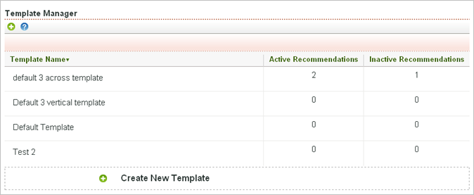

# Using the Template Manager

>1. Click **[!UICONTROL  Templates]**.

>        

>       The [!UICONTROL  Active Recommendations] and [!UICONTROL  Inactive Recommendations] columns show how many recommendations use each template. 
>1. Mouse over a template name to access a toolbar that enables you to edit, delete, or copy the template.
>[!MORE_LIKE_THIS]
>
>* [ Creating or Editing an HTML Template ](t_Creating_an_HTML_Template.md#task_98162FAC61F5407F927F53C9B839EE74)
>* [ Customizing a Template ](c_Customizing_a_Template.md#concept_94F1554C3F2E4CDB9A2C3D78F10EDA59)
>* [ Copying a Template ](t_Copying_a_Template.md#task_607C9FB356094942866C443246C25DEF)
>* [ Deleting a Template ](t_Deleting_a_Template.md#task_E31200EA7D844C039B169CB26162C292)
