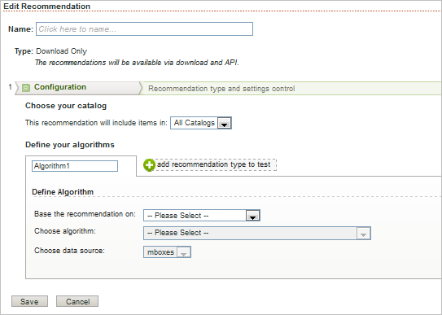

# Adding a Download Only Recommendation

This results in a downloaded CSV file that list the recommendations with one row per key. 

>1. Click ` Add New Recommendation` or ` Create New Recommendation`, or select the recommendation you want to modify and click ` Edit`.

>       The ` Edit Recommendation` page opens. 

>        
>1. Click the ` Click here to name` text, then type a name for the recommendation.

>       The name should be descriptive enough that you can recognize it later. 
>1. Configure your new recommendation.

>       **Choose your Catalog** containing the items to be recommended, or select ` All Catalogs`, as explained in [ Creating Catalogs](../../../../c_rec_mng_recs/c_Creating_a_Custom_Algorithm/t_Creating_Catalogs.md#task_CF595BC2426140E08F7948E43E3C8F81). 
>1. Define your algorithm.

>       **Base the recommendation on** a selected key, as explained in [ Basing the Recommendation on a Recommendation Key](../../../../c_rec_mng_recs/c_Setting_Up_and_Deleting_a_Recommendation/t_create_edit_recs/t_rec_key_recs.md#task_2B0ED54AFBF64C56916B6E1F4DC0DC3B). 

>       **Choose algorithm** for each recommendation type as explained in [ Selecting an Algorithm](../../../../c_rec_mng_recs/c_Setting_Up_and_Deleting_a_Recommendation/t_create_edit_recs/t_algo_select_recs.md#task_2203616ABBE342B6ADAB08F278D794FA). You can test multiple recommendation types against each other by adding more than one algorithm. 

>       **Choose data source** as explained in [ Choosing the Data Source](../../../../c_rec_mng_recs/c_Setting_Up_and_Deleting_a_Recommendation/t_create_edit_recs/t_data_source_recs.md#task_4EC990FBF374465EA6B7FCA8A5A12786). 
>1. Configure data details.

>       Adjust the Data Details slider to set the period of data you want to use. To further configure your recommendation details, click Show More and configure the remaining details. See [ Setting Data Details](../../../../c_rec_mng_recs/c_Setting_Up_and_Deleting_a_Recommendation/t_create_edit_recs/t_Setting_Data_Details.md#task_28DB20F968B1451481D8E51BAF947079). 
>1. Click ` Save`.

>       After you save your new recommendation, it appears on the [!UICONTROL  Manage Recommendations] page as inactive. (See [ Activating a Recommendation](../../../../c_rec_mng_recs/c_Starting_a_Recommendation/t_activate_recs.md#task_B0A6D22AA72E405DBEC81D22B12477DF) for information about activating the new recommendation.) The algorithm runs as soon as data is available, usually within 30 minutes. 
>[!MORE_LIKE_THIS] {class="- topic/related-links "}
>
>* [ Adding an Algorithm/Template Test Recommendation ](t_Adding_a_Algorithm_Template_Test_Recommendation.md#task_CAEFB750020C4A618ED2C059DBAF07C0)
>* [ Adding a Location Test Recommendation ](t_Adding_a_Location_Test_Recommendation.md#task_3CB225C3A7EA44D2BB5D02631AF74EB5)
