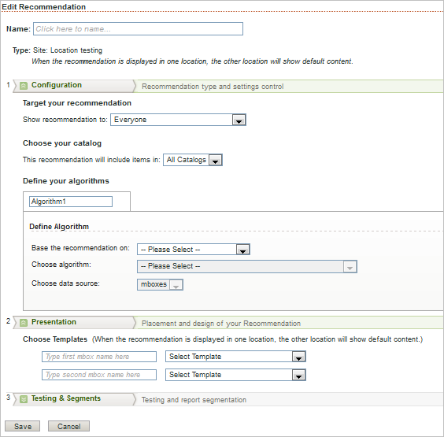

# Adding a Location Test Recommendation

You can set up a recommendation with the same algorithm in two locations with the same or different templates. This enables you to test the performance of the recommendation in different locations and with the same or different appearance in each location. For example, you might want to determine whether recommendations perform better on the right side of your page or on the bottom of the page. Use this type of recommendation to decide which page layout provides the best performance. 

>1. Mouse over ` Add New Recommendation` and select ` Location Test`.

>       The ` Edit Recommendation` page opens. 

>        
>1. Click the ` Click here to name` text, then type a name for the recommendation.

>       The name should be descriptive enough that you can recognize it later. 
>1. Configure your new recommendation.

>       **Target your recommendation** as explained in [ Targeting a Recommendation ](../../../../c_rec_mng_recs/c_Setting_Up_and_Deleting_a_Recommendation/t_create_edit_recs/t_targeting_recs.md#task_3D93B8962F6341CB9A3ADE8E29BFECA5). 

>       **Choose your Catalog** containing the items to be recommended, or select ` All Catalogs`, as explained in [ Creating Catalogs ](../../../../c_rec_mng_recs/c_Creating_a_Custom_Algorithm/t_Creating_Catalogs.md#task_CF595BC2426140E08F7948E43E3C8F81). 

>       **Base the recommendation on** a selected key, as explained in [ Basing the Recommendation on a Recommendation Key ](../../../../c_rec_mng_recs/c_Setting_Up_and_Deleting_a_Recommendation/t_create_edit_recs/t_rec_key_recs.md#task_2B0ED54AFBF64C56916B6E1F4DC0DC3B). 

>       **Choose algorithm** for each recommendation type as explained in [ Selecting an Algorithm ](../../../../c_rec_mng_recs/c_Setting_Up_and_Deleting_a_Recommendation/t_create_edit_recs/t_algo_select_recs.md#task_2203616ABBE342B6ADAB08F278D794FA). You can test multiple recommendation types against each other by adding more than one algorithm. 

>       **Choose data source** as explained in [ Choosing the Data Source ](../../../../c_rec_mng_recs/c_Setting_Up_and_Deleting_a_Recommendation/t_create_edit_recs/t_data_source_recs.md#task_4EC990FBF374465EA6B7FCA8A5A12786). 
>1. Configure data details.

>       Adjust the Data Details slider to set the period of data you want to use. To further configure your recommendation details, click Show More and configure the remaining details. See [ Setting Data Details ](../../../../c_rec_mng_recs/c_Setting_Up_and_Deleting_a_Recommendation/t_create_edit_recs/t_Setting_Data_Details.md#task_28DB20F968B1451481D8E51BAF947079). 
>1. Specify the locations you want to test, then select a template for each location.

>       Select the mbox from the dropdown list. See [ Selecting a Template and Recommendation Area ](../../../../c_rec_mng_recs/c_Setting_Up_and_Deleting_a_Recommendation/t_create_edit_recs/t_template_and_recommendation_area_recs.md#task_45CA0403F24944EF9FE6C4FC5D1A7836). 
>1. Set up targeting conditions.

>       **[!UICONTROL  Target This Mbox]****[!UICONTROL  Current Page]****[!UICONTROL  URL]****[!UICONTROL  Contains]**` /women/`` /mens/`1. Select the template for each location.
>1. Specify the percentage of visitors who see default content, as explained in [ Specifying How Many Users See Default Content ](../../../../c_rec_mng_recs/c_Setting_Up_and_Deleting_a_Recommendation/t_create_edit_recs/t_how_many_users_see_default_conten_recst.md#task_5059665F6EE64FA39D2851671898F996).

>       If the [!UICONTROL  Recommendation Type] selector is not visible, click ` Testing &amp; Segments`. 

>       This becomes your baseline. The recommendation you create is compared to the default content to show how each performs. If you choose a percentage for default content, then no recommendation is shown in either mbox for that percentage of the people to compare against. 
>1. To add a segment, click ` Add Segment`, type a name for the segment, then select the segment parameters, as explained in [ Defining Segments ](../../../../c_rec_mng_recs/c_Setting_Up_and_Deleting_a_Recommendation/t_create_edit_recs/t_definesegments_recs.md#task_338EDF86E0A2412896C2854257E91D62).

>       To delete a segment, click the box next to a segment to open it, then click the X to delete that segment. Deleting the segment also deletes any data collected for that segment. 
>1. Click ` Save`.

>       After you save your new recommendation, it appears on the [!UICONTROL  Manage Recommendations] page as inactive. (See [ Activating a Recommendation ](../../../../c_rec_mng_recs/c_Starting_a_Recommendation/t_activate_recs.md#task_B0A6D22AA72E405DBEC81D22B12477DF) for information about activating the new recommendation.) The algorithm runs as soon as data is available, usually within 30 minutes. 
>[!MORE_LIKE_THIS] {class="- topic/related-links "}
>
>* [ Adding an Algorithm/Template Test Recommendation ](t_Adding_a_Algorithm_Template_Test_Recommendation.md#task_CAEFB750020C4A618ED2C059DBAF07C0)
>* [ Adding a Download Only Recommendation ](t_Adding_a_Download_Only_Recommendation.md#task_EECE85A42EE940A589F3A897D6DB12BF)
