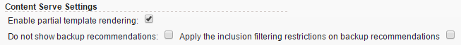

# Content Serve Settings

If the number of recommended items is less than the number of "slots" defined in a template, Recommendations can either fill the template with backup recommendations or display a partially rendered template. Use the Content Serve settings to manage these options. 

 

<table id="table_C0B893ECCEB4472B848808750C7ADDED"> 
 <thead> 
  <tr> 
   <th colname="col1" class="entry"> Partial Template Rendering </th> 
   <th colname="col2" class="entry"> Backup Recommendations </th> 
   <th colname="col3" class="entry"> Result </th> 
  </tr>
 </thead>
 <tbody> 
  <tr> 
   <td colname="col1"> Disabled </td> 
   <td colname="col2"> Disabled </td> 
   <td colname="col3"> 
If fewer recommendations are returned than the template calls for, the recommendations template is replaced by default content and no recommendations are displayed. 
 </td> 
  </tr> 
  <tr> 
   <td colname="col1"> Enabled </td> 
   <td colname="col2"> Disabled </td> 
   <td colname="col3"> 
The template is rendered, but may include blank space if fewer recommendations are returned than the template calls for. 
 </td> 
  </tr> 
  <tr> 
   <td colname="col1"> Enabled </td> 
   <td colname="col2"> Enabled </td> 
   <td colname="col3"> 
Backup recommendations will fill available template "slots," fully rendering the template. 
 
If applying inclusion rules to backup recommendations restricts the number of qualifying backup recommendations to the point that the template cannot be filled, the template is partially rendered. 
 
 If the criteria does not return any recommendations, and inclusion rules restrict backup recommendations to zero, the template is replaced with default content. 
 </td> 
  </tr> 
  <tr> 
   <td colname="col1"> Disabled </td> 
   <td colname="col2"> Enabled </td> 
   <td colname="col3"> 
Backup recommendations will fill available template "slots," fully rendering the template. 
 
 If applying inclusion rules to backup recommendations restricts the number of qualifying backup recommendations to the point that the template cannot be filled, the template is replaced by default content and no recommendations are displayed. 
 </td> 
  </tr> 
 </tbody> 
</table>

