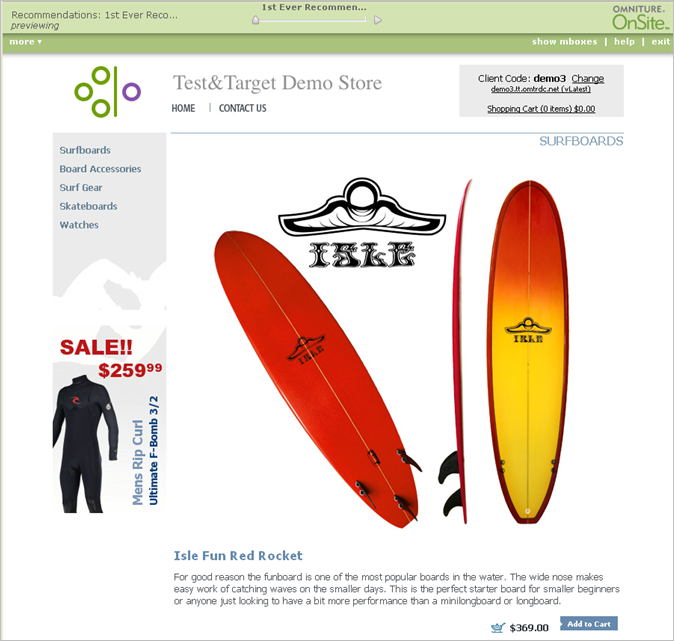

# Previewing a Recommendation

>[!NOTE]
>
>The Preview option is not available for recommendations that use a Download Only template.

>1. On the [!UICONTROL  Manage Recommendations] page, find the recommendation you want to preview.
>1. Click **[!UICONTROL  Preview]** ( ).

>       A new browser window opens, displaying a preview of your recommendation. 

>        
>[!MORE_LIKE_THIS]* [ Creating or Editing a Recommendation ](t_create_edit_recs.md#task_07791608B4DB4B3EB0EF981116F4B4E2)* [ Using a Backup Recommendation ](c_backup_recs.md#concept_5D02FA607144416BB3514364E11E9395)* [ Using Preview Options to Change the Page View ](r_previewoptions_recs.md#reference_8EBD7A9F6CF247B79A9FDCB85AB55C82)* [ Deleting a Recommendation ](t_deleting_recs.md#task_0364B109FE5D4D0C81204F69DA001AD1)