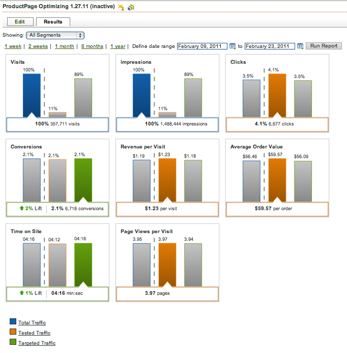

# Viewing the Optimizing Recommendation Report

The [!UICONTROL  Optimizing Recommendation] report should help you determine whether you are getting lift by running this recommendation (total traffic) vs. running a random split test (testing traffic). 

>[!NOTE]
>
>Report data remains in Recommendations for five quarters (including the current quarter).

>1. Click the recommendation whose results you want to view.
>1. Click ` Results`.

>        

>       The left-most column in the report shows your total traffic. To the right of the dashed line is the targeted vs. testing traffic. To understand the performance of the Optimizing recommendation, 10% of traffic is sent randomly to combinations, which are compared to when the algorithm determines which combination to show to each visitor. This is done separately for each segment, so the report changes per segment. This report shows whether running the Optimizing recommendation is better than a straight a/b split. 
>[!MORE_LIKE_THIS] {class="- topic/related-links "}
>
>* [ Viewing Test Results on a Recommendations Card ](c_Viewing_Test_Results_on_a_Recommendations_Card.md#concept_C035768E243F4382A5FF953E1BB870B1)
>* [ Viewing Complete Recommendation Results ](t_Viewing_Complete_Recommendation_Results.md#task_19A3022F3E2044CCA535F3CEC594300E)
>* [ Viewing the Trended Graph Report ](t_Viewing_the_Trended_Graph_Report.md#task_1D399DB0E0A14BF5A672E99C6695BAE7)
>* [ Confidence Level and Confidence Interval ](c_Confidence_Level_and_Confidence_Interval.md#concept_0D0002A1EBDF420E9C50E2A46F36629B)
