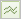

# Viewing the Trended Graph Report

>1. Click a recommendation.
>1. Click ` Results`, then click the Trended Graph Report icon ( ).
>1. Define the time period for which you want to view trends.

>       You can mouse over a data point in each trend graph for information about that data point. 
>[!MORE_LIKE_THIS] {class="- topic/related-links "}
>
>* [ Viewing Test Results on a Recommendations Card ](c_Viewing_Test_Results_on_a_Recommendations_Card.md#concept_C035768E243F4382A5FF953E1BB870B1)
>* [ Viewing Complete Recommendation Results ](t_Viewing_Complete_Recommendation_Results.md#task_19A3022F3E2044CCA535F3CEC594300E)
>* [ Viewing the Optimizing Recommendation Report ](t_Viewing_the_Optimization_Recommendation_Report.md#task_55777B3740594D8489EF04E62D2327D8)
>* [ Confidence Level and Confidence Interval ](c_Confidence_Level_and_Confidence_Interval.md#concept_0D0002A1EBDF420E9C50E2A46F36629B)
