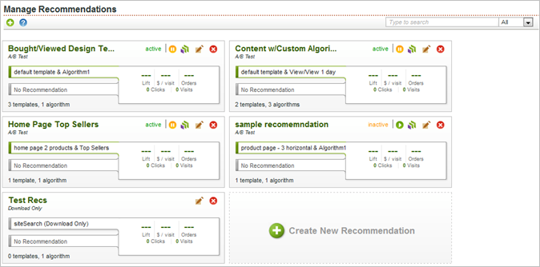

# Viewing a Recommendation in the Recommendations Manager

 
>[!MORE_LIKE_THIS]
>
>* [ Setting Up and Deleting a Recommendation ](c_Setting_Up_and_Deleting_a_Recommendation.md#concept_46FC867861EC477ABF287D49B84F0961)
>* [ Starting a Recommendation ](c_Starting_a_Recommendation.md#concept_FD5D757B0C174CE2B0D8C132303EE674)
>* [ Creating a Custom Algorithm ](c_Creating_a_Custom_Algorithm.md#concept_9D76531BEE5A4AC8BA2DD30B99CED51A)
>* [ Advanced Recommendations Options ](r_Recommendation_Parameters.md#reference_93CA52A6B7D64CDFABAE37E27D1F0A9F)
>* [ Creating Catalogs ](t_Creating_Catalogs.md#task_CF595BC2426140E08F7948E43E3C8F81)
>* [ Searching Catalogs ](t_Searching_Catalogs.md#task_B5E7B5638BF0406E93AE18B2C6893AE2)
>* [ Troubleshooting Recommendations ](r_Troubleshooting_Recommendations.md#reference_14CE05395C164BE1AC5E5FA2F7E940E2)
