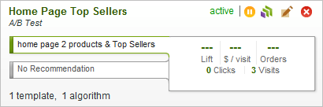

# Recommendations Cards

>Each recommendation card displays key information about a recommendation. Click on a card for more details. 

> 

><table id="table_E8B569134AE5419DB6686EB015985FD3"> 
 <thead> 
  <tr> 
   <th colname="col1" class="entry"> Element </th> 
   <th colname="col2" class="entry"> Explanation </th> 
  </tr> 
 </thead>
 <tbody> 
  <tr> 
   <td colname="col1"> 
Recommendation Name 
 </td> 
   <td colname="col2"> 
Displays the name of the recommendation at the top of each card. 
 </td> 
  </tr> 
  <tr> 
   <td colname="col1"> 
Type of Test 
 </td> 
   <td colname="col2"> 
Displays the type of test beneath the recommendation name. 
 </td> 
  </tr> 
  <tr> 
   <td colname="col1"> 
Status Flag 
 </td> 
   <td colname="col2"> 
Shows whether the recommendation is active or inactive. For information about changing the status, see <a href="../../c_rec_mng_recs/c_Starting_a_Recommendation/t_activate_recs.md#task_B0A6D22AA72E405DBEC81D22B12477DF" type="task" format="dita" scope="local"> Activating a Recommendation</a>. 
 
The status flag does not appear next to a download-only recommendation because there is nothing to activate or deactivate. 
 </td> 
  </tr> 
  <tr> 
   <td colname="col1"> 
Toolbar 
 </td> 
   <td colname="col2"> 
Contains tools that help you manage your recommendation: 
 
 
     <table id="simpletable_9C21933A9B4742029463B2A07233AE18"> 
      <tr class="strow"> 
       <td class="stentry"> 
 /
 

 </td> 
       <td class="stentry"> 
  Deactivate or  Activate changes the status of your recommendation. This icon changes depending on the current status of the recommendation. See <a href="../../c_rec_mng_recs/c_Starting_a_Recommendation/t_activate_recs.md#task_B0A6D22AA72E405DBEC81D22B12477DF" type="task" format="dita" scope="local"> Activating a Recommendation</a>. 
 
The <b>Deactivate</b>/<b>Activate</b> icon does not appear next to a download-only recommendation because there is nothing to activate or deactivate. 
 </td> 
      </tr> 
      <tr class="strow"> 
       <td class="stentry"> 
  
 </td> 
       <td class="stentry"> 
 <b>Preview</b> opens a preview of your recommendation in a browser window. The Preview button is not available if the recommendation uses a Download Only template. See <a href="../../c_rec_mng_recs/c_Setting_Up_and_Deleting_a_Recommendation/t_previewing_recs.md#task_0841AD9A5CF640719A486C24F7D4D14F" type="task" format="dita" scope="local"> Previewing a Recommendation</a>. 
 </td> 
      </tr> 
      <tr class="strow"> 
       <td class="stentry"> 
  
 </td> 
       <td class="stentry"> 
 <b>Edit</b> lets you change the details of your recommendation. See <a href="../../c_rec_mng_recs/c_Setting_Up_and_Deleting_a_Recommendation/t_create_edit_recs/t_create_edit_recs.md#task_07791608B4DB4B3EB0EF981116F4B4E2" type="task" format="dita" scope="local"> Creating or Editing a Recommendation</a>. 
 </td> 
      </tr> 
      <tr class="strow"> 
       <td class="stentry"> 
  
 </td> 
       <td class="stentry"> 
 <b>Delete</b> permanently deletes a recommendation you no longer need. See <a href="../../c_rec_mng_recs/c_Setting_Up_and_Deleting_a_Recommendation/t_deleting_recs.md#task_0364B109FE5D4D0C81204F69DA001AD1" type="task" format="dita" scope="local"> Deleting a Recommendation</a>. 
 </td> 
      </tr> 
     </table> 
 </td> 
  </tr> 
  <tr> 
   <td colname="col1"> 
Recommendation Type 
 </td> 
   <td colname="col2"> 
Describes the type of recommendation to be offered. Mouse over this text for statistics that show how the recommendation is performing. For a list of recommendation types, see <a href="../../c_rec_mng_recs/c_Setting_Up_and_Deleting_a_Recommendation/t_create_edit_recs/t_create_edit_recs.md#task_07791608B4DB4B3EB0EF981116F4B4E2" type="task" format="dita" scope="local"> Creating or Editing a Recommendation</a>. 
 </td> 
  </tr> 
  <tr> 
   <td colname="col1"> 
No Recommendation 
 </td> 
   <td colname="col2"> 
Mouse over this text to show the performance statistics when users are not shown a recommendation. When combined with the recommendation type described above, this enables you to compare performance with and without the recommendation. 
 
If you are not testing against default content, this bar does not display. 
 </td> 
  </tr> 
  <tr> 
   <td colname="col1"> 
Statistics 
 </td> 
   <td colname="col2"> 
Shows the amount of lift, the revenue earned per customer visit, the number of orders resulting from the recommendation, and the number of times the recommendation has been clicked and the resulting number of site visits. Mouse over the recommendation type and  No Recommendation text to alternate between statistics with and without the recommendation. 
 </td> 
  </tr> 
  <tr> 
   <td colname="col1"> 
Templates and Algorithms 
 </td> 
   <td colname="col2"> 
Shows the number of templates and algorithms being tested in the recommendation. 
 </td> 
  </tr> 
 </tbody> 
</table>

>[!MORE_LIKE_THIS]
>
>* [ Searching and Filtering the Recommendations List ](t_finding_recs.md#task_5B8C9C6FFC5F4191804AA07203CC22E9)
>* [ Reporting Recommendation Results ](c_Testing_Recommendation_Results.md#concept_E5B86C2093404403A6900BD0A4CFCCBB)
>* [ Viewing the Change Log ](t_Viewing_the_Change_Log.md#task_0B5CF07FDC30484F89A58E402ADFE493)
